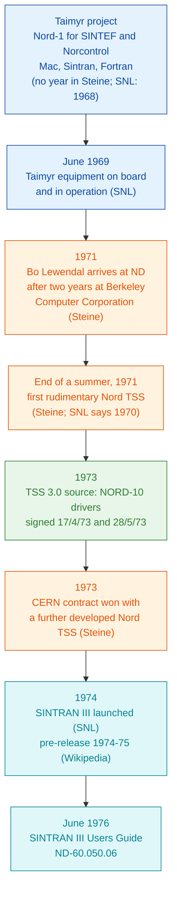
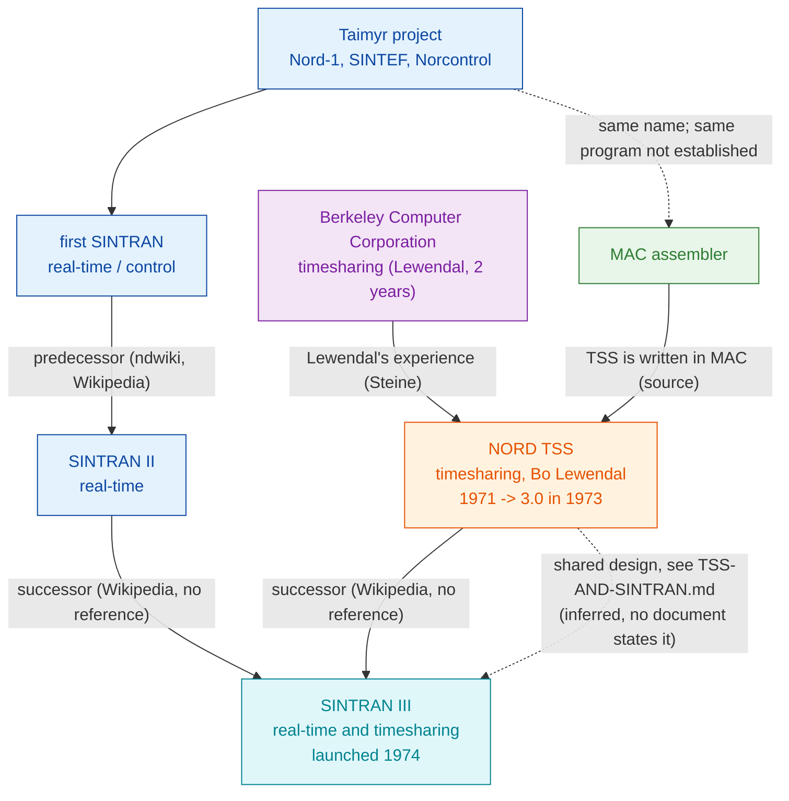

# NORD TSS and SINTRAN - a history

**This file:** `docs/TSS-AND-SINTRAN-HISTORY.md`

How Norsk Data's first timesharing system, NORD TSS, relates to the SINTRAN
family of operating systems. Every statement carries its source and a source
grade, because the sources differ a great deal in weight:

| grade | meaning |
|---|---|
| **[SRC]** | read in the TSS 3.0 source in this repository |
| **[MAN]** | read in a period Norsk Data manual |
| **[RET]** | a retrospective by a participant, written decades later |
| **[ENC]** | an encyclopedia or wiki, with no reference given for the statement |
| **[UNVERIFIED]** | reported by someone else, source not yet read by this project |

The technical comparison (monitor calls, commands, files) is in
[`TSS-AND-SINTRAN.md`](TSS-AND-SINTRAN.md). This document is the story.

## 1. The sources

| short | source | grade |
|---|---|---|
| Steine | Tor Olav Steine, "The Founding, Fantastic Growth, and Fast Decline of Norsk Data AS", *History of Nordic Computing 3*, Stockholm 2010, Springer IFIP AICT vol. 350, 2011. Open copy: <https://dl.ifip.org/db/conf/hinc/hinc2010/Steine10.pdf>. Steine was "Formerly of Norsk Data AS" and thanks Bugge-Asperheim, Monrad-Krohn, Lewendal, Skår, Trøim and Walden "for early days information" | [RET] |
| SNL | Store norske leksikon, article "Norsk Data", <https://snl.no/Norsk_Data> | [ENC] |
| Wikipedia | English Wikipedia, "Sintran III" and "QED (text editor)" | [ENC] |
| ndwiki | ndwiki.org articles NORD-TSS, SINTRAN II, SINTRAN III, NORD PL; the SINTRAN pages say they began as copies of Wikipedia (2008, 2009) | [ENC] |
| UG | ND-60.050.06 *SINTRAN III Users Guide*, version of June 1976 | [MAN] |
| MC | ND-860228 *SINTRAN III Monitor Calls* | [MAN] |
| TSS 3.0 | `src/TSS1.SYMB` ... `src/TSS5.SYMB`, `src/MINIT.SYMB` | [SRC] |

## 2. Timeline

Blue: the first SINTRAN. Orange: TSS. Green: dated by the TSS source itself.
Teal: SINTRAN III.

## 3. The first SINTRAN: a control system for a ship

Norsk Data's first customer project was the bulk carrier *Taimyr*. Steine:
"The radar was to be extended with a Nord-1 computer ... for automatic
collision avoidance. This computer was delivered to SINTEF ... in Trondheim,
remaining there a year before it was moved on board the ship." **[RET]**

The same project produced the first SINTRAN: "The development of the system
included a new assembly code generator (Mac), a new operating system
(Sintran), and application programs written in Fortran. The operating system
was named Sintran (from SINtef and forTRAN)" (Steine p. 2). **[RET]**

Steine gives no year. SNL dates SINTRAN to 1968 ("utviklet i samarbeid med
SINTEFs avdeling for reguleringsteknikk i 1968", developed with SINTEF's
control engineering department in 1968) and says the equipment was "i juni
1969 ... montert på skipet og satt i drift", mounted on the ship and put into
operation in June 1969. **[ENC]**, no reference given. English Wikipedia's
1968 date cites SNL, so it is not an independent source.

TSS 3.0 is written in an assembler also called MAC. Whether it is the same
program as the Taimyr "Mac", or a descendant of it, is not established.

## 4. Bo Lewendal and NORD TSS

Steine (p. 2), **[RET]**:

> "Before returning to BBN in September 1971, Dave Walden recommended Bo
> Lewendal, a brilliant Swedish-American who was unemployed after two years
> developing a large time-sharing system for Berkeley Computer Corporation
> (BCC), to Rolf Skår, then software development manager at Norsk Data.
> When Lewendal arrived in 1971 he asked Rolf Skår for permission to develop
> a time-sharing system for the Nord-1 computer. Since everybody was on
> holiday during the summer, he spent a few weeks in solitude working on his
> project, and at the end of the summer, Nord TSS was functioning in its
> first, rudimentary form."

Two points stay open. SNL dates Nord-TSS to 1970 ("tidsdelingssystem for
minidatamaskin lansert som en av de første i verden", a timesharing system
for a minicomputer, launched as one of the first in the world) **[ENC]**,
which conflicts with Steine's 1971. And Steine's "September 1971" sits
awkwardly with "the summer"; the paper does not say which summer.

Wikipedia says Lewendal also implemented the QED editor for the Nord-1 in
1971, after working with Deutsch and Lampson at Project Genie and BCC. That
sentence is tagged "[citation needed]" on Wikipedia itself. **[ENC]**

What the TSS 3.0 source itself shows **[SRC]**: its first line is
`% NORD TIMESHARING SYSTEM  BY BO LEWENDAL` (`src/TSS1.SYMB:1`), it carries
NORD-1 and NORD-10 variants of the same code (`"NN10` / `"N10`), and the
NORD-10 drivers are signed `NJL 17/4/73` (`src/TSS1.SYMB:3763`) and
`NJL 28/5/73` (`src/MINIT.SYMB:596`), by Nils Jakob Langeland.

## 5. CERN, 1973

Steine (pp. 2-3), **[RET]**:

> "Norsk Data, with the first time-sharing system in any minicomputer (a
> further developed Nord TSS), eventually won the contract in 1973, after
> fierce competition from other European bidders and from Digital Computer
> Corporation of Maynard, MA."

> "At that point in time, this contract was the key to the very survival of
> the company. Rolf Skår summed it up as follows: No Bo Lewendal, no
> time-sharing system. Without the time-sharing system, no CERN contract, and
> ND would have been bankrupt in 1973!"

This is Steine's rendering of Skår, not a quotation set in quote marks, and
"the first time-sharing system in any minicomputer" is Steine's own claim.

## 6. Two systems, then one

Before SINTRAN III, Norsk Data offered two separate systems: SINTRAN II for
real-time work and NORD TSS for timesharing. English Wikipedia: "Sintran III
emerged in pre-release form during 1974 and 1975 as a successor to the two
distinct operating systems offered for the Nord-1 and Nord-10 computers:
Sintran II for real-time systems and TSS for timesharing systems." **[ENC]**,
no reference given. SNL: "1974 - Operativsystemet SINTRAN-III lanseres" (the
operating system SINTRAN-III is launched). **[ENC]**

Steine mentions SINTRAN III only in passing, for the 1977 F16 simulator
sale: "The new Nord 10 with virtual memory and new operating system, Sintran
III, had just been released". **[RET]**

Solid arrows are stated by a source (named on the arrow). Dashed arrows are
this project's inference or an open question.

## 7. What SINTRAN III kept from TSS

Comparing the TSS 3.0 source with the 1976 SINTRAN III manuals **[SRC]**
**[MAN]**: the same monitor-call instruction and 8-bit call number, 18
monitor calls with the same number and name (octal 0-10, 13-14, 32, 35,
64-67, 76), 24 of the 60 TSS command names, the `(USER)NAME:TYPE` file names
with quotation marks creating a new file, six of seven default file types,
friends, owner/friend/public access, and the same login sequence. Details and
citations: [`TSS-AND-SINTRAN.md`](TSS-AND-SINTRAN.md).

No source read so far states that SINTRAN III's design was taken from TSS.
The match is distinctive enough that this is the natural reading, but it is
an inference. No evidence was found for influence in the other direction,
from SINTRAN into TSS: Steine describes TSS as Lewendal's own work for the
Nord-1, built on his Berkeley experience.

## 8. Reported, not yet verified

These come from a ChatGPT summary that cites documents on the CERN Document
Server. The documents could not be read: cds.cern.ch serves a bot check to
automated requests. Until someone opens them in a browser and records the
report numbers, they are **[UNVERIFIED]** and are not used above.

- A CERN engineering document of January 1973 describing two Norsk Data
  systems, TSS for timesharing (about 12K words, disc based) and SINTRAN for
  real-time work (about 3K core-only, 4K disc), with SINTRAN considered for
  the individual computers and TSS for the service computer.
- A 1973 CERN specification asking that tasks made for NORD TSS also run
  under SINTRAN II.
- A 1975 CERN document describing a NORD-10 running TSS with 11 terminals.

## 9. Leads not yet read

- ND-60.039.01, the NORD TSS reference manual.
- "TIMESHARING: What, Why and Whiter?" (spelled so), listed by ndwiki in the
  Norsk Data newsletter *ND-Nytt* No. 5, September 1972, and attributed to
  Bo Lewendal on the ndwiki NORD-TSS page.
- Tor Olav Steine's books *Fenomenet Norsk Data* (1992) and *Norsk Data - hva
  gikk galt?* (2020), which SNL lists.
- *Software Nord-10 Design Goals (TSS-02)*, cited by several ndwiki pages.
