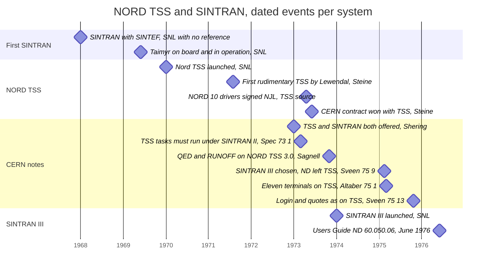
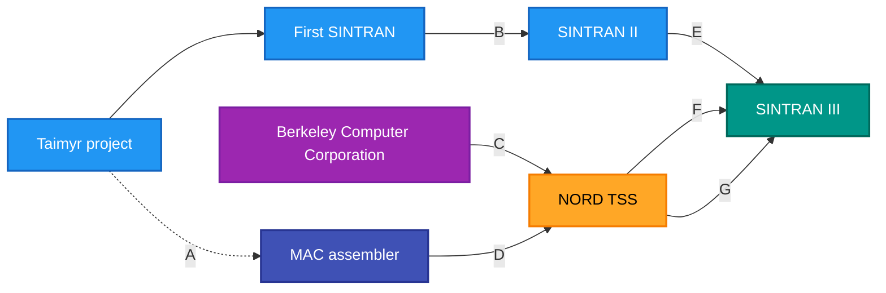

# NORD TSS and SINTRAN III - history and shared design

**This file:** `docs/TSS-AND-SINTRAN.md`

How Norsk Data's first timesharing system, NORD TSS, relates to the SINTRAN
family of operating systems: first the history (sections 2-6), then the
technical evidence of what SINTRAN III shares with TSS 3.0 (section 7).
Every statement carries its source and a source grade, because the sources
differ a great deal in weight:

| grade | meaning |
|---|---|
| **[SRC]** | read in the TSS 3.0 source in this repository |
| **[MAN]** | read in a period Norsk Data manual |
| **[PER]** | read in another period document, written at the time |
| **[RET]** | a retrospective by a participant, written decades later |
| **[ENC]** | an encyclopedia or wiki, with no reference given for the statement |
| **[UNVERIFIED]** | reported by someone else, source not yet read by this project |

## 1. The sources

| short | source | grade |
|---|---|---|
| Steine | Tor Olav Steine, "The Founding, Fantastic Growth, and Fast Decline of Norsk Data AS", *History of Nordic Computing 3*, Stockholm 2010, Springer IFIP AICT vol. 350, 2011. Open copy: <https://dl.ifip.org/db/conf/hinc/hinc2010/Steine10.pdf>. Steine was "Formerly of Norsk Data AS" and thanks Bugge-Asperheim, Monrad-Krohn, Lewendal, Skår, Trøim and Walden "for early days information" | [RET] |
| Steine 2020 | Tor Olav Steine, *Norsk Data - what went wrong?*, English edition of *Norsk Data - hva gikk galt?*, ISBN 978-82-303-4554-2, read in a pre-release English version, so no page numbers are given because they may change in the published English edition. The English text appears machine-translated (it has "SINTRAN-111" for SINTRAN III and leftover Norwegian words), so quotations keep its wording with [sic] | [RET] |
| SNL | Store norske leksikon, article "Norsk Data", <https://snl.no/Norsk_Data> | [ENC] |
| Wikipedia | English Wikipedia, "Sintran III" and "QED (text editor)" | [ENC] |
| ndwiki | ndwiki.org articles NORD-TSS, SINTRAN II, SINTRAN III, NORD PL; the SINTRAN pages say they began as copies of Wikipedia (2008, 2009) | [ENC] |
| UG | ND-60.050.06 *SINTRAN III Users Guide*, version of June 1976 | [MAN] |
| MC | ND-860228 *SINTRAN III Monitor Calls* | [MAN] |
| TSS 3.0 | `src/TSS1.SYMB` ... `src/TSS5.SYMB`, `src/MINIT.SYMB` | [SRC] |
| RM | ND-60.128.5 *SINTRAN III Reference Manual* | [MAN] |
| TBG | ND-60.132.03 *SINTRAN III Timesharing Batch Guide* | [MAN] |
| Sagnell | B. Sagnell, *How to write reports on the NORD-TSS*, CERN LAB II-CO/GE/bS/73-29, November 1, 1973. <https://cds.cern.ch/record/66380> ([PDF](https://cds.cern.ch/record/66380/files/LABII-CO-GE-BS-73-29.pdf)) | [PER] |
| Shering 1973 | G. Shering, *Development of the NORD-10 Interpretive System*, CERN LAB II-CO/CC/GS/73-9, January 1973. <https://cds.cern.ch/record/66360> ([PDF](https://cds.cern.ch/record/66360/files/LABII-CO-CC-GS-73-9.pdf)) | [PER] |
| CERN Spec 73-1 | CERN Lab II, *Technical specification for the message transfer system for the SPS*, LAB II-CO/SPEC/73-1, March 1973. <https://cds.cern.ch/record/66615> ([PDF](https://cds.cern.ch/record/66615/files/LABII-CO-SPEC-73-1.pdf)) | [PER] |
| Altaber 75-1 | J. Altaber, *Basic description of the software operating system for the computer control of the SPS*, CERN LAB II-CO/75-1, March 1975. <https://cds.cern.ch/record/66485> ([PDF](https://cds.cern.ch/record/66485/files/CERN-LABII-CO-75-1.pdf)) | [PER] |
| Sveen 75-9 | O. Sveen, *Notes to assist in the choice of an operating system and operating modes for the service computer*, CERN Lab II-CO/CE/Int.Note/OS/75-9, 14.2.75. <https://cds.cern.ch/record/66510> ([PDF](https://cds.cern.ch/record/66510/files/LABII-CO-CE-Int-Note-OS-75-9.pdf)) | [PER] |
| Sveen 75-13 | O. Sveen, *The Service Computer with its MTS-SINTRAN III, Users Guide*, CERN Lab II-CO/Int./Comp.Note/75-13, 21.10.75. <https://cds.cern.ch/record/66519> ([PDF](https://cds.cern.ch/record/66519/files/LABII-CO-Int-Comp-Note-75-13_1.pdf)); a French version is <https://cds.cern.ch/record/66605> | [PER] |
| CERN notes 1973-75 | J. Altaber, *Proposal for Sintran add-on*, LAB II-CO/CC/JA/73-30, 11.5.73, <https://cds.cern.ch/record/66381>; J. Altaber, C. Gareyte, *Timing study on Sintran*, LAB II-CO/CC/CG/73-32, <https://cds.cern.ch/record/66383>; J. Altaber, *SYNTRON, a Real-time System developed from SINTRAN*, Lab II-CO/CC/Int.Note/JA/74-15, 29.3.74, <https://cds.cern.ch/record/66440>; J. Altaber, O. Sveen, *Mechanisms of Interaction between the Message Handling Software and SINTRAN III*, Lab II-CO/CE/Int.Note/OS/75-20, 22.4.75, <https://cds.cern.ch/record/66532>; O. Sveen, *Unsystematic NODAL-Datalink SINTRAN III Information*, Lab II-CO/CE/Int.Note/OS/75-45, 12.12.75, <https://cds.cern.ch/record/66555> | [PER] |

The ND manuals are read as Markdown transcriptions under
`$NDINSIGHT/Reference-Manuals/`; line numbers such as UG:1527 refer to those
transcriptions.

## 2. Timeline

One lane per system, plus one for the CERN period documents. Each marker is
a dated event, labelled with its source. A date given only as a year or a
month is placed at its start. No lifetime bars are
drawn, because no source gives end dates for SINTRAN II or NORD TSS.

## 3. The first SINTRAN: a control system for a ship

Norsk Data's first customer project was the bulk carrier *Taimyr*. Steine:
"The radar was to be extended with a Nord-1 computer ... for automatic
collision avoidance. This computer was delivered to SINTEF ... in Trondheim,
remaining there a year before it was moved on board the ship." **[RET]**

The same project produced the first SINTRAN: "The development of the system
included a new assembly code generator (Mac), a new operating system
(Sintran), and application programs written in Fortran. The operating system
was named Sintran (from SINtef and forTRAN)" (Steine p. 2). **[RET]**

Steine gives no year. SNL dates SINTRAN to 1968 ("utviklet i samarbeid med
SINTEFs avdeling for reguleringsteknikk i 1968", developed with SINTEF's
control engineering department in 1968) and says the equipment was "i juni
1969 ... montert på skipet og satt i drift", mounted on the ship and put into
operation in June 1969. **[ENC]**, no reference given. English Wikipedia's
1968 date cites SNL, so it is not an independent source.

Steine's 2020 book adds the institutional side **[RET]**: "SINTEF in
Trondheim received funding to develop a general operating system for
mini-machines, which they called Sintran", from the research council
NTNF, and the specification came from a meeting of Nord users at Yddin in
Valdres: "The SINTEF Institute at NTH (later NTNU) developed this further,
and this gave rise to the operating system 'SINTRAN'". It gives no
year either.

TSS 3.0 is written in an assembler also called MAC. Whether it is the same
program as the Taimyr "Mac", or a descendant of it, is not established.

## 4. Bo Lewendal and NORD TSS

Steine (p. 2), **[RET]**:

> "Before returning to BBN in September 1971, Dave Walden recommended Bo
> Lewendal, a brilliant Swedish-American who was unemployed after two years
> developing a large time-sharing system for Berkeley Computer Corporation
> (BCC), to Rolf Skår, then software development manager at Norsk Data.
> When Lewendal arrived in 1971 he asked Rolf Skår for permission to develop
> a time-sharing system for the Nord-1 computer. Since everybody was on
> holiday during the summer, he spent a few weeks in solitude working on his
> project, and at the end of the summer, Nord TSS was functioning in its
> first, rudimentary form."

Two points stay open. SNL dates Nord-TSS to 1970 ("tidsdelingssystem for
minidatamaskin lansert som en av de første i verden", a timesharing system
for a minicomputer, launched as one of the first in the world) **[ENC]**,
which conflicts with Steine's 1971. And Steine's "September 1971" sits
awkwardly with "the summer"; the paper does not say which summer.

Steine's 2020 book tells it more fully **[RET]**. Rolf Skår, "following a tip
from Dave Walden, had come across Swedish-American Bo Lewendal and lured him
to Norway"; "Shortly after Bo's arrival, the entire company went on a joint
holiday some time in July 1971. But he was able to negotiate to be able to
dispose of a Nord-1 and use it for development during the summer holidays",
when he "installed an editor ... called QED" and "also created a printing
program called Runoff". Then: "Together with his colleague
Torolf Paulsen, he developed the time-sharing system NordTSS, which was based
on experience from previous systems in the US." That fits the source: `NORM`
is headed `%DUE TO T.E. PAULSEN` (`src/TSS2.SYMB:2244`). The same page says
"the Sintran II operating system had been developed at NTNU by Trygve Matre.
Nord TSS used the mechanisms of this operating system to switch between
different users." That last sentence is not borne out by the TSS 3.0 source,
which owns the machine and contains no SINTRAN II, nor by Sveen 75-9, which
calls TSS "originally a NORD-1 operating system"; it may describe an earlier
TSS version or borrowed ideas rather than code, and is left open.

Wikipedia says Lewendal also implemented the QED editor for the Nord-1 in
1971, after working with Deutsch and Lampson at Project Genie and BCC. That
sentence is tagged "[citation needed]" on Wikipedia itself. **[ENC]**

What the TSS 3.0 source itself shows **[SRC]**: its first line is
`% NORD TIMESHARING SYSTEM  BY BO LEWENDAL` (`src/TSS1.SYMB:1`), it carries
NORD-1 and NORD-10 variants of the same code (`"NN10` / `"N10`), and the
NORD-10 drivers are signed `NJL 17/4/73` (`src/TSS1.SYMB:3763`) and
`NJL 28/5/73` (`src/MINIT.SYMB:596`), by Nils Jakob Langeland. One
routine credits a second person: the double-precision normalise `NORM` is
headed `%DUE TO T.E. PAULSEN` (`src/TSS2.SYMB:2244`).

## 5. CERN, 1973

Steine (pp. 2-3), **[RET]**:

> "Norsk Data, with the first time-sharing system in any minicomputer (a
> further developed Nord TSS), eventually won the contract in 1973, after
> fierce competition from other European bidders and from Digital Computer
> Corporation of Maynard, MA."

> "At that point in time, this contract was the key to the very survival of
> the company. Rolf Skår summed it up as follows: No Bo Lewendal, no
> time-sharing system. Without the time-sharing system, no CERN contract, and
> ND would have been bankrupt in 1973!"

This is Steine's rendering of Skår, not a quotation set in quote marks, and
"the first time-sharing system in any minicomputer" is Steine's own claim.

Steine's 2020 book gives the decision itself **[RET]**: CERN's delegation
was shown only the software, on one terminal in an office; the
Finance Committee fight "took place in Geneva on 19 September 1972, i.e. on
the day 5 years after Norsk Data was started", the French offered Mitra and
the Germans Dietz machines, and "ND was awarded the contract with the support
of the Scandinavian countries, The United Kingdom and Switzerland"; the order
totalled "5 million Swiss francs", with the first machine "to be installed
and accepted on July 1, 1973"; the 24 Nord-10s were "installed and
put into operation in 1974". Its timeline says "1972 - Contract with
CERN based on Nord-1 and TSS". The award in September 1972 and
CERN's order in January 1973 (below) fit together. The book also says Bo
Lewendal "was active in defining the NODAL language with George Shering at
CERN, writing it in MAC assembler code".

A CERN note written at the time shows TSS in use there. Sagnell, dated
November 1, 1973, **[PER]**: "The NORD Time Sharing System installed in
the SPS Controls Group is equipped with programs for writing, editing and
printing English text (QED and RUNOFF)." Its log-in example begins "Push ESC
key briefly" and shows `NORD-TSS 3.0 IS UP`, `ENTER`, `PASSWORD`, `PROJECT
NUMBER P-`, then `@QED` and `QED 1.10`. To save a new file it types
`W "FIRST"`, because "Since the file is new, the system demands that we put
quotes around the name". So TSS 3.0, the QED editor and the quote rule of
section 7.3 were all in use at CERN by November 1973. The note also says RUNOFF
"was written in order to simplify the preparation of computer documents in
English at Norsk Data Elektronikk". (Quotations checked against the page images; the
PDF's OCR text layer misreads the date as 1972.)

## 6. Two systems, then one

Before SINTRAN III, Norsk Data offered two separate systems: SINTRAN II for
real-time work and NORD TSS for timesharing. English Wikipedia: "Sintran III
emerged in pre-release form during 1974 and 1975 as a successor to the two
distinct operating systems offered for the Nord-1 and Nord-10 computers:
Sintran II for real-time systems and TSS for timesharing systems." **[ENC]**,
no reference given. SNL: "1974 - Operativsystemet SINTRAN-III lanseres" (the
operating system SINTRAN-III is launched). **[ENC]**

Steine mentions SINTRAN III only in passing, for the 1977 F16 simulator
sale: "The new Nord 10 with virtual memory and new operating system, Sintran
III, had just been released". **[RET]**

His 2020 book is the only source found that says how SINTRAN III came about
**[RET]**. "The core people moved with the system to ND at Økern ...
SINTRAN-111 [sic] was the successor to the first variants ... Based on SI's
virtual memory project, Bo Lewendal's TSS, floating comma operations and
proven SINTRAN-11 [sic], it turned into an unbeatable combination. Switching
between the different users of the system now became almost imperceptible". "Key people from NTH/SINTEF had developed the operating system
SINTRAN II, and now joined ND in Oslo for the development of the successor
SINTRAN III", and "The credit for the development of SINTRAN III is
primarily to be attributed to ... Trygve Matre". This is a
participant's retrospective written about 45 years later; it names the
ingredients but not which parts of TSS were taken over.

In January 1973 CERN described the two systems Norsk Data offered, in
Shering's plan for the SPS control computers **[PER]**:

> "Two operating systems are provided by Norsk : the time sharing system
> TSS; and the real-time operating system SINTRAN. TSS takes about 12 K and
> a large disk. It is proposed by Norsk for use in the service computer. It
> provides essentially the same facilities as the PDP-11 DOS but in the
> time-sharing mode. SINTRAN is proposed for use in all other computers.
> SINTRAN takes about 3K in core-only systems, 4K in disk version."

The same note already asks for the two to come together:

> "At present TSS is not fully compatible with SINTRAN but it would be a
> pity to lose time sharing facilities when the service computer goes
> 'on-line'. Hopefully by that time fully compatible versions of TSS and
> SINTRAN will be available from NORSK."

It also expects "the first NORD-10's in May" 1973. (Quotations checked
against the page images.)

CERN's specification for the SPS message transfer system, March 1973, asks
for the same kind of continuity on the real-time side (Spec 73-1, printed
page 13) **[PER]**: "Compatibility must be maintained with the software
systems in the other computers so that tasks generated using the NORD Time
Sharing System (TSS) and able to run under the real-time executive SINTRAN
II must also run under the executive offered." TSS was where such tasks were
written and built; SINTRAN II was where they ran.

The same specification dates the order: "an Invitation to Tender for the
computers was sent out to 21 firms in 1972. As a result of this, an order for
24 NORD-10 computer configurations was placed with Norsk Data Elektronikk in
January 1973" (Spec 73-1, printed page 1, checked against the page image).
Steine (2010) dates the contract to 1973; the order fits that.

Two years later TSS was still CERN's development system. Altaber's March 1975
description of the SPS software lists, under "good well proved software",
"SINTRAN II real-time operating system" and a "Time sharing system with a
powerful file system, editor, symbolic debugging macro assembly etc. Eleven
terminaly [sic] have been connected to a NORD 10 running TSS, providing
assistance to programmers for system development" (75-1, printed page 5)
**[PER]**. (Both quotations checked against the page images.)

CERN's own notes show the change happening there **[PER]**. In 1973 and
1974 the SPS controls group found that SINTRAN, its real-time system, blocked
lower-priority programs, proposed add-ons (Altaber, 73-30), and built its own
modified version, SYNTRON (Altaber, 74-15). In April 1975 it decided "that
one should use the Norsk-Data-supplied SINTRAN III operating system" for the
service computer (Altaber and Sveen, 75-20). By October 1975 that service
computer ran SINTRAN III, and its users' guide explains it to people who
already knew TSS (Sveen 75-13):

> "The logging in procedure is described in detail in SINTRAN III USERS'
> GUIDE, and is essentially equal to the one employed on TSS."

> "A new file is specified by enclosing the name in quotes, just as on TSS."

The same note says a terminal held by a background process must "log out (as
on TSS)". (Quotations checked against the page images.)

The decision itself is argued in Sveen's February 1975 paper on choosing the
service computer's operating system (Sveen 75-9) **[PER]**. It weighs three
options. On TSS:

> "NORD-TSS is obviously a very nice alternative when only the time-sharing
> requirements are considered. It is, however, a rather closed package,
> according to ND. ... It should also be mentioned that NORD-TSS originally
> is a NORD-1 operating system, which has only been moderately modified to
> run on NORD-10. Therefore, it does not use the paging system or the
> fetch/read/write-protection system, but only the ring protection
> facilities."

On SINTRAN III:

> "all subsystems made for NORD-TSS are directly transferable to Sintran III
> as background programs, because the monitor calls are similar. The command
> monitor is also very similar to the one in NORD-TSS. Since Sintran III has
> become available, ND no longer use NORD-TSS as their own time-sharing
> system. They have instead adopted Sintran III, and are very well satisfied
> with the change."

It also records the main technical difference: in TSS "only one user could
be in core at any time", while SINTRAN III swaps single 1K pages and keeps
several users in core; and "The data organization of the two file-systems
are unequal". A SINTRAN II-based option was rejected partly because
"No systematic use of the monitor call instruction (MON) is made in Syntron.
This makes it impossible to use standard ND subsystems common to NORD-TSS and
Sintran III." (Quotations checked against the page images, pages 5-7.)

The paging remark fits the TSS 3.0 source: its NORD-10 start-up routine
`IPGTB` (`src/TSS1.SYMB:320-338`) fills the page table with entries
`163000` + n, page n to physical page n, and turns paging on. That is a fixed
one-to-one map, paging switched on but not used for virtual memory (inferred
from the code).

| arrow | meaning | source |
|---|---|---|
| Taimyr to First SINTRAN | the Taimyr project produced the first SINTRAN | Steine |
| A | Taimyr produced an assembler called Mac; that TSS's MAC is the same program is not established | Steine for the name; the link is an open question |
| B | SINTRAN II followed the first SINTRAN | ndwiki, Wikipedia |
| C | Lewendal came from two years of timesharing work at BCC | Steine |
| D | TSS 3.0 is written in MAC | the TSS source |
| E | SINTRAN III succeeded SINTRAN II | Wikipedia, no reference |
| F | SINTRAN III succeeded NORD TSS | Sveen 75-9 (1975): "Since Sintran III has become available, ND no longer use NORD-TSS as their own time-sharing system"; also Wikipedia |
| G | SINTRAN III was built on, among other things, TSS (section 6), and shares its call interface, commands and file model (section 7) | Steine 2020 for the build; the TSS source and the manuals for the shared design |

Blue: the SINTRAN line before SINTRAN III. Amber: NORD TSS. Teal: SINTRAN
III. Purple: outside influence. Indigo: the MAC assembler. Solid arrows are
stated by a source; dashed arrows are an inference or an open question.

## 7. What SINTRAN III kept from TSS

TSS 3.0 compared with the 1976 SINTRAN III manuals at three levels:
monitor calls, commands, and files and users. **[SRC]** **[MAN]**

### 7.1 Monitor calls

**Calling convention: the same.**

| | TSS 3.0 | SINTRAN III |
|---|---|---|
| instruction | `MON n` = `161000` + n; the trap handler `PVI` recognises it by `AND (177400; SUB (161000` (`src/TSS1.SYMB` `LEV14`) | `MON n` = `161000` + n |
| call number | low 8 bits of the instruction, `AND (377` (`src/TSS1.SYMB` `LEV3`, NORD-10 variant) | low 8 bits |
| dispatch | table `MCTBL` indexed by the number; a number past `MCSIZ` or a zero entry goes to the error exit `LF` (`src/TSS1.SYMB:4302-4331`) | dispatch table; unused numbers go to an error routine |
| arguments | the user's A, T, X and D, reloaded from the user's register block before the routine runs (`src/TSS1.SYMB` `LEV3`) | A, T, X, D |
| error return | `INBT`: error code in A, no skip; success skips (`src/TSS2.SYMB` `INBT`, `ISS, MIN LREG,B`) | MC examples: `JMP ERROR` right after the `MON`, then the normal path, error number in A |

The TSS error/skip rule was read in `INBT` only; that it holds for every TSS
call is inferred.

**Call table.** `MCTBL` has 81 entries, octal 0-120. 18 have the same number
and the same name in the numeric list of MC:

| octal | TSS | SINTRAN III | argument registers checked on both sides |
|---|---|---|---|
| 0 | `LEAVE` | `LEAVE` | - |
| 1 | `INBT` | `INBT` | T = file or device; byte in A - same |
| 2 | `OUTBT` | `OUTBT` | T, A - same |
| 3 | `ECHOM` | `ECHOM` | not checked |
| 4 | `BRKM` | `BRKM` | A = mode, X = table in both; SINTRAN adds T and D |
| 5 | `RDISK` | `RDISK` | T = page/block, X = buffer - same |
| 6 | `WDISK` | `WDISK` | not checked |
| 7 | `RPAG` | `RPAGE` | T = file, A = block, X = buffer - same |
| 10 | `WPAG` | `WPAGE` | not checked |
| 13 | `CIBUF` | `CIBUF` | not checked |
| 14 | `COBUF` | `COBUF` | not checked |
| 32 | `MSG` | `MSG` | X = string - same |
| 35 | `IOUT` | `IOUT` | A = number, T = radix/format - same |
| 64 | `ERMSG` | `ERMSG` | not checked |
| 65 | `QERMS` | `QERMS` | not checked |
| 66 | `ISIZE` | `ISIZE` | not checked |
| 67 | `OSIZE` | `OSIZE` | not checked |
| 76 | `SETBS` | `SETBS` | T = file, A = block size - same |

**TSS 3.0 also implements two SINTRAN III calls at SINTRAN III's numbers.**
Beside its own `OPEN` at 42, `MCTBL` has `OPIII` at 50, headed
`%OPIII - SINTRAN III OPEN FILE` (`src/TSS2.SYMB:1055`): X = name, A = type,
T = mode, as SINTRAN III's `OPEN` at 50. At 113 it has `MO113`, headed
`%MO113 - SINTRAN III CLOCK ROUTINE` (`src/TSS2.SYMB:1098`), which fills a
7-word buffer with 0, second, minute, hour, day, month and year, the layout
of SINTRAN III's `CLOCK` (`GetCurrentTime`, 113, MC). Both routines are in
the archived originals `archive/TSS2.ORG` and the call table in
`archive/TSS1.ORG`, not only in CVS's copy. So the TSS 3.0 source already
provides part of the SINTRAN III call interface, at the numbers SINTRAN III
uses; when and why this was added is not recorded in the source. Two more
keep their function under a different number: `REABT` 114 became 75 and
`SETBT` 115 became 74. Call 11 has the same number but a different
function (TSS `RCTIM`, SINTRAN `TIME`). The remaining TSS calls, mostly
string, mail and user utilities from 15 octal upward, have no SINTRAN
counterpart at their number.

### 7.2 Commands

TSS has 60 commands (`src/TSS5.SYMB:1791-1801`).

**24 exist under the same name in SINTRAN III:** `RECOVER`, `DUMP`,
`GOTO-USER`, `LOAD-BINARY`, `PLACE-BINARY`, `MEMORY`, `CONTINUE`, `LOGOUT`,
`HELP`, `MODE`, `STATUS`, `OPEN-FILE`, `CLOSE-FILE`, `DELETE-FILE`,
`CREATE-USER`, `DELETE-USER`, `CLEAR-PASSWORD`, `WHO-IS-ON`, `LIST-USERS`,
`TIME-USED`, `INIT-ACCOUNTING`, `CREATE-FRIEND`, `DELETE-FRIEND`,
`LIST-FRIENDS`. Only the names were matched; whether each behaves the same
was checked for a few (`DUMP`/`RECOVER`, `MODE <input> <output>`) and is
otherwise unknown.

**About 13 are renamed equivalents:**

| TSS | SINTRAN III |
|---|---|
| `RENAME` | `RENAME-FILE` |
| `LIST-FILE` | `LIST-FILES` |
| `WHERE-IS` | `WHERE-IS-FILE` |
| `RESERVE` / `RELEASE` | `RESERVE-DEVICE-UNIT` / `RELEASE-DEVICE-UNIT` |
| `PASSWORD` | `CHANGE-PASSWORD` |
| `DEFINE-FILE-ACCESS` | `SET-FILE-ACCESS` |
| `TRANSFER` | `GIVE-USER-SPACE` / `TAKE-USER-SPACE` |
| `SYSUP` / `SYSDOWN` | `SET-AVAILABLE` / `SET-UNAVAILABLE` |
| `ALLOCATE FILENAME,TRACK-ADDRESS,NUMBER-OF-TRACKS` | `ALLOCATE-FILE <file name> <page address> <no of pages>` (UG:2135): same arguments in the same order, pages instead of tracks |
| `DEFINE-DATE` | `DATCL` (meaning not checked) |
| `LIST-OBJECTS` | `DUMP-OBJECT-ENTRY` (weak) |

**About 23 were not found** in UG, RM or the SINTRAN command reference,
among them `SET-REGISTER`, `EXAMINE`, `CLOCK-ON`/`CLOCK-OFF`, `LINK-TO`,
`PAUSE`, `DISK-SPACE`, `LIST-TRACKS`, `DATE`, `SAVE-CORE`/`GET-CORE`,
`RBLOAD`, `BACKUP`, `DEFINE-VERSION` and `LOAD-SYSTEM`. Other SINTRAN
manuals were not searched, so "not found" is not proof of absence.

### 7.3 Files and users

| | TSS 3.0 | SINTRAN III | result |
|---|---|---|---|
| file name | `(USER)NAME:TYPE`, parsed by `OPEN` (`src/TSS3.SYMB:1361-1384`) | `(<file-directory-name>:<owner-name>) <filename>:<type>; version` (UG:1527) | same grammar; SINTRAN adds directory and version |
| new file | a name in quotation marks creates it (flag `NEWF`, `src/TSS3.SYMB`) | "with the file name surrounded by quotation marks" (UG:1422) | same rule |
| default types | `BIN PROG BRF SYMB DATA CORE` + `RB` (`src/TSS1.SYMB:4729-4735`) | `SYMB BRF PROG CORE BIN DATA` (UG:1436-1441) | 6 of 7 identical |
| login | ESC wakes the terminal, `ENTER`, password, `PROJECT NUMBER`, `@` (`docs/TSS-USER-MANUAL.md`); at CERN in 1973: `NORD-TSS 3.0 IS UP`, `ENTER`, `PASSWORD`, `PROJECT NUMBER P-` (Sagnell) | ESC, `ENTER`, `PASSWORD:`, `PROJECT NUMBER:` (UG:1614-1640) | same sequence |
| friends | `CREATE-`/`DELETE-`/`LIST-FRIEND(S)`; a 6-word block per user holds the friend table and the access word (`src/TSS2.SYMB:180-182`), so the friend limit is not established | same three commands, "up to eight other users as friends" (UG:1386) | same model |
| access | one 9-bit word, owner / friend / public, 3 bits each (`src/TSS2.SYMB` `CKACC`) | owner / friends / public (UG:1388), access letters R W A C D (UG:1479-1483) | same groups, different bits |
| space quota | tracks, granted by SYSTEM (`TRANSFER`) | 1K-word pages (`GIVE-USER-SPACE`, RM:5127) | same idea, different unit |
| directories | one flat user area | several named directories | SINTRAN only |
| devices as files | `TELETYPE` = 1, `TAPE-READER` = 2, `LINE-PRINTER` = 5, matched before any file (`src/TSS3.SYMB` `O4`, table `PDEVS`) | `TERMINAL` is unit 1 (UG:2004), `LINE-PRINTER` and `TAPE-READER` are peripheral files | same idea, terminal renamed |

**Message texts mostly differ.** Of the TSS messages
(`src/TSS5.SYMB:1210-1241` and the second table), only `NO SUCH PAGE`
appears word for word (RM:1932). `AMBIGUOUS FILENAME` / `AMBIGUOUS FILE
NAME` and `NO SUCH FILE` / `NO SUCH FILE NAME` (TBG) differ by one word. The
friend and user messages were not found in SINTRAN.

### 7.4 What this proves, and what it does not

**Proven** (read on both sides): the same monitor-call instruction, number
field and table dispatch; 18 calls with the same number and name, with the
same argument registers wherever checked; two SINTRAN III calls, `OPEN` at
50 and `CLOCK` at 113, implemented inside TSS 3.0 under SINTRAN III names; 24 identical command names; the
same file-name grammar and quote rule; 6 of 7 default file types; the same
login sequence; friends; owner/friend/public access; devices usable as file
names.

**Stated at the time** **[PER]**: in February 1975 CERN wrote that "all
subsystems made for NORD-TSS are directly transferable to Sintran III as
background programs, because the monitor calls are similar" and that "The
command monitor is also very similar to the one in NORD-TSS" (Sveen 75-9).
In October 1975 its SINTRAN III users' guide said the log-in procedure "is
essentially equal to the one employed on TSS" and that a new file is named in
quotes "just as on TSS" (Sveen 75-13). Both are in section 6. They record the
similarity as users saw it in 1975, and that Norsk Data itself had moved its
own timesharing from TSS to SINTRAN III; they do not say how SINTRAN III was
designed.

**Stated by a participant, decades later:** Steine's 2020 book says SINTRAN
III was "Based on SI's virtual memory project, Bo Lewendal's TSS, floating
comma operations and proven SINTRAN-11 [sic]", developed mainly by Trygve
Matre (section 6) **[RET]**.

**Still inferred:** which parts. That SINTRAN III's monitor-call interface,
command language and file model in particular came from TSS fits all the
evidence above, but no source says so part by part.

**Unknown:** whether any SINTRAN code was copied from TSS code (that needs a
comparison of the code, not of the manuals); whether the 24 same-name
commands behave alike.

No evidence was found for influence in the other direction,
from SINTRAN into TSS: Steine describes TSS as Lewendal's own work for the
Nord-1, built on his Berkeley experience.

## 8. Claims checked against the CERN documents

A ChatGPT summary made three claims about CERN documents; report numbers
for two of them came only in a later answer. The documents were found by searching the CERN Document Server, first by
hand in a browser ("NORD TSS", "SINTRAN", "NORD-10", "service computer") and
then by report number. Every quotation used was checked against the page
image of the PDF, not only its scanned text.

| claim | result |
|---|---|
| A January 1973 CERN document describes TSS (about 12K, disc) for the service computer and SINTRAN (3K core-only, 4K disc) for the other computers | **verified**: Shering, LAB II-CO/CC/GS/73-9, quoted in section 6 |
| A 1973 CERN specification asks that tasks made for NORD TSS also run under SINTRAN II | **verified**: LAB II-CO/SPEC/73-1, section 6.1, printed page 13, quoted in section 6. The document is dated March 1973, not January as the summary said |
| A 1975 CERN document describes a NORD-10 running TSS with 11 terminals | **verified**: Altaber, LAB II-CO/75-1, March 1975, printed page 5, quoted in section 6 |

## 9. Leads not yet read

- ND-60.039.01, the NORD TSS reference manual.
- "TIMESHARING: What, Why and Whiter?" (spelled so), listed by ndwiki in the
  Norsk Data newsletter *ND-Nytt* No. 5, September 1972, and attributed to
  Bo Lewendal on the ndwiki NORD-TSS page.
- Tor Olav Steine's books *Fenomenet Norsk Data* (1992) and *Norsk Data - hva
  gikk galt?* (2020), which SNL lists. The English edition of the 2020 book is
  now used above. The 1992 book is not read.
- Bo Lewendal, "My Corner of the Time-sharing Innovation World", *IEEE
  Annals of the History of Computing*, and four articles by Lewendal on
  timesharing in ND's newsletter, including one titled "NORD Timesharing
  System", all listed in Steine 2020. Lewendal's own account could
  settle what TSS took from SINTRAN II and what SINTRAN III took from TSS.
- *Software Nord-10 Design Goals (TSS-02)*, cited by several ndwiki pages.
