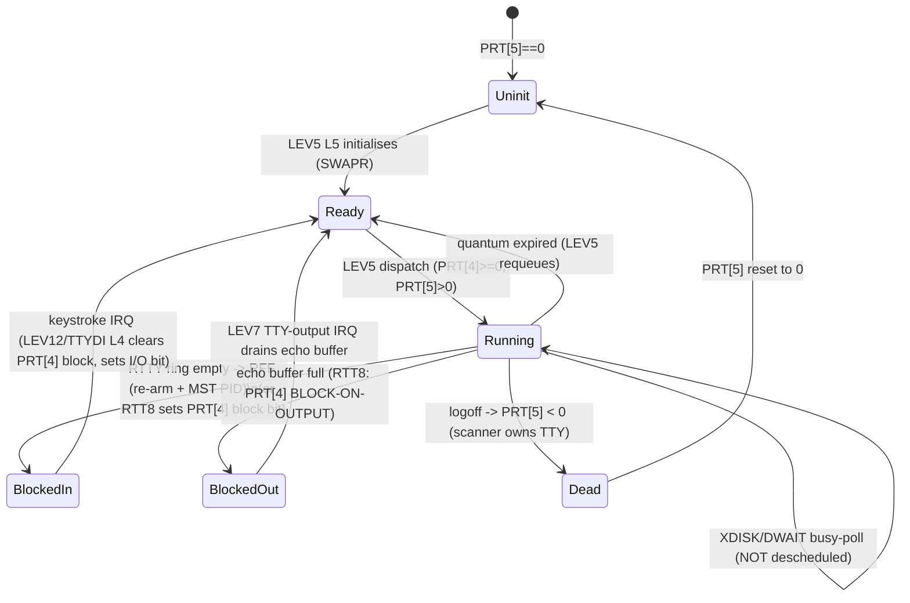
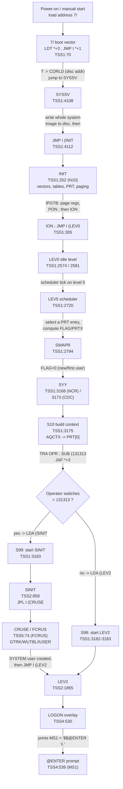
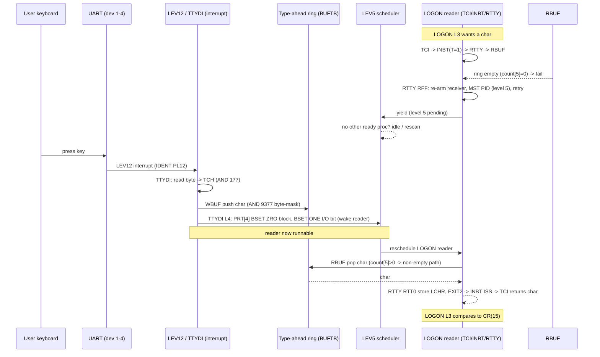
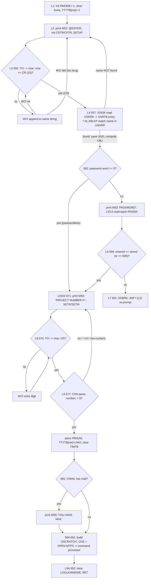

# NORD TSS 3.0 — The Architecture Reference

**Full path:** `E:\Dev\Ronny\TSS\docs\TSS-ARCHITECTURE.md`

This is the single comprehensive architecture document for the recovered 1973
**NORD TSS 3.0** timesharing system (Bo Lewendal base; NORD-10 drivers by NJL =
Nils Jakob Langeland), read directly from `src/TSS1.SYMB` … `src/TSS5.SYMB`,
`src/MINIT.SYMB`, and verified live on the nd100x emulator. Every factual claim
is tagged **[VERIFIED]** with a `file:line` citation (into
`E:\Dev\Ronny\TSS\src\` unless another tree is named), **[ASSUMPTION]** /
**[INFERRED]** for interpretation, or **NOT DETERMINED FROM SOURCE**. All
numbers are **OCTAL** unless marked "dec" (that is how MAC prints and how the
source is written). How to read it: chapters 1–4 are the resident kernel
(layout, memory, processes, interrupts and cold start), 5–9 the services built
on it (overlays, terminal I/O and login, file system, users, commands), 10–11
the device layer (TSS drivers, then the nd100x emulated devices), and 12 the
one deliberate source modification versus the archive.

---

## Table of contents

1. [System overview & source layout](#1-system-overview--source-layout)
2. [Memory & paging](#2-memory--paging)
3. [Processes, scheduler, context](#3-processes-scheduler-context)
4. [Interrupt levels & cold start](#4-interrupt-levels--cold-start)
5. [Overlay subsystem](#5-overlay-subsystem)
6. [Terminal I/O & login flow](#6-terminal-io--login-flow)
7. [File system & disc layout](#7-file-system--disc-layout)
8. [Users, login, accounting](#8-users-login-accounting)
9. [Command processor & user programs](#9-command-processor--user-programs)
10. [Device drivers (TSS side)](#10-device-drivers-tss-side)
11. [Emulated devices (nd100x)](#11-emulated-devices-nd100x)
12. [Source modifications vs the archive](#12-source-modifications-vs-the-archive)
13. [Cross-references](#13-cross-references)

---

## 1. System overview & source layout

### 1.1 The five-part structure

TSS is assembled as five MAC source parts, `TSS1`–`TSS5`, in that order
(the golden build stream is `)9ASSM TSS1,LIST1,0` … `)9ASSM
TSS5,LIST5,ASYMB:SYMB`). What each part contains, from its own contents:

| Part | Lines | Role — **[VERIFIED]** by cited content |
|---|---|---|
| **TSS1** | 4738 | The **resident kernel / machine layer**. Opens with the library-mark / configuration block (`TSS1.SYMB:1`–`159`); low-core vectors and the save-system word at location 7 (`TSS1.SYMB:62`–`70`); `INIT` interrupt-vector setup (`TSS1.SYMB:230`–`309`); paging init `IPGTB` (`TSS1.SYMB:323`); the interrupt-level routines `LEV0`,`LEV2`,`LEV5`,`LEV6`,`LEV7`,`LEV9`–`LEV14`; the scheduler+swapper `LEV5`/`SWAPR` (`TSS1.SYMB:2716`+); the disc-address map (`TSS1.SYMB:2589`+); the process table `PRT` (`TSS1.SYMB:2639`+); the monitor-call transfer vector `MCTBL` and processor `LEV3` (`TSS1.SYMB:4300`–`4366`); the software-instruction emulator `LEV14`/`DECOD` and the memory tables `PCTBL`/`PDTBL` (`TSS1.SYMB:4704`,`4709`). |
| **TSS2** | 3528 | The **per-process context block, memory/paging state, terminal I/O and command-utility layer, and file buffers**. Opens `%CONTEXT BLOCK` with the three register blocks (`TSS2.SYMB:1`–`37`), the virtual-core table `VCTBL` (`TSS2.SYMB:43`), I/O and utility variables, the stack and the overlay-enter routine `GOVX` (`TSS2.SYMB:181`–`189`), the `PROGM`/`DATA`/`GLOBL` program-frame macros (`TSS2.SYMB:244`–`263`), and page-fault / virtual-address handling that references `40000` and `NPGS` (`TSS2.SYMB:393`,`443`,`468`). |
| **TSS3** | 1754 | **Overlay machinery, the hardware bootstrap + TSS loader, and debug/utility overlays.** Defines the `GOVER`/`SOVER`/`OVERL`/`OVERX` overlay macros (`TSS3.SYMB:9`–`98`), the hardware bootstrap and TSS loader (`TSS3.SYMB:99`–`239`), the disc restart routine (`TSS3.SYMB:240`+), and register/deposit debug commands `REGS`/`SETX`/`CMOD` (`TSS3.SYMB:305`+). |
| **TSS4** | 2039 | **User-image save/restore and user-directory services.** `DUMP` — dump a user's address space to a file (`TSS4.SYMB:4`); `RECV` — restart a user from a file (`TSS4.SYMB:78`); `BROAD` broadcast (`TSS4.SYMB:163`); `GUNUM`/`GUNAM` user-name ↔ user-number conversion (`TSS4.SYMB:194`,`217`); the mail routines, `LOGON`, and the password/accounting overlays. |
| **TSS5** | 1994 | **User-account administration and the command processor.** `DLUSR` delete user (`TSS5.SYMB:4`), `CRUSE` create user (`TSS5.SYMB:61`), `IUSER` initialize user (`TSS5.SYMB:117`), `GETUN` get user number (`TSS5.SYMB:146`), the command tables and `XSTAR` (overlay OV19). TSS5 is where the golden `)LIST` fires, so it terminates the build. |

**[ASSUMPTION]** The ordering is load-bearing for the kernel: TSS1 defines
the machine layer and all symbols the later parts reference (register-block
offsets, `NPGS`, disc addresses), TSS2 lays down the resident per-process
data the kernel indexes, and TSS3–5 add services on top. This is inference
from the symbol dependencies, not a statement in the source.

Repository layout: `archive/` originals (never edit) → `src/` clean source →
`reference/` golden oracle dumps (`ASYMB.SYMB`/`BSYMB.SYMB`) → `Build/`
regenerated output → `derived/` project-made build inputs.

### 1.2 Build variants and the library-mark idiom

TSS is configured entirely with MAC **library marks**. A mark is *true when
the symbol is referenced but undefined*; "not-X" marks are made by an explicit
source construct, not by any negation syntax. **[VERIFIED]** `TSS1.SYMB:108-111`:

```
NMACF            % references NMACF -> present-but-undefined -> mark TRUE
"MACF            % if MACF is a set mark ...
)KILL NMACF      %   ... remove NMACF -> its mark becomes FALSE
"
```

So `NMACF` is a true mark **iff `MACF` is NOT set**. The same idiom defines
`NN10` = NOT `N10` **[VERIFIED]** `TSS1.SYMB:93-96` and `NCR` = NOT `CDC`
**[VERIFIED]** `TSS1.SYMB:76-79`.

The builds of record and their marks **[VERIFIED]**:

| Build | Marks | Source |
|---|---|---|
| Golden A (`ASYMB.SYMB`) | `CDC MACF DIAB K14 TEL4` | `src/ASSYSA.SYMB:4` |
| Golden B (`BSYMB.SYMB`) | `CDC MACF DEBUG DIAB K14 TEL4` | `src/ASSYSB.SYMB:4` |
| DRUM/N10 (the runnable build) | `CDC MACF DIAB K14 TEL4 DRUM N10` | `derived/ASSYS-DRUM-N10-MAC-INPUT.SYMB:13` |

Both golden builds are **NN10** (NORD-1) and compile the drum **out**; the
runnable build adds `DRUM N10`. `CDC` selects the CDC 9427 cartridge disc
over the alternative `NCR` disc throughout. `MACF` selects the `)9MOVE`
overlay-staging path (§5.5). `DEBUG` (B build only) moves the overlay disc
area to `OVDK2` (§5.6).

> **Address caveat used throughout this document.** Symbol addresses shift
> by ±1 word after any `src/` edit (e.g. the `EXRGP` restoration, §12,
> shifted every TSS2+ symbol +1). All octal addresses quoted for the DRUM
> build are representative values from `Build/drum/DSYMB.SYMB`; always
> resolve live addresses from the current build's own dump, never hard-code.
> **[VERIFIED]** by the `EXRGP` shift incident (§12.4).

---

## 2. Memory & paging

### 2.1 Physical layout

**[VERIFIED]** The resident system occupies low core; the user (virtual)
address space begins at **`MSTRT`**, which for the shipped 16K build is
octal **`40000`**: `"K16 … MSTRT=40000` (`TSS1.SYMB:4650`–`4651`; the
12K build uses `30000`, `TSS1.SYMB:4646`–`4647`). `TDUMP` independently
fixes `MSTRT=40000` (`src/TDUMP.SYMB:59`) and dumps user core starting there
(`src/TDUMP.SYMB:20`).

**[VERIFIED]** A user address space is **`NPGS` pages** and `NPGS=10` octal
= 8 pages (`TSS1.SYMB:4657`–`4659`). **[ASSUMPTION]** Each page is 2K
words: the context-block comment labels `VCTBL` "(IN 2K BLOCKS)"
(`TSS2.SYMB:43`–`44`) and `MSTRT=40000` + 8×2K spans to `60000`. 8×2K =
16K, matching the "16K system" `K16` build. **[VERIFIED]** the swapper
computes a page's core address as `page*2048` via `LDA II; SHA 13; ADD
9MSTR` — a 13-bit left shift = ×`10000` octal = 2048 (`TSS1.SYMB:2873`),
confirming the 2K page.

### 2.2 The three page tables

**[VERIFIED]** Three tables, one entry per page, hold the paging state:

- **`VCTBL`** — Virtual Core Table, resident per-process, `NPGS+NPGS`
  words (2 words/page) (`TSS2.SYMB:43`; comment `%VIRTUAL CORE TABLE`,
  `TSS2.SYMB:41`). It is what the user's address space *should* contain.
  Bit fields used by the swapper: `$W0` (word 0 = present/identity), `$X`
  (exists-on-drum flag, tested `BSKP ZRO 150 DA`, `TSS1.SYMB:2856`),
  `$MD` (mode), `$INDX` (drum index).
- **`PCTBL`** — Physical Core Table, `NPGS` words (`TSS1.SYMB:4704`,
  `%PHYSICAL CORE TABLE`). What is *actually* resident in each core page
  frame right now. `$MD` = 2 → read-only, = 3 → read/write
  (`TSS1.SYMB:2865`,`2880`).
- **`PDTBL`** — Physical Drum Table, `NDPGS+NDPGS` words (2/page)
  (`TSS1.SYMB:4709`, `%PHYSICAL DRUM TABLE`). Backing-store slot
  descriptors with a usage `$COUNT` for shared read-only pages
  (`TSS1.SYMB:2893`,`2950`). `NDPGS` (number of swap pages) scales with
  the terminal count `TEL*`; default `NDPGS=X4` where `X4=8*(NPGS+1)`
  (`TSS1.SYMB:4668`–`4695`).

### 2.3 NORD-10 hardware paging vs NORD-1

**[VERIFIED]** On the NORD-10 (`"N10`) the paging hardware is programmed at
init by `IPGTB` (`TSS1.SYMB:302`,`323`): it loops loading the paging
control register `TRR PCR` (`TSS1.SYMB:325`), then fills the page
registers `LDA (163000; ADD CNT; STA I CNT,X` over a computed count derived
from `MSTRT` and `NPGS` (`TSS1.SYMB:328`–`332`), and enables paging
with `PON` (`TSS1.SYMB:333`). Full annotated body in §4.4. **[VERIFIED]**
On the NORD-1 (`"NN10`) there is no paging hardware path in `INIT`; the
`IPGTB` routine is entirely inside `"N10` (`TSS1.SYMB:320`–`339`).
**[ASSUMPTION]** the NORD-1 runs the user in the resident 16K with the
swapper moving whole 2K pages between core and backing store rather than
using address translation — inferred from the absence of any NORD-1
page-register code and the presence of the same `SWAPR` copy loop for both
variants.

### 2.4 Swapping (core ⇄ mass storage)

**[VERIFIED]** The swapper `SWAPR` (`TSS1.SYMB:2794`+) is annotated with
ALGOL-style pseudocode. It (a) writes the outgoing user's context/register
block to swap area `DKA1+(PRT[0]<<3)` via `TRSFR` (`TSS1.SYMB:2811`,
`2818`–`2819`), (b) reads the incoming user's block (`TSS1.SYMB:2827`–
`2831`), then (c) for each of the `NPGS` pages reconciles `VCTBL` against
`PCTBL`: pages present in core but stale are written back if read/write
(`$MD=3`, `TSS1.SYMB:2865`–`2874`), cleared unless read-only
(`TSS1.SYMB:2880`–`2883`), and the required pages are read in from
`PDTBL`/drum (`TSS1.SYMB:2885`+). **[VERIFIED]** page transfers use
`MSTRT+I*2048` as the core end and `DKA1+(index<<3)` as the mass-storage
end (`TSS1.SYMB:2869`–`2874`, `2898`).

**[VERIFIED]** `TRSFR` is the swap front end that chooses drum vs disc: with
the `DRUM` mark, pages whose offset from `DKA1` is below the `4*DRMSZ`
threshold go to the drum and above it spill to the CDC disc; without `DRUM`,
`TRSFR = TRXX` (disc only) (`TSS1.SYMB:3695`–`3877`; detailed split code in
§11.2.6). The archived golden builds set neither `DRUM` nor `N10`, so the
drum is compiled out of both.

Per-user backing store is twelve fixed swap areas `DKA1`…`DKA12`, each
`200` octal words apart, based at `USRDK+10` (`TSS1.SYMB:2611`–`2622`);
see the disc map in §7.7.

---

## 3. Processes, scheduler, context

### 3.1 What a process is

**[VERIFIED]** There is **one process per terminal**. The process table
`PRT1` is `BSS NTTY+NTTY+…` (8 words × number of teletypes) with
`PRT2, BSS NTTY*8-20` following (`TSS1.SYMB:2642`–`2659`), and the
per-entry `%TTY USAGE` word documents the life-cycle: negative = dead
(scanner owns the TTY), zero = scheduler will initialize this process,
positive = alive/in use (`TSS1.SYMB:2650`–`2654`).

**[VERIFIED]** Each `PRT` entry is 8 words (`TSS1.SYMB:2642`–`2657`):

| offset | field | meaning |
|---|---|---|
| 0 | PDTBL index | index of this process's context block |
| 1 | quantum timer | small-quantum countdown |
| 2–3 | compute timer | double-precision CPU-time accounting |
| 4 | **STATUS** | bit15 = **BLOCK**, bit14 = RUBOUT, bit13 = BLOCK-ON-OUTPUT, bit12 = LOGON timer interrupt, bit11 = I/O interrupt |
| 5 | **TTY USAGE** | **negative** = scanner owns it (process dead); **zero** = scheduler will initialise; **positive** = alive/in use |
| 6 | free word | — |
| 7 | saved PID | PID register saved across swap |

`PRT` (`TSS1.SYMB:2663`) is a pointer to the *current* process entry.
`QUANT = -17` standard quantum (a negative count); `LQUA = 24` large
quantum (number of small quanta) (`TSS1.SYMB:2664`–`2665`).

**A process is runnable when STATUS (offset 4) ≥ 0 (BLOCK bit clear) and
TTY-USAGE (offset 5) > 0.** Setting STATUS bit15 blocks it; clearing bit15
wakes it. Decoded directly from the scheduler test (§3.4).

### 3.2 The context block

**[VERIFIED]** The resident per-process context block is defined at the head
of TSS2 under `%CONTEXT BLOCK` (`TSS2.SYMB:1`+) and consists of three
register images plus the memory/IO state:

- **`RBLOK`** (`BSS 11`, `TSS2.SYMB:7`) — the **user** register block:
  P at `RBLOK`, then X,T,A,D,L,STS,B,MPR at offsets `+1`…`+10`
  (`TSS2.SYMB:13`–`20`).
- **`UBLOK`** (`BSS 10`) + `UMPR` (`TSS2.SYMB:24`–`25`) — the register
  block for the **utility** (command interpreter) level.
- **`MBLOK`** and its named fields `XRG,TRG,ARG,DRG,LRG,SRG,BRG,MRG`
  (`TSS2.SYMB:29`–`37`) — the register block for the **MCALL
  processor** (level 3).

Following it: the `VCTBL` (§2.2), the terminal I/O locals (`TDEV`,`TCH`,
`IDEV`,`ODEV`… `TSS2.SYMB:48`–`55`), the utility/command variables
(`CMDLN`, `RUBAD`, `RMODE`, `PRNUM`, the `OVLAY` overlay cell, `TSS2.SYMB:
59`–`80`), locks (`LOGLK`,`PASLK`,`ELOCK`,`KMAIL`,`KTTYL`,`KACCL`,
`TSS2.SYMB:82`–`94`), the open-file machinery (`FBUF`,`OFT`,`OFTU`,
`TSS2.SYMB:141`–`177`), and the per-process **stack** `STK0, BSS STLEN`
with `STLEN=1040` octal (`TSS2.SYMB:189`,`210`).

### 3.3 Save / restore

**[VERIFIED, NORD-1]** Context save/restore uses the hardware register-file
`STF`/`LDF` register-block instructions. The `SAVE`/`UNSAV` pair at
location `40` stores/loads the full register file plus STS and MPR through
an X-indexed block, ending in `WAIT` (`TSS1.SYMB:197`–`206`); the vector
list at `20/` maps the 16 interrupt levels to their save areas
(`TSS1.SYMB:197`).

**[VERIFIED, NORD-10]** `RRBLK`/`WRBLK` read and write the three register
blocks with the NORD-10 `SRB`/`LRB` (save/load register block) instructions:
`LDX (RBLOK; SRB 10` for the user block on level 10, `UBLOK` level 20,
`MBLOK` level 30 (`TSS1.SYMB:2772`–`2783`). The swapper calls `RRBLK`
before writing a context out and `WRBLK` after reading one in
(`TSS1.SYMB:2816`,`2833`).

### 3.4 The scheduler (LEV5)

**[VERIFIED]** `LEV5` runs the scheduler first, then the swapper
(`%SCHEDULER RUNS FIRST`, `TSS1.SYMB:2718`). It walks the process table
from `9PRT` (`AAX 10` per entry), examining status word 4 and quantum
word 1, choosing the next runnable process, and falls into `SWAPR` with the
chosen entry (`TSS1.SYMB:2720`–`2764`):

```
LEV5: LDX I 9PRT; STZ FLAG; LDA DABLE; JAN L3A      % DABLE<0 disables switching
      LDA 1,X; JAP L0        % quantum timer still positive -> skip
      LDA 4,X; JAP L1        % (NN10 console poll branch)
...
ZZ:   ...advance to next PRT entry, wrap at PRT1...
L2:   LDA 5,X; JAZ L5        % TTY-USAGE == 0 -> initialise process (L5/SWAPR)
      JAN L0                 % TTY-USAGE < 0 -> dead, skip
      LDA 4,X; JAN L0        % STATUS < 0 (BLOCK bit15 set) -> BLOCKED, skip
      JAZ L3                 % STATUS == 0 -> runnable
      SAA 1; STA 5,X; SAA 0; JMP SWAPR   % dispatch it
L3:   LDA FLAG; JAZ L0; MIN 5,X; ... quantum bookkeeping ...; JMP SWAPR
L5:   SAA -1; JMP SWAPR      % first-time init of this process
```

**[VERIFIED]** Quanta: the scheduler ages `MIN 5,X` and compares against
`LQUA` to promote/demote (`TSS1.SYMB:2747`–`2750`). **[ASSUMPTION]** this
is a two-level round-robin with a small quantum for interactive processes
and a large quantum budget — inferred from the `QUANT`/`LQUA` comments and
the `MIN`/compare logic; the exact policy is not spelled out in prose.

**[VERIFIED]** `LEV9` (the sub-clock) is what periodically re-arms the
scanner (`SAA 100; MST PID` = level 6) and the scheduler (`SAA 40; MST PID`
= level 5) and decrements the current process's quantum `MIN 1,X`
(`TSS1.SYMB:4039`–`4046`), so scheduling is clock-driven.

**Idle behaviour when nothing is ready [VERIFIED `TSS1.SYMB:2752-2757`]:**

```
"N10"    L10: SAA 1; MST PID; TRA PID; AND 16; MCL PIE
              WAIT; MST PIE; SAA 1; MCL PID; JMP LEV5
"NN10"   L10: JMP LEV5        % busy rescan
```

On the NORD-10 the idle is a `WAIT` (halt until interrupt) then `JMP LEV5`;
on the NORD-1 it is a tight `JMP LEV5` rescan. Either way, the only thing
that makes a process runnable again is a BLOCK-bit clear performed by an
interrupt handler (`TTYDI L4` for input, §6.4; disc completion for I/O).

`SWAPR` (`TSS1.SYMB:2794`) saves the current PID into `PRT[7]`, and if the
chosen process differs from the current one, writes the current context
block out to disc (`DKA1 + PRT[0]<<3`) and reads the new one in (`SW1`…
page swap of `VCTBL`/`PCTBL`, §2.4). When `FLAG<0` (a fresh process) it
routes to `S10` / `SYY` instead (§4.7).

### 3.5 Process state machine



### 3.6 Terminal activation — how a terminal becomes a session

There are **two** ways a terminal becomes an active session; `PRT` word 5
drives both.

**Console / operator terminal — AUTO-STARTED at cold boot, no input needed.**
`INIT` seeds `PRT1` (the first process = console) word 5 = **0**, and every
other `PRT` entry word 5 = **-1** **[VERIFIED]** `TSS1.SYMB:258,265-267`:

```
LDX (PRT1; STX I (PRT; STZ 0,X; STZ AVAIL         ; PRT := PRT1
...
SAA 0; STA 5,X;  LDX (PRT2; LDT (PRTXX             ; PRT1[5] := 0   (X was PRT1)
SAA -1; STA 5,X; AAX 10                            ; PRT2..PRTXX[5] := -1
SKP IF DT LST SX; JMP *-4
```

Word 5 = 0 means "SCHEDULER WILL INITIALIZE THIS PROCESS", so the
round-robin scheduler picks the console up on the first pass
(`L2, LDA 5,X; JAZ L5` → `L5, SAA -1; JMP SWAPR`, **[VERIFIED]**
`TSS1.SYMB:2729-2736`), `SWAPR` routes the A<0 case to `S10`
(**[VERIFIED]** `TSS1.SYMB:2789`), and `S10` builds a fresh context with
`RMODE := -1` and dispatches level 2 → `LEV2` → `LOGON` (§4.7, §6.6).
**[VERIFIED live, nd100x/DAP]** after a cold boot the console process really
is auto-created (`RMODE=-1`, `PRT1[5]` alive) and runs at PIL 2 — no
console keypress is required to reach `LOGON`.

**Any other terminal — WOKEN by a typed character (LEV6 scanner).** Dead
terminals (word 5 = -1) are watched by the level-6 **teletype scanner**,
"RUNS EVERY 80 MILLISECONDS" **[VERIFIED]** `TSS1.SYMB:2653-2694`. For a
terminal whose word 5 is ≤ 0 it reads the input status/data register and,
on a real character, **sets word 5 := 0**, handing the terminal to the
scheduler **[VERIFIED]** `TSS1.SYMB:2664-2677`:

```
L1C, ... ADD (PRT1+5; COPY DB SA; COPY DD SA; LDA 0,B; JAP L10   ; word5>0 (alive)? skip
     ... ADD (TDEVI; COPY DB SA; LDA 0,B                          ; else read this tty's device
     ORA (IOX RDR; ...; BSKP ONE 30 DA; JMP L2                    ; N10: no char ready -> next tty
     LDA 0,B; ORA (IOX RDR; EXRG SA; AND (177; SUB (33; JAF L2    ; read char; ignore < 33 octal
     COPY DB SD; STZ 0,B                                          ; word5 := 0  -> scheduler inits
```

The scanner (level 6) and the scheduler (level 5) are both armed each clock
tick by `LEV9` (§3.4). The `SUB (33` threshold means characters below `33`
octal do not wake a dead terminal; the precise intent (control-char
filtering vs a specific wake key) is **NOT DETERMINED FROM SOURCE**.

---

## 4. Interrupt levels & cold start

### 4.1 The PIL level assignment

**[VERIFIED]** `INIT` installs the interrupt handlers. On the NORD-10 it
loads each level's P-register through `IRW nn DP` (`TSS1.SYMB:252`–`260`),
on the NORD-1 it stores handler addresses into the fixed low-core vector
cells (`TSS1.SYMB:234`–`250`). The mapping read from those two blocks:

| PIL level | Symbol | Role — **[VERIFIED]** citation |
|---|---|---|
| 0 | `LEV0` | Traps the `WAIT` and hands control to level 2 (utility). `%TRAPS THE WAIT INSTRUCTION AND SENDS CONTROL TO LEVEL 2` (`TSS1.SYMB:2569`–`2586`). Installed at cell `61` / level 0 (`TSS1.SYMB:237`,`253`). |
| 2 | `LEV2` | Utility / command-interpreter level; its handler address is stored into `UBLOK` (`TSS1.SYMB:238`,`255`). **[ASSUMPTION]** this is the level the user command loop runs at, from the `UBLOK` = "utility" pairing (`TSS2.SYMB:22`). Confirmed live: the console session runs at PIL 2. |
| 3 | `LEV3` | **Monitor-call processor** (§9.6). Stored into `MBLOK`/level 30 (`TSS1.SYMB:239`,`256`; body `TSS1.SYMB:4322`+). |
| 5 | `LEV5` | **Scheduler + swapper + overlay reader S5** (`TSS1.SYMB:240`,`256`; body `TSS1.SYMB:2716`+; S5 §5.4). |
| 6 | `LEV6` | **Teletype scanner**, `%RUNS EVERY 80 MILLISECONDS` (`TSS1.SYMB:241`,`257`; body `TSS1.SYMB:2668`–`2710`). |
| 7 | `LEV7` | Device-interrupt handler (output side) (`TSS1.SYMB:242`; body `TSS1.SYMB:1860`). |
| 9 | `LEV9` | Subsidiary clock: divides the tick, enables the TTY scanner and the scheduler, ages response/compute timers (`TSS1.SYMB:243`; body `TSS1.SYMB:4037`–`4093`). |
| 10 | `LEV10` | NORD-10 device level using `IDENT PL10` (`TSS1.SYMB:258`; body `TSS1.SYMB:1890`). |
| 11 | `LEV11` | Input-interrupt routine (card reader, paper tape, modem, teletype input); on NORD-1 uses `IOT SNI`, on NORD-10 `IDENT PL11` (`TSS1.SYMB:244`,`259`; bodies `TSS1.SYMB:1387`+, `1816`+). The only ident the N10 `IDENT PL11` dispatcher recognises is 4 (Versatec); other idents fall to the spurious counter `NER11` (§11.3). |
| 12 | `LEV12` | NORD-10 device level, `IDENT PL12` — teletype input dispatch (`TSS1.SYMB:258`; body `TSS1.SYMB:1429`). |
| 13 | `LEV13` | **Clock routine**, `MST PID` real-time clock at `1000` (`TSS1.SYMB:245`,`260`; body `TSS1.SYMB:4024`–`4035`). |
| 14 | `LEV14` | **Memory-protect / software-instruction interrupt** (NORD-1) or **internal-interrupt (IIC) dispatcher** (NORD-10) (`TSS1.SYMB:246`,`260`; bodies `TSS1.SYMB:4119`+, `4279`+). This is where a `MON` traps (§9.7). |

**[VERIFIED]** The enable masks differ by machine: `ENABL, 65357` (NORD-1)
vs `ENABL, 77157` (NORD-10) (`TSS1.SYMB:311`–`316`). The N10 mask
`77157` expands to **levels 0,1,2,3,5,6,9,10,11,12,13,14 enabled**
(bit 4 and bits 7–8, 15 clear) — level 4 is the panel-display register
block, not an interrupt consumer (§4.9). **[VERIFIED]** by bit expansion of
`ENABL, 77157` (`TSS1.SYMB:300`). Level priority is driven with
`MST PID`/`MCL PID` throughout, e.g. the scheduler is armed by
`SAA 40; MST PID` (`TSS1.SYMB:4046`).

The clock chain that keeps everything alive: the level-13 RTC handler
`LEV13` (**[VERIFIED]** `TSS1.SYMB:3996`+) triggers level 9, and `LEV9`
does `SAA 100; MST PID` (scanner, level 6) and `SAA 40; MST PID`
(scheduler, level 5) each tick (**[VERIFIED]** `TSS1.SYMB:4011-4016`). So
**level 13 → 9 → 5/6** is the heartbeat.

### 4.2 Page-zero vectors and the two entry words

Page zero holds the software dispatch vectors **[VERIFIED]**
`TSS1.SYMB:62-70`:

```
0/ JMP I *+3          ; loc 0 -> loc 3 = GOVX   (the overlay dispatcher)
1/ JMP I *+3          ; loc 1 -> loc 4 = USTK   (stack pop / overlay-return check)
2/ JMP I *+3          ; loc 2 -> loc 5 = STK    (stack push; ENTER jumps here)
3/ GOVX; USTK; STK    ; words 3,4,5 = the three routine addresses
6/ MCTBL              ; monitor-call table pointer
7/ LDT *+3; JMP I *+1; SYSSV; CORLD   ; the cold-start boot vector
```

and a **restart vector** at location 20 **[VERIFIED]** `TSS1.SYMB:197`:

```
20/ JMP I *+1; 301    ; loc 20 -> loc 21 = 301 = INIT
```

The 0/1/2 vectors are the overlay/stack trampolines: `GOVER` transfers to
address 0 → `GOVX`; `RET` (`RCLR DP AD1`) is a jump to address 1 → `USTK`;
`ENTER` jumps to address 2 → `STK` (§5.3). **[VERIFIED live 2026-07-23.]**

### 4.3 The location-7 boot vector and SYSSV

```
7/	LDT *+3; JMP I *+1; SYSSV; CORLD      [VERIFIED TSS1:70]
```

| addr | word | meaning |
|------|------|---------|
| `7`  | `LDT *+3`   | load **T** from `*+3` = address `12`, i.e. `T := CORLD` |
| `10` | `JMP I *+1` | jump **indirect** through `*+1` = address `11` |
| `11` | `SYSSV`     | (address constant) the jump target = `SYSSV` |
| `12` | `CORLD`     | (address constant) the disc address of the system core-load |

So the vector does exactly two things: **`T := CORLD`** and **jump to
`SYSSV`**. `CORLD` resolves to `CORL2` **[VERIFIED]** `TSS1.SYMB:2601-2634`:

```
CORL1=DKBIT+DKS+10      %CORELOAD 1     (TSS1:2601)
CORL2=CORL1+200         %CORELOAD 2     (TSS1:2602)
CORLX=CORL1 ; )KILL ; CORLX=CORL2 ; CORLD=CORLX   (TSS1:2627-2634)
```

**SYSSV — save system to disc [VERIFIED TSS1:4108-4114]:**

```
SYSSV, SAA -1; MCL PID; STT SYST; JPL I (ISTK
       STZ SYSCR; SAA -100;STA SYSCT
SYSLP, LDX SYSCR; LDT SYST; SAA 3; JPL I (XDISK; JPL I (FTLER
       MIN SYST; LDA (400; ADD SYSCR; STA SYSCR
       MIN SYSCT; JMP SYSLP; JMP I (INIT
```

- `STT SYST` stores the incoming disc address (`CORLD`) as the running
  target; `JPL I (ISTK` resets the interrupt stack.
- The `SYSLP` loop writes the memory image to disc in **0o100-count**
  transfers via `XDISK`: `SYSCR` = core address, advanced `400` each pass;
  `SYST` = disc track, incremented; `SYSCT` = a `-100` counter.
  **[ASSUMPTION]** "0o400 words × 0o100 passes" is the geometry the loop
  implements arithmetically; the exact track semantics of `XDISK` are not
  re-derived. What is **[VERIFIED]** is the loop structure and that it ends
  in **`JMP I (INIT`** (`TSS1.SYMB:4112`).

### 4.4 INIT — machine initialization

There are **two** `INIT` bodies selected by the CPU mark.

**NORD-1 (`"NN10`, TSS1:235-250)** installs interrupt vectors by writing
level entry-point addresses into fixed page-0 cells:

```
LDA (LEV0; STA I (61
LDA (LEV2; STA I (UBLOK
LDA (LEV5; STA I (136
... LEV6/LEV7/LEV9/LEV11/LEV13/LEV14 ...
SAA -1; STA I (61+10; STA I (UMPR; STA I (MRG ...   (mask words)
```

**NORD-10 (`"N10`, TSS1:237-290) is the live path**, in full:

```
INIT, IOF; POF                                   ; ints + paging off
   SAA 0; TRR PIE; LDA (*+2; IRW 0 DP; ION; IOF  ; clear PIE, prime level-0 P
   LDA (LEV2; IRW 20 DP                          ; arm level 2  (utility/user)
   LDA (LEV3; IRW 30 DP; LDA (LEV5; IRW 50 DP     ; arm level 3, LEVEL 5 (swapper/overlay reader)
   LDA (LEV6; IRW 60 DP; LDA (LEV9; IRW 110 DP    ; arm level 6, 9
   LDA (LEV10;IRW 120 DP;LDA (LEV12;IRW 140 DP    ; arm level 10, 12  (I/O)
   LDA (LEV11;IRW 130 DP                          ; arm level 11      (I/O)
   LDA (LEV13;IRW 150 DP;LDA (LEV14;IRW 160 DP    ; arm level 13 (clock), 14 (MON/trap)
   ... clear buffers / locks / timers ...          ; TSS1:247-266 (IBUF/ILINK loop,
                                                   ;  LRDR/LPNCH/LCRD..., FINIT, SETB
                                                   ;  seeds TTYTB/L7TBL/YSTOP/TIMTB/RSTBL)
   LDX (PRT1; STX I (PRT; STZ 0,X; STZ AVAIL      ; PRT setup: console PRT1[5]:=0,
   ...  SAA -1; STA 5,X ...                        ;  all other entries := -1  (§3.6)
   SAA -1; MCL PID; MCL PIE                        ; clear pending
   LDA ENABL; MST PIE                             ; **set the PIE mask** = 77157
   SAA 40; MST PID                                ; **kick level 5 once** (start scheduler)
   LDA (1136; TRR IIE; JPL IPGTB                  ; internal-int enable + init paging
   LDA (310; IOX 11                               ; device setup
   LDA (122001; IOX 13                            ; **program the RTC clock** (level 13)
   ION; JMP I (LEV0                               ; **interrupts ON**, hand to the idle level
```

Key anchors: level-5 handler armed `LDA (LEV5; IRW 50 DP` **[VERIFIED]**
`TSS1.SYMB:241`; PIE mask `LDA ENABL; MST PIE` with `ENABL, 77157`
**[VERIFIED]** `TSS1.SYMB:285,300`; level 5 primed once `SAA 40; MST PID`
**[VERIFIED]** `TSS1.SYMB:286`; RTC programmed `LDA (122001; IOX 13`
**[VERIFIED]** `TSS1.SYMB:289`; and `ION; JMP I (LEV0` **[VERIFIED]**
`TSS1.SYMB:290`.

**IPGTB — paging setup [VERIFIED TSS1:323-338]:**

```
IPGTB, COPY DA SL; STA IPL
       SAX -20; SAA 3; JMP I1+1
I1,    AAA 10; TRR PCR; JNC I1
       ...
       LDX (177400; SAT 0; LDA (400; JPL I (SETB
       LDA (MSTRT; SHA ZIN SHR 12; STA ICNT
       LDA (NPGS; SHA 1; ADD ICNT; STA ICNT
       STZ CNT; LDX (177400
I2,    LDA (163000; ADD CNT; STA I CNT,X
       MIN CNT; LDA CNT; SUB ICNT; JAN I2
       PON; JMP I IPL
```

It programs the paging control registers (`TRR PCR`), fills the page table
starting from `MSTRT` for `NPGS` pages with base `163000`, then `PON` turns
paging on and returns through `IPL`.

`FINIT` (`TSS1.SYMB:4711`–`4726`) clears the **in-core** file-system
headers and the `PCTBL`/`PDTBL`/`VCTBL`/bit/user/OBT tables — core
structures only, not disc content (§7.6 is the disc formatter).

### 4.5 DBOOT — the disc bootstrap path to INIT

The genuine cold entry `INIT (000301)` is reached two ways, both independent
of `ISTRT`:

1. **Disc bootstrap DBOOT** **[VERIFIED]** `TSS3.SYMB:265-268`:
   ```
   DBOOT, STZ DBCOR; LDA (CORLD; STA DBDKA
   DBLOP, LDX DBCOR; LDT DBDKA; JPL RDKOP        ; read one 256-word sector coreload->core
      MIN DBDKA; LDA (400; ADD DBCOR; STA DBCOR
      SUB (MSTRT; JAN DBLOP; JMP I (301          ; until core reaches MSTRT, then JMP INIT
   ```
   DBOOT reads the **coreload** (the resident system image) from disc
   starting at sector `CORLD` into core `0 … MSTRT=040000`, then
   `JMP I (301` = INIT. DBOOT/RDKOP themselves are the tiny bootstrap
   dumped to disc sectors 0-2 via `)8DUMP` **[VERIFIED]**
   `TSS3.SYMB:284-296`, loaded by the hardware disc-load microcode.
2. **Restart vector** location 20 → 301 **[VERIFIED]** `TSS1.SYMB:197`,
   and `SYSSV` itself ends `JMP I (INIT` (§4.3).

### 4.6 Top-level boot flowchart



### 4.7 Step table (cold start, in order)

| # | Routine | Octal addr anchor | src file:line | What it does |
|---|---------|-------------------|---------------|--------------|
| 1 | Boot vector | `7/` | TSS1:70 | `LDT *+3; JMP I *+1; SYSSV; CORLD` — load T := CORLD (disc addr of core-load 2), jump to `SYSSV`. |
| 2 | SYSSV | (label `SYSSV`) | TSS1:4108 | Save the running system image to disc in 0o100 chunks, then `JMP I (INIT`. |
| 3 | INIT (NN10) | (label `INIT`) | TSS1:235 | NORD-1 path: install interrupt-level vectors at fixed page-0 cells (61, 136, …). |
| 3 | INIT (N10) | (label `INIT`) | TSS1:252 | NORD-10 path: `IRW … DP` register-block vectors, buffer/table init, paging via `IPGTB`, then `ION; JMP I (LEV0`. |
| 3b | IPGTB | (label `IPGTB`) | TSS1:323 | Build the N10 page tables, `PON` (paging on), return. |
| 4 | LEV0 | (label `LEV0`) | TSS1:2574 / 2581 | Idle / lowest level; scheduler on level 5 runs when triggered. |
| 5 | LEV5 | (label `LEV5`) | TSS1:2720 | Scheduler: scan `PRT`, pick a runnable user, compute `FLAG`/`PRTX`, `JMP SWAPR`. |
| 6 | SWAPR | (label `SWAPR`) | TSS1:2794 | Swap current user's context out / new user's in; `FLAG<0` ⇒ `JMP I (SYY`. |
| 7 | SYY | (label `SYY`) | TSS1:3168 (NCR) / 3173 (CDC) | Entry to fresh-context build; CDC variant is just `JMP S10`. |
| 8 | S10 | (label `S10`) | TSS1:3175 | Build a brand-new process context; `AQCTX`; **OPR-switch test**; choose SINIT vs LEV2. |
| 8b | AQCTX | (label `AQCTX`) | TSS1:3227 | Acquire a free/unused `PDTBL` context-block index; returns A = index. |
| 9 | S99 | (label `S99`) | TSS1:3183 | Start the chosen process: set up devices, buffers, break/echo, `JMP I (S5`. |
| 10 | SINIT | (label `SINIT`) | TSS2:858 | Create-user-SYSTEM: `JPL I (CRUSE`, then `JMP I (LEV2`. |
| 11 | CRUSE/FCRUS | (label `FCRUS`) | TSS5:74 | Overlay `OV10`: allocates user via `GTRK`, `WUTBL`, `IUSER`; writes `USTBL`. |
| 12 | ISTRT / LEV2 | (labels) | TSS2:1863 / 1865 | Normal-running re-entry point (no OPR test — §4.8) / command-level entry: init stack, break, then `JPL I (LOGON`. |
| 13 | LOGON / `@ENTER` | (label `LOGON`) / `MS1` | TSS4:530 / TSS4:539 | Overlay `OV6`: prints `MS1, '$$@ENTER \ '`, reads user name/password/project, opens the terminal. |

S10 in detail **[VERIFIED TSS1:3175-3183]**:

```
S10,  LDX I 9PRTX; STX I 9PRT
      SAA -1; STA I (RMODE
      STZ 2,X; STZ 3,X; STZ 4,X; SAA 4
      STA 7,X; SAA 1; STA 5,X
      JPL I (AQCTX; LDX I 9PRT; STA 0,X
      TRA OPR; SUB (131313; JAF *+3; LDA (SINIT; JMP S99
      LDA I (AVAIL; JAP *+3; LDA (NOTUP; JMP S99
      LDA (LEV2
S99,  STZ I (RSTRT
      ...
```

1. Adopt `PRTX` as the current `PRT`; set `RMODE=-1`, quantum, word 5 := 1
   (alive) (`TSS1:3175-3178`).
2. `JPL I (AQCTX` — acquire a context-block index; store it in `PRT[0]`
   (`TSS1:3179`). `AQCTX` (`TSS1:3227-3283`) scans `PDTBL` for the first
   free (`$W0=0`) or unused (`$COUNT=0`) entry, `FTLER` if none, marks it
   `COUNT=1, MD=1`, returns the index in A.
3. **The operator-switch decision** (`TSS1:3180`): switches == `131313` →
   `LDA (SINIT; JMP S99`; else availability test (`AVAIL` not positive →
   `NOTUP`); else `LDA (LEV2` (`TSS1:3181-3182`).
4. `S99` (`TSS1:3183-3206`) launches the chosen process: clears `RSTRT`,
   sets `IDEV`/`ODEV`=1, initializes `FBUF`, stack (`ISTK`), `OFT`,
   `VCTBL`, break/echo tables, then `JMP I (S5` to dispatch.

SINIT → CRUSE **[VERIFIED TSS2:858-860]**:

```
SINIT, LDX (SINQ; RCLR DD; JPL I (CRUSE; JMP *+1
       JMP I (LEV2
SINQ,  #SY; #ST; #EM; 0; 0; 0; 0        ; packed 2-char words = "SYSTEM"
```

`RCLR DD` clears D (device id 0); `CRUSE` creates the SYSTEM user
(chain in §8.2); either way control falls to `JMP I (LEV2`.

### 4.8 The ISTRT gotcha — why cold start must enter at address 7

`ISTRT` (TSS2:1863) and `LEV2` (TSS2:1865) are the **normal-running
re-entry** points: the swapper writes `ISTRT` into a user's level-2
P-register when it (re)dispatches that user **[VERIFIED]**
`TSS1.SYMB:3110-3114` / `3125` (`LDA (ISTRT; SAT 1; IRW 20 DP; JPL I
(SXBRK`). `ISTRT`/`START`/`LEV2A` contain **no** `IRW` vector writes, no
`MST PIE`, and no `ION` **[VERIFIED]** `TSS2.SYMB:1846-1855` — they assume
INIT has already brought the machine up.

**The OPR-switch test lives only in `S10` (TSS1:3180), on the fresh-context
build path.** Reaching `LEV2`/`ISTRT` directly — or resuming an existing
user via `SWAPR`'s `SW1` path — never executes `TRA OPR; SUB (131313`.
Consequently:

- **Cold start must load PC = address `7`** so the machine runs
  `SYSSV → INIT → LEV0 → LEV5 → SWAPR → SYY → S10`, where `S10` reads the
  operator switches. Only there can `131313` route into `SINIT` and create
  the SYSTEM user on a virgin disc **[VERIFIED TSS1:70, 3180]**.
- Starting at `ISTRT` (or `LEV2`) bypasses the whole interrupt/paging/RTC
  bring-up *and* the OPR test. **[VERIFIED by control flow: the only
  reference to SINIT as a start address is TSS1:3180, reachable only
  through S10.]**
- **[VERIFIED live, nd100x]** the working cold-start recipe is
  `--start=7 --opr=131313`: SINIT→CRUSE creates SYSTEM (disc-verified:
  track allocated + name in `USTBL`) and the boot proceeds to `@ENTER`.

### 4.9 Operator's control-panel switches (`TRA OPR`)

On a real NORD-1 / NORD-10 the operator's panel has 16 DATA switches, read
with `TRA OPR` (A := panel register). TSS never writes the panel; it is a
pure operator-to-OS control channel. TSS reads it in **five** places:

| Value | Where read | Hardware gate | Action |
|------------------|-------------------------------|---------------|--------|
| `131313` | Cold start `S10` (TSS1:3180) | both | Create the **SYSTEM** user, then boot (§4.7) |
| `111111` | Disc driver `XDISK` error path (TSS2:577 NCR / :585 CDC) | both (per controller) | **Verbose disc-error diagnostics** |
| `25252` | Scheduler `LEV5` (TSS1:2724, `"NN10`) | **NORD-1 only** | Panel-driven **memory examine/deposit** monitor |
| *address*, bits 0–14 | Clock `LEV13` (TSS1:4031, `"N10`) | **NORD-10 only** | Continuous **memory-word display** in the LEV4 register block |
| (any, low 15 bits) | same read | — | (the value is used as an address, not compared) |

**`111111` — verbose disc diagnostics.** When a disc transfer fails, TSS
normally retries silently. With the panel at `111111` it instead prints the
error code, the logical disc address, and (CDC variant) the physical
address computed by `DKADR` **[VERIFIED]** `TSS2.SYMB:577-585`:

```
"CDC
T1,   TRA OPR; SUB (111111; JAF T1A                 ; panel != 111111 -> silent (T1A)
   LDX (MS1; JPL I 7MSG
   LDA ERR,B; SAT 10; JPL I 9IOUT                   ; error code
   LDX (MS2; JPL I 7MSG
   LDA TREG,B; SAT 10; JPL I 9IOUT                  ; logical disc address
   LDX (MS3; JPL I 7MSG
   LDA TREG,B; JPL I (DKADR; JMP *+1; SAT 10; JPL I 9IOUT  ; physical disc address
   LDX (MS4; JPL I 7MSG
T1A,  JMP T0
```

**`25252` — NORD-1 examine/deposit monitor** **[VERIFIED]**
`TSS1.SYMB:2724` (`"NN10` only): typed octal digits accumulate into `VAL`
(`VAL := VAL*8 + digit`); `/` sets the address pointer and examines
(`VALP := VAL; VAL := mem[VALP]`); CR deposits `VAL` into `mem[VALP]` and
advances. On NORD-10 the block is compiled out (`"N10 L1, JMP ZZ`).

**Panel as display address (NORD-10)** **[VERIFIED]** `TSS1.SYMB:4031`:
every clock tick `LEV13` does `IOX 306; IRW 40 DA` (console output status →
LEV4 A) then `TRA OPR; AND (77777; COPY DX SA; LDA 0,X; IRW 40 DD` — the
panel value, masked to 15 bits, is treated as a memory address whose
contents are copied into the level-4 register block (the panel's
register-display lights). A live memory monitor, harmless at 0.

Quick reference card:

```
OCTAL     ACTION                                              HARDWARE
-------   -------------------------------------------------   -----------------
131313    Cold start: create the SYSTEM user (first sysgen)   NORD-1 + NORD-10
111111    Verbose disc-error diagnostics (else silent retry)  NORD-1 + NORD-10
025252    Console memory examine/deposit monitor              NORD-1 only
<addr>    Low 15 bits = memory word shown in LEV4 display     NORD-10 only
000000    Normal run (LEV4 display shows word at address 0)   -
```

**Setting the switches on nd100x** (which has no physical panel; `OPR` is
`gReg->reg_OPR`, `nd100x src/cpu/cpu_instr.c` `case 02: gA = gOPR`):

- Command line **`--opr=OCTAL`** — presets the register before the CPU
  starts (applied after `program_load` so `cpu_reset` does not wipe it);
  parsed in octal, values > `177777` rejected. E.g.
  `nd100x --mms1 --opr=131313 --boot=bpun --image=…/tss-drum.bpun
  --drum=… --cdc=… --start=7`.
- Interactive — **F12 menu, option [6] Control Panel Switches**: shows the
  current OPR in octal/hex/decimal with a 16-bit switch display and the
  decoded TSS meaning; keys `0`–`7` shift an octal digit in from the right,
  `C` clears, `S` sets `131313`, `D` sets `111111`, ESC exits. Edits take
  effect at the next `TRA OPR`.

### 4.10 Operator-switch decision (sequence diagram)

```mermaid
sequenceDiagram
    participant OP as Operator panel (OPR reg)
    participant S10 as S10 (TSS1:3175)
    participant S99 as S99 (TSS1:3183)
    participant SINIT as SINIT (TSS2:858)
    participant LEV2 as LEV2 (TSS2:1865)

    S10->>OP: TRA OPR            (read switch register)
    S10->>S10: SUB (131313 ; JAF *+3
    alt switches == 131313
        S10->>S99: LDA (SINIT ; JMP S99
        S99->>SINIT: start process at SINIT
        SINIT->>SINIT: JPL I (CRUSE  (create SYSTEM user)
        SINIT->>LEV2: JMP I (LEV2
    else switches != 131313
        S10->>S10: (also checks AVAIL; NOTUP if down)
        S10->>S99: LDA (LEV2 ; (fallthrough) JMP S99
        S99->>LEV2: start process at LEV2
    end
    LEV2->>LEV2: JPL I (LOGON  -> prints "@ENTER"
```

### 4.11 DRUM-build key addresses (representative)

From `Build/drum/DSYMB.SYMB` (see the address caveat in §1.2 — resolve
from the current dump before use):

| symbol | addr | | symbol | addr |
|---|---|---|---|---|
| INIT | 000301 | | GOVX | 016456 |
| LEV0 / LEV5 | 006104 / 006324 | | OVLAY / OVLAX | 015205 / 015206 |
| ISTRT / START | 025076 / 025101 | | SYSOV | 011333 |
| XSTAR | 033601 | | ROVER (current) | 031400 |
| CORLD | 000060 | | OVDK | 000160 |
| MSTRT | 040000 | | OV19 | 000036 |
| ENABL (cell, holds 77157) | 000535 | | DKADR | 010006 |

(ROVER in the golden NN10 A build is `031522` **[VERIFIED]** `ASYMB:504`;
the DRUM-build value moved from `031377` to `031400` when `EXRGP` was
restored, §12.)

---

## 5. Overlay subsystem

Kernel code that is not resident is kept on disc as **overlays** and pulled
in on demand. TSS3 defines the machinery (`%OVERLAY AREA`, `TSS3.SYMB:1`+).
This chapter covers the runtime model (verified live 2026-07-23), the
build-time staging, and the disc contract.

### 5.1 The runtime model — overlays execute IN PLACE in ROVER

**Overlays assemble at, load into, and execute at `ROVER` — resident
addresses** (`031400` in the current DRUM build; `031522` in the golden A
build). The octal-`40000` **`VOR` window is BUILD-TIME STAGING ONLY** (the
`"MACF` `OVERX` macro copies each finished overlay's `ROVER` image to a
`VOR` slot so all 31 survive in MAC's memory image, §5.5); no overlay ever
executes there. **[VERIFIED live 2026-07-23.]**

- **`ROVER`** — overlay core base, `ROVER, BSS 1000` (1000 octal = 512 dec
  words) **[VERIFIED]** `TSS3.SYMB:3`; `ROV4=ROVER+400` **[VERIFIED]**
  `TSS3.SYMB:4`. Each overlay is exactly two 256-word sectors: sector D →
  `ROVER..ROVER+377`, sector D+1 → `ROV4..ROV4+377`.
- Two overlay cells track state: **`OVLAY`** (`%OVERLAY CELL FOR THE USER`,
  `TSS2.SYMB:78`) = what the user has requested/believes loaded, and
  **`SYSOV`** (`%OVERLAY CELL FOR THE SYSTEM`, `TSS1.SYMB:4539`) = what is
  *physically* in `ROVER`. **`OVLAX`** (`TSS2.SYMB:80`) holds the previous
  overlay.
- On the cold assembled image all three cells are preset by the `OVERX`
  macro to `RQR-1` = the number of the **last overlay assembled** = `OV19 =
  036` (`OVLAY/ RQR-1; OVLAX/ RQR-1; SYSOV/ RQR-1`, **[VERIFIED]**
  `TSS3.SYMB:88-90`; `RQR` starts at 0, `TSS2.SYMB:171`, and ends at `037`,
  `ASYMB:683`). This preset is **truthful by design**: after assembly the
  overlay physically resident in `ROVER` *is* OV19, so the first
  `GOVER OV19` runs the resident copy directly with no disc read; disc
  reads occur only for subsequent, different overlays. **[VERIFIED live:
  on the unpatched cold image `OVLAY = SYSOV = 036` and `S5`'s check skips
  cleanly for the fresh console process.]**

### 5.2 The four overlay macros

- **`GOVER`** — "GET OVERLAY (MACRO)", args = overlay number, transfer
  location, routine name (`TSS3.SYMB:9`–`28`). Expands a call site to
  `STX I *+5; SAX 0; SWAP DP SX; OVn ; entry ; SAVX` **[VERIFIED]**
  `TSS3.SYMB:15-26` — i.e. it sets `P:=0` and `X:=&(overlay-number word)`
  and execution continues at **virtual address 0**, the page-zero
  trampoline to `GOVX` (§4.2).
- **`OVERL`** — "DEFINE OVERLAY (MACRO)": assigns `OVn := RQR`, kills+bumps
  `RQR`, and resets the location counter to `ROVER`
  (`$A1 =RQR; )KILL RQR; RQR=$A1 +1; ROVER/`, **[VERIFIED]**
  `TSS3.SYMB:56-61`).
- **`OVERX`** — "SAVE OVERLAY ON DISK (MACRO)": closes an overlay body
  (§5.5 for the MACF path).
- **`SOVER`** — "WRITE OVERLAY ONTO DISK" at runtime, overlay number =
  `RQR-1`, `WAIT 47` if the overlay is too large (`TSS3.SYMB:29`–`51`).
  **Compiled out of every build of record** — it lives only in the `"NMACF`
  path (§5.5).

Invocation sites (all `OVERL … OVERX` pairs) **[VERIFIED]**:
`TSS3.SYMB` OV1..OV3 (7 overlays); `TSS4.SYMB` OV4..OV9D (13);
`TSS5.SYMB` OV10..OV19 (11) — 31 in total.

### 5.3 Dispatch, nested calls, and return — GOVX / STK / USTK / S5

Nested overlay calls (an overlay routine calling into another overlay) are
**by design and work**. The full verified chain **[VERIFIED live
2026-07-23]**:

1. A `GOVER` call site executes its trampoline (`STX I *+5; SAX 0;
   SWAP DP SX; ovl#; entry; SAVX`) → control arrives at **address 0** →
   page-zero vector `0/ JMP I *+3` → **`GOVX`**.
2. **`GOVX`** **[VERIFIED]** `TSS2.SYMB:181-189`:
   ```
   GOVX, SWAP DX SL; STA SAVA; STX SAVL; COPY DX SL     ; save regs
      LDA 0,X; SUB I 9OVL; JAZ *+7                       ; requested == OVLAY ? skip load
      LDA I 9OVL; STA I (OVLAX; LDA 0,X; STA I 9OVL      ; save old -> OVLAX, OVLAY := requested
      SAA 40; MST PID; LDA SAVL; COPY DL SA              ; raise LEVEL 5 (the reader)
      LDA SAVA; LDX 1,X; STX SAVST                       ; SAVST := overlay entry address
      LDX SAVX; JMP I SAVST                              ; jump into the overlay body (in ROVER)
   9OVL, OVLAY
   ```
   `GOVX` itself never touches the disc; it records the request in `OVLAY`
   and triggers level 5. Level 5 preempts level 2, so the read completes
   before the `JMP I SAVST` continues at level 2.
3. The **level-5 reader `S5`** **[VERIFIED]** `TSS1.SYMB:3069-3073`:
   ```
   %CHECK IF AN OVERLAY SHOULD BE READ IN
   S5,   LDA I (SYSOV; SUB I 9OVL; JAZ S5X            % already loaded ? skip
      LDA I 9OVL; STA I (SYSOV; SHA 1; ADD (OVDK      % A := OVLAY*2 + OVDK
      COPY DT SA; LDX (ROVER; SAA 1; JPL I 9SDK       % READ sector   -> ROVER
      AAT 1;      LDX (ROV4;  SAA 1; JPL I 9SDK       % READ sector+1 -> ROV4
   S5X, …
   ```
   with `9SDK, SDISK` (`TSS1.SYMB:3136`). When `SYSOV ≠ OVLAY` it loads
   disc sector `OVDK + 2*OVLAY` (and +1) into `ROVER`/`ROV4`, sets
   `SYSOV := OVLAY`, and the scheduler re-dispatches level 2.
4. **`STK`** (reached via `ENTER` → page-zero vector 2) pushes a stack
   frame and **stores the caller's overlay number in frame slot `XOVL`
   (offset -11 octal)**.
5. **`USTK`** (reached via `RET` = `RCLR DP AD1` = jump to address 1 →
   page-zero vector 1) pops the frame and **compares the frame's `XOVL`
   against the current `OVLAY`**; if the caller's overlay is no longer
   resident it reloads it through the same level-5 path before returning.

This is how `A → GOVER B → return to A` works even though both A and B
occupy the same `ROVER` window: the stack frame remembers which overlay
each caller lives in, and `USTK` transparently swaps it back.

### 5.4 Disc-address contract

Both the (reference) SOVER writer and the runtime reader compute the disc
address the same way:

```
disc_sector = OVLAY * 2 + OVDK          (unit = 256-word sector)
```

**[VERIFIED]** writer `TSS3.SYMB:38`: `LDA I (OVLAY; SHA 1; ADD (OVDK`;
reader `TSS1.SYMB:3071` (identical expression).

Resolved constants (CDC set, DEBUG not set) **[VERIFIED]**:

| symbol | expression | value | source |
|---|---|---|---|
| DKS | start of disc | `000000` | `TSS1.SYMB:2578` / `ASYMB:96` |
| DKBIT | CDC file-system MIB | `000050` | `TSS1.SYMB:2584` / `ASYMB:97` |
| CORL1 | DKBIT+DKS+10 | `000060` | `TSS1.SYMB:2586` / `ASYMB:98` |
| CORL2 | CORL1+200 | `000260` | `TSS1.SYMB:2587` / `ASYMB:99` |
| OVDK1 | CORL1+100 | `000160` | `TSS1.SYMB:2593` / `ASYMB:105` |
| OVDK2 | CORL2+100 | `000360` | `TSS1.SYMB:2594` / `ASYMB:106` |
| **OVDK** | OVDK1 (DEBUG→OVDK2) | **`000160`** | `TSS1.SYMB:2611-2618` / `ASYMB:113` |

Default `OVDK=OVDK1`; only `"DEBUG` switches to `OVDK2=360` (the B build),
so the debug build's overlays occupy a disjoint disc region **[VERIFIED]**
`TSS1.SYMB:2611-2618`, `src/ASSYSB.SYMB:4`.

Writer/reader symmetry:

| | writer (SOVER, `"NMACF`, reference) | reader (S5, always) |
|---|---|---|
| disc addr | `OVLAY*2+OVDK` `TSS3:38` | `OVLAY*2+OVDK` `TSS1:3071` |
| op code A | `SAA 3` = WRITE `TSS3:44` | `SAA 1` = READ `TSS1:3072` |
| core, sec0 | `ROVER` | `ROVER` |
| core, sec1 | `ROV4` | `ROV4` |
| device | XDISK (CDC 500) | SDISK→DKOP (CDC 500) |

`SDISK` A-register convention: "A = OPERATION (1=READ, 3=WRITE)"
**[VERIFIED]** `TSS1.SYMB:3927`; the CDC variant loops `DKOP` ("PERFORM A
256 WORD DISK OPERATION") **[VERIFIED]** `TSS1.SYMB:3946-3954, 3371-3398`.
Overlays live on the **CDC system disc (IOX channel 500 in the N10 build,
100 on NORD-1)** — never the swap drum (540). `DCHN` resolution
**[VERIFIED]** `TSS1.SYMB:3333-3338`; register map in §11.1.

At I/O time the driver converts the linear sector to the physical CDC
address via **`DKADR`** before loading `IOX LBA` **[VERIFIED]**
`TSS2.SYMB:551`. The verified map (per-instruction from the live machine):

```
DKADR(L) = 32*floor(L/12) + 2*(L mod 12)
```

a base-12 → `track*32 + 2*sector` repack (12 = sectors per track).
**[VERIFIED live]** `DKADR(0244) = 32*13 + 2*8 = 432 = 0o660`, seen loaded
into the CDC block-address register as `IOX 503 A=000660`. The unit-1
displacement `52600` (`TSS1.SYMB:3632`) is never added for the overlay
disc (unit 0); the result returns in T→A (`TSS1.SYMB:3642`), and the
`DKLIM=626` cylinder clamp passes. Two earlier derivations of this map are
**superseded** and must not be reused: `72*L` (traced while `RGDIV` was an
undefined symbol, fixed by restoring `RGDIV`) and
`8*floor(L*65537/12)+64*L` (traced while mac-c miscompiled the `SHR` shift
modifier; assembler fix recorded in `MAC-ASSEMBLER.md`). Over the overlay
range `0160..0257` the physical sectors run `0o450..0o712` (max 458 dec).

### 5.5 Build-time staging — MACF `OVERX` and `)9MOVE` (why SOVER never runs)

`SOVER` and the `)SOVER` command live **only** in the `"NMACF` path
(`TSS3.SYMB:35-49`; the only `)SOVER` in the tree is inside the `"NMACF`
`OVERX` macro, `TSS3.SYMB:78`). Every build of record sets **MACF**
(§1.2), so `"NMACF` is FALSE and SOVER is never assembled. The macro that
**is** defined and invoked is the `"MACF` `OVERX` **[VERIFIED]**
`TSS3.SYMB:80-93`:

```
"MACF
)MCDEF OVERX $A1
$A1 =*-ROVER            % $A1 := overlay size in words
)9MOVE ROVER VOR VORS   % copy VORS(=1000) words ROVER -> VOR  (block image move)
GLOB=VOR
)KILL VOR
VOR=GLOB+VORS           % advance VOR window by one overlay slot
)KILL GLOB
OVLAY/ RQR-1            % preset the three overlay cells to the last overlay #
OVLAX/ RQR-1
SYSOV/ RQR-1
)WRTM                   % enter write mode
)WRITE $A1              % dump the size symbol to the object/list stream
   ]
```

`)9MOVE` semantics **[VERIFIED]** MAC User's Guide `ND-60.096.01 §C.1.1.1`:
"move a block of image from one place to another … source address,
destination address, word count" — a **raw block copy of assembled words,
no relocation**. Each overlay, all assembled at `ROVER`, is preserved at a
distinct `VOR` slot (40000, 41000, … 76000) purely so all 31 survive in
MAC's memory image; internal references stay `ROVER`-relative because the
overlay both assembles and executes at `ROVER`. Cross-check: `VOR` starts
`40000` (`TSS3.SYMB:5`), advances `VORS=1000` per overlay, final
`VOR=077000` **[VERIFIED]** `ASYMB:693` → (077000-040000)/1000 = 37 octal
= 31 overlays. ✓

The `VOR` windows hold **fully fixed-up** overlay bodies: an instrumented
build showed zero forward-reference or literal fixups unresolved inside any
overlay window at the `)9MOVE` snapshot point (every overlay's internal
labels and `)FILL`'d literals are defined before its `OVERX`); pinned by
`mac-c tests/test_mac.c [12]`. **[VERIFIED]**

Per-overlay used size = `*-ROVER` at the `OVERX`, stored in the `QOVn`
symbol (`$A1 =*-ROVER`, `TSS3.SYMB:82`); e.g. `QOV19=000725` (469 dec of
512) **[VERIFIED]** `ASYMB:692`. All ≤ 1000. The reference SOVER guard
halts `WAIT 47` if an overlay reaches 512 words (`TSS3.SYMB:37`).

For the reproduction, `mac_write_cdc_disc` (`mac-c/src/mac_bpun.c`) copies each
512-word `VOR` window to CDC-disc physical sectors
`cdc_dkadr(OVDK+2n)`/`cdc_dkadr(OVDK+2n+1)` — DKADR applied once, at write
time, so the nd100x CDC device stays a dumb linear-by-physical-sector store
(§11.1.5).

### 5.6 The 31-overlay layout table

Overlay numbers and OVDK are build-independent (numbers verified from
`reference/ASYMB.SYMB` via `tools/analysis/overlay_layout.py`). Sectors are octal
256-word logical sector numbers on the CDC disc; each overlay occupies the
two consecutive sectors `sec0, sec1` and loads at `ROVER`.

| label | OVn (oct) | sec0 | sec1 | used words (QOVn) |
|---|---|---|---|---|
| OV1  | 000000 | 000160 | 000161 | 000574 |
| OV1A | 000001 | 000162 | 000163 | 000704 |
| OV1B | 000002 | 000164 | 000165 | 000426 |
| OV1C | 000003 | 000166 | 000167 | 000642 |
| OV2  | 000004 | 000170 | 000171 | 000725 |
| OV2A | 000005 | 000172 | 000173 | 000514 |
| OV3  | 000006 | 000174 | 000175 | 000447 |
| OV4  | 000007 | 000176 | 000177 | 000551 |
| OV4A | 000010 | 000200 | 000201 | 000572 |
| OV5  | 000011 | 000202 | 000203 | 000620 |
| OV6  | 000012 | 000204 | 000205 | 000702 |
| OV6A | 000013 | 000206 | 000207 | 000527 |
| OV6B | 000014 | 000210 | 000211 | 000547 |
| OV7  | 000015 | 000212 | 000213 | 000533 |
| OV8  | 000016 | 000214 | 000215 | 000713 |
| OV9  | 000017 | 000216 | 000217 | 000663 |
| OV9A | 000020 | 000220 | 000221 | 000762 |
| OV9B | 000021 | 000222 | 000223 | 000707 |
| OV9C | 000022 | 000224 | 000225 | 000714 |
| OV9D | 000023 | 000226 | 000227 | 000265 |
| OV10 | 000024 | 000230 | 000231 | 000561 |
| OV11 | 000025 | 000232 | 000233 | 000717 |
| OV12 | 000026 | 000234 | 000235 | 000670 |
| OV13 | 000027 | 000236 | 000237 | 000602 |
| OV14 | 000030 | 000240 | 000241 | 000713 |
| OV15A| 000031 | 000242 | 000243 | (QO15A, in dump) |
| OV15 | 000032 | 000244 | 000245 | 000672 |
| OV16 | 000033 | 000246 | 000247 | 000713 |
| OV17 | 000034 | 000250 | 000251 | 000545 |
| OV18 | 000035 | 000252 | 000253 | 000715 |
| **OV19 (XSTAR)** | **000036** | **000254** | **000255** | **000725** |

Total 31 overlays (0..36 octal = 0..30 dec), logical sectors 160..255.
`XSTAR` (the command processor) is overlay OV19 **[VERIFIED]**
`TSS5.SYMB:1786,1808`; `ASYMB:682` `OV19=000036`.

### 5.7 Reproducing the overlay disc (host-assembler checklist, condensed)

1. Resolve `OVDK` (160 non-DEBUG / 360 DEBUG), `ROVER`, `VORS=1000`, and
   every `OVn` from the build's own symbol table — never hard-code.
2. On `OVERL OVn` record base := `ROVER`, num := `OVn`; on `OVERX` snapshot
   512 words `image[ROVER .. ROVER+0o1000)` (equivalently the `VOR` slot).
3. Reject any overlay whose `QOVn ≥ 0o1000`.
4. Target sectors: logical `sec0 = OVDK + 2*num`, `sec1 = sec0+1`; apply
   `DKADR(L) = 32*floor(L/12) + 2*(L mod 12)` to get the physical sector
   if the disc image is physical-sector addressed.
5. Copy verbatim — no relocation (matches `)9MOVE` and the reader loading
   straight into `ROVER`).
6. Overlays go on the CDC disc (channel 500 / 100), never the drum (540).
7. `tools/analysis/overlay_layout.py` regenerates the overlay→sector table from a
   `)LIST` dump for diffing.

Not determined from source: the runtime value of `DKBAS` (`DKBAS,0`,
`TSS1.SYMB:171`; the NCR/SDISK paths add it to the block address, the CDC
overlay path does not use it); the exact MACM mechanism that transferred
the `VOR` window to disc on real ND hardware (MACM manual `ND-60.009.02`) —
no longer needed for the reproduction.

---

## 6. Terminal I/O & login flow

### 6.1 Routine map

| routine | src file:line | role |
|---|---|---|
| `LOGON` | `TSS4.SYMB:530` | log a user on (overlay OV6) |
| `TCI` | `TSS2.SYMB:2634` | terminal char in (`)PCL` local): call `INBT` T=1, fold to ASCII, wait for non-zero |
| `INBT` | `TSS2.SYMB:1237` | generic byte-input; dispatch on device in `T`; T=1 → teletype path |
| `RTTY` | `TSS1.SYMB:2211` | read one char from a teletype ring; re-arm/yield if empty |
| `RBUF` | `TSS1.SYMB:391` | pop one char from a device ring buffer; fail-return if empty |
| `WBUF` | `TSS1.SYMB:351` | push one char onto a device ring buffer (called from `TTYDI`) |
| `SBUF` | `TSS1.SYMB:485` | return count of chars in a ring |
| `IBUF` | `TSS1.SYMB:446` | initialise a ring buffer |
| `TTYDI` | `TSS1.SYMB:1465` | teletype **input** interrupt driver (per char) |
| `LEV12` | `TSS1.SYMB:1429` | level-12 input interrupt dispatcher (N10 build) |
| `LEV11` | `TSS1.SYMB:1391 / 1816` | level-11 interrupt (disc + scanned TTY on NN10) |
| `LEV6` | `TSS1.SYMB:2671` | teletype scanner (every 80 ms) — wakes dead terminals (§3.6) |
| `LEV5` / `SWAPR` | `TSS1.SYMB:2720 / 2794` | scheduler / swapper (§3.4) |
| `XDISK` | `TSS2.SYMB:532` | disc transfer (read/write); calls `DWAIT` |
| `DWAIT` | `TSS1.SYMB:3931` | disc-ready test — **busy poll with timeout, not a blocking wait** |
| `GCI` / `WCI` | `TSS2.SYMB:1903 / 1938` | get/put a byte on a *software string* (not the ring) |
| `MSG` | (via `9MSG`) | print a `$`-framed message string to the terminal |

### 6.2 The console register map (N10, IOX 300-307)

From the `MINIT.SYMB` IOXLIB **[VERIFIED]** `MINIT.SYMB:620-719`:

| IOX | register |
|---|---|
| `300` | read data |
| `302` | read input status |
| `303` | write input control |
| `305` | write data |
| `306` | read output status |
| `307` | write output control |

Note: the `IOX 306` seen every clock tick in a boot trace is **not** an
input wait — `LEV13` reads the console *output-status* register each tick
to refresh the level-4 panel-display register block (§4.9)
**[VERIFIED]** `TSS1.SYMB:3996-4004`. The genuine "wait for a key" on dead
terminals is the level-6 scanner reading `IOX RDR` (§3.6); the console
itself is auto-started and does not wait for a key to create its session.

### 6.3 The read chain and where it blocks

```
LOGON L3  --JPL I (TCI)-->  TCI (TSS2:2634)
TCI       --SAT 1; JPL I (INBT)-->  INBT (TSS2:1237)
INBT      T==1 -> I2 -> I2A -> I2B (TSS2:1269-1276) --JPL I (RTTY)-->  RTTY (TSS1:2211)
RTTY      --JPL I 9RBUF-->  RBUF (TSS1:391)  reads ring in BUFTB
```

- **`TCI`** (`TSS2:2634-2638`): `T0: SAT 1; JPL I (INBT); JMP I (TRAP);
  JAZ T0; AND 177 …` — if `INBT` returns a zero byte, `TCI` loops and
  re-reads.
- **`INBT`** dispatches on `T`; `T=1` with `IDEV==1` takes `I2A → I2B` and
  calls `RTTY` (`I2B: JPL I (RTTY); JMP *-2; JMP ISS`, `TSS2:1276`).
- **`RTTY`** (`TSS1:2211`): `JPL I 9RBUF; JMP RFF; …` — on ring-empty it
  branches to `RFF`; on success it takes the echo/return path (`RTT0`)
  storing `LCHR` and returning the char via `EXIT2`.

**The empty-ring path `RFF` [VERIFIED `TSS1.SYMB:2230-2243`]:**

```
RFF, INTEN; ...re-arm the UART receiver (IOX WCR / IOT PIN)...
     SAA 40; MST PID; COPY DA SA        % request level 5 (mask 40 = level 5)
     LDT I 9TDEV; JMP RTTY+3            % retry the whole read
```

So the "block" is **re-arm receiver + request the scheduler + retry**: the
reader does not sleep on a semaphore; it yields to LEV5 (which may swap it
out) and retries the ring on its next slice. `RTT8` (`TSS1:2225`) is the
*output*-blocked path (echo buffer full): it sets STATUS bits
(`BSET ONE 170 DA; BSET ONE 150 DA` on `PRT` word 4) then `MST PID` — the
explicit BLOCK-bit set.

### 6.4 The wake — keystroke to runnable

Keystroke → **LEV12** (`TSS1:1429`, N10): `IDENT PL12` identifies the
device, indexes jump table `LL0`, and for teletypes 1–4 (`LT1..LT4`) sets
`T` and jumps to `LLT: JPL I (TTYDI)` (`TSS1:1441`). (On NN10 the char
arrives via LEV11's scan loop, `TSS1:1400-1418`.)

**`TTYDI`** (`TSS1:1465`) per character:
- Reads the byte (`IOX RDR` / `IOT PIN`), masks `AND 177` → `TCH`
  (`TSS1:1474`); parity/rubout/break handling.
- **`L0`** (`TSS1:1489`) deposits the char: `JPL I (SBUF)` … locate the
  ring, then **`JPL I (WBUF)`** (`TSS1:1503`).
- **`L4`** (`TSS1:1516`) is the wake tail: indexes the terminal's `PRT`
  entry (`SHA 3; ADD (PRT1`), then `LDA 4,X; BSET ZRO 170 DA;
  BSET ONE 130 DA; STA 4,X` — **clears the BLOCK bit and sets the
  I/O-interrupt bit** in STATUS, marking the reader runnable, then `EXIT`s.

**`WBUF`** (`TSS1:351`) pushes into the ring: `AND 9377` (mask to a byte —
`9377, 377` is a *symbol*, `TSS1:407`), maintains write pointer `4,B` and
count `5,B`, packs two chars per word, and applies flow-control thresholds
(`YSTOP`, `L7TBL`).

**Ring shape [VERIFIED `TSS1.SYMB:446-457, 351-404`]:** `IBUF` builds each
ring: word `-2,-1` = base/size, `0` = start, `1` = end, `2` = wrap limit,
`3` = read pointer, `4` = write pointer, `5` = char count, `6` = busy flag,
`34` = echo flag, `35` = echo count. Chars are packed two per word (`SHR 1`
for the word address, bit0 selects hi/lo byte — `RBUF R1/R2`,
`TSS1:396-399`). `RBUF` fail-returns when count `5,B == 0`.



### 6.5 Disc I/O vs the scheduler — XDISK/DWAIT is a busy poll

- **`XDISK`** (`TSS2:532`) does the transfer. At entry it does
  `SAA 40; MCL PIE` — it **disables the scheduler-level interrupt enable
  during the transfer** — and restores it at `T3: SAA 40; MST PIE`
  (`TSS2:594`). **[VERIFIED]**
- **`DWAIT`** (`TSS1:3931`) is the ready test and is a **busy poll with a
  timeout counter `DWX`**, not a blocking wait:
  ```
  "N10"  DW1: IOX RST; JMP *+1; BSKP ZRO 40 DA; JMP *+3
              BSKP ONE 20 DA; EXIT AD1        % ready -> success
              MIN DWX; JMP DW1                % not ready -> bump counter, poll again
  ```
  On `DWX` overflow, `DWAIT` fail-returns (timeout). **A disc read does NOT
  deschedule the process** — it spins inside `DWAIT`/`XDISK` until the
  controller is ready or the timeout trips. LEV11 is the controller-side
  completion interrupt; the process side still confirms via the poll.

Useful debugger discriminator: a process in disc I/O shows its PC inside
`DWAIT`/`XDISK` with level-5 enable cleared; a process waiting for input
shows the LEV5 idle (`WAIT; JMP LEV5`).

### 6.6 LEV2 — the session entry that calls LOGON

```
ISTRT, SAA 1; STA I (IDEV; STA I (ODEV
START, JPL I (ISTK; LDA I (RMODE; JAZ LEV2A
LEV2,  JPL I (ISTK
       LDT I (CINF; INTDS; JPL I (IBUF; INTEN
       SAT 1; JPL I (SXBRK
       LDA (CORLD; SUB (CORL1; JAF L2
L1,    SAA 52; JPL I (ERMSG; JMP L3
L2,    SAA 61; JPL I (ERMSG
L3,    JPL I (LOGON
LEV2A, JMP I (XSTAR
```

**[VERIFIED TSS2:1863-1873]** `LEV2` resets the interrupt stack,
initializes the terminal input buffer, sets the break condition, emits the
start banner (`ERMSG 52` or `61` depending on `CORLD` vs `CORL1`), then
`JPL I (LOGON`. The banner itself goes through the overlay machinery:
`ERMSG, JMP I (FERMS` (`TSS2.SYMB:3499`) and `FERMS: GOVER OV15,E1,FERMS`
(`TSS5.SYMB:1172`) — so the very first thing a fresh session does is a
`GOVER OV15`, exercising the full §5.3 dispatch chain before `LOGON`.
The `RMODE` cell selects the path on re-entry: `RMODE=0` → `LEV2A` →
`XSTAR` (the command processor); a fresh cold user has `RMODE=-1` set by
`S10` and goes through `LOGON`.

### 6.7 LOGON — the login walk (TSS4, overlay OV6)

**[VERIFIED]** `TSS4.SYMB:524-603`. Prompt strings (`TSS4.SYMB:539-544`):
`MS1 = '$$@ENTER \ '`, `MS2 = '$PASSWORD \ '`, `MS3 = 'OK\ '`,
`MS4 = '$PROJECT NUMBER P-\ '`, `MS5 = '*****YOU HAVE MAIL*****'`.
Data cells `CSTR/CPTR` hold the name input string; `UNO/OBJ` the matched
user record.

- **L1 (546):** init — `RMODE := -1`, clear `PASLK`; optionally print the
  date; clear `KMAIL/KTTYL/KACCL`; mark this terminal's `TTYTB` entry `-1`.
- **L2 (551):** set the idle timeout word, print **`MS1 = "@ENTER "`**,
  initialise the `CSTR` name string (`CPTR`), `SETUP` its buffer.
- **L3 (555):** `JPL I (TCI)` read one char; `AND 177`; compare to `15`
  (CR). Not CR → `WCI` append to the name (WCI failure = too long →
  `JMP L2` re-prompt); CR → fall to L4.
- **L4 (557):** `XDISK` read `USRDK` into `USRTB` (`SAA 1` = read;
  `JMP *-4` retries on failure), then `LDT (USARR; … JPL I (ABLKP` matches
  the typed name against the `USTBL` names. No match → `JMP L2` (silent
  re-prompt). Found → save `UNO`, compute `OBJ = USRTB + (uno-1)*8`
  (`AAA -1 … SAD 10; ADD (USRTB`, `TSS4:559-561`).
- **Password gate (562):** `SAX 7; LDA I OBJ,B,X; JAZ LOGS` — a **zero
  password word means login succeeds immediately** (the passwordless path
  SYSTEM takes, §8.1). Otherwise prompt `PASSWORD`, read char-by-char,
  packing into `PASSW` (`SHT 3; RADD DA ST` — the password is a packed
  one-word hash of the characters, not stored text, `TSS4:566`).
- **L6 (568):** compare `PASSW` against the record; also
  `SUB (636; JAZ L6A` — the hard-coded `636` constant bypasses the
  per-user check (**[ASSUMPTION]** a master/back-door password; no source
  comment names it). Mismatch → `L7` re-prompt via `JMP I (L2)`; match →
  print `OK`, fall into LOGS.
- **LOGS (571):** print `PROJECT NUMBER P-`, reset the terminal string
  pointers (`SETR/SETW`); **L8** reads digits (TCI/CR loop); **L9 (577)**
  `CSN` converts — non-numeric/≤0 re-prompts LOGS; valid → store `PRNUM`,
  write `UNO` into `TTYTB`, clear the `TIMTB` login timer.
- **Mail check (581):** `CMAIL`; if mail, print MS5.
- **Handoff (584-591):** build the command string from `MS6 = "()SCRATCH"`,
  seed it with `SETW`/`GCI`/`WCI`, then `CNS` + `OPEN` of `MTP5` — this
  opens the user's SCRATCH file and drops into command mode (`XSTAR`).
  `L9A (592)` clears `LOGLK/RMODE`.



### 6.8 Resolution record — interactive login works (2026-07-23)

The interactive login on nd100x was **resolved 2026-07-23**. TSS boots
cold (`--start=7 --opr=131313` on first boot to create SYSTEM), reaches
`@ENTER`, accepts `SYSTEM` + project number, and reaches the **`@` command
prompt**; `HELP` and `WHO-IS-ON` work.

None of the failures along the way were TSS design flaws or nd100x device
issues — they were **mac-c assembler defects** that mis-assembled correct
1973 code. The two that broke the login path (full defect records in
`MAC-ASSEMBLER.md`):

1. **All-digit-symbol octal misparse** — symbols like `9377` (value `377`,
   the ring byte-mask, `TSS1:407`) contain the digits 8/9 and are symbols,
   not numbers; mac-c's octal branch accepted any `isdigit` token, so
   `AND 9377` in `WBUF`/`RBUF` assembled as `AND 0`, zeroing every console
   character. Fixed by requiring octal digits 0-7.
2. **Forward-reference addend loss** — a forward reference with an addend
   (`JMP RFN+2`) assembled as if the addend were absent (`JMP RFN`). This
   broke TSS2 `ROBJ`'s error exits, which made `ABLKP`'s file-directory
   enumeration infinite during `LOGON`'s `()SCRATCH` `OPEN` (the §6.7
   handoff step). This was the final defect; with it fixed, login runs to
   completion.

---

## 7. File system & disc layout

### 7.1 Two disc-address spaces: NCR and CDC

The code deals with two disc-address representations and converts between
them:

- **NCR address** — the linear/logical 256-word-sector address TSS works
  in. All file-system tables and disc-map constants are NCR addresses.
- **CDC address** — the physical cylinder/track/sector address of the CDC
  9425/9427 drive, produced by `DKADR`.

`DKADR` (`%CONVERT NCR DISK ADDRESS TO CDC DISK ADDRESS`) is defined only
for the CDC build **[VERIFIED]** `MINIT.SYMB:526-586` and `TSS1.SYMB`
(same routine, `)PCL DKADR`). Geometry constant:

```
DKLIM=626    %NUMBER OF CYLINDERS (313 FOR CDC 9425 AND 626 FOR CDC 9427)
```

**[VERIFIED]** `MINIT.SYMB:534-535` — the shipped build targets the
**CDC 9427**. The legality check rejects any NCR address whose derived
cylinder ≥ `DKLIM` (`SUB (DKLIM; JAP DKADF`, `MINIT.SYMB:571`). The
significant NCR field is divided by **12 decimal** (`%DIVIDE BY 12 (DEC)`,
`MINIT.SYMB:543`) — 12 sectors per track in the NCR→CDC mapping; the low
field is masked `AND (17777` and unit-select displacement `52600` is added
when the drive-select bit is set (`MINIT.SYMB:541,565`). The closed-form
result, live-verified, is in §5.4.

### 7.2 Sector, track, and the DMA registers

- A disc transfer unit is **256 (400 octal) words** **[VERIFIED]** `DKOP`
  header `%PERFORM A 256 WORD DISK OPERATION` (`MINIT.SYMB:333-334`); the
  CDC path loads `LDA (400; IOX LWC` (`TSS2.SYMB:569`).
- A **track** — the free-space allocation unit (one MIB bit) — is
  **8 sectors = 2000 octal = 1024 words**. **[VERIFIED by arithmetic]**:
  UIB/file sub-blocks loop `0..7` (`AAA -10`, `IUSER` `TSS5.SYMB:139-140`,
  `CRFIL` `TSS5.SYMB:286`), the MIB is written as one 8-sector transfer,
  and MINIT masks entered addresses `AND (77770` to a track boundary
  (`MINIT.SYMB:139-141`). **[ASSUMPTION]** "track = 8 sectors" phrasing is
  inferred from those loops; no single comment states it.
- Register symbols (CDC, N10): `LCA` load-core-address, `LBA`
  load-block-address, `LMR` load-modus, `LWC` load-word-count, `RST`
  read-status, `RCA/RSECT/RDC/SEEK` — `MINIT.SYMB:295-304` (N10),
  `:280-293` (NN10). Base `DCHN=500` N10 / `100` NORD-1
  (`MINIT.SYMB:267-272`). Full device model in §11.1.
- `DKS` = start-of-disc offset added to every logical address in `TRSF`
  (`ADD (DKS`, `TSS2.SYMB:2765`); default `DKS=0` (`TSS1.SYMB:2591-2594`).
  `DKBAS` is the analogous base on the NCR path (`TSS2.SYMB:545`;
  `DKBAS, 0`, `TSS1.SYMB:186`).

### 7.3 The MIB (Master Information Block)

The MIB is the disc's control block: NCR address **`DKBIT`**, **8 sectors
(4000 octal words)** long. `DKBIT=0` for the NCR build, `DKBIT=50` for the
CDC build **[VERIFIED]** `TSS1.SYMB:2596-2599`. In MINIT the whole MIB is
one 4000-word buffer (`MIB=*` / `BUFF=MIB+4000`, `MINIT.SYMB:808-809`).

| MIB sector | disc addr | contents | evidence |
|---|---|---|---|
| 0 | `DKBIT+0` | **free-track bit table** (bitmap) | `RBITB`/`WBITB` read/write `LDT (DKBIT` sector 0 — `TSS2.SYMB:2960,2980` |
| 1..7 | `DKBIT+1 … +7` | **user table** (7 sectors, index 1..7) | `RUTBL`/`WUTBL` `LDA (DKBIT; ADD TREG` with T = index 1..7 — `TSS2.SYMB:3048,3070` |

MINIT writes the MIB as one 8-sector transfer: `LDX (MIB; SAT 50; SAA 7;
COPY DD SA; SAA 1; JPL I (DKTR` — T=50 (=`DKBIT`), D=7 extra blocks = 8
sectors, A=1 write **[VERIFIED]** `MINIT.SYMB:170-171`.

**In-core copies.** The running system keeps two independently-locked
in-core sector images, each with a 3–4-word header:

```
        0  %LOCK
        0  %IN CORE FLAG
        0  %DEVICE ID
BITBL, BSS 400          % free-track bit sector (256 words)
        0  %LOCK
        0  %IN CORE FLAG
        0  %DEVICE ID
        0  %INDEX (FROM 1 TO 7)
USTBL, BSS 400          % user-table sector (256 words)
```

**[VERIFIED]** `TSS1.SYMB:4583-4598`. A third general buffer `BTEMP` (same
header shape) serves arbitrary sectors, UIBs and file blocks
(`TSS1.SYMB:4601-4609`; `BTEM4=BTEMP-4`). Header words: `-4`=LOCK,
`-3`=IN-CORE flag, `-2`=cached device id, `-1`=cached disc address /
user-table index (used by `RBITB`, `RUTBL`, `RBLOC`).

**Free-track bit table semantics:**

- Sector 0 = 256 words × 16 bits = 4096 track-bits maximum; usable size
  from `BSIZ` (default device returns `400` words; the alternate returns
  `10` — meaning of the second device class NOT DETERMINED FROM SOURCE)
  **[VERIFIED]** `TSS2.SYMB:2936-2941`.
- Bit masks `1,2,4,…,100000` at `BITM` (`TSS1.SYMB:4577-4578`); identical
  `MASKS` table in MINIT (`MINIT.SYMB:224-225`).
- **A set bit = track FREE; a cleared bit = track ALLOCATED** — the reverse
  of an in-use bitmap. **[VERIFIED by code]**: `GTRK` claims a track by
  clearing its bit (`COPY CM1 DT ST; RAND DT SA`, `TSS2.SYMB:2672-2679`);
  `RTRK` frees by setting it; MINIT's `SBIT` with A=1 sets (marks free) and
  A=0 clears (marks used) (`MINIT.SYMB:256-259`, call sites `:194,206`).
- Track number → bit position (`SBIT`): `SHT ZIN SHR 3` word index,
  `SAD ZIN SHR 4` bit-in-word (`MINIT.SYMB:252-259`). **[ASSUMPTION]** the
  shift accounting (address = track×8 sectors, 16 tracks per bit-word) is
  consistent but not stated in a comment. `GTRK` maps a found bit back:
  `SAA 20; MPY CNT,B; ADD CNTX,B; SHA 3` (word×16 + bit, then ×8)
  **[VERIFIED]** `TSS2.SYMB:2678-2679`.

### 7.4 Track allocation

- **`GTRK`** — acquire a free track (`%ACQUIRE A FREE TRACK FROM THE
  DISK`): A=device id, returns A=disc address, failure A=1 (none left).
  `LOCK`s, `BSIZ`, reads the bit sector (`RBITB`), scans words high→low
  for non-zero, then the 16 bit positions; on hit clears the bit, `WBITB`,
  returns the address **[VERIFIED]** `TSS2.SYMB:2655-2682`.
- **`RTRK`** — release: A=device id, T=disc address; sets the bit back.
  Range-checks against `BSIZ` (failure A=2 out of range) and detects
  double-free (A=1 already free) **[VERIFIED]** `TSS2.SYMB:2685-2714`.
- **`SBIT`** (MINIT only) — format-time set/reset of one bit
  (`MINIT.SYMB:246-265`).
- **`UTRK`** — per-user track quota: A=tracks to charge, T=user number;
  the quota word lives in the user's UIB header at `BTEMP+2`
  (`LDA I (BTEMP+2; SUB AREG … STA I (BTEMP+2`). Failure A=1 no tracks
  left, A=4 no such user **[VERIFIED]** `TSS2.SYMB:3102-3124`. `CRFIL`
  calls `UTRK` before allocating with `GTRK` (`TSS5.SYMB:259,267`).

### 7.5 Users' index blocks (UIB) and file descriptors

**UIB — one track per user, sector 0 is the header.** `IUSER`/`FIUSE`
(`TSS5.SYMB:117-143`) **[VERIFIED]**: A=device id, X=number of tracks,
T=user number; finds the UIB address via `UNDK`, writes the header:

```
STZ 0,X              % word 0 = 0
LDA (731; STA 1,X    % word 1 = 731  (UIB identifier)
LDA XREG,B; STA 2,X  % word 2 = number of tracks (the quota UTRK decrements)
```

then loops the remaining 7 sub-blocks (`CNT 1..7`, `AAA -10`) clearing and
writing each. **[ASSUMPTION]** "signature/magic" for `731` is a label; the
source has no comment.

**File descriptors inside the UIB.** `SUIB`/`FSUIB` (search UIB,
`TSS5.SYMB:182-228`) **[VERIFIED]**: reads the header sector (`RBLOC`,
keeps the access word from `BTEMP+1` as `ACCWD`), then scans the 7 data
sub-blocks; within each sector, entries at stride **`SHA 5` = 32 (40
octal) words → 8 entries per 256-word sector**. Entry offset 1 = valid
flag (free if ≤0); the file-id key is compared **12 octal = 10 dec words**
from offset 1 (`SAA 12; JPL I (BEQL`).

`CRFIL`/`FCRFI` (create file, `TSS5.SYMB:231-294`) **[VERIFIED]**: X
points at a file-id array `(user no., name, edition, type, password,
object type, logical block size, date)` (header comment `:234-236`). It
charges a track (`UTRK`), checks access (`CKACC`), searches (`SUIB`),
allocates the first data track (`GTRK` → `DKA2`), then fills the
descriptor (`TSS5.SYMB:271-281`):

- copies 16 octal words of the file id in at offset 1;
- offset **17** = access word OR'd with the UIB access (`SHA 11;
  ORA ACCWD; SAX 17`);
- offset **20** = device-id/object word;
- offset **21** = **first data track disc address** (`LDA DKA2; SAX 21`) —
  matches MINIT's regenerate scan reading `LDA 21,X` (`MINIT.SYMB:205`);
- offsets **22, 24, 25, 30, 32, 33** = date / block-size / object-type
  words; exact semantics of these six **NOT DETERMINED FROM SOURCE**.

**Read/write paths:**

- **`TRSF`** — low-level one-sector read/write: D=device, A=1 read /
  3 write, T=disc addr (+`DKS`), X=core addr; forwards to `TDISK`→`XDISK`
  **[VERIFIED]** `TSS2.SYMB:2755-2768`.
- **`XDISK`** — the retrying transfer that talks to the hardware (NCR and
  CDC variants, incl. the `DKADR` call on the CDC path) **[VERIFIED]**
  `TSS2.SYMB:532-598`.
- **`RBLOC`/`WBLOK`** — arbitrary sector via `BTEMP`
  (`TSS2.SYMB:2987-3028`); `RUTBL`/`WUTBL` for `USTBL` sectors;
  `RBITB`/`WBITB` for the bit sector.
- **`ROBJ`** (read object, `TSS2.SYMB:3127-3166`) — resolves the user's
  UIB via `UNDK`, indexes the 32-word descriptor (`AND (7; SHA 5;
  ADD (BTEMP`), reads the access word at offset 17 (`AND (777`) and
  checks it with `CKACC` before copying data.
- **`CKACC`** (`TSS2.SYMB:3169-3215`) — validates access rights against
  the object/UIB access word; header `%TYPE OF ACCESS WANTED (3 BITS,
  I.E. OWR)` → **[ASSUMPTION]** owner/write/read bits. Owner
  (`SUB TREG,B; JAZ CO`) gets the top 3 bits; non-owners are looked up in
  the UIB's per-user access list (`TSS2.SYMB:3201-3208`).

`FINIT` (`TSS1.SYMB:4711-4726`) initializes only the **in-core** headers
and tables (§4.4); on-disc formatting is MINIT's job.

### 7.6 MINIT — the disc formatter

`MINIT` (`MINIT.SYMB:134-243`) is the standalone CDC-disc formatter.
Operator dialogue: `FIRST DISK ADDRESS (NCR)` / `LAST DISK ADDRESS (NCR)` /
`INITIALIZE OR UPDATE OR REGENERATE (I OR U OR R)` (`MINIT.SYMB:228-234`).
Entered addresses are masked `AND (77770` (track boundary).

- **INITIALIZE** (`MIT`, `:149-171`): clears a 4000-word buffer, writes it
  track-by-track across `ADR1..ADRN` (advancing `ADRI` by `10` = one
  track), sets each written track's free bit in the MIB, then writes the
  whole 8-sector MIB to `DKBIT` (`SAT 50`).
- **REGENERATE** (`REG`, `:192-221`): rebuilds the MIB from the live
  directory — walks all users (`USN 0..340`), reads each `USTBL` block at
  `DKBIT+1`.., reads each user's UIB (offset 7), walks the UIB's file
  descriptors (offset 21 → first track), and marks every user-table block,
  UIB track, and file data track **used** (`SBIT` A=0); then writes the
  MIB back. This is the authoritative structure walk:
  **USTBL(name, +7=UIB) → UIB(+21=first track) → track chain** — proving
  the MIB bitmap is a *cache/index* and the directory is the source of
  truth for allocation.
- **UPDATE** is `%NOT IMPLEMENTED` (`:184,243`).

Track chaining beyond the first track (the in-block format of a
multi-track file's track list, walked by REGENERATE's `REG5` loop) — **NOT
DETERMINED FROM SOURCE**.

### 7.7 The disc map (constants from `TSS1.SYMB:2589-2623`)

All symbols are NCR disc addresses, a running sum **[VERIFIED]**:

```
DKS      = 0                 % start of disk (base offset added in TRSF)
DKBIT    = 0 (NCR) / 50 (CDC)% MIB (8 sectors)
CORL1    = DKBIT+DKS+10      % coreload 1
CORL2    = CORL1+200         % coreload 2
OVDK1    = CORL1+100         % overlay area 1
OVDK2    = CORL2+100         % overlay area 2
ACCTD    = CORL2+200         % account directory
DKLP     = ACCTD-20          % line-printer spool buffer
DKFP     = ACCTD-10          % fast-punch spool buffer
MAILD    = ACCTD+200         % mailbox (size MAILS=200)
USRDK    = MAILD+MAILS+400   % user password table
DKA1..DKA12 = USRDK+10, +200 each  % 12 swap areas (200 words each)
FSYS     = DKA12+200         % start of file-system storage (user data area)
```

Resolved octal addresses — **CDC build** (`DKBIT=50`, `DKS=0`):

| disc addr (octal) | length | contents | written by | source |
|---|---|---|---|---|
| `50` | 8 sect (`4000` w) | **MIB**: sector0 bit table, sect1–7 user table | `MINIT` (format), `WBITB`/`WUTBL` (runtime) | `TSS1.SYMB:2599`; `MINIT.SYMB:170`; `TSS2.SYMB:2980,3070` |
| `60` | `200` | CORL1 — coreload 1 | system loader | `TSS1.SYMB:2601` |
| `160` | `100` | OVDK1 — overlay area 1 | overlay writer (§5) | `TSS1.SYMB:2608`; `TSS3.SYMB:38` |
| `260` | `200` | CORL2 — coreload 2 | system loader | `TSS1.SYMB:2602` |
| `360` | `100` | OVDK2 — overlay area 2 (DEBUG build) | overlay writer | `TSS1.SYMB:2609,2630` |
| `440` | `10` | DKLP — line-printer spool buffer | print spooler | `TSS1.SYMB:2604` |
| `450` | `10` | DKFP — fast-punch spool buffer | punch spooler | `TSS1.SYMB:2605` |
| `460` | `200` | ACCTD — account directory | `IACCT` | `TSS1.SYMB:2603`; `TSS4.SYMB:718` |
| `660` | `200` (MAILS) | MAILD — mailbox | mail routines | `TSS1.SYMB:2606`; `TSS4.SYMB:256,279` |
| `1460` | `10` | **USRDK** — user password table | login/`PASWD`/`CPASW` | `TSS1.SYMB:2610`; `TSS4.SYMB:557,633` |
| `1470` | `200` | DKA1 — swap area 1 | swapper | `TSS1.SYMB:2611` |
| … | `200` ea | DKA2..DKA12 — swap areas 2–12 | swapper | `TSS1.SYMB:2612-2622` |
| `4470` | — | FSYS — start of file-system (user data) storage | `GTRK`/`CRFIL`/`IUSER` | `TSS1.SYMB:2623` |

> Arithmetic (octal): CORL1=50+10=60; OVDK1=60+100=160; CORL2=60+200=260;
> OVDK2=260+100=360; ACCTD=260+200=460; DKLP=460−20=440; DKFP=460−10=450;
> MAILD=460+200=660; USRDK=660+200+400=1460; DKA1=1460+10=1470;
> DKA12=1470+(11×200)=4270; FSYS=4270+200=4470. **[VERIFIED by arithmetic
> on the cited definitions.]** NCR build (`DKBIT=0`): every constant shifts
> down by 50; relative layout identical.

### 7.8 Record-layout summary

| structure | disc location | entry size | key offsets |
|---|---|---|---|
| Free-track bit table | MIB sector 0 (`DKBIT`) | 256 words / 4096 bits | bit=1 free, bit=0 used |
| User table `USTBL` | MIB sect 1–7 (`DKBIT+idx`) | 8 words, 32/sector | 0–6 name (7 w); 7 = UIB disc addr |
| Password table `USRDK` | `USRDK` (1460 CDC) | 8 words, 32/sector | 7 = password word (0 = none) |
| UIB header | sector 0 of user's UIB track | — | 0=0; 1=`731` id; 2=track quota |
| File descriptor | UIB sect 1–7 | 32 words, 8/sector | 1=valid flag; 1..12=file-id key; 17=access; 20=obj/dev; 21=first data track; 22/24/25/30/32/33 = date/size/type [semantics partly undetermined] |
| Mailbox | `MAILD` (660 CDC), 200 w | — | slot layout NOT DETERMINED |
| Account directory | `ACCTD` (460 CDC) | — | layout NOT DETERMINED (loop bounds §8.5) |

---

## 8. Users, login, accounting

### 8.1 The two on-disc tables — the crux of login

TSS keeps user information in **two independent disc structures**, both
indexed by the same 1-based user number. Do not conflate them.

| table | disc base address | entry stride | holds | written by |
|---|---|---|---|---|
| **`USTBL`** | `DKBIT + block` (inside the MIB) | 8 words/entry (`SHA 3`) | user **name** (7 words) + track word at offset 7 | `RUTBL`/`WUTBL` via `CRUSE`/`FCRUS`, `USARR`, `GETUN`, `UNDK` |
| **`USRDK`** | `1460` (`= MAILD+MAILS+400`, `TSS1.SYMB:2610`) | 8 words/entry (`SAD 10`) | **password word at offset 7**; access/track words | `LOGON`, `PASWD`, `CPASW`, `CRUSR` via `XDISK` into `USRTB` |

`USRTB = QBUF` is the in-core copy of `USRDK` (`TSS2.SYMB:218`). Offset 7
in `USTBL` = track word; offset 7 in `USRTB` = password word — same stride,
same slot, different tables **[VERIFIED]** `TSS3.SYMB:660-661`,
`TSS4.SYMB:562`.

User numbers are **1-based** (every index computation does `AAA -1` first,
e.g. `TSS4.SYMB:559`, `TSS2.SYMB:3091`). The first user created is
**SYSTEM**, made by `SINIT` (§4.7); **[ASSUMPTION]** it receives user
number 1 because the create path fills the lowest free slot. "SYSTEM"
privilege is tested as **user number == 1**: `JPL I (WHUSR; AAA -1;
JA{Z/F}` in `CRUSR` (`TSS4.SYMB:943`), `IACCT` (`:715`), `CPASW` (`:690`);
`WHUSR` returns the caller's own user number (`TSS2.SYMB:2337-2339`).

Maximum users: the create/scan loops run **8 table blocks × 32 entries**
(`CNTX … AAA -40` inner, `CNT … AAA -10` outer, `TSS5.SYMB:92,94`), user
number reconstructed as `(block-1)*32 + entry + 1` (`TSS5.SYMB:101`) —
**[ASSUMPTION]** ceiling 256 users. `USARR` separately rejects a requested
index > `101` octal (65) (`AAA -101; JAP UFF`, `TSS3.SYMB:656`); why the
accessor cap is below the create ceiling is **NOT DETERMINED FROM SOURCE**.

### 8.2 User creation

**`CRUSE`/`FCRUS`** — the create-user primitive (TSS5, overlay OV10)
**[VERIFIED]** `TSS5.SYMB:61-114`. D = device id, X = pointer to user
name; returns A = user number; failures A=1 no more tracks, A=2 too many
users, A=3 already exists. Chain, in order:

1. `LOCK` the table (`:82`).
2. Scan for a duplicate name and remember the lowest free slot: loop over
   blocks (`RUTBL`), 32 entries per block at `USTBL + CNTX*8`, comparing
   the 7-word name with `BEQL` (match → `CF3` "already exists"); each
   scanned block written back with `WUTBL` (`:85-93`).
3. No free slot → `CF2` "too many users" (`:95,110`).
4. **`GTRK`** — allocate a free disc track from the MIB bitmap; failure →
   `CF1` "no more tracks" (`:97,108`).
5. Store the track at entry offset 7 (`STT 7,X`) and `BCOPY` the 7-word
   name in (`:98-100`).
6. **`WUTBL`** — write the table block back (`:102`).
7. **`IUSER`** — initialise the new user's UIB track (§7.5) (`:104`).
8. `UTRK` charges one track, `UNLOK`, return the user number (`:106,112`).

**`CRUSE` never writes `USRDK`.** **[VERIFIED by absence]** of any
`USRDK`/`USRTB` reference in `TSS5.SYMB:61-114`. This is why a
freshly-created user — **including SYSTEM** — is **passwordless**: the
`USRDK` password word is never written, reads as 0, and `LOGON`'s
`JAZ LOGS` (§6.7) admits it immediately.

**`SINIT`** — cold-create SYSTEM (TSS2) **[VERIFIED]**
`TSS2.SYMB:856-862`: loads X with `SINQ` (packed "SYSTEM"), clears D,
calls `CRUSE`, then `JMP I (LEV2` (§4.7).

**`CRUSR`** — interactive create (TSS4, overlay OV7) **[VERIFIED]**
`TSS4.SYMB:920-964`. Header: *"CALLING USER MUST BE 'SYSTEM'"*, enforced
by the user-number==1 test (`:942-943` → "YOU MAY NOT DO THIS"). Beyond
`CRUSE` it: reads `USRDK` into `USRTB` (`XDISK` `SAA 1`), parses the name
(`PCF`), checks for duplicates via `ABLKP` over `USRTB`, calls **`CRUSE`**,
then **also writes `USRDK`** — computes the new user's `USRTB` entry,
`SETB`s the whole 8-word entry, writes back (`XDISK SAA 3`) — and prints
`USER NUMBER = <n>` (`:944-956`). **[ASSUMPTION]** the initial password
word is the `SETB` bit pattern, a non-zero placeholder; whether that makes
a `CRUSR`-created user password-protected until `PASWD`/`CPASW` runs is
**NOT DETERMINED FROM SOURCE**. (Contrast SYSTEM via `SINIT`: truly
0/passwordless.)

Supporting primitives (TSS2): `RUTBL` (cached read of a `USTBL` block,
`TSS2.SYMB:3031-3055`), `WUTBL` (`:3058-3074`), `UNDK` (user number → UIB
disc address via `USTBL` offset 7, `:3077-3099`), `GETUN`/`FGETU` (name →
user number read-only scan, `TSS5.SYMB:146-174`).

### 8.3 Name lookup — USARR and ABLKP

**`USARR`** (OV1A) is the *string-array accessor*: given a user index in A
and a string descriptor in X, it reads the block via `RUTBL`, copies the
7-word name out of `USTBL + idx*8` into `USTRG`, and streams it to the
caller's string (`TSS3.SYMB:651-674`). **It reads names from `USTBL`,
never `USRDK`.**

**`ABLKP`** (OV1A) is the abbreviation/prefix matcher (§9.2); `LOGON` and
`CRUSR` pass `USARR` as the accessor so `ABLKP` effectively searches the
name table (`TSS3.SYMB:715-…`).

### 8.4 Password management

- **`PASWD`** (PASSWORD command, OV6) — `TSS4.SYMB:606-636`. Reads `USRDK`
  into `USRTB`, finds the caller's own entry via `WHUSR`, prompts
  `OLD PASSWORD IS` and verifies against offset 7, then prompts
  `NEW PASSWORD IS`, stores the new word at offset 7, writes `USRDK` back
  (`XDISK SAA 3`). Touches **`USRDK`** only.
- **`CPASW`** (CLEAR PASSWORD, OV6A) — `TSS4.SYMB:675-701`. **SYSTEM
  only** ("YOU ARE NOT AUTHORIZED TO DO THIS"). Parses the target user
  (`GUNUM`), zeroes offset 7 (`STZ 7,X` → passwordless), writes back.
- **`PAUSE`** (OV6A) — `TSS4.SYMB:782-804` — re-prompts `PASSWORD IS` and
  re-verifies the caller's own password before resuming a suspended
  session. Read-only on `USRDK`.
- The hard-coded `636` login constant (§6.7) — master key or sentinel:
  **NOT DETERMINED FROM SOURCE**.

Both `PASWD` and `CPASW` are registered command names (`TSS5.SYMB:1795,1799`).

### 8.5 Accounting

TSS has a real per-user CPU/connect accounting subsystem, distinct from
the per-user **track quota** (`UTRK`, §7.4) and the per-object access
check (`CKACC`, §7.5).

- **`IACCT`** (INIT-ACCOUNTING, OV6A) — `TSS4.SYMB:705-721`. SYSTEM only.
  Writes a fresh (−1-marked) accounting directory block to `ACCTD`
  (`XDISK SAA 3`).
- **`UACCT`** (UPDATE-ACCOUNTING) — `TSS4.SYMB:724-779`. Accumulates usage
  keyed by **project number `PRNUM`** and user number (`WHUSR`): reads the
  terminal's connect-time base `CSTIM` and the process CPU field from
  `PRT` (`LDX I (PRT; LDD 2,X`), walks the `ACCTD` directory blocks
  (`QBUF`), finds or creates the project's slot, and double-precision-adds
  CPU and connect time into the per-user 5-word sub-entry (`STF I USENT`,
  `STD 3,X`). Locked by `ACCLK`/`KACCL` (`:747-748,777`).
  **[ASSUMPTION]** the 5-word sub-entry is `{user#, cpu-hi/lo,
  connect-hi/lo}` from the `INFO,5` layout (`:732,743-745,762-767`); units
  **NOT DETERMINED FROM SOURCE**.
- **`PACCT`** (PRINT ACCOUNT FILE, OV6B) — `TSS4.SYMB:813-…` formats and
  prints the accounting file.
- Command names: `INIT-ACCOUNTING` (`SC28`), `LIST-ACCOUNTS` (`SC29`)
  (`TSS5.SYMB:1670-1671`); the file lives at `ACCTD = CORL2+200`
  (`TSS1.SYMB:2603`); lock word `ACCLK` (`TSS1.SYMB:4556`) / `KACCL`
  (`TSS2.SYMB:94`); per-terminal login timer `TIMTB` and system clock
  `TIME0` (`TSS1.SYMB:4547,4636`), `TIMTB` reset per login
  (`TSS4.SYMB:551,580`).

The exact on-disc layout of the `ACCTD` directory (block count,
project-entry stride beyond the `-14`/`-4`/`-200` loop bounds at
`TSS4.SYMB:770-774`) and the CPU-time unit — **NOT DETERMINED FROM SOURCE**.

### 8.6 Master table — user-related routines

| routine | file:line | what it does | table(s) touched |
|---|---|---|---|
| `SINIT` | `TSS2.SYMB:858` | cold-create user SYSTEM (calls `CRUSE`) | `USTBL` (via `CRUSE`) |
| `CRUSE`/`FCRUS` | `TSS5.SYMB:61` | create-user primitive: dedup, `GTRK`, write name+track, `IUSER` | `USTBL`, MIB |
| `CRUSR` | `TSS4.SYMB:920` | interactive create (SYSTEM only); writes both tables | `USTBL` + `USRDK` |
| `IUSER`/`FIUSE` | `TSS5.SYMB:117` | initialise a new user's tracks/UIB | user tracks/UIB |
| `GETUN`/`FGETU` | `TSS5.SYMB:146` | name → user number (read-only scan) | `USTBL` |
| `RUTBL` | `TSS2.SYMB:3031` | read a `USTBL` block from disc (cached) | `USTBL` |
| `WUTBL` | `TSS2.SYMB:3058` | write a `USTBL` block back to disc | `USTBL` |
| `UNDK` | `TSS2.SYMB:3077` | user number → disc track address | `USTBL` |
| `GTRK` | `TSS2.SYMB:2655` | allocate a free disc track from the MIB | MIB bitmap |
| `USARR` | `TSS3.SYMB:651` | string-array accessor: read the i-th user name | `USTBL` |
| `GBARR` | `TSS3.SYMB:677` | string-array accessor over a user's files | user file index |
| `ABLKP` | `TSS3.SYMB:730` | abbreviation/prefix matcher (name lookup) | via `USARR` → `USTBL` |
| `LOGON` | `TSS4.SYMB:524` | login: name match, password check (offset 7 of `USRDK`) | reads `USTBL` (name) + `USRDK` (pw) |
| `PASWD` | `TSS4.SYMB:606` | PASSWORD command: change own password | `USRDK` |
| `CPASW` | `TSS4.SYMB:675` | CLEAR PASSWORD (SYSTEM only): zero a user's password | `USRDK` |
| `PAUSE` | `TSS4.SYMB:782` | re-verify own password to resume a session | reads `USRDK` |
| `WHUSR` | `TSS2.SYMB:2337` | return caller's own user number (from `TTYTB`) | `TTYTB` |
| `WHOS` | `TSS4.SYMB:639` | "who is on": list logged-in users | `TTYTB`, `USARR`→`USTBL` |
| `LUSR` | `TSS4.SYMB:967` | list authorized users | `USARR`→`USTBL` |
| `UTRK` | `TSS2.SYMB:3102` | per-user track-quota accounting | user track budget |
| `CKACC` | `TSS2.SYMB:3169` | per-object access-rights check | UIB access words |
| `IACCT` | `TSS4.SYMB:705` | INIT-ACCOUNTING (SYSTEM only) | `ACCTD` |
| `UACCT` | `TSS4.SYMB:724` | UPDATE-ACCOUNTING: add CPU+connect time | `ACCTD` |
| `PACCT` | `TSS4.SYMB:813` | PRINT/LIST accounting file | `ACCTD` |

---

## 9. Command processor & user programs

### 9.1 The command loop — XSTAR / CLOOP

The command interpreter is `XSTAR` / entry `S1`, in overlay `OV19`
(`PROGM … GOVER OV19,S1,XSTAR`, `TSS5.SYMB:1806,1808`); it is also the
level-2 entry point ("START AND LEVEL 2 ENTRY POINT / START COMMAND
PROCESSOR", `TSS5.SYMB:1803-1804`). **[VERIFIED]**

The main loop `CLOOP` (`TSS5.SYMB:1844`), each iteration:

1. `SAA ##@; JPL I (TCO` — emits the prompt character `@` (`:1844`).
   **[ASSUMPTION]** `@` is the command prompt the user sees (confirmed
   live: the post-login prompt is `@`).
2. `JPL I (EDIT` — runs the **line editor** on the command line (`:1845`;
   see §9.5 — this is a command-line recall/edit facility, not a text
   editor).
3. `JPL I (GCMD; JMP ERR` — "GET COMMAND" (`TSS2.SYMB:2052-2064`) trims
   the line and extracts the first token up to `,` or space.
4. `JPL I (RCMD` — loads the command-name string array (`:1848`; body
   `TSS5.SYMB:1774`).
5. `LDX CPTR,B; LDT (STARR; SAA 1; COPY DD SA; LDA (SCMD; JPL I (ABLKP`
   — abbreviation lookup against the `SCMD` string array (`:1848-1849`).
6. `JMP CERR; ADD (CMD; COPY DX SA; … LDX 0,X; JPL 0,X; JMP ERR` — on a
   match, the index is added to the `CMD` routine-pointer table and the
   command routine is called indirectly (`:1850-1851`).

Error paths: `ERR` (`:1856`) emits `?` and re-prompts; `CERR` (`:1857`)
distinguishes `ABLKP` `-1` (no match) from `-2` (ambiguous → error message
53, `:1858`). **[VERIFIED]**

### 9.2 The abbreviation matcher ABLKP

`ABLKP` ("ABBREVIATION LOOKUP ROUTINE", `TSS3.SYMB:715-726`, body `A1` at
`:748`). Contract, from the source header: input X = given string,
T = string-array accessor function, A = pointer to the string array,
D = start index; returns A = matching index, or A=−1 (no match) / A=−2
(ambiguous, T = first ambiguous entry). **[VERIFIED]**

It matches **hyphen-separated parts** via `GPART` ("RETURN THE ITH PART OF
THE FIRST STRING IN THE SECOND STRING", `TSS3.SYMB:783-789`) and `SBSTR`,
so each hyphenated segment of a command name can be independently
abbreviated (`TSS3.SYMB:762-772`). **[ASSUMPTION]** this is why the command
names are hyphenated (`LOAD-BINARY`, `WHO-IS-ON`). `ABLKP` is also a
user-callable monitor call, as is the second matcher `ABLKU`
(`TSS1.SYMB:4306,4311`).

### 9.3 The two parallel tables and the 60 commands

Dispatch uses two arrays in the same order:

- `SCMD` — command-**name** string array; `SCMD=QBUF` (`TSS2.SYMB:217`),
  filled at runtime by `FRCMD` copying the read-only `XCMD` template
  (`TSS5.SYMB:1776-1778`). Literal names `SC1…SC61`
  (`TSS5.SYMB:1643-1702`); count `NCMD=*-XCMD-1` (`:1641`).
- `CMD` — command-**routine** pointer table, first word `NCMD` then the
  routine labels (`TSS5.SYMB:1791-1801`).

**`SC31` is intentionally absent** — the name list jumps SC30 → SC32
(`:1672-1673`) and `XCMD` skips `XC31` (`:1636`), so there are **60 live
commands**, not 61. Why slot 31 was retired: **NOT DETERMINED FROM
SOURCE**.

The complete command table (routine notes are [VERIFIED] where the body
was read, else [ASSUMPTION] from the name):

| # | Command (typed) | Routine | Name def | Routine def | What it does |
|---|---|---|---|---|---|
| 1  | `RESET`             | `RESET`  | TSS5:1643 | `TSS2.SYMB:433` | [VERIFIED] Release the user's address space (marks all 8 pages, `TSS2.SYMB:427-446`) |
| 2  | `RECOVER`           | `RECV`   | TSS5:1644 | — | [ASSUMPTION] Recover/resume a session (also invoked at `CERR1`, `TSS5.SYMB:1860`) |
| 3  | `DUMP`              | `DUMP`   | TSS5:1645 | — | [ASSUMPTION] Dump memory |
| 4  | `GOTO-USER`         | `GOTO`   | TSS5:1646 | `TSS2.SYMB:387` | [VERIFIED] Start execution of the loaded user program (`TSS2.SYMB:380-409`) |
| 5  | `LOAD-BINARY`       | `LOAD`   | TSS5:1647 | `TSS2.SYMB:418` | [VERIFIED] `PLACE` then `GOTO` — load a binary and run it (`TSS2.SYMB:412-424`) |
| 6  | `PLACE-BINARY`      | `PLACE`  | TSS5:1648 | `TSS3.SYMB:1508` | [VERIFIED] Load a binary into core without starting it (the loader, §9.8) |
| 7  | `MEMORY`            | `MEM`    | TSS5:1649 | `TSS3.SYMB:1596` | [VERIFIED] Set the size of the address space (`TSS3.SYMB:1590-1596`) |
| 8  | `LOGOUT`            | `QUIT`   | TSS5:1650 | `TSS4.SYMB:1071` | [VERIFIED] Log the user out (`GOVER OV8,Q1,QUIT`) |
| 9  | `HELP`              | `HELP`   | TSS5:1651 | `TSS3.SYMB:1044` | [VERIFIED] Help command (`GOVER OV1B,H1,HELP`) |
| 10 | `OPEN-FILE`         | `OPFC`   | TSS5:1652 | — | [ASSUMPTION] Open a file (wrapper over the `OPEN` monitor call) |
| 11 | `CLOSE-FILE`        | `CLFC`   | TSS5:1653 | — | [ASSUMPTION] Close a file (wrapper over `CFILE`) |
| 12 | `LIST-FILE`         | `LISTF`  | TSS5:1654 | — | [ASSUMPTION] List a file's contents |
| 13 | `DELETE-FILE`       | `DELFC`  | TSS5:1655 | — | [ASSUMPTION] Delete a file |
| 14 | `RENAME`            | `RENAM`  | TSS5:1656 | — | [ASSUMPTION] Rename a file |
| 15 | `STATUS`            | `REGS`   | TSS5:1657 | — | [ASSUMPTION] Show status / registers (routine name `REGS`) |
| 16 | `SET-REGISTER`      | `SETX`   | TSS5:1658 | — | [ASSUMPTION] Set a register of the user program |
| 17 | `EXAMINE`           | `EXAM`   | TSS5:1659 | — | [ASSUMPTION] Examine memory |
| 18 | `RESERVE`           | `RESRV`  | TSS5:1660 | — | [ASSUMPTION] Reserve a device |
| 19 | `RELEASE`           | `RELSE`  | TSS5:1661 | — | [ASSUMPTION] Release a device |
| 20 | `WHERE-IS`          | `WHERE`  | TSS5:1662 | — | [ASSUMPTION] Locate a user |
| 21 | `CLOCK-ON`          | `CLON`   | TSS5:1663 | — | [ASSUMPTION] Turn on CPU-time accounting/clock |
| 22 | `CLOCK-OFF`         | `CLOFF`  | TSS5:1664 | — | [ASSUMPTION] Turn off the clock |
| 23 | `LINK-TO`           | `LINKS`  | TSS5:1665 | — | [ASSUMPTION] Link terminals for chat (uses `BROAD`/`PMSG`, §9.10) |
| 24 | `BREAK-LINKS`       | `BRKLK`  | TSS5:1666 | — | [ASSUMPTION] Break terminal links |
| 25 | `CREATE-USER`       | `CRUSR`  | TSS5:1667 | — | [VERIFIED body §8.2] Create a user account (SYSTEM only) |
| 26 | `PASSWORD`          | `PASWD`  | TSS5:1668 | — | [VERIFIED body §8.4] Set your password |
| 27 | `WHO-IS-ON`         | `WHOS`   | TSS5:1669 | — | [ASSUMPTION] List logged-in users (uses `WHUSR`) — works live |
| 28 | `INIT-ACCOUNTING`   | `IACCT`  | TSS5:1670 | — | [VERIFIED body §8.5] Initialise the accounting file |
| 29 | `LIST-ACCOUNTS`     | `PACCT`  | TSS5:1671 | — | [ASSUMPTION] Print accounting records |
| 30 | `LIST-USERS`        | `LUSR`   | TSS5:1672 | — | [ASSUMPTION] List the user table |
| 31 | `TIME-USED`         | `TUSED`  | TSS5:1673 | — | [ASSUMPTION] Show CPU/connect time used (name slot 32) |
| 32 | `PAUSE`             | `PAUSE`  | TSS5:1674 | — | [VERIFIED body §8.4] Pause; resume needs the password |
| 33 | `CONTINUE`          | `CONT`   | TSS5:1675 | — | [ASSUMPTION] Continue a paused program |
| 34 | `DISK-SPACE`        | `DKSP`   | TSS5:1676 | — | [ASSUMPTION] Report free disk space |
| 35 | `ALLOCATE`          | `ALKAT`  | TSS5:1677 | — | [ASSUMPTION] Allocate disk space |
| 36 | `LIST-OBJECTS`      | `LOBJ`   | TSS5:1678 | — | [ASSUMPTION] List objects/files owned |
| 37 | `CREATE-FRIEND`     | `CRFRC`  | TSS5:1679 | — | [ASSUMPTION] Grant another user "friend" access |
| 38 | `DELETE-FRIEND`     | `DLFRC`  | TSS5:1680 | — | [ASSUMPTION] Remove a friend |
| 39 | `LIST-FRIENDS`      | `LSFRC`  | TSS5:1681 | — | [ASSUMPTION] List friends |
| 40 | `DEFINE-UIB-ACCESS` | `SUIBC`  | TSS5:1682 | — | [ASSUMPTION] Set user-information-block access |
| 41 | `DEFINE-FILE-ACCESS`| `SFILC`  | TSS5:1683 | — | [ASSUMPTION] Set file access permissions |
| 42 | `MODE`              | `CMOD`   | TSS5:1684 | — | [ASSUMPTION] Set a mode |
| 43 | `MAKE-REENTRANT`    | `MRENT`  | TSS5:1685 | — | [ASSUMPTION] Mark a program reentrant/shared |
| 44 | `DELETE-MEMORY`     | `DLMEM`  | TSS5:1686 | — | [ASSUMPTION] Delete a memory segment |
| 45 | `CLEAR-PASSWORD`    | `CPASW`  | TSS5:1687 | — | [VERIFIED body §8.4] Clear a password (SYSTEM only) |
| 46 | `RESPONSE-TIME`     | `RSPT`   | TSS5:1688 | `TSS5.SYMB:1952` | [VERIFIED] Print average response time (`GOVER OV19,R1,RSPT`, `TSS5.SYMB:1946-1966`) |
| 47 | `DELETE-USER`       | `DELUS`  | TSS5:1689 | — | [ASSUMPTION] Delete a user account (privileged) |
| 48 | `SAVE-CORE`         | `SAVE`   | TSS5:1690 | — | [ASSUMPTION] Save core image to a file |
| 49 | `GET-CORE`          | `GET`    | TSS5:1691 | — | [ASSUMPTION] Load a saved core image |
| 50 | `PIN-DEVICE`        | `PINC`   | TSS5:1692 | — | [ASSUMPTION] Pin/attach a device |
| 51 | `DEFINE-DATE`       | `DDATE`  | TSS5:1693 | `TSS5.SYMB:1872` | [VERIFIED] Set the system date/time (`GOVER OV19,D1,DDATE`, `TSS5.SYMB:1866-1888`) |
| 52 | `DATE`              | `CDATE`  | TSS5:1694 | `TSS5.SYMB:1897` | [VERIFIED] Print date and time (`GOVER OV19,C1,CDATE`, `TSS5.SYMB:1891-1905`) |
| 53 | `RBLOAD`            | `RBLOAD` | TSS5:1695 | — | [ASSUMPTION] Reentrant/bootstrap load (`RBLOAD` is also a monitor call, `TSS1.SYMB:4314`) |
| 54 | `TRANSFER`          | `TRTRK`  | TSS5:1696 | — | [ASSUMPTION] Transfer tracks |
| 55 | `LIST-TRACKS`       | `LTRKS`  | TSS5:1697 | `TSS5.SYMB:1622` | [VERIFIED] List tracks (`)PCL LTRKS`) |
| 56 | `BACKUP`            | `BAKUP`  | TSS5:1698 | — | [ASSUMPTION] Disk backup |
| 57 | `DEFINE-VERSION`    | `DEVER`  | TSS5:1699 | — | [ASSUMPTION] Set a version/edition string |
| 58 | `LOAD-SYSTEM`       | `LOADV`  | TSS5:1700 | `TSS5.SYMB:609` | [VERIFIED] Load a system overlay/version (`GOVER OV12,L1,LOADV`) |
| 59 | `SYSUP`             | `SYSUP`  | TSS5:1701 | — | [ASSUMPTION] Bring the system up |
| 60 | `SYSDOWN`           | `SYSDW`  | TSS5:1702 | — | [ASSUMPTION] Bring the system down |

**[ASSUMPTION]** a block of these (CREATE-USER, DELETE-USER,
CLEAR-PASSWORD, INIT-ACCOUNTING, SYSUP, SYSDOWN, LOAD-SYSTEM) are
operator/privileged; the table itself carries no privilege bit, so the
full privilege model is **NOT DETERMINED FROM SOURCE** from the table
alone (individual routines enforce user==1 themselves, §8).

### 9.4 The monitor-call transfer vector MCTBL

User programs call the monitor through the numbered vector `MCTBL`
("MONITOR CALL TRANSFER VECTOR", `TSS1.SYMB:4300-4318`, size
`MCSIZ=*-MCTBL` `:4319` = 81 entries). A resident pointer lives at
low-core word 6 (`6/ MCTBL`, `TSS1.SYMB:66`). Each call number is the
routine's 0-based position:

| # (oct) | Name | # | Name | # | Name |
|---|---|---|---|---|---|
| 0  | `LEAVE`  | 1  | `INBT`  | 2  | `OUTBT` |
| 3  | `ECHOM`  | 4  | `BRKM`  | 5  | `RDISK` |
| 6  | `WDISK`  | 7  | `RPAG`  | 10 | `WPAG`  |
| 11 | `RCTIM`  | 12 | `EDIT`  | 13 | `CIBUF` |
| 14 | `COBUF`  | 15 | `SETUP` | 16 | `GCI`   |
| 17 | `GCD`    | 20 | `WCI`   | 21 | `WCD`   |
| 22 | `GC`     | 23 | `LEN`   | 24 | `SETR`  |
| 25 | `SETW`   | 26 | `ABLKP` | 27 | `STEQL` |
| 30 | `STARR`  | 31 | `GCMD`  | 32 | `MSG`   |
| 33 | `DIV`    | 34 | `NORM`  | 35 | `IOUT`  |
| 36 | `CNS`    | 37 | `CSN`   | 40 | `TRIM`  |
| 41 | `BCOPY`  | 42 | `OPEN`  | 43 | `CFILE` |
| 44 | `GCLIN`  | 45 | `DBRK`  | 46 | `GBRK`  |
| 47 | `SBRK`   | 50 | `OPIII` | 51 | `BROAD` |
| 52 | `GUNUM`  | 53 | `GUNAM` | 54 | `PMSG`  |
| 55 | `IMAIL`  | 56 | `GMAIL` | 57 | `WHUSR` |
| 60 | `ABLKU`  | 61 | `GCMD`  | 62 | `STARR` |
| 63 | `SOUT`   | 64 | `ERMSG` | 65 | `QERMS` |
| 66 | `ISIZE`  | 67 | `OSIZE` | 70 | `EXEC`  |
| 71 | `UGNXT`  | 72 | `UDLTR` | 73 | `XDRD`  |
| 74 | `SSTAT`  | 75 | `RSTAT` | 76 | `SETBS` |
| 77 | `RWACM`  |100 | `TTIM`  |101 | `RKLOK` |
|102 | `MDRIV`  |103 | `RDATE` |104 | `PDATE` |
|105 | `IOCLL`  |106 | `ESCTR` |107 | `RESUM` |
|110 | `RMAXB`  |111 | `SMAXB` |112 | `LF`    |
|113 | `MO113`  |114 | `REABT` |115 | `SETBT` |
|116 | `SFLOP`  |117 | `ZFLOP` |120 | `TMSFL` |

(**[VERIFIED]** list; **[ASSUMPTION]** the octal indices are a positional
count over `TSS1.SYMB:4302-4318`.) Some slots are duplicated on purpose:
`GCMD` and `STARR` appear twice (31/61 and 30/62) **[VERIFIED]**
`TSS1.SYMB:4306,4311`. `LF` at slot 112 is the failure/no-op sink
(`TSS1.SYMB:4316`).

### 9.5 User-facing call groups

Names as above (**[VERIFIED]** names; **[ASSUMPTION]** grouping):

- **Program control / exit:** `LEAVE` (#0) returns to the command
  processor (`LDA (START; … WAIT; JMP LEV3`, `TSS1.SYMB:4369-4381`);
  `EXEC` sets exec mode; `ESCTR`/`RESUM` set an escape trap and resume
  (`TSS1.SYMB:4384-4403`).
- **Terminal I/O:** `INBT`/`OUTBT` (byte in/out), `ECHOM`/`BRKM`
  (echo/break mode), `GCI`/`GCD`/`WCI`/`WCD`/`GC`, `MSG`, `GCLIN`,
  `IOUT`/`CNS`/`CSN` (number ⇄ string), `SOUT`, `ERMSG`/`QERMS`.
- **File I/O:** `OPEN` (#42), `CFILE` (#43), `RDISK`/`WDISK` (raw disc),
  `RPAG`/`WPAG` (page I/O), `ISIZE`/`OSIZE`, `XDRD`.
- **String utilities:** `LEN`, `SETR`/`SETW`, `SETUP`, `BCOPY`, `TRIM`,
  `STEQL`, `STARR`, `ABLKP`/`ABLKU`, `GCMD`, `DIV`/`NORM`.
- **Inter-user / mail:** `BROAD`, `PMSG`, `IMAIL`/`GMAIL`,
  `GUNUM`/`GUNAM`, `WHUSR`.
- **Time / date / accounting:** `RCTIM`, `RKLOK`, `TTIM`, `RDATE`/`PDATE`,
  `RWACM`, `RMAXB`/`SMAXB`.
- **Break / interrupt handling:** `DBRK`/`GBRK`/`SBRK`, `SETBS`/`SETBT`,
  `REABT`.
- **Device / floppy:** `SFLOP`/`ZFLOP` (`TSS1.SYMB:4407-4416`), `TMSFL`,
  `MDRIV`, `IOCLL`.

The `EDIT` monitor call (#12, `GOVER OV1C,E1,EDIT`, `TSS3.SYMB:1075`) is a
**command-line editor** — header "EDIT … FRETURN IF LINE ENDS WITH &L",
working on the "OLD LINE"/"NEW OLD LINE" strings
(`TSS3.SYMB:1070-1098`) — not a file/text editor (§9.9).

### 9.6 The dispatcher LEV3 and the calling convention

`LEV3` ("MONITOR CALL PROCESSOR", `TSS1.SYMB:4322`+) fetches the call code
(`MCODE`; on N10 it reads the calling instruction and `AND (377`,
`:4328`), bounds-checks against `MCSIZ` (`LDT (MCSIZ; SKP IF DA LST ST;
JMP LF`, `:4330`), indexes `MCTBL` (`LDX (MCTBL; RADD DX SA; LDA 0,X;
JAZ LF`, `:4331`), loads the user's X and double register from the user
register block, and calls the handler with `JPL 0,B`, returning to one of
three skip returns `LL0/LL2/LL3` which advance the user P by 1, 2 or 3
words, then `WAIT; JMP LEV3` (`:4333-4356`). Out-of-range or zero entries
go to `LF`, which posts `TRAP` into `UBLOK` (`:4357-4359`). User registers
shuttle through `RBLOK`/`RBLK1`/`RBLK2` (`:4333-4344,4362-4364`).

**Calling convention [VERIFIED from the routines]:** arguments and results
pass in **A/D/T/X**. Examples: `LEN` takes X=string pointer, returns
length in D; `OPEN` takes X=name string, A=file mode, T=type, returns
A=file number (`TSS3.SYMB:1537-1538`); `PMSG` takes A=user number,
X=message address (`TSS4.SYMB:263-267`). Routines return via `EXIT`/`RET`
restoring the user register block. **[ASSUMPTION]** there is no
stack-based argument passing; it is register-based throughout.

### 9.7 How a user program issues a MON

**[VERIFIED, NORD-1]** The user executes a `MON` instruction; the
memory-protect interrupt `LEV14` decodes it via `DECOD`/`DECTB`. The
decode table's first two rows `161000;177400;LMON` and `153000;177400;LMON`
(`TSS1.SYMB:4156-4157`) route the `MON` opcode to `LMON`, which sets
`MBLOK`←`LEV3`, extracts the low 8 bits as `MCODE` (`LDA INST; AND (377;
STA I (MCODE`), bumps the user P past the instruction, and raises to
level 3 (`SAA 10; MST PID`) (`TSS1.SYMB:4136-4141`). On the NORD-1 a
`MON n` is thus emulated: the opcode's low byte is the call number.

**[VERIFIED, NORD-10]** `LEV14` is instead the internal-interrupt handler:
`TRA IIC; RADD DP SA` then a jump table on the cause code, where the
monitor-call cause vectors to `MCI` (`TSS1.SYMB:4280-4286`). `MCI` sets
`MBLOK`←`LEV3` and raises level 3; the call code is picked up by `LEV3`'s
N10 path from the register file (`IRR 10 DP; … LDA 0,X; AND (377`,
`:4328`).

**[VERIFIED]** The same `LEV14`/`DECOD` mechanism on the NORD-1 also
*emulates NORD-10-only instructions in software* — `LBYTE`, `SBYTE`,
`RGMPY`, `RGDIV`, `EXRG` (execute-register), `EXRGF` — each with a `DECTB`
row (`TSS1.SYMB:4156-4166`) and a handler (`:4169-4275`). This is why the
`MON` trap and the software-instruction emulator share level 14. (The
`EXRGP` pointer used by that emulation is the one restored symbol — §12.)

### 9.8 The loader — PLACE, and running programs

**`PLACE`** ("LOAD BINARY PROGRAM", `TSS3.SYMB:1501-1504`, body `P1` at
`:1534`) is the binary loader. It:

1. Opens the named file with mode `MTP1` (`LDA (MTP1; … JPL I (OPEN`,
   `:1537`).
2. Scans for a start marker `12` then `15`, skipping/echoing the header,
   and reads an 8-word checksum via `CSN` (`:1540-1547`).
3. On the marker word `!` (`SAT ##!`, `:1559`), reads the load block:
   two bytes → **first core location** `CORL` (`SHA 10; …; ADD`), two
   bytes → **cell count** `CORS`, bounds-checked against `MSTRT` and via
   `CKMEM` (`:1560-1567`).
4. Reads `CORS` data words (two bytes each, big-endian `SHA 10; ADD`),
   storing to `I CLOC,B` and accumulating checksum `CSUM` (`:1571-1573`).
5. Compares the trailing checksum; mismatch → "CHECKSUM ERROR",
   out-of-range → "PROGRAM OUT OF BOUNDS" (`:1574-1583`).

**Object format [VERIFIED `TSS3.SYMB:1557-1577`]:** a byte-stream binary
with a header, a `!`-introduced load block carrying a big-endian load
address and word count, the data words, and a trailing checksum.
**[ASSUMPTION]** this is the ND "BPUN" format family (same big-endian
2-byte packing); not byte-matched here.

Running: **`LOAD-BINARY`** is literally `PLACE` then `GOTOX`
(`JPL I (PLACE; JMP LSSX; JPL I (GOTOX; JMP LF`, `TSS2.SYMB:418-420`);
**`PLACE-BINARY`** loads without starting; **`GOTO-USER`** starts
execution — takes the start address from the command line (`PCF`),
validates with `CKMEM`, programs the paging registers via `SMPR` ("SET MPR
REGISTER", `TSS1.SYMB:4494-4513` N10), and switches in
(`SAA 2; MST PID`) (`TSS2.SYMB:387-405`).

User programs run in the 8-page space of §2.1 (`NPGS=10` octal at
`MSTRT=40000`); `RESET` walks all `NPGS` page-table slots
(`TSS2.SYMB:439-443`) and `MEMORY` (`MEM`, `TSS3.SYMB:1596`) sets how many
pages are mapped. `SAVE-CORE`/`GET-CORE` **[ASSUMPTION]** save/reload a
user core image — bodies not read.

### 9.9 Finding: no editor, assembler, or compiler ships in TSS

**[VERIFIED by absence]:**

- The complete 60-entry command table contains no `EDIT`, `ASSEMBLE`,
  `COMPILE`, `FORTRAN`, `BASIC`, `MAC` or similar command — exclusively
  session control, file management, user/account administration, device
  and system operation.
- The `EDIT` that exists is the command-line editor (§9.5), not a text
  editor.
- A grep for `EDITOR|COMPIL|ASSEMBL|MACRO` across `src/*.SYMB` returns
  only MAC-assembler directives/comments (the language TSS is *written
  in*, not tools it *provides*) (`TSS3.SYMB:10,53,65`; `TSS1.SYMB:49`).

**[ASSUMPTION]** Program development happened elsewhere (the ND MAC/BPUN
toolchain), and finished binaries were brought in and run via
`PLACE-BINARY`/`LOAD-BINARY`. Whether any tool was loaded *as a user
program* at a site is **NOT DETERMINED FROM SOURCE**.

### 9.10 Mail and inter-user messaging

Mail is a per-user on-disc mailbox area `MAILD` (§7.7), manipulated by
four routines in OV4A **[VERIFIED]**:

- `IMAIL` — "INITIALIZE MAILBOX" (monitor #55), privileged (`WHUSR` check,
  "YOU MAY NOT DO THIS") (`TSS4.SYMB:241-260`).
- `PMSG` — "PUT A MESSAGE INTO THE USER'S MAILBOX", A=user number,
  X=message address; walks up to `MAILS` slots, fails if full
  (`TSS4.SYMB:263-296`).
- `GMAIL` — "GET USER'S MAIL" (#56), X=buffer; copies queued messages out
  and clears them (`TSS4.SYMB:299-330`).
- `CMAIL` — "DOES THE USER HAVE MAIL?" — success/failure (internal helper,
  not in `MCTBL`) (`TSS4.SYMB:333-353`).

Access is serialized with `MAILK`/`KMAIL` (`TSS4.SYMB:253-254,277-278`).
There is no separate "MAIL" command in the table; mail is delivered
through these monitor calls (**[ASSUMPTION]** the user-facing entries are
`LINK-TO`/broadcast and programs calling `GMAIL`). Mailbox slot layout —
**NOT DETERMINED FROM SOURCE**. `BROAD` (#51) broadcasts; `WHO-IS-ON`
(`WHOS`) and `WHUSR`/`GUNAM`/`GUNUM` give the user directory.

---

## 10. Device drivers (TSS side)

### 10.1 The NORD-1 vs NORD-10 I/O abstraction

Essentially every driver carries a `"NN10` / `"N10` split:

- **NORD-1 uses `IOT`.** `IOT` takes a device number plus strobe
  sub-fields `ACT` (activate), `PIN` (permit interrupt), `SKA` (skip if
  active/ready), `SNI` (skip if not interrupting). The same sub-field
  symbols double as *register offsets* when added to a channel base —
  e.g. `LCA=DCT+SNI`, `LBA=DCT+ACT`, `LMR=DCT+SKA`, `RST=DCT+PIN`
  **[VERIFIED]** `TSS1.SYMB:3362-3369`. **[ASSUMPTION]** `ACT`/`PIN`/
  `SKA`/`SNI` are MAC permanent symbols (never `=`-defined in TSS); their
  numeric values are NOT DETERMINED FROM SOURCE here.
- **NORD-10 uses `IOX`.** Register access is by fixed offsets from the
  device number: `RDR=0` read-data, `WDR=1` write-data, `RSR=2`
  read-status, `WCR=3` write-control **[VERIFIED]** `TSS1.SYMB:435-438`.
- **`EXRG`/`RGDIV` are NORD-10 hardware instructions** that the NORD-1
  build supplies as software-emulation routines (§9.7). `EXRG SX`
  assembles to `0140600|SX` and `RGDIV ST` to `0141660` on N10
  **[VERIFIED]** `TSS1.SYMB:108-119, 3602-3616`. These appear directly
  inside driver I/O sequences (e.g. `EXRG SA` in TTYDI, `TSS1.SYMB:1472`).

Interrupt-level model: on NN10 each level has its own hardware line —
input driver on LEV11 (`STA I (224`), output on LEV7 (`STA I (160`);
LEV11 dispatches by polling `IOT SNI <dev>` per device
(`TSS1.SYMB:1391-1420`; output-side poll `TSS1.SYMB:1862-1880`). On N10,
vectored via `IDENT`: LEV12 input (`IDENT PL12`) dispatches through the
jump table `LT1..LT4/LTR/LCR/LSM` (`TSS1.SYMB:1429-1456`).

### 10.2 Teletype / terminal driver (TTYDI / TTYDO)

The largest driver: up to **24 terminals** (`NTTY`, configuration-set at
`TSS1.SYMB:128-150`), `NTY` non-modem terminals (default 4,
`TSS1.SYMB:58`).

**Device-number tables** (configuration-dependent) **[VERIFIED]**
`TSS1.SYMB:776-836`:

- NCR: `TTY1=2, TTY2=4, TTY3=72, …`
- CDC (NN10): `TTY1=2, TTY2=104, TTY3=120, …` up to `TTY14=156`
- N10: `TTY1=300, TTY2=310, …` (step 10), then `TTY9=1300…TTY16=1370`

Output device numbers: NN10 `TTYnO=TTn+1` (`TSS1.SYMB:960-1030`); N10
`TTYnO=TTn+4` (`TSS1.SYMB:1033-1080`). Dispatch tables `DEVTB`
(`TSS1.SYMB:1147-1154`), `TDEVI`/`TDEVO` (`TSS1.SYMB:1361-1370`).

**BUFTB — the master buffer table**, one entry per device **[VERIFIED]**
`TSS1.SYMB:1335-1345`. Per-terminal buffer control block layout
(in-source, `TSS1.SYMB:1161-1175`):

```
word 0-5   buffer descriptor
word 6     busy flag
word 7     break pointer
word 10    echo pointer
word 11-20 break table
word 21-30 echo table
word 31    link to TTY(31)
word 32    special break/echo flag
word 33    echo buffer pointer
word 34    echo flag (negative if on)
word 35    echo buffer count
```

Input blocks `TBI1..TBI24` and output blocks `TBO1..TBO24` are allocated
`BSS 36` / `BSS 7`, data buffers `BB1..` sized by `9TTI`/`9TTO` (=140
octal) **[VERIFIED]** `TSS1.SYMB:672-769, 1177-1332`.

**The four buffer primitives** (each `)PCL`'d as its own scope)
**[VERIFIED]**: `WBUF` (`TSS1.SYMB:351-382`, put a char — begins
`AND 9377` byte mask), `RBUF` (`:391-404`, take a char; `9BUFT, BUFTB`
at `:408`), `SBUF` (`:485-529`, buffer status), `REBUF` (`:417-428`,
echo-buffer variant). Ring internals in §6.4.

**TTYDI** — input driver **[VERIFIED]** `TSS1.SYMB:1465-1538`. Entry:
A=char, T=teletype number. NN10 builds its `IOT ACT`/`IOT PIN`
dynamically with self-modifying code (`RORA DA SX; STA *+1`, `:1468,
1476`); N10 uses `IOX RSR`/`IOX RDR` with `EXRG` and a `BSKP ZRO 40 DA`
ready test, error to `TERR` (`:1470-1472`). Parity via `CKPAR` (`:1485`),
break/echo (`BRKCH`, `ECHCH`, `ECFST`), deposit via `WBUF`/`SBUF`.
`"DIAB` special-cases the Diablo (`:1478-1482`); `"FROG` is X-ON/X-OFF
style flow control via `YSTOP`/`L7TBL` (`:1491-1499`).

**TTYDO** — output driver **[VERIFIED]** `TSS1.SYMB:1930-1974`. Pulls a
char with `RBUF` (`AAT NTTY` selects the output half), writes data
(`IOX WDR` on N10, self-modified `IOT` on NN10, `:1946`) or marks the
buffer empty; `SBUF` re-arms.

The character-level kernel API is `WBUF`/`RBUF`/`SBUF`/`ECHCH`/`BRKCH`
plus the higher-level `CINF`/`COUTF` in TSS2 (`TSS2.SYMB:1265,1375`) and
the `INBT`/`TCI` chain of §6.3.

### 10.3 CDC disc driver (DKOP / DKTR / DKADR)

Channel and register map **[VERIFIED]** `TSS1.SYMB:3348-3379`:

- Disc channel base `DCHN`: **NN10 = 100**, **N10 = 500**.
- NN10 (IOT): `DISC=DCHN+44` (start transfer), `DCT=DCHN+45` (control),
  strobes `LCA=DCT+SNI`, `LBA=DCT+ACT`, `LMR=DCT+SKA`, `RST=DCT+PIN`,
  `RCA=DCT+PIN+ACT`, `RSECT=DCT+PIN+SKA`, `RDC=DCT+PIN+SKA+ACT`,
  `SEEK=DCT+SKA+ACT`.
- N10 (IOX): `RCA=DCHN+0, LCA=+1, RSECT=+2, LBA=+3, RST=+4, LMR=+5,
  SEEK=+6, LWC=+7` (mnemonics: load core-address / block-address / modus /
  word-count, read status / core address / sector counter, reset, seek).

**`DKOP`** — 256-word disc operation **[VERIFIED]** `TSS1.SYMB:3386-3413`.
X=core addr, T=NCR disc addr, A=operation (0 read, 1 write, 2 parity
test, 3 compare), D=unit 0-3. Wraps `DKTR`.

**`DKTR`** — the transfer engine **[VERIFIED]** `TSS1.SYMB:3417-3571`.
`A[1,0]`=operation, `A[7,6]`=unit, D=extra 256-word blocks (up to 3K
words). Sequence: wait ready (`DWAIT`), reset (`IOT RST`/`IOX RST` +
`BSKP ONE 160 DA`), load core addr (`LCA`), convert via `DKADR`, load
block addr (`LBA`), compute extra blocks, load modus (`LMR`; N10 also
`LWC`), start (`IOT ACT DISC` on NN10; N10 starts on the LMR write), wait
completion, check status, loop for multi-block. Retries via `RTRY` (init
−2, `:3433`). Errors: A=−1 illegal address (`DKF1`) or the status register
(`DKF2`).

**`DKADR`** — NCR→CDC conversion **[VERIFIED]** `TSS1.SYMB:3578-3654`.
`DKLIM=626` cylinders (313 for a CDC 9425, 626 for the 9427). Divide-by-12
gives the CDC `[14,5]` field: NN10 uses a reciprocal multiply (`MPY 952`,
`952=52525`, `:3598,3652`); N10 uses the hardware `RGDIV`. Unit-1
displacement `52600`; legality checked against `DKLIM`. Closed form §5.4.

Utility-level paths: `XDISK` (interactive transfer with operator error
messages `$DISK ERROR AT NCR(..) CDC(..)$`, `TSS2.SYMB:530-598`, calls
`DKADR` at `:556,568`); `TRXX` (2K file-system transfer,
`TSS1.SYMB:3657`+). Boot-time: `HDKOP` — the cold-boot loader's minimal
disc reader (`TSS3.SYMB:142-171`; NCR variant `:142`, CDC variant with
inline conversion and `8DKLM=616` `:154-170`); `8WORD` reads the boot
stream via `IOT ACT SKA REA` (paper tape, `:136`); `RDKOP`/`DBOOT`
(`TSS3.SYMB:244-293`, §4.5).

### 10.4 Swapping drum (XDRUM / TRSFR)

NORD-10 only; NJL, 17/4/73 ("1. APPROXIMATION TO A NORD-10 VERSION").
Compiled **out** of both archived golden builds (needs `DRUM`+`N10`).
Extracted verbatim to `derived/DRUM-DRIVER.SYMB`. Device `DRM=540`,
register offsets `RCX=0, LCX=1, LBX=3, RSX=4, LCR=5, LWX=7`; status bits
`DVA=020` device-active, `ERR=040` OR-of-errors; `DRMSZ=2000` pages of
256 words **[VERIFIED]** `derived/DRUM-DRIVER.SYMB:75-86`,
`TSS1.SYMB:46,100`. `XDRUM` calling sequence: `JPL I (XDRUM` + 3 return
points (error/busy/finished). The full wire protocol, addressing and the
`TRSFR` drum/disc split are specified in §11.2.

### 10.5 Paper-tape reader and punches

- **High-speed reader `REA`** **[VERIFIED]** `TSS1.SYMB:1590-1613`.
  Device `REA` (N10 `REA=400`, `:1111`; NN10 uses `9PPT=600` buffer
  sizing, `:618`). NN10 arms `IOT ACT REA`/`IOT PIN REA`; N10 `IOX REA
  RDR` / `IOX REA WCR`. Buffer via `WBUF`, slot `READV=NTTY+NTTY+1`
  (`:1351`). Interrupt entries: NN10 `LL2→READR` (`:1408`), N10
  `LTR→READR` (`:1442`).
- **Fast punch `DFP`** — `PUNKX` **[VERIFIED]** `TSS1.SYMB:1977-1992`.
  NN10 `DFP=7` (`:1132`); N10 `DFP=410` (`:1112`). N10: `IOX DFP WDR;
  IOX DFP WCR`; NN10: `IOT PIN ACT DFP`. Buffer slot `PNCHD`.
- **Slow punch `DSP`** (NN10 only) — `SPUNK` **[VERIFIED]**
  `TSS1.SYMB:1999-2008`. NN10 `DSP=17` (`:1137`); N10 `DSP=0` (`:1140`,
  effectively disabled). Slot `SPNCD`, `9SP=5` buffer (`:632`).

### 10.6 Line printer (PNTDR) — DLP

**[VERIFIED]** `TSS1.SYMB:2011-2035`. `DLP=DLPX`; `DLPX` is NCR `67`,
CDC (NN10) `167`, N10 `430` (`TSS1.SYMB:1098-1118`). NN10: `IOT ACT DLP;
IOT SKA DLP` to send, `IOT PIN DLP` to re-arm (`:2021-2024`). N10:
`IOX DLP RSR` ready check (error→`TERR`, sets `SER10`), `IOX DLP WDR;
IOX DLP WCR` (`:2016-2028`). Buffer via `RBUF`, slot `PNTDV`, size
`8LP=100` (`:639`). NN10 interrupt dispatch `LL1→` printer poll (`:1864`).
The demand loader also drives a printer directly (`IOX DLP+1/+3/+5`,
`:1841-1843`).

### 10.7 Card reader (CARD1) — DCR

**[VERIFIED]** `TSS1.SYMB:1623-1680`. NN10 `DCR=42` (`:1123`); N10
`DCR=420` (`:1127`). Buffer size `9CR=52` (`:646`), intermediate buffer
`CTBB` (121 words, `:1618`). NN10: `IOT ACT DCR`, ready mask `7400`,
re-arm `IOT PIN DCR` / `IOT PIN ACT DCR+1`. N10: `IOX DCR RSR` with
status bits (`BSKP ZRO 40`, `BSKP ONE 50/110`), `IOX DCR RDR` read,
`IOX DCR WCR` with control codes 3/7/20 (`:1629-1670`). Card-code↔ASCII
translation via **`CONV`** and tables `CTB1`/`CTB2` (revised 1971-08-04)
**[VERIFIED]** `TSS1.SYMB:1685-1708`. Interrupt dispatch: NN10
`LL1→CARD1` (`:1407`), N10 `LCR→CARD1` (`:1443`). Slot `CRDDV`.

### 10.8 Diablo terminal/printer (DIABD / DIABT)

`DIABD`/`DIABT` are **not** defined in `src/TSSn.SYMB`; they are supplied
by the CVS build-input streams: `DIABD=156` (device number), `DIABT=4`
(terminal slot), guarded by mark `DIAB` **[VERIFIED]** `src/ASSYSA.SYMB:9`,
`src/ASSYSB.SYMB:9`, `src/TDUMP.SYMB:4`. TTYDI special-case: device ==
`DIABD` and char < 6 clears `DIABS` state (`TSS1.SYMB:1478-1482`); Diablo
output uses `IOT ACT DIABD+2` / `IOT ACT DIABD+3` with a `177774` control
word (`TSS1.SYMB:2672-2676`); higher-level handling `SECHS`/`ODC`/`ODX`
and `DIABS` state in TSS2 (`TSS2.SYMB:516, 3456-3480`; treated as terminal
slot `DIABT` in the `CINF`/`COUTF` path, `TSS2.SYMB:1275,1383`); `DIABS`
cell `TSS1.SYMB:4541`.

### 10.9 Modem / ACM (8MDM / 8ACM) — DMSI / SADR

Conditional on marks `8MDM` (modem) and `8ACM` (ACM); **off** in the
golden builds. Devices: `DMSI=170` (modem read-status), `SADR=160` (ACM
set-address) **[VERIFIED]** `TSS1.SYMB:1089-1095`, comment table `:39-40`.
Input driver `MIDX` on LEV11 via `LL4`/`LL7` (`:1410-1412,1558-1575`):
`IOT ACT DMSI+2`, status words `8ST1=5772` (send), `8ST2=1772` (receive
char-mode), `8ST3=772` (receive binary) **[VERIFIED]** `:1581-1583`.
Output driver `KMN`/`OLS` (`:2043-2050`): `IOT ACT/PIN DMSI+3`. ACM
address-set interrupt `LL3` sets `AATIM` (`:1414-1415`); device `SADR+4`
polled (`:1399`). Modem slots `MODIN`/`MODOT` (`:1356-1357`).

### 10.10 Other devices

- **Plotter — `PLOT=153`** **[VERIFIED]** `TSS1.SYMB:1083-1085`, comment
  `:41`; state cell `LPLOT` (`:4020`). No dedicated driver body found;
  **[ASSUMPTION]** plotter output rides the generic buffered-output path.
- **Magnetic tape — `MT=134`** (mark `MT`, NN10) **[VERIFIED]**
  `TSS1.SYMB:1104-1106`, comment `:38`. A dedicated mag-tape driver body
  was **NOT DETERMINED FROM SOURCE**; marks `HP`/Kennedy select tape
  hardware (`:57`) but the routine was not located.
- **Real-time clock / interval timer** — `IOT 6` / `IOT PIN 6` at INIT
  (`:236,290-292`); N10 `IOX 11`/`IOX 13` clock setup (`:303-304`).
  **[ASSUMPTION]** these are the RTC device; the device identity is used
  but never named with an equate.

### 10.11 Master device table

| Device | Channel / device no. | Driver routine(s) | N1 (NN10) / N10 | Source |
|---|---|---|---|---|
| Teletype input | per-TTY `TDEVI` tbl (NCR/CDC/N10 sets) | `TTYDI`, `WBUF`/`SBUF` | both (IOT self-mod / IOX+EXRG) | `TSS1.SYMB:1465-1538` |
| Teletype output | per-TTY `TDEVO` tbl | `TTYDO`, `RBUF`/`SBUF` | both | `TSS1.SYMB:1930-1974` |
| Buffer primitives | `BUFTB` | `WBUF`,`RBUF`,`SBUF`,`REBUF` | both | `TSS1.SYMB:351-529` |
| CDC disc | `DCHN` NN10=100 / N10=500; `DISC=DCHN+44` | `DKOP`,`DKTR`,`DKADR` | both (IOT / IOX+LWC) | `TSS1.SYMB:3386-3654` |
| Disc (utility) | same | `XDISK`,`TRXX`,`TDISK` | both | `TSS2.SYMB:530-598` |
| Disc (boot) | same | `HDKOP`,`RDKOP`,`8WORD` | both | `TSS3.SYMB:142-171` |
| Swapping drum | `DRM=540` (IOX) | `XDRUM`,`TRSFR` | N10 only | `derived/DRUM-DRIVER.SYMB:92-183` |
| Paper-tape reader | `REA` (N10=400) | `READR` | both | `TSS1.SYMB:1590-1613` |
| Fast punch | `DFP` (NN10=7 / N10=410) | `PUNKX` | both | `TSS1.SYMB:1977-1992` |
| Slow punch | `DSP` (NN10=17 / N10=0) | `SPUNK` | NN10 only | `TSS1.SYMB:1999-2008` |
| Line printer | `DLP` (NCR=67/CDC=167/N10=430) | `PNTDR` | both | `TSS1.SYMB:2011-2035` |
| Card reader | `DCR` (NN10=42 / N10=420) | `CARD1`,`CONV` | both | `TSS1.SYMB:1623-1708` |
| Diablo | `DIABD=156`,`DIABT=4` (CVS input) | TTYDI/TTYDO + `SECHS`,`ODC` | both, mark `DIAB` | `TSS1.SYMB:1478-1482`; `TSS2.SYMB:3456-3480` |
| Modem | `DMSI=170` | `MIDX`,`KMN`,`OLS` | mark `8MDM` (off) | `TSS1.SYMB:1558-1575,2043-2050` |
| ACM | `SADR=160` | `LL3` handler | mark `8ACM` (off) | `TSS1.SYMB:1399,1414-1415` |
| Plotter | `PLOT=153` | (buffered path) | — | `TSS1.SYMB:1083-1085` |
| Mag tape | `MT=134` | NOT DETERMINED | mark `MT` | `TSS1.SYMB:1104-1106` |

Honestly unresolved: the numeric values of the MAC permanent IOT strobe
symbols `ACT`/`PIN`/`SKA`/`SNI` (they come from MAC's permanent table,
not TSS); no standalone mag-tape driver body located; the RTC device
identity (`IOT 6`, `IOX 11/13`) is used but never named.

---

## 11. Emulated devices (nd100x)

Emulator repo: `E:\Dev\Emulators\ND\nd100x`. Two TSS-era devices were
added specifically so TSS can run: the CDC cartridge disc (500-507) and
the swapping drum (540-547).

### 11.1 CDC cartridge-disc controller (IOX 500-507)

Emulated **CDC 9427 "Hawk" cartridge-disc controller** serving TSS's code
overlays (§5) and file system. Device source:
`nd100x/src/devices/cdc/deviceCDC.c` / `.h`; unit test
`nd100x/tests/test_cdc.c`. The register/bit model comes from Norsk Data's
own programming specifications, cross-checked against the TSS driver
(which wins where they could differ):

- **[MANUAL-N10]** `ND-11.008.01 CARTRIDGE DISC SYSTEM FOR NORD-10`
  (Dec 1973 / Rev.A 1976) — primary; this is the controller TSS drives.
- **[MANUAL-N100]** `ND-06.016.01 NORD-100 Input/Output System`
  pp.188-190 — used only for fuller status-bit names and the 24-bit
  core-address two-access form.
- **[TSS]** the driver of §10.3 — behavioural ground truth.

**Bus identity:**

| property | value | source |
|---|---|---|
| IOX address block | **0500-0507** (system I; +010 for system II) | [MANUAL-N10 p.13]; TSS `DCHN=500` [`TSS1.SYMB:3336`] |
| IDENT code | **01** | [MANUAL-N10 p.20 / MANUAL-N100 p.190] "ident number for the first disc system is 1" |
| interrupt level | **11** | [MANUAL-N10 p.20 / MANUAL-N100 p.190] |
| sector size (TSS contract) | **256 words** (512 bytes) | [`TSS2.SYMB:552`] `LDA (400; IOX LWC` |

The real 9427 physical sector is 128 data words + 1 CRC word
[MANUAL-N10 p.6]; TSS's contract is 256-word transfers into a linear
sector store, so the device models 256-word sectors. This is the older
cartridge-disc controller, **not** the ECC/SMD "Big Disc" (`deviceSMD` @
1540) — do not copy SMD's CHS/seek/ECC registers.

**Register map** (address − startAddress) [MANUAL-N10 p.13, confirmed by
MANUAL-N100 p.188 and `TSS1.SYMB:3356-3364`]:

| reg | IOX | dir | name | meaning |
|---|---|---|---|---|
| 0 | 500 | Read  | `CDC_REG_RCA`   | Read Core Address register (24-bit: low-16 then high-8) |
| 1 | 501 | Write | `CDC_REG_LCA`   | Load Core Address register |
| 2 | 502 | Read  | `CDC_REG_RSECT` | Read Sector Counter (bits 0-4 relevant) |
| 3 | 503 | Write | `CDC_REG_LBA`   | Load Block (disc) Address |
| 4 | 504 | Read  | `CDC_REG_RST`   | Read Status Register (the register `DWAIT` polls) |
| 5 | 505 | Write | `CDC_REG_LCW`   | Load Control Word — **writing it starts the transfer** |
| 6 | 506 | Read  | `CDC_REG_SEEK`  | Seek; with control bit 3 (test) = Read Block Address |
| 7 | 507 | Write | `CDC_REG_LWC`   | Load Word Count Register |

(The TSS symbol for register 5 is `LMR`, "load modus" — it **is** the
manual's Load Control Word.)

**The GO sequence** — `XDISK` `"CDC N10` **[VERIFIED]**
`TSS2.SYMB:548-557`:

```
T0, IOX RST; JMP *+1; BSKP ONE 160 DA; JMP *-3   % poll status until READY (bit 14)
    LDA XREG,B; IOX LCA                            % load core address        (501)
    LDA TREG,B; JPL I (DKADR; JMP XDF1; IOX LBA    % load disc address        (503)
    LDA (400; IOX LWC                              % load word count = 256     (507)
    LDA AREG,B; SHA SHR 1; SHA 13; AAA 4; IOX LCW  % load control word -> STARTS xfer (505)
    JPL I (DWAIT; JMP T0                           % wait for completion
    IOX RST; JMP *+1; BSKP ZRO 40 DA; JMP T2       % read status; branch on ERR (bit 4)
```

There is no separate ACT/GO strobe on the N10 path: the transfer starts on
the `IOX LCW` write with control bit 2 (activate) set. A live boot trace
shows exactly `501 → 503 → 507 → 505 → (poll 504)` per overlay.

**Control Word (LCW = 505)** [MANUAL-N10 p.14-15]:

| bit | field | meaning |
|---|---|---|
| 0 | enableInterruptReady | interrupt on device ready-for-transfer |
| 1 | enableInterruptError | interrupt on errors |
| 2 | activate | **ACTIVATE — starts the transfer** |
| 3 | testMode | test mode (pre-wired self-test) |
| 4 | deviceClear | device clear (clears active flip-flop + controller error) |
| 5 | addressBit16 | core address bit 16 |
| 6 | addressBit17 | core address bit 17 |
| 7-8 | — | not assigned |
| 9-10 | unitSelect | unit select (0..3) |
| 11-12 | **deviceOperation** | **00 read / 01 write / 10 read-parity / 11 compare** |
| 13-14 | — | not assigned |
| 15 | writeFormat | write format (write sector address tags) |

> **Correction history.** An earlier nd100x derivation decoded transfer
> direction from bit 13 (from `SHA 13` in `XDISK`). That was **wrong**:
> the operation is **bits 11-12** per the manual. It happened to work for
> READ only because `AREG=1 → (1 SHR 1)=0 → SHA 13` shifts zero, giving a
> READ control word of just `04`. The device now decodes bits 11-12;
> WRITE / read-parity / compare are correct per the manual.

Device clear **[VERIFIED]** `TSS2.SYMB:557` / `TSS1.SYMB:3543`:
`SAA 20; IOX LCW` — `0o20` alone (bit 4, no activate) clears the
controller.

**Status Register (RST = 504)** [MANUAL-N100 p.190, agreeing with
MANUAL-N10 p.17]:

| bit | field | meaning |
|---|---|---|
| 0 | readyIntEnabled | ready-for-transfer, interrupt enabled |
| 1 | errorIntEnabled | error interrupt enabled |
| 2 | active | **DEVICE ACTIVE (BUSY)** — *TSS reads this* |
| 3 | readyForTransfer | device ready / finished |
| 4 | errorOr | **inclusive OR of errors (bits 5-11)** — *TSS reads this* |
| 5 | writeProtect | write protect violate |
| 6 | timeOut | time out |
| 7 | hardwareError | missing clock / disk fault / seek error |
| 8 | addressMismatch | address mismatch |
| 9 | parityError | parity error |
| 10 | compareError | compare error |
| 11 | dmaError | DMA error / missing read clocks |
| 12 | transferComplete | transfer complete (WC = 0) |
| 13 | transferOn | transfer on |
| 14 | onCylinder | **ON CYLINDER (READY)** — *TSS reads this* |
| 15 | loadedByPrevCw | bit 15 loaded by previous control word |

The three bits TSS actually reads (skip-instruction operand =
bit-number << 3): bit 2 BUSY (`BSKP ONE 20 DA`, `TSS1.SYMB:3906`), bit 4
ERR (`BSKP ZRO 40 DA`, `TSS2.SYMB:555`), bit 14 READY
(`BSKP ONE 160 DA`, `TSS2.SYMB:549`). Idle status = onCylinder set,
everything else clear; on completion `active`/`transferOn` clear,
`transferComplete`/`readyForTransfer` set; error bits persist until a
device clear.

**Core address — 18-bit on this controller.** One 16-bit LCA write plus
control bits 5-6 as address bits 16-17 [MANUAL-N10 p.14; TSS drives
exactly this, never setting bits 5-6]. The later ND-100 generation widened
to 24 bits via two consecutive accesses [MANUAL-N100 p.188]; the device
models the two-**read** RCA form (harmless to single-read callers, phase
reset by read-status) but deliberately not a two-write LCA — TSS issues a
single LCA write.

**Addressing and DKADR.** The running TSS driver converts the logical
sector to a physical address via `DKADR` **before** loading LBA, so the
LBA value arriving at the device is already physical. The device therefore
treats LBA directly as the linear physical sector (`cdc_lba_to_sector` is
the identity); DKADR is applied once, at overlay-write time, by
`mac-c -c` (mac-c `cdc_dkadr`, §5.4-5.5). **Do not add DKADR in the
device** — that double-converts. Backing image is linear: sector `S` at
bytes `[S*512, +512)`, raw big-endian ND word order.

**Transfer / test-mode / interrupt behaviour:** on an LCW write with
activate: decode operation from bits 11-12, clear error bits, set
`active`+`transferOn`, `wordOffset = sector*256`, bounds-check
(out-of-range → `errorOr`+`addressMismatch`), then read (disc→core DMA),
write (core→disc, persisted), read-parity (no transfer, always clean —
no injected faults), or compare (word-by-word; mismatch sets
`compareError`+`errorOr`). Test mode (control bit 3) [MANUAL-N10 p.14]:
a test read returns pre-wired data — even words `125252`, odd `052525` —
and requires block address `125252` (else `addressMismatch`); `IOX 506`
in test mode returns the loaded block address. Completion is queued via
`Device_QueueIODelay`; the callback clears `active` and raises the
level-11 interrupt. TSS polls `RST` via `DWAIT` and never sets the
enable bits (**[VERIFIED]** the CDC path writes only Activate,
`AAA 4; IOX LMR`, `TSS1.SYMB:3473`), so the modelled interrupt is
invisible to TSS. `Ident` returns 01 and clears its pending bit.

**Backing image:** `--cdc=FILE` (plumbed like `--drum`); loaded on attach,
a larger file grows the surface, writes persisted on exit. Default
surface 512 sectors (256 KiB), covering the DKADR-mapped overlay range
(`0o450..0o712`) with headroom.

**Registration is CONDITIONAL on `--cdc`** (`nd100x.c` `initialize()`);
deliberately not in `DeviceManager_AddAllDevices()`. With no `--cdc`,
address 0500 stays free.

### 11.2 Swapping drum (IOX 540-547)

The drum is a **cut-down SMD controller**: its register map is
offset-for-offset a subset of `deviceSMD`, and `deviceSMD.c` was the
implementation template. Device source: `nd100x/src/devices/drum/
deviceDrum.c` / `.h`; test `tests/test_drum.c`. Runtime identity:
**ident `024` (provisional), level 11**, 4 MiB backing surface
(`DRMSZ`=1024 pages × 2048 words × 2 bytes); the drum owns its **own
`FILE*`** for backing store (`--drum=FILE`; in-memory zeroed image if
omitted — correct, since the swap drum starts empty and TSS writes pages
before reading them).

Primary source for the wire protocol: the TSS `XDRUM`/`TRSFR` driver,
`TSS1.SYMB:3695-3874` (guards `"CDC-DRUM` / `"DRUM N10`), verbatim in
`derived/DRUM-DRIVER.SYMB`.

#### 11.2.1 IOX mechanics

**[VERIFIED, nd100 CPU doc]** `IOX <devreg>` opcode base is `164000`; the
device-register address is the low 11 bits. **Transfer direction is the
LSB of the device-register address**: 0 = input (device → A), 1 = output
(A → device). `BSKP ZRO/ONE <bn> <dr>` skips if bit `bn` of register
`dr` is 0/1; the operand's bit number is the octal field ÷ 8 (so `020`
tests bit 2, `040` bit 4).

#### 11.2.2 Device registers

**[VERIFIED]** `TSS1.SYMB:3763-3769`:

```
DRM=	540	%DRUM MAIN DEVICE NUMBER
RCX=	0	%READ CORE ADDRESS
LCX=	1	%LOAD CORE ADDRESS
LBX=	3	%LOAD BLOCK ADDRESS
RSX=	4	%READ STATUS REGISTER
LCR=	5	%LOAD CONTROL REGISTER
LWX=	7	%LOAD WORD COUNT
```

| Octal dev | disp | Mnemonic | dir | Register | Used by XDRUM? | Evidence |
|---|---|---|---|---|---|---|
| **540** | 0 | RCX | input  | Read core address | No (defined only) | :3764 |
| **541** | 1 | LCX | output | Load core (memory) address | Yes | `IOX DRM LCX` :3806 |
| 542 | 2 | — | input | (undefined / unused) | No | — |
| **543** | 3 | LBX | output | Load block (drum) address | Yes | `IOX DRM LBX` :3815 |
| **544** | 4 | RSX | input  | Read status register | Yes | `IOX DRM RSX` :3783, :3846 |
| **545** | 5 | LCR | output | Load control register | Yes | `IOX DRM LCR` :3838; `IOX 545` :3860 |
| 546 | 6 | — | input | (undefined / unused) | No | — |
| **547** | 7 | LWX | output | Load word counter | Yes | `IOX DRM LWX` :3803 |

Note **[VERIFIED]** `TSS1.SYMB:3778` comment: *"HDEV,B MUST HOLD THE
HARDWARE DEV. NUMBER (THE RCX DEVICE NUMBER)"* — but `HDEV` is not
defined anywhere; the code hard-codes `DRM=540`. The emulator responds at
the fixed 540-547 block.

#### 11.2.3 Status and control assembly

**Status (RSX / 544)** — the driver defines and tests exactly two bits
**[VERIFIED]** `:3773-3774, 3784, 3786`:

```
DVA=	020	%DEVICE ACTIVE          -> bit 2
ERR=	040	%INCLUSIVE OR OF ERRORS -> bit 4
```

On the error path the entire status word is handed back in X
(`DERRO, COPY SA DX`, :3858; header "ERROR EXIT: X-DRUM STATUS
REGISTER"); on the finished path status is re-read into X and the core
address returned in A (`DRDS1`, :3846-3850). **[INFERRED]** minimal
correct emulation: DVA=1 while busy, DVA=0 done, ERR=0 on success; other
status bits pass through unexamined (their layout is UNKNOWN, §11.2.7).

**Control (LCR / 545)** — built in A **[VERIFIED]** `:3828-3838`:

```
	SAA	3
	AND	DTREG	          ; A = (function code) AND 3   (low 2 bits)
	SHA	ZIN 13	          ; A <<= 13  -> function in bits 13,14
	COPY	SA DT
	LDA	(1400	          ; bits 8,9 mask
	AND	DTREG	          ; core-addr bits 16,17 (held in T[8,9])
	SHA	ZIN SHR 3	  ; -> bits 5,6
	RORA	ST DA	          ; merge with function
	AAA	7	          ; "ENABLE INTERRUP AND ACTIVATE DEVICE"
DRDCO, IOX	DRM LCR
```

| Bits | Field | Value / source |
|---|---|---|
| 0–2 | activate + interrupt enable | always `7` on start |
| 5–6 | core address bits 16–17 | `(DTREG & 1400) >> 3` |
| 13–14 | device operation | `(DTREG & 3) << 13`: 0=read, 1=write, 2=read-test, 3=compare |

The three low bits are always written together as `7`; which bit is
activate vs interrupt-enable is not distinguished by the source. On a
transfer error the driver writes control = **`4`** (bit 2 alone,
`SAA 4; IOX 545`, :3859-3860) — **[INFERRED]** a stop/clear; the exact
effect of the isolated bit-2 write is UNKNOWN.

**Core address (LCX / 541)** — low 16 bits from A (`LDA DAREG; IOX DRM
LCX`, :3804-3806); high bits 16-17 come via the control word.
**[INFERRED]** 18-bit physical core address total.

**Word counter (LWX / 547)** — loaded with `blocks << 6` = blocks × 64
words (`SHA ZIN 6`, :3801-3803).

#### 11.2.4 Transfer model — block DMA, one track-segment per start

This is **block DMA**, not programmed I/O: load core address, word count
and block address, then a single control write starts an autonomous
transfer; no per-word data IOX exists. One hardware start moves **at most
the sectors remaining in the current track (max 32)** — the driver caps
the count at the track boundary (`SAT 37; RAND SD DT; SAA 40; RSUB ST DA;
SKP IF DA LST SX; COPY SX DA`, :3795-3800); requests spanning a boundary
are split into multiple starts, each ended by an interrupt and a BUSY
re-entry.

Numbered protocol for one start (`XDRUM`, :3780-3842):

1. Read status (`IOX 544`). DVA=1 → BUSY exit (do not reprogram);
   ERR=1 → error exit.
2. Compute the segment count (≤ sectors-left-in-track, ≤ blocks
   requested); form `count*64` in A.
3. Load word counter (`IOX 547`).
4. Load core address (`IOX 541`).
5. Compute the packed hardware block address (§11.2.5).
6. Load block address (`IOX 543`).
7. Update residuals; build control word = `func<<13 | addr16_17<<5 | 7`.
8. Load control register (`IOX 545`) — **starts** the DMA and enables the
   completion interrupt.
9. BUSY exit (`EXIT AD1`); the OS re-enters XDRUM on the drum interrupt.

**[INFERRED]** register-load ordering the emulator should accept: LWX,
LCX, LBX, then LCR-last-as-start; latch on write, begin only on the LCR
whose low bits are set. Completion contract: keep DVA=1 from the start
until the word count is transferred, then clear DVA and raise the
interrupt; the driver polls DVA on re-entry (`JXZ DRDS1` when the residual
block count reaches 0 → FINISHED).

#### 11.2.5 XDRUM calling convention and drum addressing

**Calling convention [VERIFIED]** header `:3741-3763`:

- **X** = number of blocks (drum sectors of 64 words).
- **T** = function: 0=read, 1=write, 2=read-test, 3=compare,
  `20`=read-status-only; **T bits [8,9] = core-address bits [16,17]**.
- **A** = core address; **D** = linear drum block address.
- Returns: ERROR exit → X = status; BUSY exit → call again unchanged, at
  once or after interrupt; FINISHED exit → X = status, A = core address.
  B untouched.

**Block = 64 words [INFERRED, self-consistent]:** word counter =
`blocks<<6`, cap 32 sectors/track; 32 × 64 = 2048 words = one TSS page =
one track. Independently, TSS calls `TRSFR` with disc addresses
`DKA1 + (page << 3)` (8 units of 256 words per 2048-word page,
`TSS1.SYMB:2803, 2854, 2857`) and the drum front end re-chunks a page
into 32 sectors (`SAX 40`, :3720) — consistent only if a drum sector = 64
words.

**Sizes [VERIFIED]:** `DRMSZ = 2000` octal = 1024 (default), comment
*"SIZE OF DRUM IN 256 WORD PAGES"* (`TSS1.SYMB:46,100`); 32 sectors per
track (mask `037`, `SAA 40`).

**Linear → hardware block address** (`:3807-3813`): the driver's own
comments assert the **LBX word format: bits 15–11 = SECTOR (0-31), bits
10–0 = TRACK (0-2047)**, with the input linear address split as track =
low 11 bits, sector = high 5 bits. Worked example **[INFERRED from the
stated format]**: track 5, sector 3 → `(3<<11)|5` = `014005`.
**Caveat:** the literal `SAD ZIN 13`/`SHA ROT 13`/`SHA ROT 5`/`SAD 5`
bit-reshuffle was not decoded instruction-by-instruction; the field
layout is taken from the driver's comments, which are authoritative for
intent. An earlier project formula `32*S + ((B+S) mod 32)` could **not**
be confirmed against this code.

#### 11.2.6 The TRSFR drum/disc split

**[VERIFIED]** `TSS1.SYMB:3714-3722`:

```
TRSF1, LDA TRSAV; SUB (DKA1; SHA 2; COPY DD SA
	SUB (DRMSZ+DRMSZ+DRMSZ+DRMSZ; JAN TRSF2   ; if (offset*4 - 4*DRMSZ) < 0 -> drum
	LDA TRSAV; SUB (DRMSZ; COPY DT SA          ; else spill to CDC disk (TRXX)
	LDA TRSAV+1; JPL TRXX; JMP *+1; JMP TRSF3
TRSF2, LDT TRSAV+1; SHT ZIN SHR 1
	SAX 40; LDA TRSX
	JPL XDRUM; JMP TRSF1; JMP *-2               ; JMP TRSF1 = BUSY re-entry loop
```

Blocks whose offset from `DKA1` is below the drum region go to `XDRUM`;
higher blocks **spill to the CDC disc** via `TRXX`. **[INFERRED]** because
the offset is pre-scaled ×4 and compared to `4*DRMSZ`, the effective drum
capacity is `DRMSZ` of these units; the exact unit reconciliation is not
fully decoded.

#### 11.2.7 Initialisation, errors, and remaining unknowns

**No drum-specific initialisation exists [VERIFIED negative]:** `XDRUM`'s
first action is a status read; `IOINI` (`TSS1.SYMB:783-794`) clears TTY /
reader / punch / printer / CDC disc but issues no `IOX 54x`; `MINIT.SYMB`
contains no drum access. An emulated drum needs no init handshake — just
accept register loads and report DVA/ERR correctly.

Error handling **[VERIFIED]**: `DERRO` (status ERR=1) saves the status to
X, writes control=4, plain ERROR exit; `DRILL` (:3854) rejects an illegal
function code with A=−1 (a software check, not device status). The driver
branches only on ERR; all other bits pass to the OS.

**UNKNOWN / could not determine (updated per the implementation):**

1. ~~Interrupt level~~ — **level 11 CONFIRMED** (all ND mass-storage
   controllers share the SMD level; user-confirmed). **IDENT code:
   nd100x uses `024`, PROVISIONAL** — chosen unique, not derived from
   TSS; the manuals give the 540-slot ident as `2` (§11.3). Harmless to
   TSS either way (see §11.3 ident-dependence note).
2. Meaning of status bits other than 2 (DVA) and 4 (ERR).
3. Exact split of control bits 0–2 (always written together as `7`;
   `4` alone on error inferred as stop/clear).
4. Registers 542 and 546 (even = read) are never used; function unknown.
5. `RCX`/`IOX 540` read-back semantics (defined, never issued).
6. The precise `SAD`/`SHA ROT` bit-reshuffle in the block-address
   computation (field layout from comments is the reliable part).
7. Whether the word counter counts up or down, and its width.
8. Physical geometry beyond 32 sectors/track (real track count,
   RPM/latency). `DRMSZ`=1024 pages × 2048 words = 2,097,152 words is the
   configured swap capacity, not necessarily the physical drum size.

Emulator quick-reference: device block 540-547; 541 LCX latch core-addr
low 16; 543 LBX latch `(sector<<11)|(track&03777)`; 544 RSX status with
bit 2 = BUSY, bit 4 = ERROR; 545 LCR control `(func<<13) |
(coreaddr16_17<<5) | 7` (low bits = start + interrupt-enable; `4` on
error); 547 LWX word count = blocks×64; segment cap one track (32
sectors × 64 words = 2048); completion = clear bit 2 + raise interrupt.

### 11.3 The shared 540 slot and default gating

Three facts govern how these devices coexist with normal ND-100 software
(from the ND manuals and the nd100x QC review):

1. **IOX 540-547 is a shared/overlapping device slot**: a machine has
   *either* a swap drum *or* an SMD 15 MHz disc controller #3 there —
   never both — and **both carry ident `2` (octal) on level 11**, because
   the ident is bound to the address range, not the peripheral
   (ND-06.016.01 App. A p.165: `540-547 | Level 11 | Ident 2 | "Drum 1"`;
   ND-30.053.01 §8 p.37: `SMD 15 MHZ DISC CONTR. #3 | 540-547 |
   Ident 2`). nd100x's drum currently answers ident `024` (provisional,
   §11.2.7).
2. **CDC cartridge disc: IOX 500-507, ident `1`, level 11**
   (ND-11.008.01 p.20).
3. **nd100x gates both devices behind `--drum` / `--cdc`**, so a plain
   SINTRAN configuration sees a clean bus at 500-507 and 540-547 (no
   false "No identcode found" from the SMD probe at 540). TSS never
   probes for either device by ident — the only `IDENT PL11` in TSS
   (`TSS1.SYMB:1816`) recognises only ident 4 (Versatec); CDC/drum idents
   route to the harmless spurious counter `NER11`. TSS
   activates-then-polls and never assumes instant readiness, so gated
   devices that assert the polled status bits once activated are fully
   compatible.

### 11.4 nd100x device-model essentials

The minimum an implementer must know about nd100x's I/O architecture
(all **[VERIFIED]** against the nd100x source):

- **IOX dispatch:** `ndfunc_iox` passes the **low 11 bits** of the
  instruction word as the IO address and exchanges with the A register
  (`gA = io_op(operand & 0x07ff, gA)`, `src/cpu/cpu_instr.c:1510-1520`);
  `IOXT` is the same but takes the full 16-bit address from T.
- **Read vs write is address parity:** odd address → `Write` (A → device),
  even → `Read` (device → A) (`src/machine/io.c:72-89`).
- **No device-number table:** the device manager holds a dynamic array of
  `Device*` and linearly scans it, matching the address against each
  device's `[startAddress, endAddress]` range
  (`devicemanager.c:290-309`). Registering = setting the range in the
  factory. The sub-register index is `address - startAddress`.
- **Unclaimed IOX → level-14 error:** an IOX no device claims raises
  `interrupt(14, 1<<7)`, same as real hardware (`devicemanager.c:304`).
- **DMA API:** `Device_DMAWrite(coreAddr, data)` (device → memory) and
  `Device_DMARead(coreAddr)` (memory → device) operate on **24-bit
  physical word addresses**, setting the `gDMAAccess` flag so the
  transfer bypasses the page tables (`device.c:365-383`). Completion is
  usually a queued delayed callback (`Device_QueueIODelay`) whose `true`
  return raises the interrupt at the queued level; `Tick` must return
  `self->interruptBits`; `Ident` returns `identCode` and clears its
  pending bit.
- **The `machine_block_read` FLOPPY-branch gotcha:** the machine-level
  block callbacks pick the host image purely from `device->type` —
  anything that is not `DEVICE_TYPE_DISC_SMD` falls into the
  `DRIVE_FLOPPY` branch (`machine.c:783`). A new block device must either
  extend `machine.c` (new `DRIVE_*`, drives array, mount, type mapping)
  **or manage its own `FILE*`** and skip the machine callbacks — the drum
  does the latter (§11.2).
- **DAP needs the WSL build:** the native Windows (w64devkit) build has
  no DAP debugger (`external/libdap` uses POSIX-only sockets;
  `WITH_DEBUGGER` unset). Build/run under WSL for `--debugger`; `-t`
  (CPU trace) works natively. Project convention: DAP port **1777**.

---

## 12. Source modifications vs the archive

This chapter records every change made to the recovered TSS
**symbol/source** set beyond the original 1973/1978 archive, why each was
necessary, and why the chosen value/placement is correct. There is exactly
**one**: the restoration of `EXRGP`. (Assembler and emulator changes are
recorded in `MAC-ASSEMBLER.md` and §11 respectively; the CVS-era
`STR`→`XTR`/`LSS`→`XSS` renames are part of the archive itself, not a
project change.)

### 12.1 Why any change at all — the invisible gap

The golden builds only ever produced **symbol-table dumps**; they were
never executed. This project is the first time the recovered TSS actually
*runs* on a CPU. Running exposes what a dump cannot: a **variable that is
referenced but never defined** has a literal that resolves to **0**, and
any executed store *through* that literal writes to **address 0**.
Harmless for a dump; fatal for a run. Of the corpus's "20 symbols that
remain undefined after a full build" (correct for the dumps), exactly one
is used as the target of an executed store: `EXRGP`.

### 12.2 The `EXRGP` restoration

**File:** `src/TSS2.SYMB`, in the `%LEV14 VARIABLES` block, immediately
after `EXRP` and **before** `SAVEX`:

```
MCODE, 0 %MONITOR CALL CODE
EXRP, 0  %EXR ADDRESS
"N10
EXRGP, 0 %EXR REGISTER-SAVE POINTER (RECONSTRUCTED - SEE NOTE ABOVE)
"
SAVEX, 0 %SAVED EXR + NEXT 2 INSTRUCTIONS
```

**Root cause, from primary evidence.** `EXRGP` is referenced but never
defined: `grep EXRGP src/` returns exactly three references, zero
definitions **[VERIFIED]**:

| ref | context | build that executes it |
|---|---|---|
| `TSS1.SYMB:3181` | `S10`: `... STZ I (EXRGP; ...` | **N10 (runs)** — unconditional context-init |
| `TSS1.SYMB:4101` | `LEVX`: `LDX I (EXRGP; JXZ LEVX1; STZ I (EXRGP` | `"NN10` only (software instruction emulation) |
| `TSS1.SYMB:4231` | `EXRG`: `AAX -1; STX I (EXRGP` | `"NN10` only |

Undefined, the literal `(EXRGP` assembles to **0** (**[VERIFIED]** in the
flat drum image the S10 literal-pool word for `(EXRGP` was `000000` while
every neighbour was a valid address). At `S10` — executed for **every**
fresh user in the N10 build — `STZ I (EXRGP` therefore stored 0 through
the null literal **into physical address 0**. **[VERIFIED live, physical
write watchpoint]**: the only write to address 0 in the whole boot was
this instruction, changing word 0 from `0125003` to `0000000`. Word 0 is
the **GOVER dispatch vector** `0/ JMP I *+3` (§4.2): once zeroed, every
`GOVER OVn` fell through instead of dispatching to `GOVX`.

**Why a pointer, why value 0.** Its three uses fix its type: `S10` clears
it each context-init; `LEVX` reads it as a pointer (`JXZ LEVX1` — 0 = "no
pending save" — else deposit the saved float registers at the address it
holds); `EXRG` writes it (`EXRGP := RBLOK-1`, a pointer into the user
register block). So `EXRGP` is a single resident word holding a pointer
used by the NORD-1 software instruction emulation (§9.7), initial value 0.
The family it sits in — `MCODE`, `EXRP` ("EXR ADDRESS"), `SAVEX` ("SAVED
EXR") — are all `%LEV14 VARIABLES` (`TSS2.SYMB:104-108`); `EXRGP` ("EXR
reGister Pointer") is the missing fourth member. **[INFERRED, strong]**
the original 1973 source defined it right here.

**Why before `SAVEX`.** `SAVEX` heads a **3-word** area: `LEVX` does
`LDF I (SAVEX` (**[VERIFIED]** `TSS1.SYMB:4102`) and a MAC 32-bit-float
`LDF` reads 3 consecutive words ("SAVED EXR + NEXT 2 INSTRUCTIONS").
Inserting `EXRGP` after `SAVEX` would land inside that float.

**Why gated `"N10`.** Both golden builds are NN10, and `EXRGP` is absent
from `ASYMB.SYMB`/`BSYMB.SYMB` — the 1978 source that produced the dumps
also left it undefined. An unconditional word would shift every symbol
after it and destroy the 679/693 (A) and 675/689 (B) golden match. Gated
`"N10`: the golden builds assemble without it (dumps byte-identical); the
runnable N10 build assembles it (the S10 store clears the variable, not
address 0). An NN10 build that is one day actually *executed* would need
`EXRGP` unconditional plus a golden re-baseline — noted in the source
comment. **[INFERRED]**

**Validation.**

- Golden reconciliation **unchanged**: `./scripts/build/build_tss_assysa.sh` +
  `./scripts/verify/compare_asymb.sh` → `exact matches : 679` (A), 675 (B); the only
  unmatched entries remain the pre-existing 13 macro names.
  **[VERIFIED]**
- `EXRGP` now defined: drum `DSYMB.SYMB` shows `EXRGP=015246`; the S10
  literal is no longer 0. **[VERIFIED]**
- The clobber is gone and GOVER dispatches: before the fix `GOVX`
  executed **0** times; after, **1194** times, address 0 correctly
  dispatches, and the CDC controller was issued the overlay disc reads.
  **[VERIFIED live]** (The specific physical sectors observed in that
  first trace predate the corrected `DKADR` map of §5.4.)

**Status after this fix:** the word-0 clobber is resolved. Combined with
the mac-c assembler fixes (the octal-symbol parse, the `SHR` shift
modifier, the `RGDIV` permsym, the undefined-operand guard, and the
forward-reference addend fix — defect records in `MAC-ASSEMBLER.md`),
**TSS boots cold, creates SYSTEM, and interactive login works to the `@`
prompt** (§6.8).

### 12.3 Symbols examined and deliberately NOT changed

- **`REA=400`, `RKE=0`** (`TSS1.SYMB:1096,1098`, inside `"N10`) —
  defined constants in the N10 build; not used in any executed
  store-through; "undefined" only in the NN10 golden build, which is
  correct there. **[VERIFIED]**
- **`STR`, `STR0`–`STR2`, `STR1X`, `STR2X`** — the six casualties of
  CVS's incomplete `STR`→`XTR` rename. Referenced but undefined; **not**
  executed store targets, so they do not clobber. Left as-is (changing
  them would diverge from the archived patched source). **[VERIFIED]**
- **`&L`, `PROGM&M`** — expressions by design, not variables.
- The remaining undefined symbols are **library marks** (true when
  referenced-but-undefined — their intended mechanism).

Only `EXRGP` met the dangerous pattern *undefined AND executed
store-through in the N10 build*.

### 12.4 Reproducing / re-verifying

| step | command (from `mac-c/`) | expected |
|---|---|---|
| golden A/B unchanged | `./scripts/build/build_tss_assysa.sh` then `./scripts/verify/compare_asymb.sh ../Build/ASYMB.SYMB ../reference/ASYMB.SYMB` | `exact matches : 679` |
| `EXRGP` defined | `grep -i '^EXRGP=' ../Build/drum/DSYMB.SYMB` | `EXRGP=015246` |
| GOVER dispatches | `bringup/logon_trace_probe.sh` | `GOVX>0` and the login-path counters advance |

Supporting tooling note: restoring `EXRGP` shifted every TSS2+ symbol by
+1 word, which silently invalidated hard-coded addresses in
`logon_trace_probe.sh`; the probe now resolves all shiftable addresses
from the build's own `DSYMB.SYMB` at run time. This is the concrete
incident behind the address caveat of §1.2.

| date | symbol | file | change | golden impact |
|---|---|---|---|---|
| 2026-07-21 | `EXRGP` | `src/TSS2.SYMB` | restored `EXRGP, 0` gated `"N10` (LEV14-variable family, before `SAVEX`) | none — A=679, B=675 unchanged |

---

## 13. Cross-references

- **`TSS-BRINGUP.md`** — the operational bring-up guide: building the
  images, formatting the disc, cold-boot recipes, and the runbook.
- **`PROJECT-DESCRIPTION.md`** — recovery history, authorship, the golden
  build streams, and the rebuild results.
- **`MAC-ASSEMBLER.md`** — the mac-c assembler: MAC semantics, the
  golden-dump validation methodology, and the defect records (including
  the octal-symbol parse and forward-reference addend bugs that broke the
  login path, §6.8).
- **`../bringup/README.md`** — the bring-up toolkit scripts.
- **`../mac-c/README.md`** — the assembler reimplementation itself.
