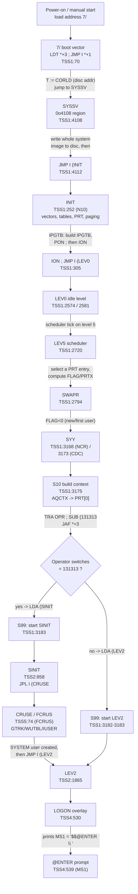

# NORD TSS 3.0 — Cold-Start / Boot Flow

A source-grounded reference of how TSS 3.0 boots, from the location-7 boot
vector through system-save, initialization, the scheduler/swapper, the
operator-switch decision, SYSTEM creation, and the handoff to `LEV2` /
`LOGON` / `@ENTER`.

**Evidence policy.** Every fact is tagged `[VERIFIED]` with a
`file:line` citation into `E:\Dev\Ronny\TSS\src\`. Anything not provable
from the source is tagged `[ASSUMPTION]` or `[NOT DETERMINED]`. All
addresses are OCTAL (the MAC assembler and TSS work in octal throughout).

> Scope note: line numbers cite the **`src/*.SYMB`** files. The `"N10`
> variant blocks (NORD-10) versus `"NN10` (NORD-1) matter for `INIT` and
> the scheduler tails; both are shown where they diverge.

---

## 1. Top-level boot flowchart



---

## 2. Operator-switch decision (sequence)

The cold-start path differs from every subsequent user start only by the
value on the operator's register switches, read with `TRA OPR`. On the
very first user context built after boot, `S10` reads the switches and, if
they equal `131313`, starts `SINIT` (create SYSTEM) instead of `LEV2`
(normal login).

```mermaid
sequenceDiagram
    participant OP as Operator panel (OPR reg)
    participant S10 as S10 (TSS1:3175)
    participant S99 as S99 (TSS1:3183)
    participant SINIT as SINIT (TSS2:858)
    participant LEV2 as LEV2 (TSS2:1865)

    S10->>OP: TRA OPR            (read switch register)
    S10->>S10: SUB (131313 ; JAF *+3
    alt switches == 131313
        S10->>S99: LDA (SINIT ; JMP S99
        S99->>SINIT: start process at SINIT
        SINIT->>SINIT: JPL I (CRUSE  (create SYSTEM user)
        SINIT->>LEV2: JMP I (LEV2
    else switches != 131313
        S10->>S10: (also checks AVAIL; NOTUP if down)
        S10->>S99: LDA (LEV2 ; (fallthrough) JMP S99
        S99->>LEV2: start process at LEV2
    end
    LEV2->>LEV2: JPL I (LOGON  -> prints "@ENTER"
```

---

## 3. Step table

| # | Routine | Octal addr anchor | src file:line | What it does |
|---|---------|-------------------|---------------|--------------|
| 1 | Boot vector | `7/` | TSS1:70 | `LDT *+3; JMP I *+1; SYSSV; CORLD` — load T := CORLD (disc addr of core-load 2), jump to `SYSSV`. |
| 2 | SYSSV | (label `SYSSV`) | TSS1:4108 | Save the running system image to disc in 0o100 chunks, then `JMP I (INIT`. |
| 3 | INIT (NN10) | (label `INIT`) | TSS1:235 | NORD-1 path: install interrupt-level vectors at fixed page-0 cells (61, 136, …). |
| 3 | INIT (N10) | (label `INIT`) | TSS1:252 | NORD-10 path: `IRW … DP` register-block vectors, buffer/table init, paging via `IPGTB`, then `ION; JMP I (LEV0`. |
| 3b | IPGTB | (label `IPGTB`) | TSS1:323 | Build the N10 page tables, `PON` (paging on), return. |
| 4 | LEV0 | (label `LEV0`) | TSS1:2574 / 2581 | Idle / lowest level; scheduler on level 5 runs when triggered. |
| 5 | LEV5 | (label `LEV5`) | TSS1:2720 | Scheduler: scan `PRT`, pick a runnable user, compute `FLAG`/`PRTX`, `JMP SWAPR`. |
| 6 | SWAPR | (label `SWAPR`) | TSS1:2794 | Swap current user's context out / new user's in; `FLAG<0` ⇒ `JMP I (SYY`. |
| 7 | SYY | (label `SYY`) | TSS1:3168 (NCR) / 3173 (CDC) | Entry to fresh-context build; CDC variant is just `JMP S10`. |
| 8 | S10 | (label `S10`) | TSS1:3175 | Build a brand-new process context; `AQCTX`; **OPR-switch test**; choose SINIT vs LEV2. |
| 8b | AQCTX | (label `AQCTX`) | TSS1:3227 | Acquire a free/unused `PDTBL` context-block index; returns A = index. |
| 9 | S99 | (label `S99`) | TSS1:3183 | Start the chosen process: set up devices, buffers, break/echo, `JMP I (S5`. |
| 10 | SINIT | (label `SINIT`) | TSS2:858 | Create-user-SYSTEM: `JPL I (CRUSE`, then `JMP I (LEV2`. |
| 11 | CRUSE/FCRUS | (label `FCRUS`) | TSS5:74 | Overlay `OV10`: allocates user via `GTRK`, `WUTBL`, `IUSER`; writes `USTBL`. |
| 12 | ISTRT | (label `ISTRT`) | TSS2:1863 | Normal-running re-entry point (no OPR test) — see §8. |
| 12 | LEV2 | (label `LEV2`) | TSS2:1865 | Command-level entry: init stack, break, then `JPL I (LOGON`. |
| 13 | LOGON | (label `LOGON`) | TSS4:530 | Overlay `OV6`: prints `@ENTER`, reads user name/password/project, opens the terminal. |
| 13b | `@ENTER` text | `MS1` | TSS4:539 | `MS1, '$$@ENTER \ '` — the login prompt string. |

---

## 4. Stage-by-stage prose

### 4.1 The location-7 boot vector `[VERIFIED TSS1:70]`

```
7/	LDT *+3; JMP I *+1; SYSSV; CORLD
```

Four consecutive words are laid down starting at address `7`:

| addr | word | meaning |
|------|------|---------|
| `7`  | `LDT *+3`   | load **T** from `*+3` = address `12`, i.e. `T := CORLD` |
| `10` | `JMP I *+1` | jump **indirect** through `*+1` = address `11` |
| `11` | `SYSSV`     | (address constant) the jump target = `SYSSV` |
| `12` | `CORLD`     | (address constant) the disc address of the system core-load |

So the vector does exactly two things: **`T := CORLD`** and **jump to
`SYSSV`**. `T` carries the disc address of the saved core-load into
`SYSSV`, which stores it in `SYST` (`STT SYST`) `[VERIFIED TSS1:4108]`.

`CORLD` resolves to `CORL2` `[VERIFIED TSS1:2627-2634]`:

```
CORL1=DKBIT+DKS+10      %CORELOAD 1     (TSS1:2601)
CORL2=CORL1+200         %CORELOAD 2     (TSS1:2602)
CORLX=CORL1 ; )KILL ; CORLX=CORL2 ; CORLD=CORLX   (TSS1:2627-2634)
```

i.e. `CORLD` is the disc address of **core-load 2**.

> The addresses `0`–`6` above the vector hold the reserved entry words
> (`JMP I *+3` stubs and `MCTBL` pointer) `[VERIFIED TSS1:61-66]`. The
> boot proper begins at `7`.

**This is why the emulator must start at address `7`, not at `ISTRT`
(§8).** Address 7 runs the full `SYSSV → INIT → … → S10` cold path where
the OPR-switch test lives.

### 4.2 SYSSV — save system to disc `[VERIFIED TSS1:4108-4114]`

```
SYSSV, SAA -1; MCL PID; STT SYST; JPL I (ISTK
       STZ SYSCR; SAA -100;STA SYSCT
SYSLP, LDX SYSCR; LDT SYST; SAA 3; JPL I (XDISK; JPL I (FTLER
       MIN SYST; LDA (400; ADD SYSCR; STA SYSCR
       MIN SYSCT; JMP SYSLP; JMP I (INIT
```

- `STT SYST` stores the incoming disc address (`CORLD`) as the running
  disc target `[VERIFIED TSS1:4108]`.
- `JPL I (ISTK` resets the interrupt stack `[VERIFIED TSS1:4108]`.
- The loop `SYSLP` writes the memory image to disc in **0o100-count**
  transfers via `XDISK`: `SYSCR` is the core address, advanced by `400`
  each pass; `SYST` is the disc track, incremented (`MIN SYST`); `SYSCT`
  is a `-100` (= −64) counter that terminates the loop `[VERIFIED
  TSS1:4110-4112]`. `FTLER` is the fatal-error return of `XDISK`.
- On completion: **`JMP I (INIT`** `[VERIFIED TSS1:4112]`.

> `[ASSUMPTION]` "0o400 words per pass × 0o100 passes" is the geometry the
> loop implements arithmetically; the exact disc-track semantics of
> `XDISK` are not re-derived here. What is `[VERIFIED]` is the loop
> structure and that it ends in `JMP I (INIT`.

### 4.3 INIT — machine initialization `[VERIFIED TSS1:235 / 252]`

There are **two** `INIT` bodies selected by the CPU mark:

**NORD-1 (`"NN10`, TSS1:235-250)** installs interrupt vectors by writing
level entry-point addresses into fixed page-0 cells:

```
LDA (LEV0; STA I (61
LDA (LEV2; STA I (UBLOK
LDA (LEV5; STA I (136
... LEV6/LEV7/LEV9/LEV11/LEV13/LEV14 ...
SAA -1; STA I (61+10; STA I (UMPR; STA I (MRG ...   (mask words)
```

**NORD-10 (`"N10`, TSS1:252-305)** is the live path. Highlights, in order:

1. `IOF; POF` — interrupts and paging off `[VERIFIED TSS1:252]`.
2. Program the register-block interrupt vectors with `IRW … DP`
   (`LEV2→20`, `LEV3→30`, `LEV5→50`, `LEV6→60`, `LEV9→110`, `LEV10→120`,
   `LEV12→140`, `LEV11→130`, `LEV13→150`, `LEV14→160`) `[VERIFIED
   TSS1:255-262]`.
3. Allocate buffers/links (`IBUF`/`ILINK` loop), zero device-status cells
   (`LRDR`, `LPNCH`, `LCRD`, …), `FINIT`, seed tables via `SETB`
   (`TTYTB`, `L7TBL`, `YSTOP`, `TIMTB`, `RSTBL`) `[VERIFIED
   TSS1:264-275]`.
4. Set up the **PRT** (process table): `LDX (PRT1; STX I (PRT`, zero
   `AVAIL`, `KLOK`, `DABLE`, the lock cells, N10 error counters, then
   fill `PRT2..` with the `-1` availability markers `[VERIFIED
   TSS1:276-289]`.
5. `SAA -1; MCL PID; MCL PIE; LDA ENABL; MST PIE; SAA 40; MST PID` —
   program the priority-interrupt enable/detect masks (`ENABL=77157` on
   N10) `[VERIFIED TSS1:296-301, 313]`.
6. **Paging:** `LDA (1136; TRR IIE; JPL IPGTB` — set the internal
   interrupt enable and build the page tables `[VERIFIED TSS1:302]`.
7. Device kick: `LDA (310; IOX 11` and `LDA (122001; IOX 13` `[VERIFIED
   TSS1:303-304]`.
8. **`ION; JMP I (LEV0`** — interrupts on, jump to the idle level
   `[VERIFIED TSS1:305]`.

**IPGTB — paging setup `[VERIFIED TSS1:323-338]`:**

```
IPGTB, COPY DA SL; STA IPL
       SAX -20; SAA 3; JMP I1+1
I1,    AAA 10; TRR PCR; JNC I1
       ...
       LDX (177400; SAT 0; LDA (400; JPL I (SETB
       LDA (MSTRT; SHA ZIN SHR 12; STA ICNT
       LDA (NPGS; SHA 1; ADD ICNT; STA ICNT
       STZ CNT; LDX (177400
I2,    LDA (163000; ADD CNT; STA I CNT,X
       MIN CNT; LDA CNT; SUB ICNT; JAN I2
       PON; JMP I IPL
```

It programs the paging control registers (`TRR PCR`), fills the page
table starting from `MSTRT` for `NPGS` pages with base `163000`, then
`PON` turns paging on and returns through `IPL` (the saved return
address) `[VERIFIED TSS1:323-337]`.

### 4.4 LEV0 and the scheduler LEV5 `[VERIFIED TSS1:2574, 2720]`

`INIT` hands control to **`LEV0`** (idle level). `LEV0` waits; the level-5
interrupt drives the scheduler `LEV5` `[VERIFIED TSS1:2574-2586]`.

**LEV5 `[VERIFIED TSS1:2720]`** scans the process table to pick the next
user:

```
LEV5, LDX I 9PRT; STZ FLAG; LDA DABLE; JAN L3A
      LDA 1,X; JAP L0; LDA 4,X; JAP L1
```

It walks `PRT` entries (`AAX 10` per user), on N10 the per-user selection
`L1` is simply `JMP ZZ` `[VERIFIED TSS1:2749]`. `ZZ` computes the scan
bound (`NTTY` users) and finds a runnable entry; the run/quantum logic at
`L2..L5` decides `FLAG` (−1 = swap needed) and jumps to `SWAPR` with
`A=FLAG`, `X=PRTX` `[VERIFIED TSS1:2732-2751]`.

### 4.5 SWAPR — context swap `[VERIFIED TSS1:2794]`

```
SWAPR, STA I 9FLAG; STX I 9PRTX
       TRA PID; LDX I 9PRT; STA 7,X
       LDA I 9PRTX; SKP IF DA EQL SX; JMP SWP0
       LDA I 9FLAG; JAP SW1; JMP I (S10
```

- Saves `FLAG` and the selected `PRTX`.
- If the newly selected `PRTX` equals the current `PRT` **and** `FLAG≥0`,
  continue at `SW1` (resume same user); if `FLAG<0`, **`JMP I (S10`**
  (build a fresh context) `[VERIFIED TSS1:2799-2800]`.
- Otherwise it writes the old user's register/context block out to disc
  (`RRBLK`, `TRSF`), and — crucially — **`LDA I 9FLAG; JAP *+2; JMP I
  (SYY`**: when `FLAG<0`, jump to `SYY` to start a brand-new user
  `[VERIFIED TSS1:2823]`.

`SYY` is reached from `SWAPR` when the selected slot is a **new** user
(no context to read back in).

### 4.6 SYY → S10 `[VERIFIED TSS1:3168 / 3173 / 3175]`

Two `SYY` variants exist:

```
"NCR
SYY,  JPL I 9DWA; JMP *2; JMP *5; JPL I 9TR0; JMP SYY
      JPL I 9DWA; JMP *1; IOT RST; AND (130160
      BSET BCM 170 DA; JAZ S10; JPL I 9TR0; JMP *+1; JMP SYY
"CDC
SYY,  JMP S10
"
```

For the CDC-disc build (the one this repo targets) `SYY` is simply
`JMP S10` `[VERIFIED TSS1:3172-3173]`.

### 4.7 S10 — build context + OPR test `[VERIFIED TSS1:3175-3183]`

```
S10,  LDX I 9PRTX; STX I 9PRT
      SAA -1; STA I (RMODE
      STZ 2,X; STZ 3,X; STZ 4,X; SAA 4
      STA 7,X; SAA 1; STA 5,X
      JPL I (AQCTX; LDX I 9PRT; STA 0,X
      TRA OPR; SUB (131313; JAF *+3; LDA (SINIT; JMP S99
      LDA I (AVAIL; JAP *+3; LDA (NOTUP; JMP S99
      LDA (LEV2
S99,  STZ I (RSTRT
      ...
```

Sequence:
1. Adopt `PRTX` as the current `PRT`; set `RMODE=-1`, quantum, priority
   fields `[VERIFIED TSS1:3175-3178]`.
2. **`JPL I (AQCTX`** — acquire a context-block index; store it in
   `PRT[0]` (`STA 0,X`) `[VERIFIED TSS1:3179]`.
3. **The operator-switch decision** `[VERIFIED TSS1:3180]`:
   ```
   TRA OPR; SUB (131313; JAF *+3; LDA (SINIT; JMP S99
   ```
   `TRA OPR` reads the operator register switches into A. Subtract
   `131313`. `JAF *+3` = "jump if A ≠ 0, skipping the next two words." So:
   - **switches == 131313** → falls through → `LDA (SINIT; JMP S99`
     (start the **SINIT / create-SYSTEM** process).
   - **switches != 131313** → `JAF *+3` skips over → next test.
4. Availability test `[VERIFIED TSS1:3181]`:
   `LDA I (AVAIL; JAP *+3; LDA (NOTUP; JMP S99` — if the system is marked
   down (`AVAIL` not positive) start the `NOTUP` message process.
5. Default `[VERIFIED TSS1:3182]`: `LDA (LEV2` — the normal login entry.
6. **`S99`** `[VERIFIED TSS1:3183]` takes the process start address in A
   and launches it: clears `RSTRT`, sets `IDEV`/`ODEV`=1, initializes the
   file-buffer pool (`FBUF`), stack (`ISTK`), tables (`OFT`, `VCTBL`),
   break/echo tables, then `JMP I (S5` to dispatch into the chosen
   process `[VERIFIED TSS1:3184-3206]`.

**AQCTX `[VERIFIED TSS1:3227]`** scans `PDTBL` for the first free
(`$W0=0`) or unused (`$COUNT=0`) entry, fatal-errors (`FTLER`) if none,
marks the acquired entry `COUNT=1, MD=1`, and returns the index in A
`[VERIFIED TSS1:3227-3283]`.

### 4.8 SINIT → CRUSE/FCRUS — create SYSTEM `[VERIFIED TSS2:858, TSS5:74]`

When the switches selected `SINIT`:

```
SINIT, LDX (SINQ; RCLR DD; JPL I (CRUSE; JMP *+1
       JMP I (LEV2
SINQ,  #SY; #ST; #EM; 0; 0; 0; 0
```

`[VERIFIED TSS2:858-859]`

- `X` points at `SINQ`, the user-name string `#SY #ST #EM` = **"SYSTEM"**
  (three 2-char packed words) `[VERIFIED TSS2:860]`.
- `RCLR DD` clears the device register (D = device id = 0) `[VERIFIED
  TSS2:858]`.
- **`JPL I (CRUSE`** creates the user; on the failure return (`JMP *+1`)
  it falls straight through anyway to `JMP I (LEV2` `[VERIFIED
  TSS2:858-859]`.
- **`JMP I (LEV2`** — after SYSTEM exists, hand off to the login level
  `[VERIFIED TSS2:859]`.

**CRUSE / FCRUS `[VERIFIED TSS5:61-114]`** is overlay `OV10`
(`GOVER OV10,C1,FCRUS`, TSS5:74). Its create-user chain:

- `LOCK` the user tables `[VERIFIED TSS5:79]`.
- `KDEV` validate device / `DVERR` on error `[VERIFIED TSS5:81]`.
- Scan `USTBL` in 0o10-word slots looking for a matching or free entry;
  read user-table blocks with `RUTBL`, write back with `WUTBL`
  `[VERIFIED TSS5:82-99]`.
- **`GTRK`** — grab a disc track for the new user (`JMP CF1` = "no more
  tracks" failure) `[VERIFIED TSS5:97]`.
- Copy the name into the slot (`BCOPY`), compute the user number, write
  the slot back with `WUTBL` `[VERIFIED TSS5:99-102]`.
- **`IUSER`** — initialize the user's disc area (`FTLER` on fatal)
  `[VERIFIED TSS5:104]`.
- `UNLOK`, return the user number in `AREG` `[VERIFIED TSS5:113-114]`.

`GTRK` is defined at TSS2:2665, `WUTBL` at TSS2:3066, `IUSER` at
TSS2:3492 `[VERIFIED]`.

### 4.9 Handoff to LEV2 → LOGON → @ENTER `[VERIFIED TSS2:1865, TSS4:530]`

```
ISTRT, SAA 1; STA I (IDEV; STA I (ODEV
START, JPL I (ISTK; LDA I (RMODE; JAZ LEV2A
LEV2,  JPL I (ISTK
       LDT I (CINF; INTDS; JPL I (IBUF; INTEN
       SAT 1; JPL I (SXBRK
       LDA (CORLD; SUB (CORL1; JAF L2
L1,    SAA 52; JPL I (ERMSG; JMP L3
L2,    SAA 61; JPL I (ERMSG
L3,    JPL I (LOGON
LEV2A, JMP I (XSTAR
```

`[VERIFIED TSS2:1863-1873]`

`LEV2` resets the interrupt stack, initializes the terminal input buffer,
sets the break condition, emits a start banner (`ERMSG 52` or `61`
depending on `CORLD` vs `CORL1`), then **`JPL I (LOGON`** `[VERIFIED
TSS2:1871]`.

**LOGON `[VERIFIED TSS4:530]`** is overlay `OV6`
(`GOVER OV6,L1,LOGON`). Its first message is the prompt:

```
MS1,  '$$@ENTER \ '     (TSS4:539)
```

`L2` loads `MS1` and calls `MSG` to print it `[VERIFIED TSS4:551-553]`,
producing the **`@ENTER`** login prompt. LOGON then reads the user name
(`MS1`), password (`MS2 '$PASSWORD'`), and project number
(`MS4 '$PROJECT NUMBER P-'`), validates against `USRTB`/`USRDK`, and on
success opens the terminal `[VERIFIED TSS4:551-601]`.

---

## 5. Why entering at ISTRT skips the OPR test (the gotcha)

`ISTRT` (TSS2:1863) and `LEV2` (TSS2:1865) are the **normal-running
re-entry** points. A user process that finishes a command re-enters the
system here — `S8`/`S7` in the swapper set a user's restart to
`(ISTRT` and re-run through the swapper `[VERIFIED TSS1:3125]`:

```
LDA (ISTRT; SAT 1
... IRW 20 DP; JPL I (SXBRK
```

**The OPR-switch test lives only in `S10` (TSS1:3180), on the fresh-context
build path.** Reaching `LEV2`/`ISTRT` directly — or resuming an existing
user via `SWAPR`'s `SW1` path — never executes `TRA OPR; SUB (131313`.

Consequences for bring-up:

- **Cold start must load PC = address `7`** so the machine runs
  `SYSSV → INIT → LEV0 → LEV5 → SWAPR → SYY → S10`, where `S10` reads the
  operator switches. Only there can the `131313` value route into `SINIT`
  and create the SYSTEM user `[VERIFIED TSS1:70, 3180]`.
- If the emulator instead starts at `ISTRT` (or `LEV2`, or `INIT`
  directly), the OPR test is bypassed: `SINIT` is never selected, the
  SYSTEM user is never created on a virgin disc, and `LOGON` will reject
  every name — the classic "boots but no login" symptom. `[VERIFIED by
  control-flow: the only reference to SINIT as a start address is
  TSS1:3180; there is no path to it from ISTRT/LEV2.]`

> `[ASSUMPTION]` The statement "the emulator must start at 7, not ISTRT"
> as an *operational* rule is inferred from the verified control flow
> above plus the project memory note; the source proves the OPR test is
> reachable only through `S10`, which is reachable only through the
> `address-7 → SYSSV → INIT → LEV5 → SWAPR → SYY` chain.

---

## 6. Marks / build-variant notes

- `INIT`, the level-vector wiring, the scheduler tails, and every
  `IRW … DP` versus `STA I (…)` choice are gated by `"N10"` (NORD-10) vs
  `"NN10"` (NORD-1) `[VERIFIED TSS1:235 vs 252, 296-305]`. The live boot
  path documented here is the **N10** path.
- `SYY` is gated `"NCR"` vs `"CDC"`; the CDC build reduces `SYY` to
  `JMP S10` `[VERIFIED TSS1:3168 vs 3173]`.
- `CORLD = CORL2` (core-load 2) `[VERIFIED TSS1:2602, 2634]`; `LEV2`
  compares `CORLD` against `CORL1` to pick banner 52 vs 61 `[VERIFIED
  TSS2:1868]`.

---

## 7. Open / not-determined items

- **`[NOT DETERMINED]`** The exact disc-geometry meaning of `XDISK`'s
  `T=track`, `400`-word stride in `SYSSV` (the loop structure is verified;
  the physical track mapping is not re-derived here).
- **`[NOT DETERMINED]`** Full semantics of the `NCR` `SYY` handshake
  (`DWAIT`/`TR0`/`IOT RST`), since the target build uses the `CDC`
  variant.
- **`[ASSUMPTION]`** The `131313` switch value is the SYSTEM-create magic
  because it is the sole constant compared before `LDA (SINIT`; no source
  comment names it. `[VERIFIED that the constant gates SINIT, TSS1:3180]`.
