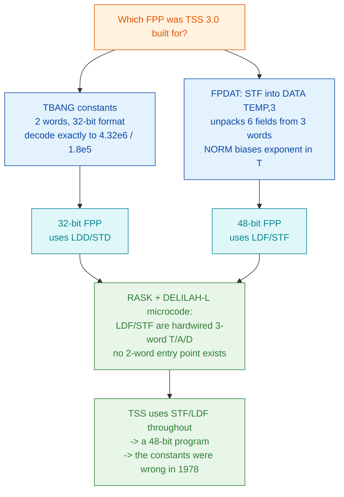

# The floating-point format question — TBANG vs FPDAT

**This file:** `docs/TSS-FLOAT-FORMAT.md`

**ANSWERED 2026-07-28** (§4, §6) — kept as a document because it took six
wrong answers to get here and the reasoning is worth preserving. TSS 3.0 is a
**48-bit** floating-point program, and its `TBANG` clock constants were in the
2-word 32-bit format: **wrong when the system was built in 1973/78**, not
wrong in this reconstruction. **Nothing in this document is a defect in `mac-c`.** Read
§5 before changing any code because of it.

---

## 1. The question, in one line

**Was NORD TSS 3.0 built for a 32-bit floating-point processor or a 48-bit
one?** Its own source appeared to answer both ways, and the two answers are
load-bearing in different routines.

**Answer: 48-bit.** `LDF`/`STF` — which TSS uses throughout — always move
three words, on every machine generation from the NORD-10/S to the ND-120.
The `TBANG` constants are simply wrong. Evidence in §4; consequences in §6.

## 2. Why it matters: the clock is frozen

Under the 48-bit FPP — the only self-consistent option nd100x offers — `DATE`
returns *exactly* the value last set by the login prompt or `DEFINE-DATE` and
never advances. Measured 2026-07-28: `KLOK` advanced 6736 ticks over 134
seconds while `DATE` still read `1200:00`. Elapsed-time counters
(`TIME USED`, `OUT OF`, `RESPONSE-TIME`) do advance; the absolute time of day
does not.

This is not the same defect as the NLZ/DNZ assembler bug fixed in `01dce34`.
That one produced *garbage* (negative seconds, a different day on every read).
This one produces *stable but frozen* values, and only became visible once the
garbage was gone.

## 3. The evidence, both directions

### 3a. `TBANG` says 32-bit  [READ FROM MEMORY]

`TBANG` (`src/TSS2.SYMB:1143-1155`) divides the elapsed
tick count by four constants to get days / hours / minutes / seconds:

```
K1, [4.32E6      K2, [1.8E5      K3, [3000      K4, [50
```

They assemble as **two words each**, in the ND 32-bit packed format of
ND-60.096.01 Appendix E: a 9-bit exponent biased `0400` occupying the top of
word 0, six mantissa bits in the low end of word 0, sixteen more in word 1,
with an implicit leading 1.

Read out of the running machine at `022650`:

| symbol | words | decodes as |
|---|---|---|
| `K1` | `042701 165400` | exponent 23, mantissa 0.514984130859375 -> **4320000.0** |
| `K2` | `042227 162000` | exponent 18 -> **180000.0** |

**The constants are exactly right — for a 32-bit FPP.** `mac-c`'s encoding
matches Appendix E's worked example (`+1.0` = `040100 000000`).

But `FDV` reads a **three**-word operand under the 48-bit FPP, so it consumes
`K1`'s two words plus `K2`'s first word, and reads word 0 as a 48-bit
exponent field: `042701 - 040000` = **1473**. A divisor of magnitude 2^1473
drives every quotient to zero. All four fields therefore stay at whatever
`DEFINE-DATE` set — precisely the observed behaviour.

**Confirmed by experiment, not inference.** Overwriting `K1` alone, in memory,
with a well-formed 48-bit float of 3000 (`040014 135600 000000`) makes the day
field advance and roll over correctly:

```
BEFORE   DATE IS 25 JULY 2026   1200:00   (x3, frozen)
AFTER    28 -> 29 -> 30 -> 31 JULY -> 1 AUGUST -> 2 AUGUST
```

Probe: `k1patch.py`. The hour/minute/second fields stay frozen because a
48-bit `K1` needs three words where two were reserved, so the patch
necessarily clobbers `K2`'s word 0. The day field alone is the discriminator.

> **Locate `K1` by searching for `042701`, not by arithmetic.** It sits at
> `022650`. Arithmetic off `RDATE=022700` minus eight words predicts `022670`
> and is **wrong by 16 words** — a 16-word table sits between `K4` and
> `RDATE`. Hand-derived addresses have failed every time in this project.

### 3b. `FPDAT` and `NORM` say 48-bit  [READ FROM SOURCE]

- `FPDAT` (`src/TSS5.SYMB:520`) does `STF TEMP,B` into a
  `DATA TEMP,3` buffer and unpacks **six** byte fields from **three** words.
  A 32-bit `STF` would write two words and leave the third stale.
- `NORM` (`src/TSS2.SYMB:2230`) builds an `040000`-biased
  exponent in **T**. The 32-bit operations never touch T.
- ND-60.096.01 Appendix E states that a genuine 32-bit machine uses `LDD`/`STD`
  for the float accumulator. TSS uses `STF`/`LDF` throughout.
- **Decisive, and for the right machine generation:** the NORD-10/S Reference
  Manual §2.5.2.6 (`ND-06.008.01`) says the 32-bit option replaces the
  microprogram for exactly six instructions — **`FAD`, `FSB`, `FMU`, `FDV`,
  `NLZ`, `DNZ`** — and adds "the T register is not affected by 32-bit Floating
  Point operations". `LDF` and `STF` are **not** on that list. See §4.

## 4. `LDF`/`STF` are always 3-word — settled by manual and microcode

> **[RETRACTION 2026-07-28]** This section previously argued that nd100x's
> FPP32 mode was internally inconsistent, because `ndfunc_stf`/`ndfunc_ldf`
> move three words while the 32-bit arithmetic reads two. A patch was proposed
> to make them branch on `CurrentFPPType`. **Both the diagnosis and the patch
> were wrong, and the patch was withdrawn before it was applied.**

**Primary source — ND-110 RASK microcode**
(`$ND110COMPILE/uCode\ND-110-RASK.uc`), via the
microcode owner:

- `LDF1` (line 407) puts the word fetched from `ea` into **T** and issues the
  read of `ea+1`, then jumps to `LDD1`;
- `LDD1` (line 402) takes the previous word into **A** and issues the read of
  `ea+2`;
- the fall-through (line 403) takes the last word into **D**.

All 32 `LDF` addressing-mode dispatch slots (lines 11647-11690) funnel into
that one chain — 12 to `LDF1`, 8 to `LDFI`, 8 to `LDFIX`, 4 to `LDFXB`, and
each of those jumps to `LDF1`. **There is no entry point that starts at
`LDD1`**, which is what a 2-word `A,D` load would require. ND-120 DELILAH-L
(lines 462-486) is byte-for-byte the same structure.

**Primary source — NORD-10/S Reference Manual §2.5.2.6** (`ND-06.008.01`, in
`$NDINSIGHT/Reference-Manuals/10\`). This is **TSS's own machine
generation**, and it settles the question in prose:

> "As an option, the NORD-10/S may be equipped with microprogram for 32-bit
> floating point format instead of the standard 48-bit format... **The
> instructions affected are: FAD, FSB, FMU, FDV, NLZ, DNZ**"
>
> "In CPU registers, bits 0-15 of the mantissa are in the D register, bits
> 16-21 and exponent and sign are in the A register. These two registers
> together are defined as the 32-bit floating accumulator. **The T register is
> not affected by 32-bit Floating Point operations.**"

**`LDF` and `STF` are not on that list.** The option replaces the microprogram
for six arithmetic/conversion instructions and nothing else. The manual also
states the two formats' memory footprints directly: 48-bit occupies "three
16-bit core locations, addressed by the address of the exponent part"
(§2.5.2.5), 32-bit occupies "two 16-bit memory locations" (§2.5.2.6).

**So `LDF`/`STF` are hardwired to the 3-word `T/A/D` layout, and nd100x is
correct as it stands** — on the NORD-10/S by manual, and on the ND-110/ND-120
by microcode. The proposed `CurrentFPPType` branch has no counterpart in
either and would have made nd100x diverge from real hardware.

**nd100x branches on exactly those six instructions and no others** — `fad`,
`fsb`, `fmu`, `fdv`, `nlz`, `dnz`. Its implementation matches the manual
instruction for instruction.

> **One discrepancy, noted not resolved.** The manual says the 32-bit exponent
> is "biased with 2^8" (256); nd100x uses `FP32_BIAS 257`, commented as
> "derived from and validated against a live 32-bit-FPP ND-110 running RASK
> microcode... (not the manual's 256)". Decoding `K1` with bias **256** yields
> exactly `4320000.0` (§3a), which is evidence that MAC encoded to the manual's
> value. Manual, MAC and a live ND-110 need not agree; this is flagged for the
> nd100x owner rather than judged here.

**The resolution of the apparent contradiction:** `LDF`/`STF` *are* the 48-bit
accumulator's load/store. A 32-bit-FPP machine uses **`LDD`/`STD`** for its
`A,D` accumulator — exactly what ND-60.096.01 Appendix E says — and that pair
addresses `ea`/`ea+1`, matching the arithmetic's operand layout. Two register
sets, two instruction pairs, no inconsistency. The error was expecting `LDF` to
serve a role it never had, from over-reading one manual sentence ("a further
register (T) and memory location (ea+2) are used"), which describes the 48-bit
accumulator and not a rebasing of `LDF`.

**What `--fpp=32` results still cannot do.** Under 32-bit the date moves but is
garbage and non-monotonic (`26 JULY 1301:01` -> `40 JULY 1004:144` -> `25 JULY
1200:00` -> `26 JULY 1301:01`), with `TIME-USED` back to negative seconds. That
is now explained rather than excused: TSS uses `STF`/`LDF` throughout, so
running it under a 32-bit FPP mixes a 3-word load/store with 2-word arithmetic
*in the program's own terms*. **TSS is simply not a 32-bit program**, and
running it as one produces garbage for that reason. See §6.

## 5. Attribution — do NOT "fix" this in `mac-c`

The 1978 original had the same two-word constants:

- `TBANG=022611` and `RDATE=022700` in **both** `reference/ASYMB.SYMB` and our
  `Build/ASYMB.SYMB` — an identical 55-word span.
- Our `K1`-`K4` occupy eight words, read directly from memory at
  `022650`-`022657`.
- Three-word constants would push `RDATE` to `022704`. The golden dump says
  `022700`.

`mac-c` reproduces the archived binary faithfully, and its 32-bit encoding is
correct per Appendix E. Rebuilding TSS with 48-bit constants (`mac -F48`)
is a **diagnostic only**: it shifts every address after the first `[`, breaks
the golden-dump match, and has already produced one false negative that sent
this investigation down the wrong path for a session.

## 6. What is genuinely unknown



§6 previously listed three readings and stated in advance what each possible
answer would mean. **The microcode answered that question on 2026-07-28** (§4),
and it answered the branch that was written down ahead of time: *"If they
always move three, then the constants were always wrong and reading 3 is
likely."*

1. ~~The 1973 source predates the machine it was finally built for.~~ Still
   possible as *history* — it may well be how the constants came to be wrong —
   but it is no longer a competing account of the machine.
2. ~~The `[` directive's width differed between MAC builds.~~ Weak. It would
   still leave `FPDAT` and `NORM` requiring 48-bit while the constants assume
   otherwise, in a program assembled by one MAC.
3. **It was already broken in 1978 and nobody noticed — now the strongly
   favoured reading.** TSS uses `STF`/`LDF` throughout, those instructions are
   hardwired 3-word, so TSS is a 48-bit program and its `TBANG` constants were
   simply wrong. The archived system's time of day could not have advanced on
   real hardware either. A timesharing system that boots, logs in and bills in
   *seconds* can run for years that way, and the operator sets the date at
   every cold start anyway.

**The generational caveat is now closed.** It previously read: *"RASK is
ND-110 and DELILAH-L is ND-120, while TSS 3.0 is 1973 for the NORD-1 /
NORD-10 — nothing yet excludes a NORD-10-era machine having behaved
differently."* The NORD-10/S Reference Manual §2.5.2.6 (§4) is that machine's
own documentation, and it names the six instructions the 32-bit option
affects. `LDF`/`STF` are not among them.

**The question is therefore answered.** TSS 3.0 is a 48-bit floating-point
program running on a machine whose `LDF`/`STF` always move three words, and
its `TBANG` constants are two-word 32-bit values. They were **wrong when the
system was built**, and the archived 1978 system's time of day could not have
advanced on real hardware any more than it does under emulation.

What is left is not a question about the machine but about the history: *how*
the wrong constants got there and why it went unnoticed for years. The
`[`-directive width in the 1973 MAC that first assembled this source is the
obvious place to look, and the honest answer today is that nobody knows. An
original TSS site report of whether `DATE` ever advanced would be a pleasant
confirmation but is no longer needed to decide the technical point.

**What is already excluded:** any further `--fpp=32` experiment. TSS is not a
32-bit program, so running it as one mixes 3-word load/store with 2-word
arithmetic in the program's own terms and can only produce garbage. The 48-bit
configuration is the faithful one, and under it the time of day cannot advance.

## 7. History of wrong answers to this question

Recorded because the pattern is the point, not the individual errors.

| claim | status | why it failed |
|---|---|---|
| "TSS is a 32-bit-float program; nd100x has 48-bit only — a CPU-model mismatch" | **retracted** | labelled PROVEN on a correlation. `DNZ` sits exactly on the integer/float boundary, so an *instruction* bug mimicked a *format* bug |
| "32-bit FPP stabilises the date" | **retracted** | one run, two identical readings. Six repeats killed it |
| "the clock runs 10x slow — an emulator bug" | **retracted** | measured the instrumented rig, not the system |
| "FP width is ruled out by experiment" | **retracted** | run before the NLZ/DNZ fix (which masked both arms) *and* against the inconsistent FPP32 mode |
| "`-F48` rebuild does not fix the date, so constants are not the cause" | **retracted** | false negative: the rebuild shifted every address after the first `[` |
| "nd100x's FPP32 is internally inconsistent; `LDF`/`STF` should move 2 words" | **retracted** | over-read one manual sentence about the 48-bit accumulator as a statement about `LDF`'s base. RASK and DELILAH-L microcode show `LDF`/`STF` hardwired 3-word. A 32-bit machine uses `LDD`/`STD`. The proposed patch would have made nd100x diverge from real hardware; withdrawn before it was applied |
| "the constants are the cause" (§3a) | **confirmed** | one variable patched in memory, one observable, otherwise untouched system |
| "TSS is a 48-bit program and the constants were always wrong" (§6.3) | **ANSWERED** | NORD-10/S Reference Manual §2.5.2.6 names the six instructions the 32-bit option affects; `LDF`/`STF` are not among them. TSS's own machine generation, in prose |

Every retracted entry was reasoned from source or from a correlation. The one
that held was a single-variable experiment on a running machine.
