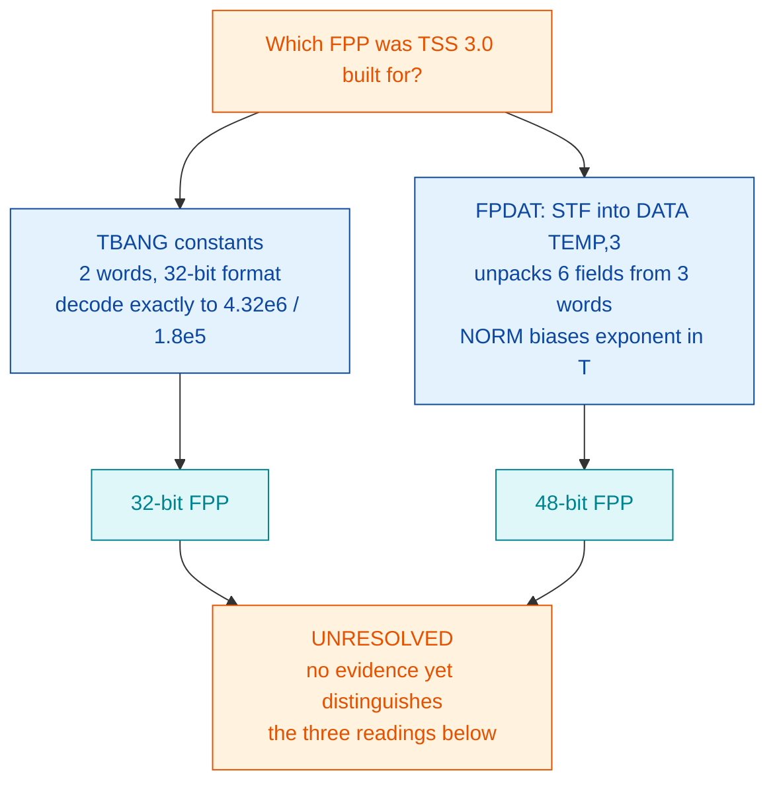

# The floating-point format question — TBANG vs FPDAT

**This file:** `/mnt/e/Dev/Ronny/TSS/docs/TSS-FLOAT-FORMAT.md`
**Repository root:** `/mnt/e/Dev/Ronny/TSS`

One unresolved question about the original system, isolated here because it
keeps being rediscovered, keeps being "explained", and every explanation so
far has been wrong. **Nothing in this document is a defect in `mac-c`.** Read
§5 before changing any code because of it.

---

## 1. The question, in one line

**Was NORD TSS 3.0 built for a 32-bit floating-point processor or a 48-bit
one?** Its own source answers both ways, and the two answers are load-bearing
in different routines.

## 2. Why it matters: the clock is frozen

Under the 48-bit FPP — the only self-consistent option nd100x offers — `DATE`
returns *exactly* the value last set by the login prompt or `DEFINE-DATE` and
never advances. Measured 2026-07-28: `KLOK` advanced 6736 ticks over 134
seconds while `DATE` still read `1200:00`. Elapsed-time counters
(`TIME USED`, `OUT OF`, `RESPONSE-TIME`) do advance; the absolute time of day
does not.

This is not the same defect as the NLZ/DNZ assembler bug fixed in `01dce34`.
That one produced *garbage* (negative seconds, a different day on every read).
This one produces *stable but frozen* values, and only became visible once the
garbage was gone.

## 3. The evidence, both directions

### 3a. `TBANG` says 32-bit  [READ FROM MEMORY]

`TBANG` (`/mnt/e/Dev/Ronny/TSS/src/TSS2.SYMB:1143-1155`) divides the elapsed
tick count by four constants to get days / hours / minutes / seconds:

```
K1, [4.32E6      K2, [1.8E5      K3, [3000      K4, [50
```

They assemble as **two words each**, in the ND 32-bit packed format of
ND-60.096.01 Appendix E: a 9-bit exponent biased `0400` occupying the top of
word 0, six mantissa bits in the low end of word 0, sixteen more in word 1,
with an implicit leading 1.

Read out of the running machine at `022650`:

| symbol | words | decodes as |
|---|---|---|
| `K1` | `042701 165400` | exponent 23, mantissa 0.514984130859375 -> **4320000.0** |
| `K2` | `042227 162000` | exponent 18 -> **180000.0** |

**The constants are exactly right — for a 32-bit FPP.** `mac-c`'s encoding
matches Appendix E's worked example (`+1.0` = `040100 000000`).

But `FDV` reads a **three**-word operand under the 48-bit FPP, so it consumes
`K1`'s two words plus `K2`'s first word, and reads word 0 as a 48-bit
exponent field: `042701 - 040000` = **1473**. A divisor of magnitude 2^1473
drives every quotient to zero. All four fields therefore stay at whatever
`DEFINE-DATE` set — precisely the observed behaviour.

**Confirmed by experiment, not inference.** Overwriting `K1` alone, in memory,
with a well-formed 48-bit float of 3000 (`040014 135600 000000`) makes the day
field advance and roll over correctly:

```
BEFORE   DATE IS 25 JULY 2026   1200:00   (x3, frozen)
AFTER    28 -> 29 -> 30 -> 31 JULY -> 1 AUGUST -> 2 AUGUST
```

Probe: `k1patch.py`. The hour/minute/second fields stay frozen because a
48-bit `K1` needs three words where two were reserved, so the patch
necessarily clobbers `K2`'s word 0. The day field alone is the discriminator.

> **Locate `K1` by searching for `042701`, not by arithmetic.** It sits at
> `022650`. Arithmetic off `RDATE=022700` minus eight words predicts `022670`
> and is **wrong by 16 words** — a 16-word table sits between `K4` and
> `RDATE`. Hand-derived addresses have failed every time in this project.

### 3b. `FPDAT` and `NORM` say 48-bit  [READ FROM SOURCE]

- `FPDAT` (`/mnt/e/Dev/Ronny/TSS/src/TSS5.SYMB:520`) does `STF TEMP,B` into a
  `DATA TEMP,3` buffer and unpacks **six** byte fields from **three** words.
  A 32-bit `STF` would write two words and leave the third stale.
- `NORM` (`/mnt/e/Dev/Ronny/TSS/src/TSS2.SYMB:2230`) builds an `040000`-biased
  exponent in **T**. The 32-bit operations never touch T.
- ND-60.096.01 Appendix E states that a genuine 32-bit machine uses `LDD`/`STD`
  for the float accumulator. TSS uses `STF`/`LDF` throughout.

## 4. Why `--fpp=32` cannot settle it

nd100x gained `--fpp=32|48`. Under 32-bit the date moves but is garbage and
**non-monotonic** (`26 JULY 1301:01` -> `40 JULY 1004:144` -> `25 JULY
1200:00` -> `26 JULY 1301:01`), with `TIME-USED` back to negative seconds.

That result proves nothing, because **nd100x's FPP32 mode is not
self-consistent.** From its source:

| function | file:line | honours `CurrentFPPType`? |
|---|---|---|
| `ndfunc_fad` / `fsb` / `fmu` / `fdv` | `src/cpu/cpu_instr.c:890, 922, 954, 986` | **yes** — 32-bit path reads two operand words, leaves `gT` untouched |
| `ndfunc_nlz` / `ndfunc_dnz` | `src/cpu/cpu_instr.c:294, 302` | **yes** |
| `ndfunc_stf` | `src/cpu/cpu_instr.c:637-643` | **no** — writes three words unconditionally |
| `ndfunc_ldf` | `src/cpu/cpu_instr.c:681-688` | **no** — reads three words unconditionally |

The precise consequence, which is what makes the mode unusable as evidence:

- in 32-bit mode the accumulator is the **`A,D` pair** (`gT` untouched);
- `FAD`/`FSB`/`FMU`/`FDV` read their memory operand from **`EA+0, EA+1`**;
- `STF` writes `gT`->`EA+0`, `gA`->`EA+1`, `gD`->`EA+2`, so it stores the
  accumulator at **`EA+1, EA+2`** — and `EA+0` gets `gT`, which the 32-bit
  operations never write, so it is stale;
- `LDF` reloads `gA,gD` from `EA+1, EA+2`, agreeing with `STF`.

So `LDF` and `STF` are self-consistent with each other, but **disagree with
the arithmetic by exactly one word**. A float stored with `STF` and then used
as an `FDV` operand is misaligned. That is sufficient on its own to explain
the non-monotonic garbage in the table above, without any of it telling us
anything about TSS.

**What this does not claim.** Whether real 32-bit-FPP hardware moved two words
in `LDF`/`STF`, or used `LDD`/`STD` instead and left `LDF`/`STF` to the 48-bit
option, is exactly the open question in §6 — it is not settled here, and
"nd100x's FPP32 does not match real hardware" is *not* what this section
says. The defensible claim is narrower and provable from their source alone:
**the mode is internally inconsistent**, so no experiment run under it can be
evidence about TSS either way. Reported upstream on that basis.

## 5. Attribution — do NOT "fix" this in `mac-c`

The 1978 original had the same two-word constants:

- `TBANG=022611` and `RDATE=022700` in **both** `reference/ASYMB.SYMB` and our
  `Build/ASYMB.SYMB` — an identical 55-word span.
- Our `K1`-`K4` occupy eight words, read directly from memory at
  `022650`-`022657`.
- Three-word constants would push `RDATE` to `022704`. The golden dump says
  `022700`.

`mac-c` reproduces the archived binary faithfully, and its 32-bit encoding is
correct per Appendix E. Rebuilding TSS with 48-bit constants (`mac-as -F48`)
is a **diagnostic only**: it shifts every address after the first `[`, breaks
the golden-dump match, and has already produced one false negative that sent
this investigation down the wrong path for a session.

## 6. What is genuinely unknown



Three readings remain open, and **no evidence currently distinguishes them**:

1. The 1973 source predates the machine it was finally built for, and the
   constants were never revisited.
2. The `[` directive's width differed between MAC builds, so the 1978
   assembler emitted what its target machine wanted.
3. It was already broken in 1978 and nobody noticed — a timesharing system
   that boots, logs in and bills in seconds can run for years with a frozen
   day counter, and the operator sets the date at every cold start anyway.

**What would settle it:** a primary source on the ND-100's `LDF`/`STF` word
count per FPP option. If `LDF`/`STF` move two words on a 32-bit machine, then
TSS is a 32-bit program, `FPDAT` was always broken, and reading 1 is likely.
If they always move three, then the constants were always wrong and reading 3
is likely. This is something to **read**, not to reason about — start with
`E:\Dev\Ronny\NDInsight\Reference-Manuals\` and the `MAC.BPUN` disassembly
route described in `/mnt/e/Dev/Ronny/TSS/docs/MAC-ASSEMBLER.md`.

**What would not settle it:** any further emulator experiment, until nd100x's
FPP32 mode moves two words in `LDF`/`STF`. Until then the only faithful
configuration is 48-bit, under which the time of day cannot advance.

## 7. History of wrong answers to this question

Recorded because the pattern is the point, not the individual errors.

| claim | status | why it failed |
|---|---|---|
| "TSS is a 32-bit-float program; nd100x has 48-bit only — a CPU-model mismatch" | **retracted** | labelled PROVEN on a correlation. `DNZ` sits exactly on the integer/float boundary, so an *instruction* bug mimicked a *format* bug |
| "32-bit FPP stabilises the date" | **retracted** | one run, two identical readings. Six repeats killed it |
| "the clock runs 10x slow — an emulator bug" | **retracted** | measured the instrumented rig, not the system |
| "FP width is ruled out by experiment" | **retracted** | run before the NLZ/DNZ fix (which masked both arms) *and* against the inconsistent FPP32 mode |
| "`-F48` rebuild does not fix the date, so constants are not the cause" | **retracted** | false negative: the rebuild shifted every address after the first `[` |
| "the constants are the cause" (§3a) | **confirmed** | one variable patched in memory, one observable, otherwise untouched system |

Every retracted entry was reasoned from source or from a correlation. The one
that held was a single-variable experiment on a running machine.
