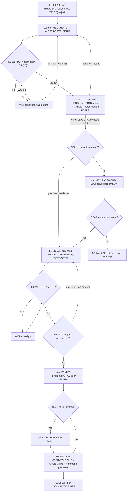
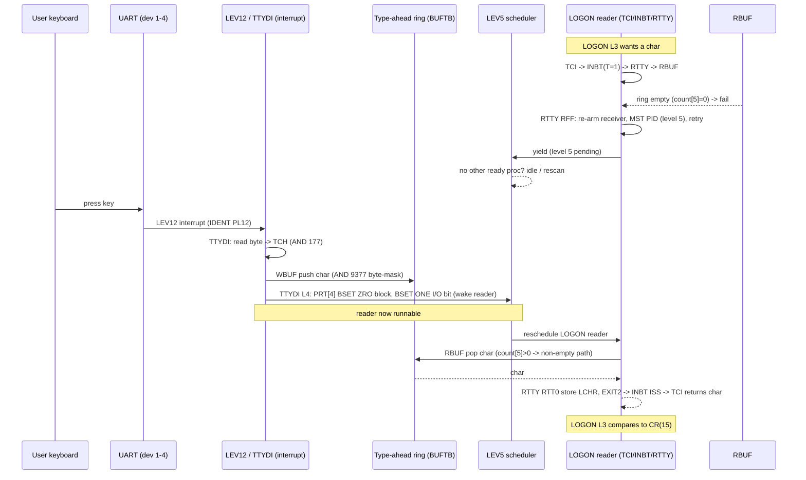
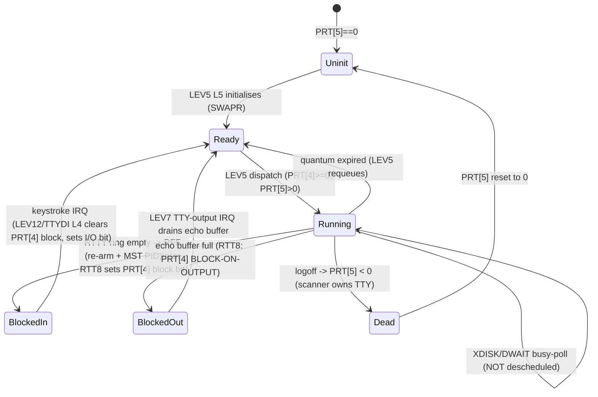

# NORD TSS 3.0 — LOGIN Flow and the Process / Block / Wake Mechanism

Reference for debugging why interactive login stalls after the name is echoed.
Everything marked **[VERIFIED]** is grounded in `src/*.SYMB` at the cited
`file:line`. Items marked **[UNVERIFIED]** or **[TENTATIVE]** could not be
proven from static source alone and need the live build map / DAP.

> **Symptom under investigation:** after cold-start creates `SYSTEM` and reaches
> `@ENTER`, typing `SYSTEM<CR>` echoes the name but LOGON never advances to
> `PROJECT NUMBER P-`. The CPU spins in a tight 2-instruction loop
> (virtual PC 006106 ↔ 006107) and further console input is ignored.

---

## 0. TL;DR — the mechanism in one paragraph

A user process that wants a keystroke calls **`TCI`** → **`INBT`** → **`RTTY`**,
which reads from the *per-terminal type-ahead ring buffer* via **`RBUF`**. If the
ring is empty, `RTTY`'s `RFF` branch re-arms the UART receiver, requests the
level-5 scheduler (`MST PID`, mask `40`₈ = level 5) and retries — so the reader
effectively yields to **`LEV5`** (scheduler + swapper) until a character shows up.
A keystroke raises a **LEV12** hardware interrupt → **`TTYDI`** (the input driver)
→ **`WBUF`** deposits the char into that terminal's ring and clears the reader's
BLOCK bit. The scheduler then re-runs the reader, `RBUF` returns the char, and
`TCI` hands it up to `LOGON`. **The ring buffer is the rendezvous point between the
LEV12 interrupt and the reading process.**

**Root cause of the current stall (DAP-verified, memory `tss-login-char-path`):**
the ring's byte-mask literal **`9377`** (`9377, 377` at `TSS1.SYMB:407`) is a
digit-leading symbol. The `mac-c` tokenizer mis-parsed all-digit tokens as base-8
numbers, so `AND 9377` in `WBUF`/`RBUF` (`TSS1.SYMB:351,362,397`) assembled as
**`AND 0`** — every console character is AND-ed to zero on the way through the ring.
`RBUF` returns 0, `TCI` sees 0 (never CR), and `LOGON` never terminates the name
read. See §7.

---

## 1. Routine map

| routine | octal addr | src file:line | role |
|---|---|---|---|
| `LOGON` | 032736 | `TSS4.SYMB:530` | log a user on (overlay OV6) |
| `TCI` | 027015 | `TSS2.SYMB:2634` | terminal char in (`)PCL` local): call `INBT` T=1, fold to ASCII, wait for non-zero |
| `INBT` | 023063 | `TSS2.SYMB:1237` | generic byte-input; dispatch on device in `T`; T=1 → teletype path |
| `RTTY` | 005273 | `TSS1.SYMB:2211` | read one char from a teletype ring; block/re-arm if empty |
| `RBUF` | 000702 | `TSS1.SYMB:391` | pop one char from a device ring buffer; fail-return if empty |
| `WBUF` | 000610 | `TSS1.SYMB:351` | push one char onto a device ring buffer (called from `TTYDI`) |
| `SBUF` | — | `TSS1.SYMB:485` | return count of chars in a ring |
| `IBUF` | — | `TSS1.SYMB:446` | initialise a ring buffer |
| `TTYDI` | 003362 | `TSS1.SYMB:1465` | teletype **input** interrupt driver (per char) |
| `LEV12` | — | `TSS1.SYMB:1429` | level-12 input interrupt dispatcher (N10 build) |
| `LEV11` | — | `TSS1.SYMB:1391 / 1816` | level-11 interrupt (disc + scanned TTY on NN10) |
| `LEV6` | — | `TSS1.SYMB:2671` | teletype scanner (runs every 80 ms) |
| `LEV5` | — | `TSS1.SYMB:2720` | **scheduler**: pick next runnable process |
| `SWAPR` | — | `TSS1.SYMB:2794` | **swapper**: write out / read in process context blocks |
| `XDISK` | 021137 | `TSS2.SYMB:532` | disc transfer (read/write); calls `DWAIT` |
| `DWAIT` | — | `TSS1.SYMB:3931` | disc-ready test — **busy poll with timeout, not a blocking wait** |
| `GCI` / `WCI` | — | `TSS2.SYMB:1903 / 1938` | get/put a byte on a *software string* (not the ring) |
| `MSG` | — | (via `9MSG`) | print a `$`-framed message string to the terminal |
| `PRT` / `PRT1` | — | `TSS1.SYMB:2663 / 2642` | process table: current-process ptr / first entry |

Addresses without a value are `)PCL` locals or macro-expanded and are not fixed in
source; the four with octal values are taken from the DAP-verified memory note.

---

## 2. Process table (PRT) layout **[VERIFIED `TSS1.SYMB:2642-2665`]**

Each process has an 8-word entry starting at `PRT1`:

| offset | field | meaning |
|---|---|---|
| 0 | PDTBL index | index of this process's context block |
| 1 | quantum timer | small-quantum countdown |
| 2–3 | compute timer | double-precision CPU-time accounting |
| 4 | **STATUS** | bit15 = **BLOCK**, bit14 = RUBOUT, bit13 = BLOCK-ON-OUTPUT, bit12 = LOGON timer interrupt, bit11 = I/O interrupt |
| 5 | **TTY USAGE** | **negative** = scanner owns it (process dead); **zero** = scheduler will initialise; **positive** = alive/in use |
| 6 | free word | — |
| 7 | saved PID | PID register saved across swap |

`PRT` (`TSS1.SYMB:2663`) points to the *current* process entry.
`QUANT = -17`₈ standard quantum; `LQUA = 24`₈ large quantum (`TSS1.SYMB:2664`).

**A process is runnable when STATUS word (offset 4) is ≥ 0 (BLOCK bit clear) and
TTY-USAGE (offset 5) is ≥ 0.** Setting STATUS bit15 blocks it; clearing bit15
wakes it. This is decoded directly from the scheduler test in §5.

---

## 3. PART A — the LOGON flow **[VERIFIED `TSS4.SYMB:524-603`]**

`LOGON` (label `L1`) runs in overlay OV6. Data cells `CSTR/CPTR` hold the name
input string; `XSTR/XPTR` the command string; `UNO/OBJ` the matched user record.

Textual walk (line numbers are `TSS4.SYMB`):

- **L1 (546):** init — `RMODE := -1`, clear `PASLK`; optionally print date;
  clear `KMAIL/KTTYL/KACCL`; mark this terminal's `TTYTB` entry `= -1`.
- **L2 (551):** re-prompt entry. Set the idle timeout word, print **`MS1 = "@ENTER "`**
  (`MSG`), initialise the `CSTR` name string pointer (`CPTR`), `SETUP` its buffer.
- **L3 (555):** `JPL I (TCI)` read one char; `AND 177`; compare to `15`₈ (CR).
  - char **= CR** → fall through to **L4**.
  - char **≠ CR** → `WCI` append to the name string; on WCI failure `JMP L2`
    (name too long → re-prompt); else `JMP L3` (next char).
- **L4 (557):** `XDISK` read `USRDK` (user directory) block from disc into
  `USRTB` (`JMP *-4` retries `XDISK` on failure). Then `ABLKP` looks the typed
  name up in `USARR`.
  - **name not found** → `JMP L2` (re-prompt `@ENTER`).
  - **found** → save user number `UNO`, compute the user record pointer `OBJ`.
- **password gate (562):** `LDA I OBJ,B,X` (record's password word); `JAZ LOGS`
  → **passwordless account jumps straight to LOGS**. Otherwise print
  **`MS2 = "PASSWORD "`** and read the password char-by-char (`L5/L6`, same
  TCI/CR loop, packing into `PASSW`).
- **L6 (568):** compare entered `PASSW` against the record; mismatch →
  `MS3 = "OK "` path / `L7` re-prompt via `JMP I (L2)`; match → **LOGS**.
- **LOGS (571):** print **`MS4 = "PROJECT NUMBER P-"`**, reset the terminal
  read/write string pointers (`SETR/SETW`), then **L8** reads the project number.
- **L8 (574):** TCI/CR loop reading the project digits; CR → **L9**.
- **L9 (577):** `CSN` converts the string to a number.
  - non-numeric / negative / zero → `JMP LOGS` or `JAN/JAZ LOGS` (**re-prompt**).
  - valid → store `PRNUM`, write `UNO` into `TTYTB`, clear the `TIMTB` timer.
- **mail check (581):** `CMAIL`; if mail present print **`MS5 = "*****YOU HAVE MAIL*****"`**.
- **handoff (584-591):** build the command string from `MS6 = "()SCRATCH"`,
  `SETW`/`GCI`/`WCI` to seed it, then `CNS` + `OPEN` of `MTP5` — this launches the
  command processor (XSTAR/scratch command). `L9A (592)` clears `LOGLK/RMODE`.

### Mermaid — LOGON flowchart



---

## 4. PART B — terminal input: block and wake

### 4.1 The read chain **[VERIFIED]**

```
LOGON L3  --JPL I (TCI)-->  TCI (TSS2:2634)
TCI       --SAT 1; JPL I (INBT)-->  INBT (TSS2:1237)
INBT      T==1 -> I2 -> I2A -> I2B (TSS2:1269-1276) --JPL I (RTTY)-->  RTTY (TSS1:2211)
RTTY      --JPL I 9RBUF-->  RBUF (TSS1:391)  reads ring in BUFTB
```

- **`TCI` (`TSS2:2634-2638`):** `T0: SAT 1; JPL I (INBT); JMP I (TRAP); JAZ T0;
  AND 177 …`. Note `JAZ T0` — **if `INBT` returns a zero byte, `TCI` loops back
  and re-reads.** This is the loop that spins forever when the ring hands back a
  zeroed char (§7).
- **`INBT` (`TSS2:1237`):** dispatches on `T`. `T=1` → `I2`; with `IDEV==1` it
  takes `I2A → I2B` and calls `RTTY`. `I2B: JPL I (RTTY); JMP *-2; JMP ISS`
  (`TSS2:1276`) — RTTY success returns via `ISS`, failure would retry (`JMP *-2`).
- **`RTTY` (`TSS1:2211`):** `JPL I 9RBUF; JMP RFF; …` — if `RBUF` fails (ring
  empty) it branches to **`RFF` (TSS1:2230)**; on success it takes the echo /
  return path (`RTT0`, `TSS1:2215`) storing `LCHR` and returning the char via
  `EXIT2`.

### 4.2 Where the read *blocks* **[VERIFIED `TSS1.SYMB:2230-2243`]**

`RFF` (empty-ring path):
```
RFF, INTEN; ...re-arm the UART receiver (IOX WCR / IOT PIN)...
     SAA 40; MST PID; COPY DA SA        % request level 5 (mask 40 = level 5)
     LDT I 9TDEV; JMP RTTY+3            % retry the whole read
```
So the "block" is **re-arm receiver + request the scheduler + retry**. The reader
does not literally sleep on a semaphore; it asks LEV5 to run (which may swap it out
if its quantum is gone) and retries the ring on its next slice. Combined with the
LEV12 → `TTYDI` → `WBUF` deposit, the effect is a wake-on-keystroke.

`RTT8` (`TSS1:2225`) is the *output*-blocked path (echo buffer full): it sets
STATUS bits (`BSET ONE 170 DA; BSET ONE 150 DA` on `PRT` word 4) then `MST PID` —
this is the explicit BLOCK-bit set. The plain input-empty path (`RFF`) relies on
re-arm + reschedule instead.

### 4.3 The wake **[VERIFIED]**

Keystroke → **LEV12** (`TSS1:1429`, N10 build): `IDENT PL12` identifies the device,
indexes the jump table `LL0`, and for teletypes 1–4 (`LT1..LT4`) sets `T` and
jumps to **`LLT: JPL I (TTYDI)`** (`TSS1:1441`). (On the NN10 build the same char
arrives via **LEV11**'s scan loop `LL0…LLT` at `TSS1:1400-1418`.)

**`TTYDI` (`TSS1:1465`)** — per-character input driver:
- Reads the received byte from the device (`IOX RDR` / `IOT PIN`), masks to
  `AND 177` → `TCH` (`TSS1:1474`).
- Parity/rubout/break handling, then **`L0` (`TSS1:1489`)** deposits the char:
  `JPL I (SBUF)` … `LDX 0,X` locate the ring, and (`L0A`/`WBUF`) **`JPL I (WBUF)`**
  (`TSS1:1503`) pushes the char.
- **`L4` (`TSS1:1516`)** is the *wake / notify* tail: it indexes the terminal's
  `PRT` entry (`SHA 3; ADD (PRT1`), then
  `LDA 4,X; BSET ZRO 170 DA; BSET ONE 130 DA; STA 4,X` — **clears a BLOCK bit and
  sets the I/O-interrupt bit in the STATUS word**, marking the reader runnable, and
  `EXIT`s back to the interrupt.

**`WBUF` (`TSS1:351`)** pushes into the ring: `AND 9377` (mask to a byte),
maintain write pointer `4,B`, count `5,B`, pack two chars per word (`W1/W2`),
threshold/flow-control (`YSTOP`, `L7TBL`). **The `AND 9377` here is the exact word
that mis-assembles — see §7.**

### 4.4 The ring buffer shape **[VERIFIED `TSS1.SYMB:446-457, 351-404`]**

`IBUF` builds each ring: word `-2,-1` = base/size, `0` = start, `1` = end,
`2` = wrap limit, `3` = read pointer, `4` = write pointer, `5` = char count,
`6` = busy flag, `34` = echo flag, `35` = echo count. Chars are packed **two per
word** (`SHR 1` for the word address, bit0 selects hi/lo byte — `RBUF R1/R2`
`TSS1:396-399`). `RBUF` fail-returns (skip-return) when count `5,B == 0`.

### Mermaid — terminal input sequence (block + wake)



---

## 5. The scheduler LEV5 and swapper SWAPR **[VERIFIED `TSS1.SYMB:2720-2831`]**

`LEV5` runs on interrupt level 5 (requested by `MST PID` mask `40`, or by the
clock). It walks the `PRT` table looking for a runnable process:

```
LEV5: LDX I 9PRT; STZ FLAG; LDA DABLE; JAN L3A      % DABLE<0 disables switching
      LDA 1,X; JAP L0        % quantum timer still positive -> skip
      LDA 4,X; JAP L1        % (NN10 console poll branch)
...
ZZ:   ...advance to next PRT entry, wrap at PRT1...
L2:   LDA 5,X; JAZ L5        % TTY-USAGE == 0 -> initialise process (L5/SWAPR)
      JAN L0                 % TTY-USAGE < 0 -> dead, skip
      LDA 4,X; JAN L0        % STATUS < 0 (BLOCK bit15 set) -> BLOCKED, skip
      JAZ L3                 % STATUS == 0 -> runnable
      SAA 1; STA 5,X; SAA 0; JMP SWAPR   % dispatch it
L3:   LDA FLAG; JAZ L0; MIN 5,X; ... quantum bookkeeping ...; JMP SWAPR
L5:   SAA -1; JMP SWAPR      % first-time init of this process
```

**Runnable test = `PRT[5] > 0` (alive) AND `PRT[4] ≥ 0` (BLOCK bit clear).**
A blocked reader has `PRT[4] < 0`; `TTYDI L4` clears that bit to wake it.

**Idle behaviour when nothing is ready [VERIFIED `TSS1.SYMB:2752-2757`]:**
```
"N10"    L10: SAA 1; MST PID; TRA PID; AND 16; MCL PIE
              WAIT; MST PIE; SAA 1; MCL PID; JMP LEV5
"NN10"   L10: JMP LEV5        % busy rescan
```
On the NORD-10 (`N10`) build the idle is a `WAIT` (halt until interrupt) followed by
`JMP LEV5`; on the non-N10 (`NN10`) build it is a **tight `JMP LEV5` rescan loop**.
Either way, **the only thing that makes a process runnable again is a BLOCK-bit
clear performed by an interrupt handler (`TTYDI L4` for input, disc completion for
I/O).**

`SWAPR` (`TSS1:2794`) saves the current PID into `PRT[7]`, and if the chosen
process differs from the current one, writes the current context block out to disc
(`DKA1 + PRT[0]<<3`) and reads the new one in (`SW1`… page swap of `VCTBL`/`PCTBL`).

### Mermaid — process state machine



---

## 6. Disc I/O vs the scheduler **[VERIFIED]**

- **`XDISK` (`TSS2:532`)** does the transfer. At entry it does
  `SAA 40; MCL PIE` (mask 40 = level 5) — **it disables scheduler-level interrupt
  enable during the transfer** — and restores it at `T3: SAA 40; MST PIE`
  (`TSS2:594`).
- **`DWAIT` (`TSS1:3931`)** is the ready test and is a **BUSY POLL with a timeout
  counter `DWX`**, not a blocking wait:
  ```
  "N10"  DW1: IOX RST; JMP *+1; BSKP ZRO 40 DA; JMP *+3
              BSKP ONE 20 DA; EXIT AD1        % ready -> success
              MIN DWX; JMP DW1                % not ready -> bump counter, poll again
  ```
  When `DWX` overflows, `DWAIT` fail-returns (timeout). **A disc read therefore
  does NOT deschedule the process** — the process spins inside `DWAIT`/`XDISK`
  until the controller is ready or the timeout trips.
- **LEV11** (`TSS1:1391` NN10 / `1816` N10) is the disc completion interrupt. Since
  `DWAIT` polls the status register directly, LEV11's role for `XDISK` is the
  controller-driven completion; the process side still confirms via `DWAIT`'s poll.

Consequence: a disc stall shows up as a **busy loop inside `DWAIT`/`XDISK`**
(interrupts disabled at level 5), *not* as the low-address idle loop — a useful
discriminator when reading the PC in a debugger.

---

## 7. Where a login could stall

Each entry: the mechanism point, and what it looks like in a debugger.

1. **Ring byte-mask assembles as `AND 0` — the VERIFIED root cause.**
   `9377` (`TSS1:407`, value `377`) is a digit-leading symbol used by
   `WBUF` (`TSS1:351,362`) and `RBUF` (`TSS1:397,423`). The `mac-c` tokenizer
   treated all-digit tokens as base-8 numbers, so `AND 9377` encoded as `AND 0`
   (`070000`). Every console char is zeroed going into / out of the ring. **What
   you see:** `TTYDI` fires and echoes (echo uses `TCH` directly), the ring count
   increments, but `RBUF` returns `0`; `RTTY` returns 0; `INBT` returns 0; and
   **`TCI`'s `T0` loop (`JAZ T0`, `TSS2:2635`) spins forever re-polling** — the
   name never terminates on CR and `LOGON` never leaves the L3 read loop. This
   matches "name echoed but never advances." **Fix:** the octal branch must require
   octal digits `0-7`, not `isdigit`, so `9377` resolves to the symbol (=377).
   *(Verified via DAP; see memory note `tss-login-char-path`.)*

2. **Name terminator (CR) never observed.** If the CR byte is lost or masked (as in
   #1), L3 (`TSS4:555`) loops indefinitely appending to the name string via `WCI`.
   **Debugger:** PC cycling through `TCI`/`INBT`/`RTTY` and `LOGON` L3; `CPTR`
   string grows or WCI eventually fails → `JMP L2` re-prompt storm.

3. **TCI wake never delivered (LEV12 not re-arming).** If `TTYDI L4` (`TSS1:1516`)
   does not clear the reader's `PRT[4]` block bit, or the UART receiver is not
   re-armed after `IDENT` (a known nd100x device-emulation concern), the reader
   stays blocked and LEV5 finds nobody runnable. **Debugger:** CPU sits in the LEV5
   idle (N10: `WAIT;JMP LEV5`; NN10: tight `JMP LEV5`) and **console input has no
   effect** — this is the signature that best matches the reported 006106↔006107
   2-instruction idle loop. **[TENTATIVE mapping]** — see §8.

4. **`USRDK` disc read never completes.** L4 (`TSS4:557`) `JPL I (XDISK); JMP *-4`
   retries `XDISK` on failure. If `DWAIT` never sees ready and keeps timing out,
   L4 loops. **Debugger:** PC inside `DWAIT`/`XDISK` (`TSS2:532`, level-5 enable
   cleared), *not* the low idle loop; `DWX` counting.

5. **Project-number loop.** L9 (`TSS4:577`) re-prompts `LOGS` when `CSN` yields a
   non-numeric / ≤ 0 value. If digits arrive zeroed (as in #1) `CSN` never produces
   a positive number. **Debugger:** repeated `MS4 "PROJECT NUMBER P-"` prints, PC
   cycling `LOGS → L8 → L9 → LOGS`. *(Not reached in the current symptom, since the
   stall precedes the `PROJECT NUMBER` prompt.)*

---

## 8. On the reported 006106↔006107 idle loop  **[UNVERIFIED mapping]**

I cannot map virtual PC **006106** to a specific source label from the `.SYMB`
files alone — that requires the build's address/listing map, which is not present
in `Build/` (no `.LIST` file). What I can state:

- 006106₈ is in **low resident memory** (above `RTTY`=005273, below the overlay
  region where `LOGON`=032736 lives), i.e. it is a **kernel/monitor** location, not
  overlay code. That rules out LOGON's own L3/L8 read loops as the spinning PC.
- A **2-instruction loop in resident code where console input has no effect** is
  most consistent with the **LEV5 idle** (§5: `WAIT;JMP LEV5` on N10, or the tight
  `JMP LEV5` rescan on NN10) or an equivalent monitor wait — i.e. **the scheduler
  has found no runnable process and no interrupt is making one runnable.** That in
  turn points at stall-cause **#3** (wake not delivered) as the mechanism, which is
  the downstream effect of root-cause **#1** if the zeroed char also defeats the
  `TTYDI L4` wake or leaves the reader parked.
- It is **not** consistent with a disc stall (#4/#5 would show the PC inside
  `DWAIT`/`XDISK` with level-5 enable cleared, a longer poll loop).

To pin 006106 exactly: build with a listing map (or use DAP `debug_symbol_list` /
`disassemble` at 006106-006107) and match the two instructions against `LEV5 L10`
(`TSS1:2752`), `LEV6 L2` (`WAIT;JMP LEV6`, `TSS1:2694`), or `LEV12 LCON`
(`WAIT;JMP LEV12`, `TSS1:1446`) / `LEV11 LCON` (`TSS1:1406,1824`) — all of which are
`WAIT;JMP` 2-instruction idles in resident code.

---

## 9. Provenance

All `TSSn.SYMB` references are the CVS-patched `src/` copies (the build source).
The DAP-verified facts in §0 #1 / §7 #1 come from the session memory note
`tss-login-char-path` (2026-07-22, live trace on DAP port 1777). Octal addresses
for `TCI/INBT/RTTY/RBUF/WBUF/TTYDI/LOGON/XDISK` are from that same live trace;
treat any raw *memory-value* reads there as MMS1-page-context dependent
(`@pil`-qualified) per the note's paging caveat.
