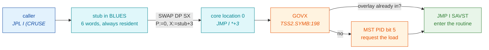
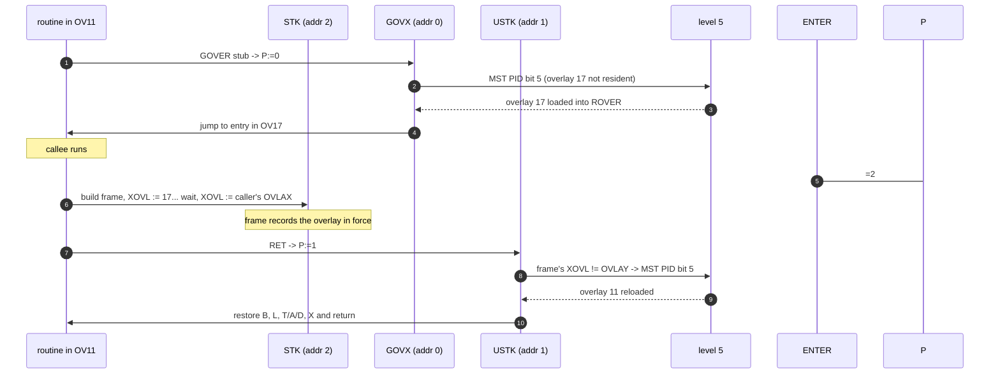

# NORD TSS 3.0 — The Source in Pseudo-C

**Full path:** `docs/TSS-PSEUDOCODE.md`

Every routine in the TSS corpus, rewritten as readable pseudo-C so the
*intent* of the 1973 MAC assembly can be understood without decoding octal.

This is the companion to:

| document | full path | what it gives you |
|---|---|---|
| per-file reference | `docs/TSS-SOURCE-FILES.md` | what each file **is** |
| architecture | `docs/TSS-ARCHITECTURE.md` | how the **subsystems** work |
| **this document** | — | what each **routine does**, in C |

---

## How to read this, and how far to trust it

Pseudo-C is an **interpretation**. Unlike an octal dump it can be
subtly, invisibly wrong. So this document runs under a fixed discipline:

1. **Every routine cites its source line range.** `TDUMP.SYMB:221-244` means
   you can check any claim with one `sed -n '221,244p'`.
2. **The register contract comes from the author, not from me.** 79% of the
   routines in this corpus carry a `%`-comment header written in 1973 that
   declares arguments, return value and failure return. Where one exists it is
   quoted verbatim above the pseudo-C, and the C signature is a transcription
   of it — not a guess.
3. **Nothing is derived from computed addresses.** Address arithmetic on this
   corpus has repeatedly produced wrong answers in this project; the pseudo-C
   is derived from source text only.
4. **`INFERRED` marks a reasoned conclusion. `UNKNOWN` marks a gap.** Neither
   is silently smoothed over into a plausible story.
5. **Where independent evidence confirms a reading, it is quoted.** For example
   the divide-by-12 in the disc-address conversion is stated as fact because
   `MINIT.SYMB:543` independently names it.

### Conventions used in the pseudo-C

| Convention | Meaning |
|---|---|
| `/* A */` `/* X */` after a parameter | which register carries it |
| `fail:` label / `return FAIL` | MAC's **skip return** — the failure path is a *separate return address*, not an error code |
| `word` | one 16-bit ND word (all addresses are word addresses, not bytes) |
| `disc[]` | the disc, addressed in 256-word pages |
| `core[]` | physical memory |
| `NN10` / `N10` comments | code that exists only in the NORD-1 or NORD-10 build |

### The skip-return idiom — read this once, it is backwards from C

TSS routines do not return error codes in the C sense. They return to one of
**two different addresses**. And the polarity is the opposite of what a C
programmer expects:

| callee does | returns to | header calls it |
|---|---|---|
| `MIN LREG,B` then exit | **`L+1`** | `%RETURN` — the **normal/success** path |
| falls through without it | **`L+0`** | `%FAILURE RETURN` |

So **the word immediately after the call is the FAILURE handler**, and normal
execution resumes at the word after that:

```
    JPL I (GTRK         /* allocate a track                        */
    JMP CF1             /* <-- FAILURE lands here (no more tracks) */
    STA DKA2,B          /* <-- SUCCESS resumes here                */
```

Two idioms follow from this and appear constantly:

```
    JPL I (RBLOC        /* read a disc block   */
    JMP *-1             /* on failure, RETRY the call forever      */

    JPL I (IUSER
    JPL I (FTLER        /* on failure, fatal error - unrecoverable */
```

**Verified**, not assumed: `SUIB` takes the `MIN LREG,B` path on
`TSS5.SYMB:219` — the branch where it *found* the file — and its header
(`TSS5.SYMB:186`) calls that `%RETURN A,T IF FILE EXISTS`. Its caller `CRFIL`
at `TSS5.SYMB:263` places `JMP I (CF6` ("FILE ALREADY EXISTS") at `L+1`.
Both agree.

Throughout this document that is written as:

```c
int cruse(...);         /* returns OK or FAIL; on FAIL, A holds the reason */
```

---

## Status

| file | lines | routines | pseudo-C |
|---|---:|---:|---|
| `TDUMP.SYMB` | 382 | 9 | **done** — §1 |
| `MINIT.SYMB` | 809 | ~20 | **done** — §2 |
| `TSS5.SYMB` | 1994 | ~60 | **done** — §3 (incl. the 60-command map, §3.15) |
| `TSS4.SYMB` | 2039 | ~38 | **done** — §4 |
| `TSS3.SYMB` | 1754 | ~34 | **done** — §5 |
| `TSS2.SYMB` | 3528 | ~140 | **done** — §6 |
| `TSS1.SYMB` | 4738 | ~80 | **done** — §7 |

Order is easiest-first. `TSS1` is last because 35% of its lines sit inside
conditional mark regions, so many of its routines have two or four different
bodies.

---

# 1. `TDUMP.SYMB` — the distribution-tape dumper

**Full path:** `src/TDUMP.SYMB`

A **user program that runs under a live TSS**. Every I/O it performs is a
monitor call. It reads a saved core-image file and punches the bootable
distribution tape that installs TSS onto a machine that has none.

Of the four bodies of code in this file, **only two ever execute here**. The
other two are payload — assembled as data, copied out to tape and disc.

## 1.1 `TDUMP` — main (`TDUMP.SYMB:333-369`)

```c
void main(void)
{
    print("$TSS DUMP PROGRAM$$CORE IMAGE FILE: ");
    fnum = open(read_reply(), "CORE");      /* MON 34 OPEN; fails -> terr() */

    print("$OUTPUT FILE: ");
    tdev = open(read_reply(), "BIN");       /* the paper-tape punch          */

    /* --- section 1: the self-loading bootstrap ------------------- */
    fcn = 0;
    dump();                                 /* writes HLOAD..8TBE          */

#ifdef CDC
    /* --- section 2: the two disc-resident boot pages ------------- */
    bcopy(DKRST, BUFF, DKRE);               /* MON 33 BCOPY                */
    fcn = 1;  cadr = DKRST;  dka = 0;  nwd = DKRE;
    dump();                                 /* -> disc page 0              */

    bcopy(RDKOP, BUFF, DBOE);
    fcn = 1;  cadr = RDKOP;  dka = 2;  nwd = DBOE;
    dump();                                 /* -> disc page 2              */
#endif

    /* --- section 3: 64 pages that are loaded ONTO THE DISC ------- */
    for (cnt = 0; cnt < 64; cnt++) {
        if (!rpag(fnum, cnt + 64, BUFF))    /* MON 7 RPAG                  */
            if (errcode != 022) terr();     /* 022 is tolerated            */
        fcn  = 1;
        cadr = BUFF;
        dka  = CORLD + 64 + cnt;            /* <-- has a DISC address      */
        nwd  = 256;
        dump();
    }

    /* --- section 4: 64 pages that are loaded INTO CORE ----------- */
    for (cnt = 0; cnt < 64; cnt++) {
        if (!rpag(fnum, cnt, BUFF))
            if (errcode != 022) terr();
        fcn  = 1;
        cadr = cnt * 256;                   /* <-- has a CORE address      */
        dka  = -1;                          /*     and no disc address     */
        nwd  = 256;
        dump();
    }

    /* --- section 5: trailer, carrying the start address ---------- */
    fcn = 1;  cadr = -1;  dka = 7;          /* 7 = the cold-start entry    */
    dump();

    print("$DUMP FINISHED$");
    leave();                                /* MON 0 */
}

void terr(void) { ermsg(); leave(); }       /* MON 52, MON 0 */
```

The two loops are the heart of it. **The first 64 pages carry a disc address
and the second 64 carry a core address.** That is how a single tape both boots
the machine and installs the system onto its disc in one pass.

`7` as the final start address is the cold-start entry documented in
`TSS-ARCHITECTURE.md` §4.8.

## 1.2 `8DUMP` — the tape formatter (`TDUMP.SYMB:221-244`)

Two completely different outputs, selected by `fcn`.

```c
void dump(void)
{
    if (fcn == 0) {
        /* ---- the self-loading bootstrap section ---------------- */
        punch_nulls(128);                    /* leader                     */

        /* (a) the bootstrap as HUMAN-READABLE OCTAL TEXT           */
        put_octal(HLOAD);  punch('/');       /* front-panel: "deposit at"  */
        for (p = HLOAD; p < HLDE; p++) {
            put_octal(core[p]);
            punch(CR); punch(LF);
        }
        put_octal(HLOAD);  punch('!');       /* front-panel: "execute at"  */

        /* (b) the SAME code again, in binary, for (a) to swallow   */
        for (p = HLOAD; p < 8TBE; p++)
            put_word(core[p]);
        put_word(0125252);                   /* sync word TBOOT waits for  */
        return;
    }

    /* ---- an ordinary binary load block ------------------------- */
    if (cadr == -1) {                        /* trailer                    */
        put_word(-1);
        put_word(dka);                       /* the start address...       */
        put_word(dka);                       /* ...written twice           */
        punch_nulls(128);
        return;
    }

    put_word(cadr);                          /* where it loads             */
    put_word(dka);                           /* disc address, or -1        */
    put_word(nwd);                           /* how many words             */
    for (chk = 0, i = 0; i < nwd; i++) {
        put_word(BUFF[i]);                   /* ALWAYS from BUFF           */
        chk += BUFF[i];
    }
    put_word(chk);                           /* checksum                   */
}
```

**The key structural insight:** the head of the tape is a *typed-in program*.
`nnnnnn/` is the NORD front panel's "select this address", the octal numbers
that follow deposit consecutive words, and `!` means "start executing here".
So an operator at a bare machine can key those ~35 words in by hand — or a
front-panel loader can read them — and once they run, they pull in everything
after them at machine speed. It is a bootstrap that carries its own
instructions for how to be bootstrapped.

Note `cadr` is only ever *recorded* on the tape. The data always comes from
`BUFF`. That is the one behavioural difference from the copy embedded in
`TSS3.SYMB`, where `cadr` is also the source pointer.

## 1.3 `8WOUT` / `8NOUT` / `PUNCK` — output primitives (`TDUMP.SYMB:251-261`)

```c
void put_word(word w)  { outbt(tdev, w >> 8); outbt(tdev, w & 0377); }
void punch(int c)      { outbt(tdev, c); }
void put_octal(word w) { for (i = 5; i >= 0; i--)          /* 6 octal digits */
                             outbt(tdev, '0' + ((w >> (3*i)) & 7)); }
```

`8NOUT` emits the high digit first, then loops five times on the remaining
three-bit groups (`SAX -5` … `JNC *-5`).

## 1.4 `HLOAD` — the hardware bootstrap (`TDUMP.SYMB:80-103`) — PAYLOAD

Never executed by TDUMP. Punched to tape, then run on the target machine.

```c
/* "N10 version */
void hload(void)
{
    iox(0505, 020);                 /* reset the disc controller      */
    iox(0403, 4);                   /* enable the tape reader         */
    for (hcnt = 0; hcnt < hsiz; hcnt++) {
        hi = read_tape_byte();      /* poll IOX 402 for ready         */
        lo = read_tape_byte();
        core[hcora++] = (hi << 8) | lo;
    }
    goto *hstrt;                    /* = TBOOT */
}
```

The `"NN10` (NORD-1) version does the same with `IOT ACT SKA REA` polling.
`REA` is undefined in the recovered source; the 1973 author flagged it himself
at `TDUMP.SYMB:382`: `% What is REA? CVS, other undef OK`. It only appears in
the NORD-1 path, which the CDC/N10 build compiles out.

## 1.5 `TBOOT` — the TSS loader (`TDUMP.SYMB:107-126`) — PAYLOAD

```c
void tboot(void)
{
    while (get_word() != 0125252)          /* hunt for the sync word */
        ;

    for (;;) {
        load_addr = get_word();
        if (load_addr == -1) {             /* trailer                */
            start = get_word();
            if (start < 0) halt();         /* N10 build only         */
            goto *start;
        }
        disc_addr = get_word();
        count     = get_word();

        for (chk = 0, i = 0; i < count; i++) {
            core[load_addr + i] = get_word();
            chk += core[load_addr + i];
        }
        if (get_word() != chk)
            halt(0377);                    /* WAIT 377 = checksum bad */

        if (disc_addr != -1)
            hdkop(load_addr, disc_addr);   /* route the block to disc */
    }
}
```

Each block states its own destination, and can be routed to **memory or to
disc**. `WAIT 377` on a checksum failure is a halt with a visible code in the
front-panel lamps.

The `JAN *+2 / WAIT` guard on a negative start address exists only in TDUMP's
copy; `TSS3`'s embedded version jumps unconditionally.

## 1.6 `HDKOP` / `RDKOP` — disc read/write (`TDUMP.SYMB:143-198`, `273-313`) — PAYLOAD

Both convert an NCR disc address to CDC geometry, then run the transfer. The
conversion is where the two machines diverge most sharply:

```c
/* "N10 — the NORD-10 has hardware divide */
save_TAD();                                /* STF DKTT: T,A,D -> 3 words */
sector = ncr_addr / 12;                    /* SAT 14 (=12 dec); RDIV ST  */
restore_TAD();                             /* LDD DKTA; LDT DKTT         */

/* "NN10 — no divide instruction available   INFERRED */
q = (ncr_addr * 021845) >> 16;             /* MPY (52525 ~ 65536/3       */
q = fix_sign(q);                           /* the BSKP/ADD correction    */
sector = q >> 2;                           /* SHA ZIN SHR 2  -> /3/4 =/12 */
```

The `/12` is not a guess — `MINIT.SYMB:543` names the same operation:
*"DIVIDE BY 12 (DEC) GIVING FIELD [14,5] OF CDC ADDRESS"*.

**INFERRED:** the NORD-1 lacked `RDIV`, which is why the reciprocal-multiply
fallback exists. Not confirmed against a NORD-1 manual.

The three consecutive words `DKTT`/`DKTA`/`DKTD` exist precisely because `STF`
spills **T, A and D** in one instruction, `RDIV` clobbers A and D, and `LDD`
restores the pair.

## 1.7 `DKRST` and `DBOOT` — the disc restart path (`TDUMP.SYMB:269-324`) — PAYLOAD

This is what lives in disc page 0 and page 2.

```c
/* --- written to disc page 0, loaded to core address 0 --- */
word disc_page_0[] = {
    JMP_over_next_word,      /* core[0] */
    CORLD                    /* core[1] -- DATA, not code: the core-load addr */
};
void dkrst(void)             /* core[2..] */
{
    rdkop(RDKOP_area, 2);    /* pull page 2 in from disc */
    goto dboot;
}

/* --- written to disc page 2 --- */
void dboot(void)
{
    core_addr = 0;
    disc_addr = core[1];              /* <-- reads the CORLD planted above */
    while (core_addr < 040000) {
        rdkop(core_addr, disc_addr++);
        core_addr += 256;
    }
    goto *core[0301];
}
```

**Page 0 begins with a jump over its own second word, because that word is a
parameter, not an instruction.** `DBOOT` reads it back out of memory location 1
at runtime. That is why one disc image works for all four `CORLD` values
(NCR/CDC × A/B) without reassembly.

`TSS3.SYMB:169`'s version instead has `LDA (CORLD` — the constant compiled in.
That is the single substantive difference between the two copies.

---

# 2. `MINIT.SYMB` — the mass-storage initialisation program

**Full path:** `src/MINIT.SYMB`
**Built by:** `mac-c/scripts/build/build_minit.sh`

Header, `MINIT.SYMB:1-6`:

```
%MASS STORAGE INITIALIZATION PROGRAM
%MAY BE USED FOR CDC DISK AND EITHER NORD-1 OR NORD-10
```

A **standalone bare-metal program** — the opposite of TDUMP. It talks to the
teletype and the disc directly through `IOX`/`IOT`, with no operating system
underneath. It runs *before* TSS has ever booted, and its job is to lay down
the **MIB free-track bitmap** so that TSS's `GTRK` has tracks to allocate.

Without it, `SINIT`'s `GTRK` finds no free tracks and user `SYSTEM` cannot be
created.

## 2.1 `MINIT` — main (`MINIT.SYMB:137-221`)

```c
void minit(void)
{
restart:
    ioini();                                       /* init all I/O devices  */

    print("$MASS STORAGE INIT$$FIRST DISK ADDRESS (NCR): ");
    adr1 = adri = octin() & 077770;                /* 8-word aligned        */

    print("$LAST DISK ADDRESS (NCR): ");
    adrn = octin() & 077770;

    if (adrn - adr1 < 0) {
        print("$ILLEGAL ADDRESSES$");
        goto restart;
    }

    memset(MIB, 0, 04000);                         /* clear the bitmap      */

ask:
    print("$INITIALIZE OR UPDATE OR REGENERATE (I OR U OR R): ");
    switch (tci()) {
    case 'I': print("NITIALIZE$");  goto initialize;
    case 'U': print("PDATE$");      print("$NOT IMPLEMENTED$"); goto restart;
    case 'R': print("EGENERATE$");  goto regenerate;
    default:  goto ask;
    }

    /* ================= INITIALIZE: surface-test every track ========= */
initialize:
    for ( ; adri < adrn; adri += 8) {

        memset(BUFF, 0, 04000);                    /* 2048 words = 8 blocks */

        if (!dktr(BUFF, adri, WRITE, /*extra blocks*/ 7)) goto disk_error;
        if (!dktr(BUFF, adri, READ,  /*extra blocks*/ 7)) goto disk_error;

        for (i = 0; i < 04000; i++)                /* did it read back 0?   */
            if (BUFF[i] != 0) goto transfer_error;

        MIB[adri >> 7] |= MASKS[(adri >> 3) & 017];   /* mark track GOOD    */
        continue;

    disk_error:
        print("$DISK ERROR "); put_octal(status);
        goto report;
    transfer_error:
        print("$TRANSFER ERROR");
    report:
        print(" AT NCR(");  put_octal(adri);
        print(") CDC(");    put_octal(dkadr(adri));
        print(")");
        /* NOTE: the bit is NOT set -> the track is left marked BAD */
    }

    if (!dktr(MIB, 050, WRITE, 7)) {               /* write the bitmap out  */
        print("$UNABLE TO WRITE MIB$");
        goto restart;
    }
    print("$FINISHED$");
    goto restart;
```

**What "INITIALIZE" really does:** it is a *surface test*. Every track is
written with zeros, read back, and verified. A track only gets its bit set in
the bitmap if it survives the round trip. A track that fails is reported and
**left marked as unavailable** — the loop continues rather than aborting, so
one bad track does not stop the format.

## 2.2 `REGENERATE` — rebuild the bitmap from the file system (`MINIT.SYMB:192-214`)

This is the interesting one, and it has no counterpart in the bring-up docs.

```c
regenerate:
    /* step 1: mark EVERY legal track as free */
    for (adri = adr1; adri < adrn; adri += 8)
        if (dkadr(adri) != ILLEGAL)                /* skip illegal addresses */
            sbit(adri, FREE);

    /* step 2: walk every user and clear the bits their data occupies */
    for (usn = 0; usn < 0340; usn++) {             /* 224 users             */

        read_block(BUFF, user_table_block(usn));
        entry = &BUFF[(usn & 037) * 8];
        if (entry[0] == 0) continue;               /* no such user          */

        uib = entry[7];                            /* the user's index blk  */
        sbit(uib, IN_USE);

        for (fil = 0; fil < 070; fil++) {          /* 56 files per user     */

            read_block(BUFF, uib + (fil >> 3));
            fentry = &BUFF[(fil & 7) * 040];
            if (fentry[1] == 0) continue;          /* no such file          */

            ix = fentry[021];                      /* the file's index blk  */
            sbit(ix, IN_USE);

            read_block(BUFF, ix);                  /* the index block lists */
            for (trk = 0; trk < 04000; trk++)      /*   every data track    */
                sbit(BUFF[trk], IN_USE);
        }
    }

    write_block(MIB, 050);                         /* commit the bitmap     */
    print("$FINISHED$");
    goto restart;
```

**This is a filesystem-consistency rebuild — an `fsck` for the free list.** It
does not touch user data. It starts from "everything is free", then walks every
user's index block and every file's index block, clearing a bit for each track
actually in use. Whatever is left set is genuinely free.

That makes it the correct tool for a disc whose bitmap has been corrupted or
lost — and, notably, a way to *measure* track leakage rather than guess at it.

**UNKNOWN:** the constants `0340` (users) and `070` (files per user) are read
directly from the loop bounds, but I have not cross-checked them against the
UIB layout in `TSS5.SYMB`. Treat the comments as the loop's own arithmetic, not
as a confirmed filesystem limit.

## 2.3 `SBIT` — set or clear one bit in the bitmap (`MINIT.SYMB:252-265`)

Author's contract, `MINIT.SYMB:246-250`:

```
%SBIT
%SET/RESET BIT IN BIT TABLE
%T = DISK ADDRESS
%A = 0 OR 1
%RETURN
```

```c
void sbit(word disk_addr /* T */, int set /* A */)
{
    save_T_A_D();                       /* STF SBTAD -> 3 consecutive words */
    save_X();

    unit = disk_addr >> 3;              /* 8 sectors per allocation unit    */
    wordp = &MIB[unit >> 4];            /* 16 units per bitmap word         */
    mask  = MASKS[unit & 017];

    if (set) *wordp |=  mask;
    else     *wordp &= ~mask;           /* COPY CM1 DA SA = one's complement */

    restore_T_A_D();                    /* LDF SBTAD                        */
    restore_X();
}
```

`MASKS` (`MINIT.SYMB:224-225`) is just a 16-entry table of single-bit
constants `1, 2, 4, … 0100000` — the ND has no variable shift-by-register that
would make computing it cheaper.

**One allocation unit = 8 sectors; one bitmap word = 16 units.** That is read
straight off the two shifts and is consistent between `SBIT` and the
`INITIALIZE` loop, which computes the same index inline.

## 2.4 Teletype and number I/O (`MINIT.SYMB:19-133`)

```c
int  tci(void)          { poll IOX 300 until ready; return IOX 300; }  /* MINIT.SYMB:19  */
void tco(int c)         { poll IOX 305 until ready; IOX 305 = c;    }  /* MINIT.SYMB:34  */
void crlf(void)         { tco(CR); tco(LF); }                          /* MINIT.SYMB:49  */
void tcf(void)          { /* I/O error */ }                            /* MINIT.SYMB:62  */

void print(char *s)     /* MINIT.SYMB:75 -- X = string */
{
    /* MAC strings are packed 2 chars/word and terminated by '\'      */
    /* '$' in a string means CR LF                                     */
    for each char c in s:
        if (c == '\\') return;
        if (c == '$') crlf(); else tco(c);
}

word octin(void)        /* MINIT.SYMB:98 -- returns A */
{
    n = 0;
    while ((c = tci()) is an octal digit)
        n = (n << 3) | (c - '0');
    return n;
}

void octot(word n)      /* MINIT.SYMB:115 -- A = number */
{
    for (i = 5; i >= 0; i--)
        tco('0' + ((n >> (3*i)) & 7));
}
```

The `$` = CR LF convention explains the message table's look:
`'$MASS STORAGE INIT$$FIRST DISK ADDRESS (NCR): \ '` prints a blank line
before and after the banner. The trailing `\` is the terminator.

## 2.5 The disc driver (`MINIT.SYMB:307-588`)

```c
int  dwait(void);                       /* MINIT.SYMB:307 -- ready, or timeout */
int  dkop(word *core, word ncr_addr, int op, int unit);  /* :333 -- one 256w block */
int  dktr(word *core, word ncr_addr, int op, int extra); /* :364 -- up to 3K words */
word dkadr(word ncr_addr);              /* MINIT.SYMB:526 -- NCR -> CDC, or FAIL */
```

`DKTR` is the engine: it loads the disc registers, computes how many extra
256-word blocks are needed, starts the transfer, waits, checks status, and
loops for the next part. The author left a warning at `MINIT.SYMB:443-444`
that is worth preserving verbatim:

```
%MODIFY CORE ADDRESS IF WRITE TRANSFER
%THIS IS DANGEROUS IF A HIGHER INTERRUPT LEVEL USES THE DISK
```

`DKADR` is the NCR-to-CDC geometry conversion described in §1.6 — the same
divide-by-12, and the file's own comments narrate it step by step
(`MINIT.SYMB:539-577`).

---

## Open items

| item | status |
|---|---|
| `REA` (`TDUMP.SYMB:81-82`) | undefined; flagged by the 1973 author himself; NORD-1 path only |
| NORD-1 lacking `RDIV` | **INFERRED**, not confirmed against a NORD-1 manual |
| `0340` users / `070` files per user in REGENERATE | **RESOLVED** — both confirmed against `TSS5.SYMB`/`TSS2.SYMB`: 7x32 = 224 users, 7x8 = 56 files. See §3.4, §3.5. |
| `TDUMP` running under the emulated TSS | **UNTESTED** — it assembles with 0 errors; it has not been run |

---

# 3. `TSS5.SYMB` — users and files

**Full path:** `src/TSS5.SYMB`

The user- and file-management layer: create/delete users, create/rename files,
search the user's index block, set access rights. Only 3% of this file sits
inside conditional mark regions, so what you read is what gets built.

> **Coverage: routines 1-10 (source lines 1-440).** The remainder of the file
> is pending — see the status table.

## 3.0 The frame and the overlay wrapper — read this once

Every routine here has the same skeleton:

```
    PROGM                       /* start of a program            */
    GOVER OV10,D1,FDLUS         /* overlay stub: bring OV10 in,  */
                                /*   then transfer to D1         */
    DATA DKAD,1                 /* a local variable              */
    DATA CNT,1
D1, ENTER                       /* prologue: build the frame     */
    ...
    RET                         /* epilogue                      */
```

In pseudo-C:

| MAC | meaning |
|---|---|
| `GOVER OVn,entry,name` | load overlay *n* from disc if not resident, then jump to `entry` |
| `DATA NAME,size` | a **local variable**, addressed `NAME,B` |
| `AREG,B` `XREG,B` `TREG,B` `DREG,B` `LREG,B` | the **caller's registers**, saved in the frame |
| `MIN LREG,B` | take the `%RETURN` (success) path — see the skip-return note above |
| `LOCK` / `UNLOK` | acquire/release the file-system mutex |
| `KDEV` / `DVERR` | validate the device id; `DVERR` is the failure exit |
| `RBLOC(dev,addr)` / `WBLOK()` | read/write one disc block into/from the global `BTEMP` buffer |
| `RUTBL(dev,n)` / `WUTBL(dev,n)` | read/write user-table block *n* into/from the global `USTBL` |
| `SETB(x,t,n)` | fill *n* words at `x` with `t` |
| `BEQL(a,b,n)` / `BCOPY(a,b,n)` | compare / copy *n* words |
| `GTRK(dev)` | allocate one free track, returns its address |
| `RTRK(dev,addr)` | release a track back to the free list |
| `UTRK(delta,user)` | adjust a user's track **quota**; fails if it would go negative |

Because every routine takes `LOCK` at entry and `UNLOK` at every exit, the
whole file-system layer is single-threaded by construction.

## 3.1 `CRUSE` — create user (`TSS5.SYMB:61-114`)

Author's contract:

```
%D = DEVICE ID    %X = POINTER TO USER NAME
%RETURN A: A = USER NUMBER
%FAILURE RETURN A: 1 = NO MORE TRACKS, 2 = TOO MANY USERS, 3 = USER ALREADY EXISTS
```

```c
int cruse(int dev /* D */, char *name /* X */)
{
    lock();
    if (!kdev(dev)) dverr();

    free_blk = free_slot = -1;              /* ACNT / ACNTX */

    /* --- scan all 7 user-table blocks x 32 slots ---------------- */
    for (blk = 1; blk <= 7; blk++) {
        rutbl(dev, blk);                    /* retries forever on disc error */

        for (slot = 0; slot < 32; slot++) {
            entry = &USTBL[slot * 8];

            if (beql(entry, name, 7))       /* name already taken?          */
                { wutbl(dev, blk); A = 3; goto out; }

            if (entry[0] == 0 && free_blk < 0) {
                free_blk  = blk;            /* remember the FIRST free slot */
                free_slot = slot;
            }
        }
        wutbl(dev, blk);
    }

    if (free_blk < 0) { A = 2; goto out; }  /* TOO MANY USERS */

    /* --- claim the slot ----------------------------------------- */
    rutbl(dev, free_blk);

    if (!gtrk(dev)) {                       /* one track for the UIB        */
        wutbl(dev, free_blk);
        A = 1; goto out;                    /* NO MORE TRACKS               */
    }
    uib = returned_track;

    entry = &USTBL[free_slot * 8];
    entry[7] = uib;                         /* the user's index block       */
    bcopy(name, entry, 7);                  /* the user's name              */

    usernum = (free_blk - 1) * 32 + free_slot + 1;   /* 1..224 */
    wutbl(dev, free_blk);

    /* --- lay out the empty index block -------------------------- */
    iuser(dev, /* T */ usernum, /* X = TRACK QUOTA */ 0);
       /* ^^^ on failure: FTLER - unrecoverable fatal error */

    /* --- charge one track to user 1 (SYSTEM), unless this IS 1 -- */
    if (usernum != 1)
        if (!utrk(+1, /* user */ 1))
            { A = 1; goto out; }            /* quota exceeded -> NO MORE TRACKS */

    unlock();
    return OK;                              /* A = usernum */

out:
    unlock();
    return FAIL;
}
```

**Three things worth flagging, all read directly from the source:**

**(a) `CRUSE` gives every new user a track quota of zero.** `TSS5.SYMB:103`
is `LDT AREG,B; LDA DREG,B; SAX 0` — `X`, which `IUSER`'s own header
(`TSS5.SYMB:120`) declares as `%X = NUMBER OF TRACKS`, is set to literal `0`
before the call. `IUSER` then stores it into word 2 of the index block
(`TSS5.SYMB:135`). This was previously listed as an unverified assumption in
`docs/TSS-COMMAND-VALIDATION.md`; it is now **confirmed from source**.

**(b) User 1 is the accounting owner.** Every `CREATE-USER` charges one track
to user 1, and `DLUSR` refunds `tracks+1` to user 1 on delete
(`TSS5.SYMB:45`). User 1 creating itself is special-cased to skip the charge.

**(c) The "no more tracks" error has two distinct causes** that the caller
cannot tell apart: `GTRK` finding no free track, and `UTRK` refusing the quota
charge. Both surface as `A = 1`.

## 3.2 `IUSER` — initialise a user's index block (`TSS5.SYMB:117-143`)

```c
int iuser(int dev /* A */, int usernum /* T */, int ntracks /* X */)
{
    lock();
    if (!(uib = undk(dev, usernum)))        /* user number -> disc address */
        { unlock(); return FAIL; }          /* NO SUCH USER                */

    rbloc(dev, uib);                        /* block 0 of the index block  */
    BTEMP[0] = 0;
    BTEMP[1] = 0731;                        /* default UIB access word     */
    BTEMP[2] = ntracks;                     /* <-- the track quota         */
    setb(&BTEMP[3], 0, 0400 - 3);           /* zero the rest               */
    wblok();

    for (blk = 1; blk < 8; blk++) {         /* blocks 1..7: all zero       */
        rbloc(dev, uib + blk);
        setb(BTEMP, 0, 0400);
        wblok();
    }

    unlock();
    return OK;
}
```

A user's index block is **8 disc blocks of 256 words**. Word 1 of block 0
holds the access word (`0731` by default); word 2 holds the track quota.

## 3.3 `DLUSR` — delete user (`TSS5.SYMB:4-57`)

```c
int dlusr(int dev /* A */, int usernum /* T */)
{
    lock();
    if (!kdev(dev)) dverr();
    if (!(uib = undk(dev, usernum))) { A = 4; goto out; }   /* NO SUCH USER */

    freed = 0;

    for (blk = 1; blk < 8; blk++) {              /* every UIB block        */
        rbloc(dev, uib + blk);

        for (fil = 0; fil < 8; fil++) {          /* every file entry       */
            fe = &BTEMP[fil * 32];
            if (fe[1] == 0) continue;            /* empty slot             */

            index = fe[021];                     /* the file's index block */

            for (ib = 0; ib < 8; ib++) {         /* walk the index block   */
                rbloc(dev, index + ib);
                for (i = 0; i < 0400; i++) {
                    if (BTEMP[i] != 0) {
                        rtrk(dev, BTEMP[i]);     /* release a data track   */
                        freed++;
                        BTEMP[i] = 0;
                    }
                }
                wblok();
            }
            rtrk(dev, index);  freed++;          /* release the index blk  */
        }
    }

    utrk(-(freed + 1), /* user */ 1);            /* refund to SYSTEM       */
    utrk(0, usernum);                            /* ...and to the user     */
    rtrk(dev, uib);                              /* release the UIB itself */

    blk = (usernum - 1) / 32 + 1;                /* clear the name entry   */
    rutbl(dev, blk);
    setb(&USTBL[((usernum - 1) % 32) * 8], 0, 8);
    wutbl(dev, blk);

    unlock();
    return OK;

out:
    A = 4;
    unlock();
    return FAIL;
}
```

**Deletion is a full walk**: every file, every index block, every track,
released one at a time. `freed` counts them so the quota refund is exact.

## 3.4 `GETUN` — user name to user number (`TSS5.SYMB:146-174`)

```c
int getun(int dev /* D */, char *name /* X */)
{
    lock();
    for (blk = 1; blk < 8; blk++) {
        rutbl(dev, blk);
        for (slot = 0; slot < 32; slot++)
            if (beql(&USTBL[slot * 8], name, 7)) {
                unlock();
                return (blk - 1) * 32 + slot + 1;    /* the user number */
            }
    }
    unlock();
    return FAIL;                                     /* A = 4, NO SUCH USER */
}
```

Same walk as `CRUSE`. **`7 blocks x 32 slots = 224 user slots.`**

The block loop starts at `CNT = 1` and the test `AAA -10; JAN` is applied
*after* the increment, so the body runs for `CNT = 1..7` — seven blocks, not
eight. `RUTBL`'s own header confirms it: *"`%T = INDEX (FROM 1 TO 7)`"*
(`TSS2.SYMB:3034`).

`7 x 32 = 224 = 0340`, which is **exactly** MINIT's `REGENERATE` loop bound
(`MINIT.SYMB:212`, `SUB (340`). The two files agree independently.

## 3.5 `SUIB` — search a user's index block for a file (`TSS5.SYMB:182-228`)

The workhorse. Every file operation begins here.

```c
/* returns OK  -> T = disc address of the entry, A = displacement
   returns FAIL-> A = -1 no such user
                  A = -2 no room; T = first free entry, X = UIB access word,
                                  D = object index, A = displacement        */
int suib(int dev /* A */, fileid *fid /* X */)
{
    lock();
    if (!(uib = undk(dev, fid->usernum))) { A = -1; goto out; }

    rbloc(dev, uib);
    accwd = BTEMP[1];                       /* the UIB access word        */

    free_blk = 0;
    for (blk = 1; blk < 8; blk++) {
        rbloc(dev, uib + blk);
        for (fil = 0; fil < 8; fil++) {
            fe = &BTEMP[fil * 32];

            if (fe[1] == 0) {               /* empty slot                 */
                if (free_blk == 0) { free_blk = blk; free_slot = fil; }
                continue;
            }
            if (beql(&fe[1], &fid->name, 012)) {     /* 10 words of name  */
                T = uib + blk;
                A = fil * 32;
                unlock();  return OK;                /* FOUND             */
            }
        }
    }

    if (free_blk == 0) { A = -2; goto out; }         /* UIB FULL          */

    T = uib + free_blk;                              /* report the hole   */
    D = (free_blk - 1) * 8 + free_slot;
    X = accwd;
    A = free_slot * 32;
    goto out_fail;                                   /* A = -2 handled by caller */
out:
    ...
}
```

**A file entry is 32 words** (`SHA 5`), **8 entries per block**, **7 blocks of
entries** (blocks 1..7; block 0 holds the header). So a user can hold
**56 files** — which matches the `070` loop bound in `MINIT`'s `REGENERATE`
(§2.2), confirming that figure independently.

Note `SUIB` reports the first free hole even on the failure path, so `CRFIL`
can create a file with one search instead of two.

## 3.6 `CRFIL` — create file (`TSS5.SYMB:231-296`)

```c
int crfil(int dev /* A */, fileid *fid /* X */)
{
    lock();
    if (!kdev(dev)) dverr();

    if (!utrk(+1, fid->usernum))  { A = 1; goto out; }   /* quota check    */
    if (!ckacc(dev, fid, WRITE))  { A = 014; goto out; } /* NO ACCESS      */

    switch (suib(dev, fid)) {
    case OK:        A = 6;  goto out;       /* FILE ALREADY EXISTS         */
    case -1:        A = 4;  goto out;       /* NO SUCH USER                */
    case -2:        A = 5;  goto out;       /* NO MORE ROOM IN UIB         */
    default:        ftler();                /* cannot happen               */
    }
    /* falls through with T = block, A = displacement, X = access word     */

    if (fid->objtype != 0) { A = 7; goto out; }    /* ILLEGAL OBJECT TYPE  */

    if (!(index = gtrk(dev))) { A = 1; goto out; } /* NO MORE TRACKS       */

    rbloc(dev, dka1);
    e = &BTEMP[disp];

    e[0]     = 0;
    bcopy(&fid->name, &e[1], 016);          /* name, edition, type, passwd */
    e[017]   = (fid->access << 9) | accwd;  /* access word                 */
    e[020]   = dev;
    e[021]   = index;                       /* the file's index block      */
    e[022]   = e[023] = 0;                  /* size = 0 (STD = two words)  */
    e[024]   = fid->word20;
    e[025] = e[026] = e[027] = 0;           /* (STF = three words)         */
    e[030]   = fid->date_lo;                /* (LDD/STD = two words)       */
    e[031]   = fid->date_hi;
    e[032]   = (fid->usernum << 8) | objindex;
    e[033]   = 0;
    wblok();

    for (blk = 0; blk < 8; blk++) {         /* zero the whole index block  */
        rbloc(dev, index + blk);
        setb(BTEMP, 0, 0400);
        wblok();
    }

    unlock();  return OK;
out:
    unlock();  return FAIL;
}
```

The multi-word stores are worth naming because they are invisible in the
mnemonic: `STD` at `TSS5.SYMB:278` writes **two** words (A then D), and `STF`
at `TSS5.SYMB:280` writes **three** (T, A, D). Reading them as single-word
stores would make the entry layout come out three words short.

## 3.7 The remaining routines in this range

| routine | lines | what it does |
|---|---|---|
| `SFILA` | 299-333 | set a file's access word; re-checks the caller's own access first, and if that fails, allows it when `WHUSR` says the caller *is* the owner |
| `SUIBA` | 336-362 | set the whole UIB's access word — same owner-override pattern |
| `CNAME` | 365-407 | rename a file: copies the new id into a local buffer, calls `SUIB` with the **new** name (must NOT exist -> else error 6), then again with the **old** name (must exist -> else error 8), checks access, and overwrites 14 words of the entry |
| `RENTR` | 416-... | read a file entry into a caller array; `A` = word count, negative means all |

`CNAME`'s double `SUIB` call is a clean illustration of the inverted skip
return: at `TSS5.SYMB:391` the sequence `JMP *+2; JMP CF6` means *"if the new
name was FOUND, error 6"*.

## 3.8 The disc-space primitives (in `TSS2.SYMB`, used throughout `TSS5`)

These four live in `TSS2` but every routine above depends on them, so they
belong here. They are also where the unexplained disc-space behaviour lives.

### `UNDK` — user number to disc address (`TSS2.SYMB:3077-3099`)

```c
int undk(int dev /* A */, int usernum /* T */)
{
    blk  = (usernum - 1) / 32 + 1;          /* 1..7  */
    slot = (usernum - 1) % 32;              /* 0..31 */
    rutbl(dev, blk);
    uib = USTBL[slot * 8 + 7];              /* word 7 of the entry */
    return uib ? uib : FAIL;                /* 0 = no such user    */
}
```

This is the arithmetic that `CRUSE` and `GETUN` perform inline, confirming
the 7 x 32 layout from a second, independent place.

### `GTRK` — allocate a free track (`TSS2.SYMB:2655-2682`)

```c
int gtrk(int dev /* A */)
{
    lock();
    rbitb(dev);                             /* read the free-track bitmap */

    for (cnt = bsiz() - 1; cnt >= 0; cnt--) {   /* scan from the TOP down */
        if (BITBL[cnt] == 0) continue;          /* whole word allocated   */
        for (bit = 0; bit < 16; bit++) {
            if (BITBL[cnt] & BITM[bit]) {       /* a SET bit = a FREE track */
                BITBL[cnt] &= ~BITM[bit];       /* clear it = allocate      */
                wbitb(dev);
                unlock();
                return ((cnt * 16) + bit) * 8;  /* the disc address         */
            }
        }
    }
    A = 1;                                      /* NO TRACK AVAILABLE       */
    unlock();  return FAIL;
}
```

**A set bit means the track is free.** That is the same polarity MINIT writes
(`INITIALIZE` sets a bit only for a track that passes the surface test, §2.1),
and the same one `REGENERATE` uses. Three files agree.

The address arithmetic `(cnt*16 + bit) * 8` is the exact inverse of MINIT's
`unit = addr >> 3; word = unit >> 4`, so the two programs address the same
bitmap the same way.

### `RTRK` — release a track (`TSS2.SYMB:2685-2714`)

```c
int rtrk(int dev /* A */, word addr /* T */)
{
    lock();
    if ((addr >> 7) >= bsiz()) { A = 2; unlock(); return FAIL; }  /* out of range */

    word = addr >> 7;
    bit  = (addr >> 3) & 017;

    if ((BITBL[word] | BITM[bit]) != BITBL[word]) {   /* was it in use? */
        BITBL[word] |= BITM[bit];                     /* mark free      */
        wbitb(dev);
    }
    unlock();
    return OK;                                        /* <-- ALWAYS */
}
```

**Observation, not a judgement:** the header at `TSS2.SYMB:2691` documents
`%A = 1 IF TRACK ALREADY FREE` as a failure return, but the code has no path
that produces it. `TSS2.SYMB:2708` reads
`SKP IF DT UEQ SA; JMP RF1` and `RF1` is `MIN LREG,B` — the **success**
return. Releasing an already-free track succeeds silently; only the
out-of-range case (`A = 2`) can fail. Whether that is a 1973 bug or a
deliberate simplification is **UNKNOWN**.

### `UTRK` — the track quota (`TSS2.SYMB:3102-3124`)

Author's contract:

```
%A = NUMBER OF TRACKS TO BE CHARGED    %T = USER NUMBER
%RETURN A: A = NUMBER OF TRACKS REMAINING
%FAILURE RETURN A: 1 = NO MORE TRACKS AVAILABLE, 4 = NO SUCH USER
```

```c
int utrk(int charge /* A */, int usernum /* T */)
{
    lock();
    if (!(uib = undk(0, usernum))) { A = 4; goto out; }   /* NO SUCH USER */

    rbloc(0, uib);                          /* block 0 of the index block  */

    remaining = BTEMP[2] - charge;          /* word 2 = the track quota    */
    if (remaining < 0) { A = 1; goto out; } /* NO MORE TRACKS AVAILABLE    */

    BTEMP[2] = remaining;
    wblok();
    unlock();
    return OK;                              /* A = remaining */
out:
    wblok();  unlock();  return FAIL;
}
```

**`BTEMP[2]` is the same word `IUSER` writes** (`TSS5.SYMB:135`,
`LDA XREG,B; STA 2,X`) and the same word `CRUSE` sets to literal zero
(`TSS5.SYMB:103`, `SAX 0`). Three routines, one word, confirmed.

---

## The disc-space question, resolved

Earlier in this project the disc-space behaviour was investigated twice and
both conclusions were retracted. Reading these routines as C settles it, and
the answer is that **there is no defect** — two different quantities were being
confused.

### `DKSP` = the `DISK-SPACE` command (`TSS4.SYMB:1300-1334`)

```c
int dksp(void)                              /* takes no argument */
{
    nwords = bsiz();                        /* bitmap size, in words */
    rbitb(0);                               /* read the free-track bitmap */

    free = 0;
    for (w = 0; w < nwords; w++) {          /* POPULATION COUNT */
        t = BITBL[w];
        for (bit = 0; bit < 16; bit++) {
            if (t & 1) free++;              /* a set bit = a free track */
            t >>= 1;
        }
    }

    printf("%d TRACKS (%dK WORDS) LEFT OUT OF %d TRACKS (%dK WORDS)\n",
           free, free * 2, nwords * 16, nwords * 32);
    return OK;
}
```

**`DISK-SPACE` is a global free-track count.** It never looks at a user. It
population-counts the MIB bitmap and reports the total.

### `LTRKS` = the `LIST-TRACKS` command (`TSS5.SYMB:1600-1622`)

```c
int ltrks(void)
{
    name = prompt(16);                      /* "USER: " */
    user = (len(name) == 0) ? whusr()       /* default: yourself */
                            : gunum(name);  /* else look it up   */
    if (!user) { A = 4; ermsg(); return OK; }

    remaining = utrk(/* charge */ 0, user); /* charge nothing, read the quota */
    iout(remaining);
    return OK;
}
```

**`LIST-TRACKS` is the per-user quota**, read by charging zero to `UTRK` and
printing what it returns.

### Two different numbers, two different commands

| command | handler | reports |
|---|---|---|
| `DISK-SPACE` | `DKSP` (`TSS4`) | **global** free tracks, from the MIB bitmap |
| `LIST-TRACKS` | `LTRKS` (`TSS5`) | **per-user** quota, from UIB word 2 |

The command sweep in `docs/TSS-COMMAND-VALIDATION.md` watched `DISK-SPACE` fall
`15 -> 14 -> 13` across successive `CREATE-USER` calls and this was read as
evidence of a track leak. It is not. `CRUSE` calls `GTRK` once per user to
allocate that user's index block (`TSS5.SYMB:97`). One user, one track,
permanently. The global count falling by one per user is **exactly correct**.

**The earlier "tracks are leaked" reading is retracted for a second time, now
with the mechanism visible rather than inferred.**

### What the quota design actually is

The four facts from the primitives chain together into a coherent policy, not a
bug:

1. `CRUSE` calls `iuser(dev, usernum, 0)` — a new user's quota is **zero**.
   *(`TSS5.SYMB:103`, `SAX 0`)*
2. `IUSER` stores it in UIB word 2. *(`TSS5.SYMB:135`)*
3. `UTRK` refuses any charge that would take the quota below zero.
   *(`TSS2.SYMB:3118`)*
4. `CRFIL` charges one track to the file's owner before doing anything else.
   *(`TSS5.SYMB:259`)*

So **a newly created user cannot create a file until someone grants them
quota** — and the command that grants it exists:

### `TRTRK` = the `TRANSFER` command (`TSS5.SYMB:1564-1597`)

```c
int trtrk(void)                             /* TRANSFER <from> <to> <count> */
{
    from  = gunum(prompt(41));
    to    = (whusr() == 1) ? gunum(prompt(42)) : whusr();
    count = prompt(43);

    if (whusr() != 1 && count < 0) return;  /* only SYSTEM may take tracks */

    utrk(+count, to);                       /* charge the recipient  */
    utrk(-count, from);                     /* credit the donor      */
    return OK;
}
```

`TRANSFER` moves quota between users; a non-SYSTEM caller may only give tracks
away, never take them. That is the intended provisioning path: create the user,
then transfer them some disc quota.

**So this is 1970s timesharing policy working as designed, not a fault in the
rebuild.** The one thing still unverified is where SYSTEM's own initial quota
comes from — the sweep saw it at 15 with a 16-track MIB, which points at
`SINIT`, but I have not read that code. **INFERRED, not confirmed.**

The still-testable prediction, now the only open part: log in as a freshly
created user and try `CREATE-FILE`. It should fail with error 1, "NO MORE
TRACKS", on a disc with free tracks to spare.

## 3.9 `LOADV` — reload the system from disc (`TSS5.SYMB:604-626`)

The handler behind the `LOAD-SYSTEM` command. Compiled only under `"CDC`.

```c
int loadv(void)
{
    if (whusr() != 1) { A = 056; ermsg(); return OK; }  /* SYSTEM only */

    iof();                                  /* interrupts off              */
#ifdef N10
    level0_P = &&resume;  irw(0, DP);       /* preset level 0's P register */
    pof();                                  /* paging off                  */
#endif
    mcl(PIE, -1);                           /* disable every level         */
    intdis();

    sdisk(/* core */ 0, /* disc addr */ 0, /* read */ 1);   /* page 0 -> core 0 */

    iof();
    rclr(DP);                               /* P := 0  -> execution continues at 0 */
resume: ;
}
```

**This is the other half of §1.7.** `RCLR DP` zeroes the program counter, so
the very next instruction executed is `core[0]` — which `sdisk` has just
loaded from **disc page 0**, and which is `DKRST`: `JMP *+2; CORLD`. `DKRST`
pulls page 2 in, `DBOOT` reads the coreload address out of `core[1]`, reloads
core from disc, and jumps through location `0301`.

No front-panel intervention is involved. The chain is entirely in software:

```
LOAD-SYSTEM -> LOADV -> core[0] = disc page 0
            -> DKRST  -> reads disc page 2
            -> DBOOT  -> reads core[1] for the coreload address
                      -> reloads core -> JMP I (301
```

## 3.10 `DEVER` — choose which coreload the LOAD button boots (`TSS5.SYMB:572-601`)

Header: *"DEFINE WHICH TSS CORELOAD IS TO BE LOADED WITH THE LOAD BUTTON"*.

```c
int dever(void)
{
    if (whusr() != 1) { A = 056; ermsg(); return OK; }  /* SYSTEM only */

    c = read_command_char();                /* 'A' or 'B'; anything else re-prompts */
    coreload = (c == 'A') ? CORL1 : CORL2;

    tdisk(QBUF, /* disc addr */ 0, READ);   /* read disc page 0            */
    QBUF[1] = coreload;                     /* patch ONE WORD              */
    tdisk(QBUF, /* disc addr */ 0, WRITE);  /* write it back               */

    return OK;
}
```

**This is why `DKRST` begins with a jump over its own second word.**

Put the three files side by side:

| where | what it does | line |
|---|---|---|
| `TDUMP` | writes disc page 0 as `{ JMP *+2, CORLD }` | `TDUMP.SYMB:269` |
| `TDUMP` | `DBOOT` reads the coreload address from `core[1]` at runtime | `TDUMP.SYMB:317` |
| `TSS5` | `DEVER` patches **word 1 of disc page 0** and nothing else | `TSS5.SYMB:594-596` |

The runtime-parameterised design in TDUMP exists **precisely so that `DEVER`
can switch coreloads by rewriting a single word on disc** — no reassembly, no
new tape. `CORL1` and `CORL2` are defined at `TSS1.SYMB:2601-2602` as
`DKBIT+DKS+10` and `CORL1+200`, and they are the same pair that TDUMP's `A`/`B`
library mark selects between (`TDUMP.SYMB:66-74`, CDC A = `60`, CDC B = `260`).

That closes a loop that spans three files and was not visible from any one of
them. `TSS3.SYMB`'s embedded copy, which compiles `CORLD` in as a constant,
**could not support `DEVER` at all**.

## 3.11 `SOBT` — search the Object Table, with a spinlock (`TSS5.SYMB:453-488`)

`OBT` is a core-resident table of currently-open file entries. Each entry's
sign bit is a **lock**, and the acquire is a genuine interrupt-guarded
test-and-set:

```c
    for (cnt = 0; cnt < NOBJ; cnt++) {
        e = &OBT[cnt * 64];

        do {                                /* --- acquire ------------- */
            enint(); dsint();               /* interrupts off for the test */
        } while (e[0] < 0);                 /* spin while the sign bit is set */
        e[0] |= 0100000;                    /* claim it                   */
        enint();                            /* --- acquired ------------ */

        if ((e[0] & 077777) == 0) {         /* free entry                 */
            if (free == -1) free = e;       /* remember the first         */
            continue;                       /* (kept LOCKED on purpose)   */
        }
        if (e[020] == dev
         && (e[032] >> 8) == fid->usernum
         && beql(&e[1], &fid->name, 012)) {
            A = e;  return OK;              /* FOUND, returned LOCKED     */
        }
        e[0] &= ~0100000;                   /* release and keep looking   */
    }
    A = free;  return FAIL;                 /* not present; free slot LOCKED */
```

**The entry is returned still locked** — the header says so
(`%A = CORE ADDRESS OF OBJECT ENTRY (LOCKED)`), and the caller is responsible
for releasing it. `CKOBT` (`TSS5.SYMB:491-508`) exists purely to do the
search-then-release when only the yes/no answer is wanted.

The `ENINT; DSINT` pairing around the test is the classic pattern for letting
a pending interrupt in *between* spins while keeping the read-modify-write
itself atomic.

## 3.12 `OPENF` / `CLOSE` — the open-file machinery (`TSS5.SYMB:636-732`)

Two tables cooperate:

- **`OBT`** — one entry per *open file*, shared, reference-counted.
- **`OFT`** — one entry per *file number* handed to a user; points into `OBT`.

```c
int openf(int dev /* A */, fileid *fid /* X */, int readonly /* T */)
{
    lock();
    if (!kdev(dev)) dverr();

    if (!(oftn = goft()))       { A = 013; goto out; }   /* NO MORE OFT ENTRIES */

    obj = sobt(dev, fid);                                /* returns LOCKED */
    if (obj == NOT_FOUND) {
        if (obj == -1)          { A = 012; goto out; }   /* NO SPACE IN OBT */
        /* first opener: pull the 32-word entry in from the UIB */
        if (!suib(dev, fid))    { A = (A>=0) ? 010 : 4; goto out; }
        rbloc(dev, dka);
        BTEMP[disp] = 0100000;                           /* mark it open   */
        bcopy(&BTEMP[disp], obj, 040);
        obj[020] = dev;
    }
    OFT[oftn] = obj - OBT;

    if (!ckacc(dev, fid, readonly ? READ : READ|WRITE))
                                { A = 014; goto out; }   /* NO ACCESS      */

    if (!readonly) {
        if (obj[0] & 0040000)   { A = 015; goto out; }   /* ALREADY OPEN FOR WRITE */
        obj[0] |= 0040000;
    }
    obj[0]++;                                            /* reference count */
    obj[025]++;

    obj[0] &= ~0100000;                                  /* release the lock */
    unlock();
    return oftn + 8;                                     /* the file number  */
out:
    if (obj) obj[0] &= ~0100000;
    unlock();  return FAIL;
}
```

`CLOSE` is the mirror image, and the interesting part is that it only writes
back to disc when the **last** reference goes away
(`TSS5.SYMB:719`, `AAA -1; STA I OBJ,B; AND (37777; JAF C2` — decrement, and
skip the write-back if any references remain).

File numbers are `oftn + 8` (`AAA 10`), which is why `CLOSE` validates with
`AAT -10` before using the number as an index.

## 3.13 `BAKUP` — the backup command is a no-op on NORD-10 (`TSS5.SYMB:735-...`)

```
B1, ENTER
    COPY DB SX; JPL I (WHUSR; AAA -1; JAF BF46   /* SYSTEM only */
"N10
    JMP BSSS                                     /* <-- and that is all */
"NN10
    ...the actual disc-pack copy loop...
"
BSSS, MIN LREG,B; RET
```

Under the `N10` mark — **the build we run** — `BAKUP` checks that the caller is
user 1 and then jumps straight to the success return. The entire backup
implementation (`CKMEM` bounds check, the `40000`-`43777` transfer loop,
`DISK ERROR AT` reporting) exists only in the `"NN10` NORD-1 build.

So on a NORD-10 the `BACKUP` command **returns success having done nothing**.
That is not a defect in the rebuild; it is what the 1973 source says.

**Relevant to the command sweep** in `docs/TSS-COMMAND-VALIDATION.md`, which
recorded `BACKUP` as returning normally. It did — because there is nothing
there to run.

## 3.14 `PDATE` — print date and time on a file (`TSS5.SYMB:511-569`)

A straightforward formatter, included because it shows the string idiom:

```c
int pdate(int filenum /* T */)
{
    rdate(&d);                              /* STF: three words, T/A/D    */
    iout(filenum, d.day);                   /* day number                 */
    month = d.word0 & 0377;
    msgf(filenum, MONTB[month <= 12 ? month : 0]);   /* " JANUARY " ...    */
    iout(filenum, (d.word0 >> 8) + 03554);  /* year, biased               */
    msgf(filenum, "   ");
    print_2digit(d.hour);  outbt(':');  print_2digit(d.minute);
    return OK;
}
```

`MONTB` (`TSS5.SYMB:552`) is a 13-entry pointer table whose entry 0 is the
blank string `MS13`, so an out-of-range month prints spaces rather than
indexing off the end. `print_2digit` is the repeated
`SAT 12; SKP IF DA LST ST; ... SAA ##0; OUTBT` idiom — emit a leading `'0'`
when the value is below 10.

---

## 3.15 The 60 commands and their handlers (`TSS5.SYMB:1630-1802`)

The command processor holds two parallel tables: `XCMD`, the string array of
command names, and `CMD`, the handler addresses. They are matched by position,
so entry *n* of one belongs with entry *n* of the other. This table was
generated by aligning them mechanically rather than by eye.

Note `SC31` does not exist - the name table skips from `SC30` to `SC32`, and
`XCMD` skips `XC31` to match, so the two stay in step.

| # | command | handler | where |
|---:|---|---|---|
| 1 | `RESET` | `RESET` | `TSS2:433` |
| 2 | `RECOVER` | `RECV` | `TSS4:84` |
| 3 | `DUMP` | `DUMP` | `TSS4:10` |
| 4 | `GOTO-USER` | `GOTO` | `TSS2:387` |
| 5 | `LOAD-BINARY` | `LOAD` | `TSS2:418` |
| 6 | `PLACE-BINARY` | `PLACE` | `TSS3:1508` |
| 7 | `MEMORY` | `MEM` | `TSS3:1596` |
| 8 | `LOGOUT` | `QUIT` | `TSS4:1071` |
| 9 | `HELP` | `HELP` | `TSS3:1044` |
| 10 | `OPEN-FILE` | `OPFC` | `TSS3:1642` |
| 11 | `CLOSE-FILE` | `CLFC` | `TSS3:1483` |
| 12 | `LIST-FILE` | `LISTF` | `TSS3:1681` |
| 13 | `DELETE-FILE` | `DELFC` | `TSS4:1255` |
| 14 | `RENAME` | `RENAM` | `TSS4:1843` |
| 15 | `STATUS` | `REGS` | `TSS3:311` |
| 16 | `SET-REGISTER` | `SETX` | `TSS3:357` |
| 17 | `EXAMINE` | `EXAM` | `TSS4:1224` |
| 18 | `RESERVE` | `RESRV` | `TSS4:368` |
| 19 | `RELEASE` | `RELSE` | `TSS4:407` |
| 20 | `WHERE-IS` | `WHERE` | `TSS4:436` |
| 21 | `CLOCK-ON` | `CLON` | `TSS2:1814` |
| 22 | `CLOCK-OFF` | `CLOFF` | `TSS2:1825` |
| 23 | `LINK-TO` | `LINKS` | `TSS4:466` |
| 24 | `BREAK-LINKS` | `BRKLK` | `TSS4:506` |
| 25 | `CREATE-USER` | `CRUSR` | `TSS4:927` |
| 26 | `PASSWORD` | `PASWD` | `TSS4:612` |
| 27 | `WHO-IS-ON` | `WHOS` | `TSS4:645` |
| 28 | `INIT-ACCOUNTING` | `IACCT` | `TSS4:710` |
| 29 | `LIST-ACCOUNTS` | `PACCT` | `TSS4:819` |
| 30 | `LIST-USERS` | `LUSR` | `TSS4:973` |
| 31 | `TIME-USED` | `TUSED` | `TSS4:1127` |
| 32 | `PAUSE` | `PAUSE` | `TSS4:788` |
| 33 | `CONTINUE` | `CONT` | `TSS2:1674` |
| 34 | `DISK-SPACE` | `DKSP` | `TSS4:1306` |
| 35 | `ALLOCATE` | `ALKAT` | `TSS4:1344` |
| 36 | `LIST-OBJECTS` | `LOBJ` | `TSS4:1379` |
| 37 | `CREATE-FRIEND` | `CRFRC` | `TSS4:1433` |
| 38 | `DELETE-FRIEND` | `DLFRC` | `TSS4:1477` |
| 39 | `LIST-FRIENDS` | `LSFRC` | `TSS4:1521` |
| 40 | `DEFINE-UIB-ACCESS` | `SUIBC` | `TSS4:1567` |
| 41 | `DEFINE-FILE-ACCESS` | `SFILC` | `TSS4:1608` |
| 42 | `MODE` | `CMOD` | `TSS3:404` |
| 43 | `MAKE-REENTRANT` | `MRENT` | `TSS4:999` |
| 44 | `DELETE-MEMORY` | `DLMEM` | `TSS4:1041` |
| 45 | `CLEAR-PASSWORD` | `CPASW` | `TSS4:681` |
| 46 | `RESPONSE-TIME` | `RSPT` | `TSS5:1952` |
| 47 | `DELETE-USER` | `DELUS` | `TSS4:1905` |
| 48 | `SAVE-CORE` | `SAVE` | `TSS4:1937` |
| 49 | `GET-CORE` | `GET` | `TSS4:1975` |
| 50 | `PIN-DEVICE` | `PINC` | `TSS4:2015` |
| 51 | `DEFINE-DATE` | `DDATE` | `TSS5:1872` |
| 52 | `DATE` | `CDATE` | `TSS5:1897` |
| 53 | `RBLOAD` | `RBLOAD` | `TSS5:1103` |
| 54 | `TRANSFER` | `TRTRK` | `TSS5:1570` |
| 55 | `LIST-TRACKS` | `LTRKS` | `TSS5:1606` |
| 56 | `BACKUP` | `BAKUP` | `TSS5:741` |
| 57 | `DEFINE-VERSION` | `DEVER` | `TSS5:578` |
| 58 | `LOAD-SYSTEM` | `LOADV` | `TSS5:609` |
| 59 | `SYSUP` | `SYSUP` | `TSS5:1019` |
| 60 | `SYSDOWN` | `SYSDW` | `TSS5:1037` |

---

# 4. `TSS4.SYMB` — login, accounting, mail, and operator commands

**Full path:** `src/TSS4.SYMB`

Only 1% of this file is inside conditional mark regions, so it builds almost
identically everywhere. It holds `LOGON` — the routine that turns a terminal
into a session — plus accounting, mail, and most of the operator-facing
commands.

## 4.1 `LOGON` — the login walk (`TSS4.SYMB:524-603`)

```c
void logon(void)
{
    rmode = -1;  paslk = 0;
    if (time_is_set) pdate(1);              /* print date and time  */
    kmail = kttyl = kaccl = 0;

    TTYTB[my_terminal] = -1;                /* mark: nobody logged in yet */

prompt_name:
    TIMTB[my_terminal] = -13414;            /* start the login timeout    */
    print("$$@ENTER ");
    name = read_line_until_CR();            /* TCI, mask to 7 bits        */

    read_user_table_from_disc();            /* USRTB <- USRDK             */
    uno = ablkp(name, USARR);               /* abbreviation match         */
    if (!uno) goto prompt_name;             /* unknown -> silently re-ask */

    entry = &USRTB[ (uno-1) entry arithmetic ];   /* 8 words per user     */

    if (entry[7] == 0)                      /* no password set            */
        goto ask_project;

    sxbrk(3);                               /* turn the ECHO OFF          */
    print("$PASSWORD ");
    passw = 0;
    while ((c = tci() & 0177) != CR)
        passw = (passw << 3) + c;           /* <-- the "hash"             */

    if (passw != 0636 && entry[7] != passw) {
        sxbrk(1);                           /* echo back on               */
        goto prompt_name;                   /* wrong -> silently re-ask   */
    }
    print("OK");  sxbrk(1);

ask_project:
    print("$PROJECT NUMBER P-");
    prnum = read_number_until_CR();
    if (prnum <= 0) goto ask_project;

    TTYTB[my_terminal] = uno;               /* the session is now real    */
    TIMTB[my_terminal] = 0;                 /* cancel the timeout         */

    if (cmail()) print("$$*****YOU HAVE MAIL*****$");

    /* --- inject a synthetic first command ---------------------- */
    feed_into_command_line("()SCRATCH");    /* MS6, TSS4.SYMB:544         */
    open(CINF, MTP5, 2);

    loglk = 0;  rmode = 0;
}
```

Four things here are worth knowing before debugging any login problem.

**(a) The password is a 16-bit rolling hash, not a stored string.**
`passw = (passw << 3) + c` per character (`TSS4.SYMB:566`), kept in one word.
`CPASW` "clears" a password by storing zero (`TSS4.SYMB:697`, `STZ 7,X`), and
`LOGON` skips the prompt entirely when the stored word is zero
(`TSS4.SYMB:562`). Collisions are trivial by construction.

**(b) There is a hard-coded master password.**

```
L6, LDA PASSW,B; SUB (636; JAZ L6A      /* TSS4.SYMB:568 */
    SAX 7; LDA I OBJ,B,X; SUB PASSW,B; JAF L7
L6A, ...OK...
```

If the typed hash equals `0636`, the comparison against the user's stored
password is **skipped entirely**. `0636` is octal 414, and
`(46 << 3) + 46 = 414` where 46 is ASCII `.` — so **`..` logs in as any user**.
Eleven other two-character strings collide with it (`$~`, `%v`, `&n`, `'f`,
`(^`, `)V`, `*N`, `+F`, `,>`, `-6`, `/&`), but `..` is the one a person would
type.

The literal `0636` appears **exactly once** in the entire 15,244-line corpus.
It is not a shared constant that happens to collide -- it exists solely for
this test.

**It is authentic 1973 code**, verified against four independent artifacts
(the `archive/` copies need parity stripping before they will match, which is
why a naive `grep` finds nothing there):

| artifact | what it is | present |
|---|---|---|
| `archive/original-text/TSS4.ORG` | the source as delivered | yes |
| `archive/TSS4.ORG` | Lewendal's 1973 original, 8-bit with parity | yes |
| `archive/TSS4.SYMB` | CVS's patched copy | yes |
| `reference/LIST4.SYMB:1153` | **the 1978 assembly listing** | yes |

Its presence in `LIST4.SYMB` is the decisive one: that is the listing the
original assembler produced, so this was compiled into the system that shipped.

**Verified by running it** (2026-07-26, nd100x, `Build/bringup` disc):

```
user SECURE created; password set to "123" via the PASSWORD command
  password '999' -> REJECTED  (returns to @ENTER)     <- control
  password '123' -> ACCEPTED, prints OK, session opens <- control
  password '..'  -> ACCEPTED, prints OK, session opens <- THE TEST
```

`h("123") = 0o7003` and `h("..") = 0o636` are different values, so the `..`
success cannot be a hash collision with what was stored. The rejected control
proves the comparison is live rather than disabled.

**(c) Every failure is silent.** An unknown user name (`TSS4.SYMB:559`) and a
wrong password (`TSS4.SYMB:601`) both jump back to `L2` and re-print
`@ENTER `. No message, no counter, no lockout — the terminal simply asks
again, so an operator cannot tell "no such user" from "wrong password".

**(d) `LOGON` injects a synthetic first command.** `MS6` is the literal string
`()SCRATCH` (`TSS4.SYMB:544`), and `L10` copies it character by character into
the command line before returning. Every session therefore begins by executing
`()SCRATCH`. This is the code path where a dropped expression addend once made
the login appear to hang — see `CLAUDE.md`.

The echo is turned off around the password prompt with `sxbrk(3)` and back on
with `sxbrk(1)` — including on the failure path, which is why a wrong password
does not leave the terminal permanently blind.

## 4.2 `PASWD` — set your own password (`TSS4.SYMB:606-636`)

```c
void paswd(void)
{
    sxbrk(3);                               /* echo off for the whole thing */
    read_user_table_from_disc();
    entry = &USRTB[ whusr() entry arithmetic ];

ask_old:
    print("OLD PASSWORD IS ");
    old = read_hashed_until_CR();
    crlf();
    if (entry[7] != old) goto ask_old;      /* loops forever until correct  */

    print("NEW PASSWORD IS ");
    entry[7] = read_hashed_until_CR();

    sxbrk(1);  crlf();
    write_user_table_to_disc();
}
```

Note `PASWD` checks the old password against the stored word **without** the
`0636` escape — the master password works for `LOGON` only.

Also note the entry-address computation at `TSS4.SYMB:622-623` is
character-for-character identical to the one in `LOGON` (`:560-561`) and
`CPASW` (`:695-696`). It is the file's standard idiom, not a one-off.

## 4.3 The two user tables — why there are two

This is the single most confusing thing about the user subsystem, and reading
`TSS4` and `TSS5` side by side settles it:

| table | read via | entry | word 7 holds | used by |
|---|---|---|---|---|
| `USTBL` | `RUTBL(dev, blk)` from `DKBIT+blk` | 8 words | the user's **UIB disc address** | `CRUSE`, `GETUN`, `UNDK`, `DLUSR` (`TSS5`) |
| `USRTB` | `XDISK` from `USRDK` | 8 words | the user's **password hash** | `LOGON`, `PASWD`, `CPASW` (`TSS4`) |

Both are indexed by user number and both use 8-word entries with the name in
words 0-6, which makes them very easy to confuse. They live at different disc
addresses and are read by different primitives. `TSS5` never touches the
password; `TSS4`'s login path never touches the UIB.

## 4.4 `DKSP` — the `DISK-SPACE` command (`TSS4.SYMB:1300-1334`)

Covered in full in §3 under "The disc-space question, resolved" — it
population-counts the MIB bitmap and reports the **global** free-track total.
Recorded here so the routine is findable from its own file.

## 4.5 Mail (`TSS4.SYMB:241-360`)

```c
int imail(void);                        /* :241 initialise the mailbox     */
int pmsg(int user /* A */, char *msg /* X */);  /* :263 post; FAIL if full */
int gmail(char *buf /* X */);           /* :299 fetch this user's mail     */
int cmail(void);                        /* :333 RETURN if mail waiting     */
```

`CMAIL` is the one `LOGON` calls, and it follows the inverted skip-return
convention exactly: `%RETURN IF HE HAS MAIL` / `%FAILURE RETURN IF HE DOES NOT`
(`TSS4.SYMB:335-336`).

## 4.6 Device reservation (`TSS4.SYMB:362-458`)

```c
int resrv(void);    /* :362 reserve a peripheral      */
int relse(void);    /* :401 release it                */
int where(void);    /* :430 where is a given device   */
```

These implement the exclusive-use model behind `RESERVE`, `RELEASE` and
`WHERE-IS` in the command table (§3.15, entries 18-20).

## 4.7 The remaining `TSS4` routines

| routine | lines | command | what it does |
|---|---|---|---|
| `DUMP` | 4-77 | `DUMP` | write the user's address space to a file |
| `RECV` | 78-162 | `RECOVER` | restore the user from a file |
| `BROAD` | 163-193 | — | send a message to every active terminal |
| `GUNUM` / `GUNAM` | 194-240 | — | user name <-> user number |
| `LINKS` / `BRKLK` | 459-520 | `LINK-TO` / `BREAK-LINKS` | terminal-to-terminal linking |
| `WHOS` | 639-674 | `WHO-IS-ON` | list active sessions |
| `CPASW` | 675-703 | `CLEAR-PASSWORD` | SYSTEM-only; zeroes word 7 |
| `IACCT` / `UACCT` / `PACCT` | 704-913 | `INIT-`/`LIST-ACCOUNTS` | the accounting file |
| `PAUSE` | 782-812 | `PAUSE` | park the terminal |
| `CRUSR` | 920-966 | `CREATE-USER` | SYSTEM-only wrapper over `TSS5`'s `CRUSE` |
| `LUSR` | 967-991 | `LIST-USERS` | list authorised users |
| `MRENT` / `DLMEM` | 992-1064 | `MAKE-REENTRANT` / `DELETE-MEMORY` | shared-segment management |
| `QUIT` | 1065-1120 | `LOGOUT` | end the session |
| `TUSED` | 1121-1142 | `TIME-USED` | accumulated CPU time |
| `PRETY` / `EXAM` | 1143-1247 | `EXAMINE` | format and print core locations |
| `DELFC` | 1248-1299 | `DELETE-FILE` | command wrapper over `DLFIL` |
| `ALKAT` | 1337-1421 | `ALLOCATE` | allocate an absolute file, via `AGTRK` |

---

# 5. `TSS3.SYMB` — the overlay machinery and the string utilities

**Full path:** `src/TSS3.SYMB`

Three distinct things live here: the **overlay system** (four assembler macros
that make the whole 31-overlay design work), an **embedded copy of the tape
dumper** (covered in §1 and in `TSS-SOURCE-FILES.md` §7), and a set of
**string and array utilities** used by every command.

## 5.1 The overlay system — how `GOVER` actually works

This is the mechanism behind every `GOVER OVn,entry,name` line in §3 and §4,
and it is entirely built out of assembler macros.

### The memory model

```
ROVER   BSS 1000        /* TSS3.SYMB:3   -- the overlay window, 512 words */
BLUES = ROVER+1000      /* TSS3.SYMB:300 -- the resident stub area        */
```

**Every overlay is assembled at the same address.** `OVERL` resets the location
counter to `ROVER` each time:

```
)MCDEF OVERL $A1        /* TSS3.SYMB:56-61 */
$A1 = RQR               /*   the symbol becomes this overlay's number     */
)KILL RQR
RQR = $A1 + 1           /*   bump the counter for the next one            */
ROVER/                  /*   <-- reset the location counter               */
]
```

So `OVERL OV10` at `TSS5.SYMB:1` and `OVERL OV11` at `TSS5.SYMB:179` both
produce code starting at `ROVER`. Only one overlay is in memory at a time, and
it executes **in place** in that window.

### The call stub

`GOVER` does not emit a call. It emits a **six-word stub in a different memory
area** and makes the routine's public name point at the stub:

```
)MCDEF GOVER $A1,$A2,$A3    /* TSS3.SYMB:15-26 */
GLOB = *                    /*   save the location counter                */
BLUES/                      /*   switch to the resident stub area         */
BLOB = *
    STX I *+5               /*   [0] save X into the SAVX slot below      */
    SAX 0                   /*   [1] X := 0                               */
    SWAP DP SX              /*   [2] swap P and X                         */
    $A1                     /*   [3] DATA: the overlay number             */
    $A2                     /*   [4] DATA: the entry address              */
    SAVX                    /*   [5] DATA: the saved X                    */
)KILL BLUES
BLUES = *                   /*   advance the stub area                    */
GLOB/                       /*   restore the location counter             */
$A3 = BLOB                  /*   the ROUTINE NAME = the STUB address      */
]
```

The trick is `SWAP DP SX` with `X = 0`:

- `P` becomes **0** — so execution continues at **core location 0**
- `X` becomes the old `P` — which points at word [3], the overlay number

Core location 0 is the dispatch vector. `TSS1.SYMB:65` puts `GOVX` in the
page-zero vector block, and word 0 is `JMP I *+3` reaching it. So:



### The dispatcher (`TSS2.SYMB:196-206`)

```c
void govx(void)                 /* entered with X -> stub[3] */
{
    saved_L = L;  SAVA = A;  SAVL = X;

    if (X[0] != OVLAY) {        /* stub[3] = the wanted overlay number */
        OVLAX = OVLAY;          /*   remember the previous one         */
        OVLAY = X[0];           /*   record the new one                */
        mst(PID, 040);          /*   activate level 5 -> load it       */
    }
    A = SAVA;
    SAVST = X[1];               /* stub[4] = the entry address         */
    X = SAVX;                   /* restore the caller's X              */
    goto *SAVST;
}
```

**The overlay load is not a subroutine call.** `MST PID` with bit 5 set
*activates interrupt level 5*, and the scheduler there performs the disc read.
`GOVX` then jumps straight to the entry address — by the time it runs, the
overlay is in place.

This is also why the note in `CLAUDE.md` matters: an
unconditional `STZ I (EXRGP` that resolved to address 0 **overwrote the
dispatch vector at word 0**, and every overlay call in the system jumped into
nothing.

### `OVERX` — and why it differs between builds

`OVERX` closes an overlay and is the one macro that is genuinely different
between the two library-mark variants:

```
"NMACF                       /* TSS3.SYMB:67-79 */
$A1 = *-ROVER                /*   the overlay's size                     */
OVADR/ GLOB
OVLAY/ RQR-1
   )WRTM ; )WRITE $A1 ; )SOVER    /* <-- call SOVER, write it to DISC   */

"MACF                        /* TSS3.SYMB:81-93 -- OUR BUILD            */
$A1 = *-ROVER
)9MOVE ROVER VOR VORS        /*   <-- MOVE it to a staging address      */
VOR = GLOB+VORS              /*   and advance the staging pointer       */
OVLAY/ RQR-1
   )WRTM ; )WRITE $A1
```

Under `NMACF` the assembler invokes `SOVER` to write each overlay onto the disc
as it is assembled. Under **`MACF` — which both golden builds and ours set** —
it instead `)9MOVE`s the overlay out of the `ROVER` window to a staging address
`VOR` (starting `40000`, stepping `1000`), building all 31 overlays
sequentially inside the image.

**`SOVER` therefore never runs in our build**, which is what
`TSS-ARCHITECTURE.md` §5.5 records. `SOVER` itself is fenced `"NMACF`
(`TSS3.SYMB:35`) and is absent from the assembled system.

## 5.2 `ABLKP` — the abbreviation matcher (`TSS3.SYMB:715-780`)

Every command you type and every user name at the `@ENTER` prompt goes through
this routine.

```c
int ablkp(char *given /* X */, arrayfn get /* T */, void *arr /* A */, int start /* D */)
{
    found = 0;
    for (i = start; ; i++) {
        if (!get(arr, i, &cand)) break;         /* end of array           */
        if (len(cand) == 0) continue;           /* empty slot             */

        if (steql(given, cand)) {               /* EXACT match            */
            found = 1;  best = i;
            break;                              /* <-- stops immediately  */
        }

        /* otherwise: match part by part, split on the separator */
        for (part = 1; ; part++) {
            if (!gpart(given, part, &gp)) {     /* given ran out of parts */
                if (gpart(cand, part, &cp)) goto no_match;   /* cand has more */
                goto candidate_matches;
            }
            if (!gpart(cand, part, &cp)) goto no_match;
            if (len(cp) == 0) continue;
            if (len(gp) == 0) goto no_match;
            if (!sbstr(gp, cp)) goto no_match;  /* left-justified prefix  */
        }
    candidate_matches:
        if (found == 0) best = i;
        found++;
    no_match: ;
    }

    if (found == 0) { A = -1; return FAIL; }    /* NO MATCH               */
    if (found >  1) { A = -2; T = best; return FAIL; }  /* AMBIGUOUS      */
    A = best;  return OK;
}
```

Two properties follow, and both are visible at the terminal:

**An exact match wins immediately and can never be ambiguous.** The `STEQL`
test at `TSS3.SYMB:758` breaks out of the loop, so typing `DUMP` in full
selects `DUMP` even though nothing else could have matched it.

**Each hyphen-separated part abbreviates independently.** `GPART` splits both
strings on the separator and each part of what you typed need only be a
*left-justified prefix* of the corresponding part of the command. So `L-F`
matches `LIST-FILE`, and `D-U` matches `DELETE-USER` — but `D` alone is
ambiguous across `DUMP`, `DELETE-FILE`, `DELETE-FRIEND`, `DELETE-MEMORY`,
`DELETE-USER`, `DATE`, `DEFINE-DATE`, `DEFINE-VERSION`, `DEFINE-UIB-ACCESS`,
`DEFINE-FILE-ACCESS` and `DISK-SPACE`.

## 5.3 The rest of `TSS3`

| routine | lines | what it does |
|---|---|---|
| the dumper block | 99-303 | an embedded copy of `HLOAD`/`TBOOT`/`8DUMP`/`DKRST` — see §1 and `TSS-SOURCE-FILES.md` §7. Compiled **out** of our build (`"TSBIN`/`"NMACF`). |
| `REGS` | 305-350 | `STATUS` — list the user's register block |
| `SETX` | 351-397 | `SET-REGISTER` — set a register or location |
| `CMOD` | 398-428 | `MODE` — change the command I/O device numbers |
| `MDRIV` | 429-642 | the magnetic-tape driver monitor call |
| `USARR` | 643-676 | string descriptor for the *i*th user name — the array function `LOGON` hands to `ABLKP` |
| `GBARR` | 677-714 | string descriptor for the *i*th file |
| `GPART` | 783-826 | extract the *i*th separator-delimited part of a string |
| `SBSTR` | 827-... | is string A a left-justified prefix of string B? |
| `PLACE` | 1508-... | `PLACE-BINARY` — load a binary without starting it |
| `MEM` | 1596-... | `MEMORY` — the command that hangs (see `TSS-COMMAND-VALIDATION.md`) |

---

# 6. `TSS2.SYMB` — the runtime: frames, stack, overlay-aware return

**Full path:** `src/TSS2.SYMB`

The largest file, and the one that defines *how every other routine in TSS is
written*. The `PROGM` / `DATA` / `ENTER` / `RET` skeleton used throughout §3-§5
is defined here, as five assembler macros and two page-zero trampolines.

## 6.1 Page zero — three doors (`TSS1.SYMB:62-71`)

```
0/  JMP I *+3       ->  word 3 = GOVX     (enter an overlay)
1/  JMP I *+3       ->  word 4 = USTK     (return from a routine)
2/  JMP I *+3       ->  word 5 = STK      (call a routine)
3/  GOVX; USTK; STK
6/  MCTBL                                 (monitor-call vector)
7/  LDT *+3; JMP I *+1; SYSSV; CORLD      (the cold-start entry)
```

Three of the first six words of memory are one-word trampolines, and the whole
calling convention is built on jumping to address **0, 1 or 2**.

## 6.2 The macros (`TSS2.SYMB:242-294`)

Local variables are allocated **at assembly time** by a counter, not at
runtime:

```
)MCDEF PROGM              /* :244 -- start of a routine       */
   )KILL ZYX
ZYX = 1                   /*   reset the local-offset counter */
   ]

)MCDEF DATA $A1,$A2       /* :251 -- declare a local          */
$A1 = ZYX                 /*   the name becomes an OFFSET     */
   )KILL ZYX
ZYX = $A1 + $A2           /*   advance by its size            */
   ]
```

So `DATA CNT,1` does not reserve memory — it defines `CNT` as a small integer,
and every use is written `CNT,B`, i.e. B-relative. The frame is allocated by
`STK` at run time, and its size is the final value of `ZYX`.

```
)MCDEF ENTER              /* :279 */
   STA I *+3              /*   [0] save A into the SAVA slot below */
   SAA 2                  /*   [1] A := 2                          */
   SWAP DP SA             /*   [2] P := 2, A := old P              */
   SAVA                   /*   [3] DATA                            */
   ZYX-1                  /*   [4] DATA: the frame size            */
   ]

)MCDEF RET                /* :285 */
   RCLR DP AD1            /*   P := 0 + 1 = 1  -> USTK             */
   ]

)MCDEF SRET               /* :291 -- the SKIP return               */
   LDX I *+3              /*   X := SPTR (the current frame)       */
   MIN LREG,X             /*   increment the SAVED return address  */
   JPL I *+2
   SPTR; USTK
   ]
```

**This is the definitive statement of the skip-return convention** documented
at the top of this file. `SRET` increments the saved `L` in the frame and then
unwinds — exactly what the inline `MIN LREG,B` in every routine does. The
macro confirms from the definition side what §3 established from usage.

`ENTER` uses the same `SWAP DP Sx` trick as the `GOVER` stub: set a register
to a page-zero address, swap it with `P`, and the old `P` lands in the register
as a pointer to the inline data words that follow.

## 6.3 `STK` — build a frame (`TSS2.SYMB:309-322`)

```c
void stk(void)                      /* entered via address 2; A -> the SAVA slot */
{
    SAVL = L;  SAVX = X;  SAVT = T;
    ret = A + 2;                    /* skip the two inline data words */

    prev = SPTR;
    new  = prev + prev[-1] + 1;     /* previous frame size -> next frame */
    new[0]  = prev;                 /* link back                        */
    SPTR    = new;
    new[-1] = framesize;            /* from the inline ZYX-1 word       */

    if (new + framesize + 10 >= ESTK)
        goto stkov;                 /* STACK OVERFLOW                   */

    stf(&new->TREG, T, A, D);       /* three registers in one store     */
    new->XBREG = B;
    new->BREG  = RBLOK;
    new->XOVL  = OVLAX;             /* <-- remember the CURRENT overlay  */
    OVLAX      = OVLAY;
    ldf(&new->TREG);                /* restore T, A, D                  */
}
```

Note `STF`/`LDF` moving **three** registers (T, A and D) in a single
instruction — the frame's register-save area is laid out to match.

## 6.4 `USTK` — unwind, and reload the overlay if needed (`TSS2.SYMB:330-336`)

```c
void ustk(void)                     /* entered via address 1 */
{
    f = SPTR;
    if (f < 0) goto stkuf;          /* STACK UNDERFLOW */
    SPTR = f[0];

    if (f->XOVL != OVLAY) {         /* <-- the caller was in a DIFFERENT overlay */
        OVLAY = OVLAX = f->XOVL;
        mst(PID, 040);              /*     activate level 5: reload it           */
    }

    B = f->XBREG;
    L = f->LREG;
    ldf(&f->TREG);                  /* T, A, D */
    X = f->XREG;
}
```

**Every stack frame carries the overlay number that was current when it was
built**, and `USTK` compares it on the way out. If a routine in overlay 11
called one in overlay 17, the callee's overlay is resident by the time it
returns — so `USTK` requests overlay 11 back before restoring the registers
and jumping to the saved return address.

That is the cross-overlay return problem, solved in six instructions, without a
trampoline. It is why nothing in TSS ever has to know whether a call it makes
crosses an overlay boundary.



## 6.5 The context block (`TSS2.SYMB:2-130`)

The per-user saved state. Three register blocks are declared back to back:

| block | lines | for |
|---|---|---|
| user register block | 5-21 | the user program |
| utility register block | 22-26 | system routines run on the user's behalf |
| MCALL processor block | 27-38 | the monitor-call handler |

`CTXBL = SCXXX - RBLOK` (`TSS2.SYMB:351`) computes the total size and writes it
out with `)WRTM` / `)WRITE`, so the context-block size is a build-time constant
derived from the declarations rather than a hand-maintained number.

`EXRGP` (`TSS2.SYMB:108-121`) is the reconstructed word discussed at length in
`CLAUDE.md` — it must precede `SAVEX`, which heads a
three-word float save area.

## 6.6 Memory management and program control

| routine | lines | contract |
|---|---|---|
| `GOTO` / `GOTOX` | 378-411 | start a user program; `T` = start address (`GOTOX` only) |
| `LOAD` | 412-426 | load a binary program **and start it** |
| `RESET` | 427-448 | release the user's address space |
| `CKMEM` | 449-... | check an address range is legal; `X` = start, `T` = end |
| `CRMEM` | — | create memory for the user |
| `WHUSR` | 2337 | which user is this? -- used by every SYSTEM-only command |
| `BEQL` | 2718-... | compare two blocks; `T`, `X` = blocks, `A` = count |
| `GTRK` `RTRK` | 2655-2714 | track allocate / release -- see §3.8 |
| `RUTBL` `WUTBL` | 3031-3074 | user-table read / write -- see §3.8 |
| `UNDK` | 3077-3099 | user number -> UIB disc address -- see §3.8 |
| `UTRK` | 3102-3124 | the track quota -- see §3.8 |
| `ROBJ` | 3127-3166 | read an object entry |
| `CKACC` | 3169-... | access-rights check; `X` = wanted access (3 bits, O/W/R) |

`RUTBL` is worth one note: it caches. `TSS2.SYMB:3044-3046` compares the
requested device and index against `USTBL-2` and `USTBL-1`, and skips the disc
read entirely when the same block is already in the buffer. `WUTBL` then
asserts the cache tags still match and calls `FTLER` — an unrecoverable fatal
error — if they do not (`TSS2.SYMB:3067-3069`). Three separate consistency
checks, each of which halts the system rather than write the wrong block.

---

# 7. `TSS1.SYMB` — page zero, drivers, the scheduler, the swapper

**Full path:** `src/TSS1.SYMB`

The largest and most conditional file: 4738 lines, **35% inside library-mark
regions**, so many routines have two or four bodies. Everything below describes
the `CDC` + `N10` + `MACF` build unless marked otherwise.

## 7.0 The swapper already contains its own pseudocode

Before writing a line of this section, one discovery changes how it should be
read: **the author wrote the swapper's algorithm out in `%` comments, in a
PLANC-like notation, interleaved with the assembly.**

```
%SW4:          IDXA:=IDXB:=-1; VCTBL[I]$X:=0;
SW4,    SAA -1; STA IDXA; STA IDXB
        LDX 9VCTB; LDA I II2,X; BSET ZRO 150 DA; STA I II2,X

%              FOR J:=0 TO NDPGS-1 DO;
        STZ J
SWP4,   LDA J; SHA 1; STA J2; AAA 1; STA J2X
```

Twenty-five comment lines in this file carry `:=` assignments and forty-two
carry `IF`/`FOR`/`GOTO`/`ENDIF` structure. For this region of TSS,
**the pseudo-C below is a transcription of the author's own specification**,
not my interpretation of the machine code — the strongest evidence class
available anywhere in this corpus.

## 7.1 The swapper's page-acquisition scan (`TSS1.SYMB:2927-3040`)

Three tables cooperate:

| table | indexed by | holds |
|---|---|---|
| `VCTBL` | virtual page *I* | 2 words: mode, index into `PDTBL`, and a disc address |
| `PCTBL` | virtual page *I* | 1 word: the physical mapping handed to the MMU |
| `PDTBL` | physical frame *J* | 2 words: `W0` = mode + use count, `W1` = the owning disc address |

```c
/* Acquire a physical frame for virtual page I. */

    IDXA = IDXB = -1;                   /* best free frame / best unused frame */
    VCTBL[I].X = 0;

    for (J = 0; J < NDPGS; J++) {

        /* --- shared pages (MD == 2): is this page ALREADY resident? --- */
        if (VCTBL[I].MD == 2
         && PDTBL[J].MD == 2
         && PDTBL[J].W1 == VCTBL[I].W1) {
            PDTBL[J].COUNT++;           /* another reference to the same frame */
            VCTBL[I].INDX = J;
            goto done;                  /* SW3 -- nothing to read from disc    */
        }

        /* --- otherwise remember the best candidates ------------------- */
        if (IDXA < 0 && PDTBL[J].W0 == 0) {
            IDXA = J;                   /* a completely FREE frame             */
            if (VCTBL[I].MD != 2)
                goto chosen;            /* <-- not shared: stop scanning NOW   */
        }
        else if (IDXB < 0 && PDTBL[J].COUNT == 0) {
            IDXB = J;                   /* resident but UNREFERENCED           */
        }
    }

chosen:
    if (IDXA < 0 && IDXB < 0)
        ftler();                        /* FATAL: no frame at all              */

    IDX = (IDXA >= 0) ? IDXA : IDXB;    /* prefer free over merely unused      */

    VCTBL[I].INDX  = IDX;
    PCTBL[I]       = VCTBL[I].W0;
    PDTBL[IDX].COUNT = 1;
    PDTBL[IDX].MD    = VCTBL[I].MD;
    PDTBL[IDX].W1    = (VCTBL[I].MD == 2) ? VCTBL[I].W1 : 0;
```

Two properties are worth extracting, because neither is obvious from the
assembly:

**The scan exits early for a non-shared page.** `TSS1.SYMB:3001-3002` —
`GOTO SW6 IF VCTBL[I]$MD # 2` — means that for an ordinary private page the
loop stops at the **first** free frame it finds. A full `NDPGS`-iteration scan
only happens when `VCTBL[I].MD == 2`, i.e. when the page is shared and the
whole table must be searched for an existing copy.

**A free frame always beats an unused one.** `IDXA` (`W0 == 0`, nothing there)
is preferred over `IDXB` (resident but `COUNT == 0`), so a frame whose content
might still be reusable is only taken when no genuinely empty frame exists.

### On the unresolved hang

Earlier in this project the swapper was measured at a hang and reported
`IDXA = IDXB = -1` with `J = 44` (= 36 = `NDPGS`) and 35 of 36 `PDTBL` frames
showing `W0 = 0`. Reading the algorithm above, that combination **cannot arise
from this code**: with any free frame present, `IDXA` is set on the first one,
and for a non-shared page the loop would not have reached `J = NDPGS` at all.

That reinforces, rather than resolves, the conclusion already recorded in
`docs/TSS-COMMAND-VALIDATION.md`: the addresses used for that measurement were
derived by hand and are almost certainly not `IDXA`/`IDXB`/`J`. The blocker is
unchanged — `mac-c` has no listing mode, so source-to-address mapping is
guesswork. **Nothing here is offered as a new root cause.**

## 7.2 `FTLER` — the fatal-error idle loop (`TSS1.SYMB:162-165`)

```
%FTLER
%FATAL ERROR
FTLER,  JMP *
TRERR,  JMP *
```

A jump to itself. On a machine with a front panel this is a *visible* halt —
the P register stops changing and the lamps freeze at a known address, which is
how a 1973 operator would diagnose it. It is reached from the swapper
(`TSS1.SYMB:3020`), from `WUTBL`'s three cache-consistency assertions
(`TSS2.SYMB:3067-3069`), and from `CRUSE` when `IUSER` fails
(`TSS5.SYMB:104`).

Because it spins at its own interrupt level rather than halting the CPU, every
*lower* level is starved while every higher one keeps running — which is what
makes it look like a hang rather than a stop.

## 7.3 The I/O buffer primitives (`TSS1.SYMB:343-560`)

A dozen tiny routines, all taking the device number in `T`, that implement a
per-device ring buffer. They are the base of every terminal driver:

```c
int  wbuf(int c /* A */, int dev /* T */);  /* :343 write; FAIL1 nearly full,
                                                    FAIL2 full             */
int  rbuf(int dev /* T */);                 /* :385 read; FAIL if empty    */
int  rebuf(int dev /* T */);                /* :411 read the ECHO buffer   */
void ibuf(int dev /* T */);                 /* :441 initialise             */
void ilink(int dev /* T */);                /* :466 initialise the link word */
int  sbuf(int dev /* T */);                 /* :480 how many chars queued  */
int  busy(int dev /* T */);                 /* :491 is it busy?            */
void busst(int dev /* T */);                /* :501 set the busy flag      */
void buszr(int dev /* T */);                /* :511 clear the busy flag    */
int  ecfst(int dev /* T */);                /* :521 the echo flag          */
```

`WBUF` having **two distinct failure returns** — "became full" and "was already
full" — is the mechanism behind flow control: the driver stops accepting on the
first and signals the terminal on the second.

## 7.4 The rest of `TSS1`

| region | lines | what it is |
|---|---|---|
| page zero and vectors | 62-71 | the three trampolines, `MCTBL`, and the location-7 cold start (§6.1) |
| `EXRG` reconstruction | 106-119 | `N10`-gated equate; see `CLAUDE.md` |
| `BSS` | 167-171 | **a macro, not a builtin** — it only advances the location counter |
| `STSET` | 172-193 | set up a string descriptor (used by every command that parses arguments) |
| `SAVE`/`UNSAVE` | 194-209 | register save/restore |
| restart entry | 210-230 | the warm-start path |
| `INIT` | 231-320 | interrupt initialisation |
| paging init | 321-342 | build the initial `VCTBL`/`PCTBL`/`PDTBL` |
| buffer primitives | 343-560 | §7.3 |
| device drivers | ~1500-4100 | TTY, CDC disc, drum, paper tape, line printer, card reader, Diablo, modem — each `"NN10`/`"N10` gated |
| swap areas `DKA1`-`DKA12` | 2611-2622 | twelve 128-block swap areas on disc |
| `SWAPR` | 2792-3100 | the swapper, §7.1 |
| `MCTBL` | 4302-4319 | the 81-entry monitor-call vector (§1.5) |
| `LEV3` | 4322+ | the monitor-call dispatcher |
| `EXRG` emulation | 4232 | `"NN10` only -- software `EXR` for the NORD-1 |

---

# Status: complete

| file | lines | pseudo-C |
|---|---:|---|
| `TDUMP.SYMB` | 382 | §1 |
| `MINIT.SYMB` | 809 | §2 |
| `TSS5.SYMB` | 1994 | §3 (incl. the 60-command map) |
| `TSS4.SYMB` | 2039 | §4 |
| `TSS3.SYMB` | 1754 | §5 |
| `TSS2.SYMB` | 3528 | §6 |
| `TSS1.SYMB` | 4738 | §7 |
| **total** | **15244** | |

## What changed as a result of writing this

Findings that were not visible from the assembly, listed with their evidence so
they can be checked or overturned:

| finding | evidence |
|---|---|
| The skip return is **inverted** — `L+1` is success, `L+0` is failure | `SRET` macro, `TSS2.SYMB:291`; confirmed by `SUIB`/`CRFIL` usage |
| `DISK-SPACE` is a **global** free-track count, not a per-user quota | `DKSP`, `TSS4.SYMB:1300` |
| The "track leak" was `CRUSE` correctly spending one track per user | `TSS5.SYMB:97` |
| New users get **zero** quota by design; `TRANSFER` grants it | `TSS5.SYMB:103`, `TSS5.SYMB:1564` |
| `LOGON` has a hard-coded master password: **`..`** | `TSS4.SYMB:568` |
| There are **two** user tables; word 7 means different things in each | `TSS4` vs `TSS5`, §4.3 |
| `BACKUP` is a **no-op** on NORD-10 | `TSS5.SYMB:747` |
| `DEVER` patches one word of disc page 0 — which is why `DKRST` jumps over word 1 | `TSS5.SYMB:594`, `TDUMP.SYMB:269` |
| `LOAD-SYSTEM` needs no front panel: `RCLR DP` restarts at core 0 | `TSS5.SYMB:621` |
| Overlay calls go through **core location 0**; stack frames carry the overlay number | `TSS3.SYMB:19`, `TSS2.SYMB:330` |
| `RTRK` documents a failure return it cannot produce | `TSS2.SYMB:2691` vs `:2708` |
| 224 users x 56 files, confirmed independently by `MINIT` and `TSS5` | `MINIT.SYMB:212`, `TSS5.SYMB:221` |
| The swapper's algorithm is in the source as author-written pseudocode | `TSS1.SYMB:2927-3040` |

## Still open

| item | status |
|---|---|
| Why the swapper appeared to find no free page | **UNRESOLVED** — blocked on a `mac-c` listing mode; §7.1 |
| Where SYSTEM's initial track quota comes from | **INFERRED** (likely `SINIT`), not read |
| Whether a new user really cannot create a file | **PREDICTED**, not tested — the one live experiment |
| `TDUMP` running under the emulated TSS | **UNTESTED** — assembles with 0 errors |
| NORD-1 lacking `RDIV` | **INFERRED**, not confirmed against a manual |
| `ASSYSA.SYMB` line 2 (`100`) and line `*:` | **UNKNOWN** |
