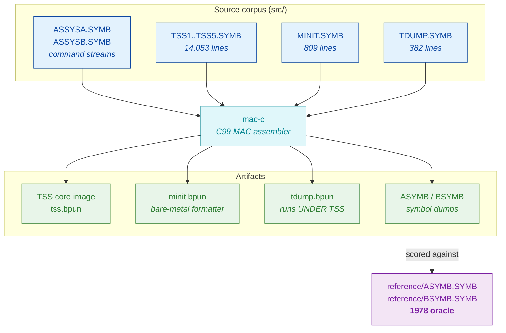
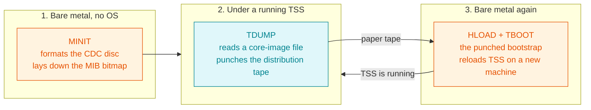
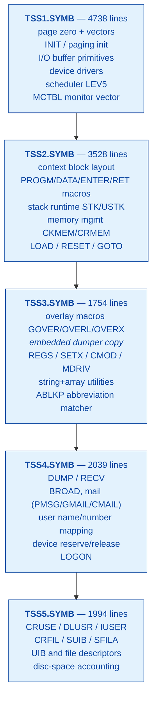
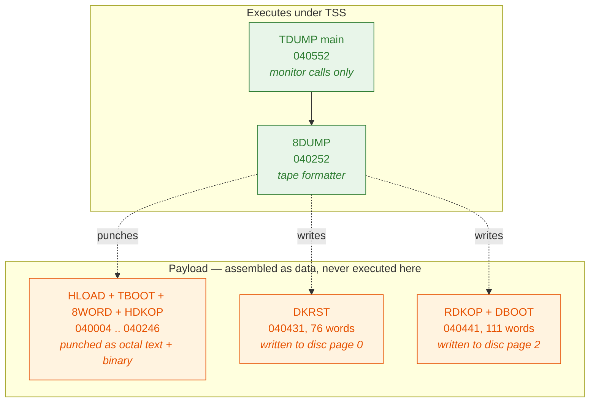
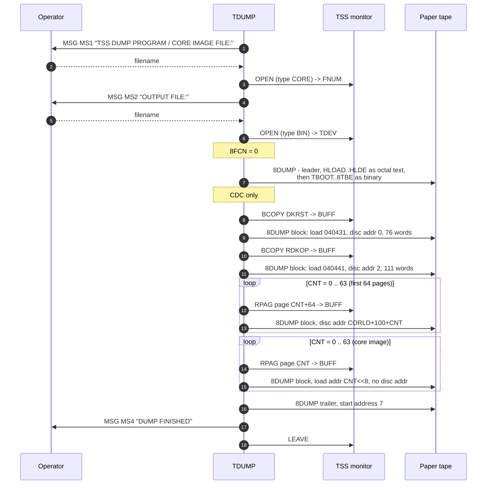
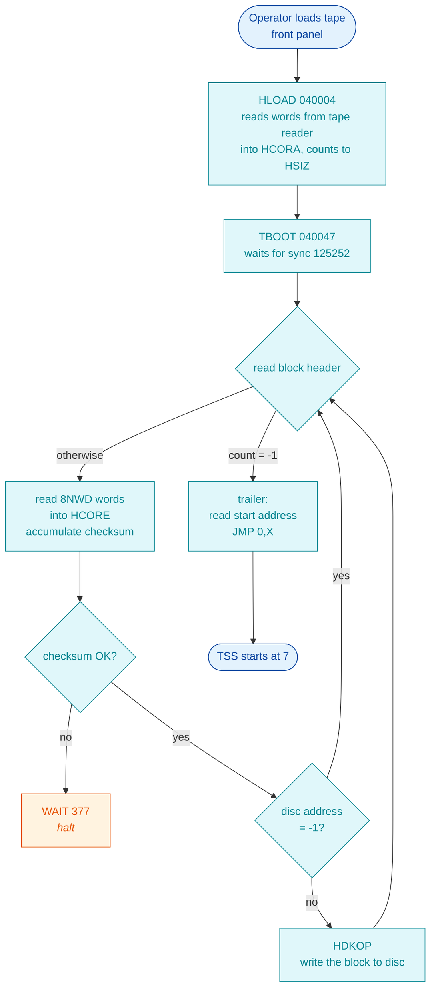

# NORD TSS 3.0 — Per-File Source Reference

**Full path:** `docs/TSS-SOURCE-FILES.md`

This document answers one question for **every `.SYMB` file in the repository**:
*what is this file, what does it contain, is it built, and where is it
described in depth?*

It is the file-oriented companion to
`docs/TSS-ARCHITECTURE.md`, which is organised by
**subsystem** (paging, scheduler, file system, drivers). If you know the
subsystem, read that. If you have a filename, start here.

Everything below was read from the files themselves or produced by assembling
them. Statements that are inference rather than observation are labelled
**INFERRED**. Statements that could not be established are labelled
**UNKNOWN** rather than filled in.

---

## Table of contents

1. [Complete inventory](#1-complete-inventory)
2. [How the files relate](#2-how-the-files-relate)
3. [`ASSYSA.SYMB` / `ASSYSB.SYMB` — the build command streams](#3-assysasymb--assysbsymb--the-build-command-streams)
4. [`TSS1`–`TSS5.SYMB` — the operating system](#4-tss1tss5symb--the-operating-system)
5. [`MINIT.SYMB` — the disc formatter](#5-minitsymb--the-disc-formatter)
6. [`TDUMP.SYMB` — the distribution-tape dumper](#6-tdumpsymb--the-distribution-tape-dumper)
7. [`TSS3` vs `TDUMP` — the same code, two lives](#7-tss3-vs-tdump--the-same-code-two-lives)
8. [`LIST*.SYMB`, `ASYMB.SYMB`, `BSYMB.SYMB` — assembler output](#8-listsymb-asymbsymb-bsymbsymb--assembler-output)
9. [`derived/*.SYMB` — project-made inputs](#9-derivedsymb--project-made-inputs)
10. [Build coverage — what is assembled and what is not](#10-build-coverage--what-is-assembled-and-what-is-not)

---

## 1. Complete inventory

Every `.SYMB`/`.ORG` file, by directory. Sizes are from the working tree.

### `src/` — the clean, buildable corpus

| File | Lines | Kind | What it is |
|---|---:|---|---|
| `TSS1.SYMB` | 4738 | source | OS part 1: page zero, INIT, buffers, drivers, scheduler, MCTBL |
| `TSS2.SYMB` | 3528 | source | OS part 2: context block, stack/overlay runtime, memory management |
| `TSS3.SYMB` | 1754 | source | OS part 3: overlay macros, **an embedded copy of the dumper**, string/array utilities |
| `TSS4.SYMB` | 2039 | source | OS part 4: DUMP/RECV, mail, device reservation, LOGON |
| `TSS5.SYMB` | 1994 | source | OS part 5: user & file management (CRUSE, CRFIL, SUIB …) |
| `MINIT.SYMB` | 809 | source | standalone disc formatter, runs on bare metal |
| `TDUMP.SYMB` | 382 | source | **TSS Dumper — user program that punches the distribution tape** |
| `ASSYSA.SYMB` | 24 | command stream | the 1978 build stream for version A |
| `ASSYSB.SYMB` | 23 | command stream | the 1978 build stream for version B (adds `DEBUG`) |

### `archive/` — originals, never edited

| File | Lines | What it is |
|---|---:|---|
| `TSS1–5.SYMB` | 14026 | CVS's patched copies (`STR`→`XTR`, `LSS`→`XSS`) — the ancestor of `src/` |
| `TSS1–5.ORG` | 14006 | Lewendal's 1973 originals, before the renames |
| `original-text/TSS1–5.ORG` | 14006 | the same originals as delivered |
| `MINIT.SYMB` | 809 | original formatter |
| `TDUMP.SYMB` | 382 | original dumper |
| `ASSYSA/B.SYMB` | 47 | original build streams |
| `ASYMB.SYMB` / `BSYMB.SYMB` | 1384 | **the 1978 golden symbol dumps** (8-bit, with parity) |
| `LIST.SYMB`, `LIST1–5.SYMB` | 28674 | the 1978 assembly listings |

`archive/` holds the source **twice and they are different programs** — see
`CLAUDE.md` and `docs/PROJECT-DESCRIPTION.md` §2.

### `reference/` — the oracle

| File | Lines | What it is |
|---|---:|---|
| `ASYMB.SYMB` / `BSYMB.SYMB` | 1384 | parity-stripped golden symbol dumps — **the validation oracle** |
| `LIST.SYMB`, `LIST1–5.SYMB` | 28674 | parity-stripped golden listings |

### `derived/` — project-made, not historical

| File | Lines | What it is |
|---|---:|---|
| `ASSYSA-MAC-INPUT.SYMB` | 26 | `ASSYSA` adapted to `mac-c` invocation |
| `ASSYSB-MAC-INPUT.SYMB` | 24 | ditto for version B |
| `ASSYS-DRUM-N10-MAC-INPUT.SYMB` | 37 | adds the `DRUM`+`N10` marks to compile the drum driver in; `TEL10` + `NTY=12` for 10 teletypes (rewritten by `build_tss_drum.sh` from `TEL=<n>`) |
| `DRUM-DRIVER.SYMB` | 189 | the extracted `XDRUM` driver, for study |

---

## 2. How the files relate



The three programs run at **three different times on three different machines**,
and confusing them is the single easiest mistake to make with this corpus:



---

## 3. `ASSYSA.SYMB` / `ASSYSB.SYMB` — the build command streams

These are not programs. They are **MAC command streams**: the exact keystrokes
the 1978 operator fed to the assembler. They are the reason the golden dumps
exist, and they are the definitive statement of which library marks the
archived builds used.

`src/ASSYSA.SYMB`, complete:

```
FMAC
100
SYSA
CDC MACF DIAB K14 TEL4
% Add what is unknown to MAC and FMAC
IOT=160000;ACT=400;SKA=1000;PIN=2000;SNI=0;     % Added by CVS
INTDS=150440;INTEN=150540                       % Added by CVS
TDBI=410; TDBO=40                               % Added by CVS
DIABD=156; TT3=162; TT4=DIABD; DIABT=4; DLP=143 % Added by CVS
GRP1=1;GRP2=2;GRP3=4;GRP4=10;
MPR=3;
% STR and LSS are defined in the MAC/FMAC symbol table
% CVS:  STR has been substituted by XTR
% CVS:  LSS has been substituted by XSS
8LP=200; 9PPT=100; 9TTI=40; 9TTO=40
9FP=200; 9CR=5; NOPEN=16
)9ASSM TSS1,LIST1,0
)9ASSM TSS2,LIST2,0
)9ASSM TSS3,LIST3,0
)9ASSM TSS4,LIST4,0
)9ASSM TSS5,LIST5,ASYMB:SYMB
)LIST
*:
?
)9TSS
```

Line by line:

| Line | Meaning |
|---|---|
| `FMAC` | load the floating-point MAC overlay |
| `100` | **UNKNOWN** — a bare numeric line; emits one word, or is an operator response to an FMAC prompt. Not resolved from a primary source. |
| `SYSA` | sets the library mark `SYSA` (a bare symbol line makes a mark) |
| `CDC MACF DIAB K14 TEL4` | **the marks that define the build**: CDC disc, assembly with MACF, Diablo terminal, K14, TEL4 |
| `IOT=…` … `MPR=3` | symbols CVS had to supply because they live in MAC's/FMAC's permanent table, not in the source |
| `8LP=200 …` | buffer and table sizing constants |
| `)9ASSM TSSn,LISTn,0` | assemble part *n*, listing to `LISTn`, object to device `0` (the dummy/NULL device) |
| `)9ASSM TSS5,LIST5,ASYMB:SYMB` | the last part sends its object stream to `ASYMB:SYMB` … |
| `)LIST` | … and `)LIST` dumps the symbol table **into the object stream** — this is exactly how `reference/ASYMB.SYMB` was produced |
| `*:` | **UNKNOWN** — not resolved |
| `?` | end-of-input marker |
| `)9TSS` | return to TSS |

The `B` stream differs in exactly three ways:

| | A | B |
|---|---|---|
| mark set | `CDC MACF DIAB K14 TEL4` | `CDC MACF DEBUG DIAB K14 TEL4` |
| name mark | `SYSA` | `SYSB` |
| listings | `LIST1`…`LIST5` written | listing argument omitted (`)9ASSM TSS1`) |
| trailer | `*:` `?` `)9TSS` | `)9TSS` `@cc` |

**`MACF` is set in both.** That one fact decides the content of TSS3 — see §7.

---

## 4. `TSS1`–`TSS5.SYMB` — the operating system

These five files are the OS. They are assembled **as one continuous unit** —
the location counter and symbol table carry across `)9ASSM` boundaries, so the
split is editorial, not architectural.

Full subsystem-level treatment is in
`docs/TSS-ARCHITECTURE.md` (13 sections). What follows is
the file-level map: what lives where, so a filename and line number can be
turned into a subsystem.



### Where to look

| Looking for | File | Anchor |
|---|---|---|
| page-zero vectors, boot entry at 7 | `TSS1.SYMB` | lines 1–110; `ARCHITECTURE` §4.2, §4.3 |
| `FTLER` fatal-error idle loop | `TSS1.SYMB` | 162–165 |
| interrupt initialisation | `TSS1.SYMB` | 231+ (`%INIT`) |
| paging init | `TSS1.SYMB` | 321+ |
| I/O buffer primitives (`WBUF`/`RBUF`/`IBUF`…) | `TSS1.SYMB` | 343–560 |
| the monitor-call transfer vector | `TSS1.SYMB` | 4302 (`MCTBL`, 81 entries) |
| register/context block layout | `TSS2.SYMB` | 2–130 |
| the `PROGM`/`DATA`/`ENTER`/`RET` calling convention | `TSS2.SYMB` | 242–300 |
| stack runtime | `TSS2.SYMB` | 297–377 |
| `CKMEM` memory-bounds check | `TSS2.SYMB` | 449+ |
| overlay macros | `TSS3.SYMB` | 9–98 |
| **the embedded dumper** | `TSS3.SYMB` | **99–303** (see §7) |
| `ABLKP` abbreviation matcher | `TSS3.SYMB` | 715+ |
| mail subsystem | `TSS4.SYMB` | 241–360 |
| `CRUSE` create-user | `TSS5.SYMB` | 61+ |
| `CRFIL` create-file | `TSS5.SYMB` | 231+ |

Every routine in these files carries a `%`-comment header giving its
**register-level contract** — arguments, return, and failure return. For
example `TSS5.SYMB:61`:

```
%CRUSE
%CREATE USER
%D = DEVICE ID
%X = POINTER TO USER NAME
%RETURN A
%A = USER NUMBER
%FAILURE RETURN A
%A = 1 IF NO MORE TRACKS
%A = 2 IF TOO MANY USERS
%A = 3 IF USER ALREADY EXISTS
```

These headers are the authoritative interface documentation and are worth
trusting over any prose — including this document.

---

## 5. `MINIT.SYMB` — the disc formatter

**Full path:** `src/MINIT.SYMB` (809 lines)
**Built by:** `mac-c/scripts/build/build_minit.sh`
**Output:** `Build/minit/minit.bpun`, entry `MINIT` = `000206`

Header, `MINIT.SYMB:1–6`:

```
%MASS STORAGE INITIALIZATION PROGRAM
%MAY BE USED FOR CDC DISK AND EITHER NORD-1 OR NORD-10
```

MINIT is **not part of TSS**. It is the operator tool that prepares a bare CDC
disc *before* the first TSS cold boot: it lays down the MIB free-track bitmap.
Without it, `SINIT`'s `GTRK` finds no free tracks and user `SYSTEM` cannot be
created.

### Structure

| Lines | Block | Purpose |
|---|---|---|
| 19–133 | `TCI` `TCO` `CRLF` `TCF` `MSG` `OCTIN` `OCTOT` | bare-metal teletype I/O and octal number conversion |
| 134–245 | `MINIT` | the main program: prompt for first/last disc address and I/U/R, then write |
| 246–281 | `SBIT` | set/reset one bit in the free-track bit table |
| 282–306 | — | disc device number definitions |
| 307–332 | `DWAIT` | disc ready test with timeout |
| 333–363 | `DKOP` | perform one 256-word disc operation |
| 364–525 | `DKTR` | the disc transfer engine (up to 3K words, multi-block) |
| 526–588 | `DKADR` | **NCR disc address → CDC disc address conversion** |
| 590–808 | `IOXLIB` | standard NORD-10 I/O library (`%ORIGINATOR: NJL 28/5/73`) |

### Library marks

MINIT carries `CDC` itself (line 8) and selects NORD-1 vs NORD-10 I/O from
`N10`. The idiom at the top of the file is:

```
NN10
"N10 )KILL NN10
"
```

— define `NN10`, then if `N10` is set, kill it. So `NN10` means "NOT N10".
The build script sets `N10`, giving the `IOX` path; the NORD-1 `IOT`/`SKA`
path at line 798 is compiled out.

`DKADR` deserves note: the whole system addresses the disc in **NCR** terms and
converts to **CDC** geometry at the last moment. The comments walk the
arithmetic step by step (`MINIT.SYMB:539–577`), including the divide-by-12 that
produces field `[14,5]` of the CDC address. This is the same conversion the
`HDKOP`/`RDKOP` routines in TDUMP perform inline.

---

## 6. `TDUMP.SYMB` — the distribution-tape dumper

**Full path:** `src/TDUMP.SYMB` (382 lines)
**Built by:** `mac-c/scripts/build/build_tdump.sh` *(new)*
**Output:** `Build/tdump/tdump.bpun`
**Assembly result:** `000000 DIAGNOSTICS` — **0 errors**, 528 words at `040000`–`041017`

> This file had never been assembled before 2026-07-26 and had no analysis
> beyond five passing mentions. Everything in this section is new and was
> derived from the source text plus the assembly just performed.

### 6.1 What it is

`TDUMP` is a **user program that runs under a live TSS**. Every I/O it performs
is a monitor call — the bare `1610nn` words in the source. It cannot run on
bare metal and it is not bootable.

Its job is to produce the **distribution tape**: the self-loading paper tape
that carries TSS to a machine that has none. It reads a core-image file through
TSS's file system and punches it out in TSS binary tape format, prefixed by a
hardware bootstrap it carries as data.

### 6.2 Memory map (from the assembled symbol table)

Produced by `build_tdump.sh`, at
`Build/tdump/TSYMB.SYMB`:

| Symbol | Address | What |
|---|---|---|
| `MSTRT` | `040000` | load base (`TDUMP.SYMB:20` sets `40000/`) |
| `HLOAD` | `040004` | hardware bootstrap entry — **payload, never executed here** |
| `HLDE` | `040047` | end of bootstrap / start of loader |
| `TBOOT` | `040047` | TSS loader entry — **payload** |
| `8WORD` | `040132` | read one 16-bit word from paper tape (payload subroutine) |
| `HDKOP` | `040157` | disc operation used by the loader (payload subroutine) |
| `8TBE` | `040246` | end of the whole bootstrap+loader payload |
| `8FCN` | `040246` | dumper function selector |
| `8CADR` | `040247` | load address for the block being dumped |
| `8DKA` | `040250` | disc address / start address |
| `8NWD` | `040251` | word count |
| `8DUMP` | `040252` | **the dumper subroutine** |
| `PUNCK` | `040424` | punch one character via monitor call |
| `DKRST` | `040431` | disc restart routine — **payload**, `DKRE` = `76` words |
| `RDKOP` | `040441` | disc read primitive — **payload** |
| `DBOOT` | `040527` | disc bootstrap — **payload**, `DBOE` = `111` words from `RDKOP` |
| `TDUMP` | `040552` | **the program entry point** |
| `TDEV` | `040716` | output file number |
| `FNUM` | `040717` | input core-image file number |
| `CNT` | `040720` | page counter |
| `MS1`…`MS4` | `040742`–`040777` | prompt and status strings |
| `BUFF` | `041017` | the 256-word page buffer, and the top of the program |

Derived constants for the CDC/N10 build: `DCHN=000500`, `LCA=501`, `LBA=503`,
`RST=504`, `LMR=505`, `LWC=507`, `CORLD=000060`, `8DKLM=000616`.

Those device addresses match the CDC cartridge-disc controller at `IOX 500-507`
documented in `TSS-ARCHITECTURE.md` §11.1.

### 6.3 Library marks

`TDUMP.SYMB:6–18` declares them:

| Mark | Default | Alternative | Effect |
|---|---|---|---|
| `NCR` | default | `CDC` | disc controller family |
| `NN10` | default | `N10` | NORD-1 `IOT`/`SKA` vs NORD-10 `IOX` |
| `A` | default | `B` | selects `CORLD`, the core-load disc address |
| `DCHN` | — | derived | `100` if `NN10`, `500` if `N10` |

`CORLD` by combination (`TDUMP.SYMB:66–74`):

| | A | B |
|---|---|---|
| NCR | `10` | `210` |
| CDC | `60` | `260` |

Our build selects **CDC + N10 + A**, matching the TSS builds, giving
`CORLD = 60`.

### 6.4 The three payloads

`TDUMP` contains four bodies of code. **Only one of them ever executes on the
machine running TDUMP.** The other three are data — assembled into the image so
they can be copied to the tape and the disc.



### 6.5 The main program

`TDUMP.SYMB:333–369`. Monitor calls decoded against `MCTBL` (`TSS1.SYMB:4302`,
81 entries, index 0 = `LEAVE`):

| Word | MON # | Routine | Use here |
|---|---:|---|---|
| `161000` | 0 | `LEAVE` | exit to TSS |
| `161002` | 2 | `OUTBT` | punch one byte |
| `161007` | 7 | `RPAG` | read one page from the core-image file |
| `161032` | 26 | `MSG` | print a prompt or status string |
| `161041` | 33 | `BCOPY` | block-copy a payload into `BUFF` |
| `161042` | 34 | `OPEN` | open a file, returns file number |
| `161064` | 52 | `ERMSG` | print the error message for the last failure |



The two loops are `TDUMP.SYMB:348–362`. The first writes pages that carry a
**disc address** (`8DKA = CORLD+100+CNT`) — these are loaded to disc by the
bootstrap. The second writes pages with `8DKA = -1` and a **core address**
(`8CADR = CNT<<8`) — these go straight to memory. The final call sets
`8CADR = -1` (trailer) and `8DKA = 7`, which is the **start address**, and 7 is
exactly the cold-start entry documented in `TSS-ARCHITECTURE.md` §4.8.

Error handling: `RPAG` failures land at `XL10`/`XL11`
(`TDUMP.SYMB:365–366`), which compare the error code against `22` (octal) and
either continue the loop or fall into `TERR` → `ERMSG`, `LEAVE`.

### 6.6 The tape format produced by `8DUMP`

`TDUMP.SYMB:221–244`. Two functions selected by `8FCN`:

**`8FCN = 0`** — the leading, self-describing section:

1. 128 null characters of leader (`SAX -177`, `PUNCK`, `JNC *-2`)
2. the address `HLOAD`, in octal text, followed by `/`
3. every word from `HLOAD` to `HLDE` as octal text, each followed by CR LF
4. the address `HLOAD` again, followed by `!`
5. every word from `HLOAD` to `8TBE` as raw binary
6. the word `125252`

This structure is a **NORD front-panel deposit script**: `nnnnnn/` selects an
address, subsequent octal numbers deposit consecutive words, and `!` starts
execution. So the first part of the tape can be typed in by hand or read by a
front-panel loader; once `HLOAD` runs, it consumes the binary section that
follows. `125252` is the sync word `TBOOT` looks for at `TDUMP.SYMB:107`.

**`8FCN = 1`** — a binary load block:

```
8CADR   load address, or -1 for the trailer
8DKA    disc address, or -1 for "core only"
8NWD    word count
...     8NWD words, copied from BUFF
checksum (sum of the words)
```

The trailer (`8CADR = -1`) writes `-1`, the start address twice, and 128 nulls
of trailer.

### 6.7 The boot chain the tape creates



Verified encoding, `TDUMP.SYMB:87` against the assembled image at
`Build/tdump/tdump.img`:

```
source:  HLOAD, SAA 20; IOX 505; SAA 4; IOX 403
image:   040004: 170420   = SAA 20     (170400 + 20)
         040005: 164505   = IOX 505    (164000 + 505)
         040006: 170404   = SAA 4
         040007: 164403   = IOX 403
```

### 6.8 `DKRST` and `DBOOT` — the disc restart path

This is the answer to "what is in disc page 0".

`DKRST` (`TDUMP.SYMB:269–271`) is written to **disc address 0**, `DBOE`'s
block starting at `RDKOP` to **disc address 2**:

```
DKRST, JMP *+2; CORLD
       SAT 2; LDX (RDKOP; JPL RDKOP; JMP I (DBOOT
```

Word 0 is `JMP *+2` and word 1 is the constant `CORLD`. When this page is
loaded into core at address 0, **address 1 holds the core-load disc address**.
`DBOOT` then reads it at runtime:

```
DBOOT, STZ DBCOR; LDA I (1; STA DBDKA
DBLOP, LDX DBCOR; LDT DBDKA; JPL RDKOP
       MIN DBDKA; LDA (400; ADD DBCOR; STA DBCOR
       SUB (MSTRT; JAN DBLOP; JMP I (301
```

So `DBOOT` loads consecutive 256-word pages from disc, starting at the address
planted at core location 1, filling core from 0 up to `MSTRT` (`040000`), then
jumps indirect through location `301`.

This is the **restart** path: it re-loads the system from disc without a tape.
It is what a `RCLR DP` restart at address 0 runs.

---

## 7. `TSS3` vs `TDUMP` — the same code, two lives

`TSS3.SYMB:99–303` contains a **second copy** of the bootstrap, loader, `8DUMP`
and disc-restart routines. It is not a duplicate to be cleaned up — the two
copies are deliberately different, because they run in different environments.

### 7.1 The differences (verified by diff)

| Aspect | `TSS3.SYMB:99–303` | `TDUMP.SYMB:78–327` |
|---|---|---|
| environment | inside MAC, at assembly time | a user program under TSS |
| how it punches | `IOT ACT SKA PFA` — direct paper-tape punch I/O | `161002` = `OUTBT` monitor call, via `PUNCK` |
| how it returns | `JMP 103,B` — back into MAC | `JMP I 8DL` — an ordinary subroutine return |
| bootstrap variants | **NORD-1 only** — no `"N10` alternative for `HLOAD`, `8WORD` | both `"NN10` and `"N10` paths |
| `DKRST` head | `SAT 2; LDX (RDKOP; …` | `JMP *+2; CORLD` then the same — a 2-word runtime-parameterised header |
| `DBOOT` core-load address | `LDA (CORLD` — baked in at assembly | `LDA I (1` — read from core location 1 at runtime |
| `TBOOT` start-address check | `COPY DX SA; JMP 0,X` | `COPY DX SA; JAN *+2; JMP 0,X; WAIT` — halts on a negative start address |
| `8DUMP` source of data | `8CADR` points directly at the words | always `BUFF`; `8CADR` is only the *recorded* load address |
| CDC `LMR` value in `HDK1` | `LDA (1401` | `LDA (401` |

The `DBOOT` difference is the substantive one: **TDUMP's version is
runtime-parameterised**. Because `DKRST` plants `CORLD` at core location 1, the
same disc-resident boot page works for any of the four `CORLD` values without
reassembly. TSS3's version has the constant compiled in.

### 7.2 Why TSS3's copy is not in our builds

`TSS3`'s copy is fenced by library marks:

| Lines | Guard |
|---|---|
| 97–139 | `"TSBIN` — bootstrap + loader |
| 141–152 | `"NCR NMACF` — NCR `HDKOP` |
| 154–171 | `"CDC NMACF` — CDC `HDKOP` |
| 175–237 | `"TSBIN` — `8FCN`…`8DUMP`, and the `)8DUMP` invocation |
| 239–275 | `"CDC NMACF` — `DKRST`, `RDKOP`, `DBOOT` |
| 277–297 | `"TSBIN` sets `CDBIN`; `"NCR` kills it; `"CDBIN` gates the two disc writes |

Both `ASSYSA` and `ASSYSB` set **`MACF`** and neither sets **`TSBIN`**.
Therefore `NMACF` is false and `TSBIN` is false, and **every one of those
regions is compiled out** of the 1978 golden builds and of ours.

That is why the archived TSS image contains no bootstrap: the historical
operator did not build one into it. The bootstrap came from the tape, produced
by a separate `TSBIN` build or by `TDUMP`.

The two disc writes at `TSS3.SYMB:284–296` are the assembly-time equivalent of
what TDUMP does at runtime:

```
"CDBIN
8FCN/ 1
8CADR/ DKRST
8DKA/ 0
8NWD/ DKRE
   )8DUMP

8FCN/ 1
8CADR/ RDKOP
8DKA/ 2
8NWD/ DBOE
   )8DUMP
"
```

**Disc page 0 gets `DKRST`; disc page 2 gets `RDKOP`+`DBOOT`.** Identical
targets to TDUMP's `TDUMP.SYMB:339–346`. Both routes produce the same disc
layout.

---

## 8. `LIST*.SYMB`, `ASYMB.SYMB`, `BSYMB.SYMB` — assembler output

These are **not source**. They are what MAC printed in 1978.

| File | Produced by | Content |
|---|---|---|
| `ASYMB.SYMB` | `)9ASSM TSS5,LIST5,ASYMB:SYMB` + `)LIST` in `ASSYSA` | the complete symbol table of build A — 693 symbols |
| `BSYMB.SYMB` | the same in `ASSYSB` | build B — 689 symbols |
| `LIST1`–`LIST5.SYMB` | the `LISTn` argument of each `)9ASSM` | per-part assembly listings |
| `LIST.SYMB` | — | the concatenated listing, 10370 lines |

The `archive/` copies are the original 8-bit bytes **with the parity bit
intact**; the `reference/` copies are parity-stripped. When a parity-stripped
file looks wrong, the `archive/` bytes are the tiebreaker — that is how it was
settled that `#SY` really has one `#`.

`reference/ASYMB.SYMB` and `reference/BSYMB.SYMB` are **the validation oracle**.
Every change to `mac-c` is judged by rebuilding and re-scoring against them.

Current standing: **679/693 exact (A), 675/689 (B), zero assembly errors.**
13 of the 14 unmatched entries in each are macro names, which real MAC lists
with the address of the macro body inside MAC's own memory image — not
reproducible by a host assembler, and deliberately not faked.

Scoring tools:

| Script | Purpose |
|---|---|
| `mac-c/scripts/verify/compare_asymb.sh <produced> <golden>` | score a dump |
| `mac-c/scripts/verify/first_divergence.sh <produced> <golden>` | first differing symbol, in definition order |

**Caveat that cost real time once:** matching symbol *addresses* only proves the
word **count** is right. A bug that emitted `000000` for every `COPY SA DT`
survived a long time because the count was correct. `tests/test_mac.c` asserts
every instruction's **encoding** for that reason.

---

## 9. `derived/*.SYMB` — project-made inputs

Not historical. Created by this project, and labelled as such inside the files.

| File | Purpose |
|---|---|
| `ASSYSA-MAC-INPUT.SYMB` | `ASSYSA` adapted to `mac-c`'s invocation conventions |
| `ASSYSB-MAC-INPUT.SYMB` | ditto for B |
| `ASSYS-DRUM-N10-MAC-INPUT.SYMB` | adds `DRUM`+`N10` so the `XDRUM` swapping-drum driver (device `IOX 540`, NORD-10 only) is compiled **in**. It is compiled **out** of both archived builds. Since 2026-10-08 it also carries `TEL10` (10 teletypes) and `NTY=12` (all of them non-modem, so nd100x's TERMINAL 5-10 idents 044-051 reach TTY5-TTY10); `make build TEL=4` restores the single-user build. |
| `DRUM-DRIVER.SYMB` | the extracted `XDRUM` driver in isolation, for study |

---

## 10. Build coverage — what is assembled and what is not

| Source | Build script | Output | Status |
|---|---|---|---|
| `TSS1–5` (version A) | `mac-c/scripts/build/build_tss_assysa.sh` | `Build/` | 0 errors, 679/693 vs oracle |
| `TSS1–5` (drum/N10) | `mac-c/scripts/build/build_tss_drum.sh` | `Build/drum/` | 0 errors |
| `TSS1–5` (direct) | `mac-c/scripts/build/run_tss.sh` | `Build/` | 0 errors |
| `MINIT` | `mac-c/scripts/build/build_minit.sh` | `Build/minit/minit.bpun` | 0 errors, entry `000206` |
| **`TDUMP`** | **`mac-c/scripts/build/build_tdump.sh`** | **`Build/tdump/tdump.bpun`** | **0 errors, entry `040552`** — new 2026-07-26 |
| `ASSYSA/B` | — | — | these *are* the command streams, not assembled targets |
| `LIST*`, `ASYMB`, `BSYMB` | — | — | assembler output, not input |

Run everything at once:

```bash
wsl -d Ubuntu -- bash -lc "cd mac-c && make && ./scripts/verify/verify_repo.sh"
```

---

## Open items

Recorded honestly rather than closed with a plausible story.

| Item | Status |
|---|---|
| `ASSYSA.SYMB` line 2, the bare `100` | **UNKNOWN** — not resolved from a primary source |
| `ASSYSA.SYMB` line `*:` | **UNKNOWN** |
| Whether `TDUMP` runs correctly under the emulated TSS | **UNTESTED** — it assembles cleanly; it has not been loaded and run |
| `REA` (used in `TDUMP.SYMB:81–82`, NORD-1 path) | undefined; flagged in the source itself at line 382: `% What is REA? CVS, other undef OK`. Only referenced in the `"NN10` path, which our CDC+N10 build compiles out. |
| Why the swapper finds no free page | **UNRESOLVED** — see `docs/TSS-COMMAND-VALIDATION.md` |

---

## Cross-references

| Document | Full path |
|---|---|
| Architecture, by subsystem | `docs/TSS-ARCHITECTURE.md` |
| Project history and provenance | `docs/PROJECT-DESCRIPTION.md` |
| The MAC assembler and `mac-c` | `docs/MAC-ASSEMBLER.md` |
| Bring-up, clean checkout to `@` prompt | `docs/TSS-BRINGUP.md` |
| Command validation, all 60 commands | `docs/TSS-COMMAND-VALIDATION.md` |
| User manual | `docs/TSS-USER-MANUAL.md` |
